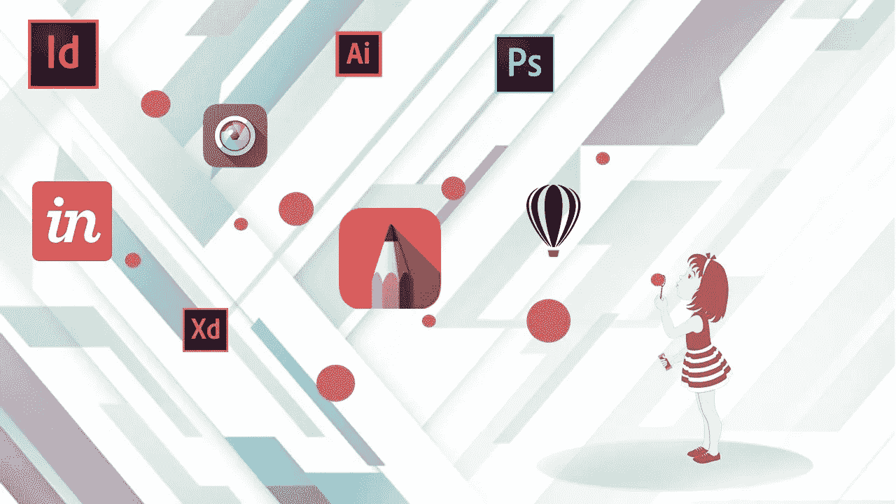
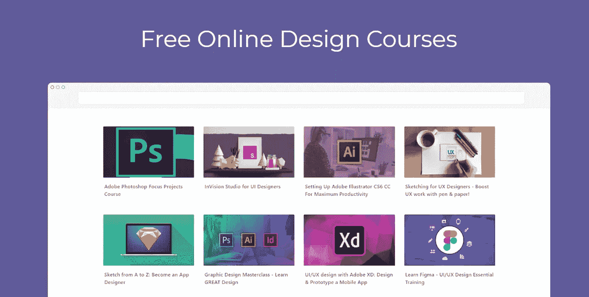
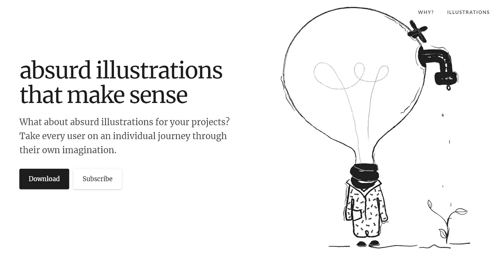
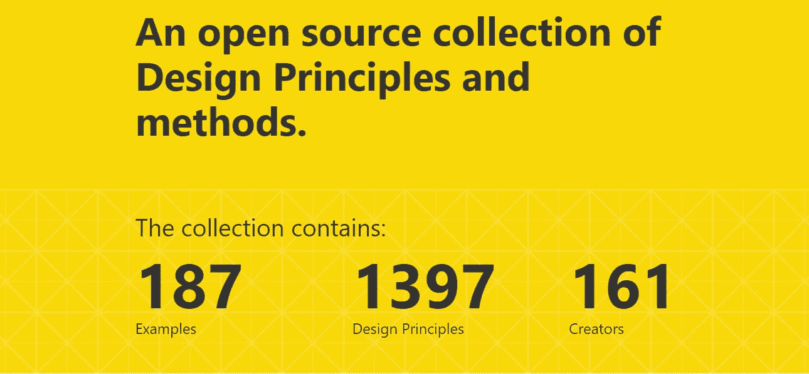
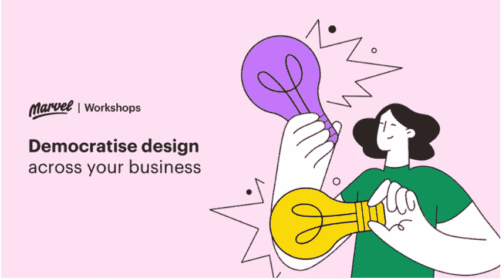
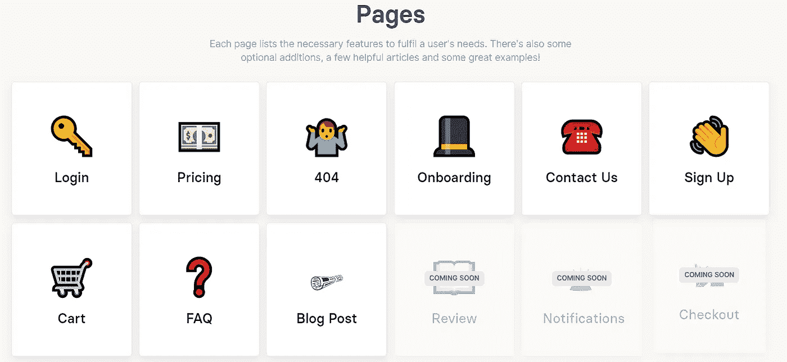
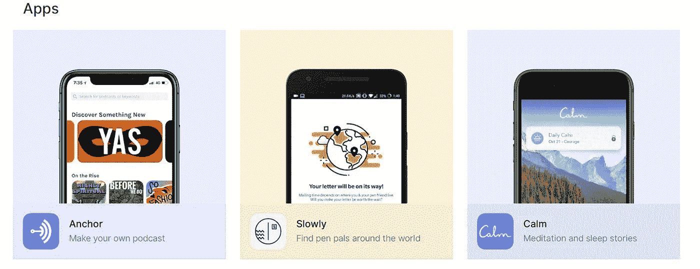
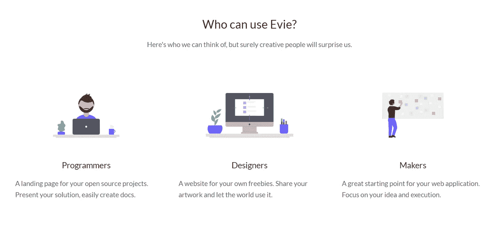

# 7 种新的设计工具和资源，立即加入书签

> 原文：<https://medium.com/hackernoon/7-new-design-tools-and-resources-to-bookmark-today-830de17a7e58>

Img Source: https://www.quickcode.co/design

微妙是大多数有影响力的设计的灵魂。也许仅仅因为这个原因，过去十年来，围绕设计的对话大多是在数据科学、人工智能、IOT 和其他许多所谓的更性感技术的背景下进行的。不要从这些学科中拿走任何东西。但出于某种原因，设计对话一直处于这个行业中第二重要的独特位置。至少在“移动应用”出现之前是这样。从那以后，关于用户体验和设计师的讨论开始变得模糊。

带着这样的想法，我最终做了一些关于现代设计工具和资源开发的研究。在此期间，我发现了一些我完全不知道的非常酷的新工具。公平的警告，我不是一个专业的设计师，虽然我在我的工作和营销社区中与一些人合作。所以不要再拖延了，我相信这是 7 个最酷最现代的设计资源，任何初学者或专业设计师都应该知道！

## 快速设计

Img Source: [https://www.quickcode.co/design](https://www.quickcode.co/design)

[快速设计](https://www.quickcode.co/design?utm_campaign=PrototyprPub&utm_term=Prototypr_Panks)是一个寻找免费和顶级在线设计课程的平台。该平台的独特之处在于，它们不仅为数字应用设计人员提供资源，还为各种 3D、CAD 软件和其他面向行业的设计人员提供资源。

> 这个平台的另一个很酷的特点是，你可以跟随其他设计师学习你感兴趣的工具。这有助于将创造性的应用程序想法相互交换，并用于您自己的用例。

## 荒谬的插图

Img source: [https://absurd.design](https://absurd.design)

这是我最喜欢去寻找酷灵感的地方之一！用他们自己的话说，荒谬设计是一个项目，附带一套免费的超现实主义插图，用于应用程序或登录页面消息、演示文稿、文章等。主要想法是给人们一个思考的机会，激发他们的创造性想象力和艺术眼光。

## 设计原则

source:[https://principles.design](https://principles.design)

正如他们的主页所描述的,《设计原则》是一个最具创新性和持续有效的设计思想的开源集合。它来源于设计案例研究和最强大的网络应用程序的例子，这些应用程序定义了我们新的数字化集成的生活、工作和旅行。请访问，了解为您喜爱的应用提供动力的灵感、创意和成熟创新。

## MarvelApp

Img Source: [https://www.producthunt.com/posts/the-design-thinking-workshop-kit](https://www.producthunt.com/posts/the-design-thinking-workshop-kit)

MarvelApp 旨在为您或与您合作的任何团队成员，甚至是您设计团队之外的人，提供实践研讨会。这样不仅是你，其他人也可以和公司里经常被误解的设计师联系起来！这样你或你公司的所有人都可以熟悉设计思维的基本原则，并创造新的功能、应用和产品。

> 他们的研讨会承诺将带你从培养同理心、产生想法，一直到绘制草图和创建交互式原型，会议时间可以压缩到一个小时！

为周五的团队活动计划一个不错的方法！

## 清单设计

Img Source: [https://www.checklist.design](https://www.checklist.design)

清单设计是最佳用户界面和 UX 实践的集合，为用户提供完整、诚实和有益的体验。不仅要了解要在解决方案中加入什么，还要了解应该如何加入以及为什么要加入。它为你提供了一个实用的方法来解决你在制作一个专业应用程序时遇到的最常见的问题。

## 用户界面源

Img Source: [https://www.uisources.com](https://www.uisources.com)

UI Sources 于 2018 年年中推出，是一个交互设计的策划知识库。分析产品流程、功能和交互，为您自己的应用获得真正的设计灵感。这个资源可以被设计者、开发者、产品人员和企业家广泛使用。

## 拉开

Img Source: [https://evie.undraw.co/](https://evie.undraw.co/?ref=producthunt)

unDraw 是一个麻省理工学院许可并不断更新的美丽的 svg 图像集，你可以完全免费使用，没有归属。只需与他们签约，使用他们周到、优雅且非常实用的图片来搭配你的产品。

这完成了我为任何领域的现代设计师列出的 7 个很酷的新资源。希望，无论你是初学者还是专业人士，你都从这篇文章中找到了值得学习的东西！