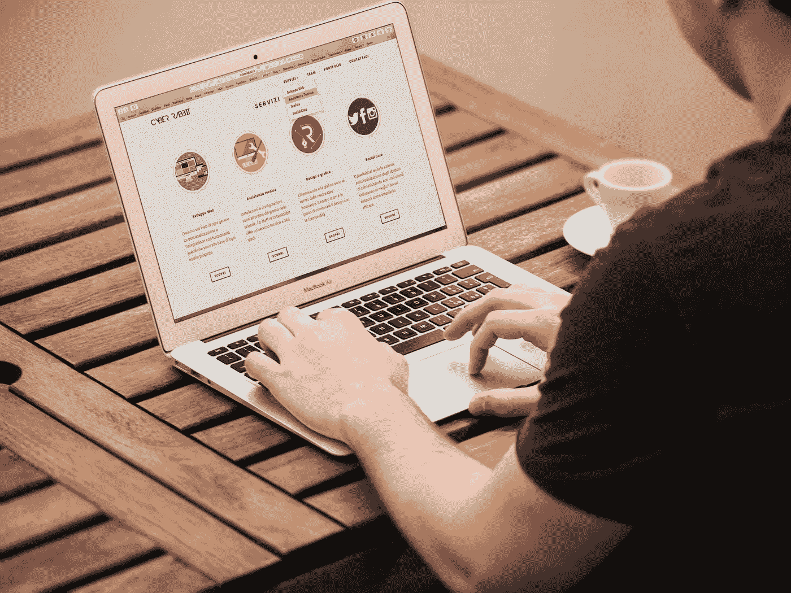
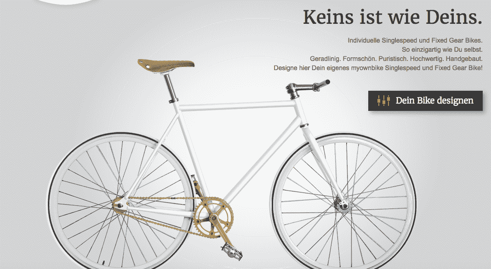
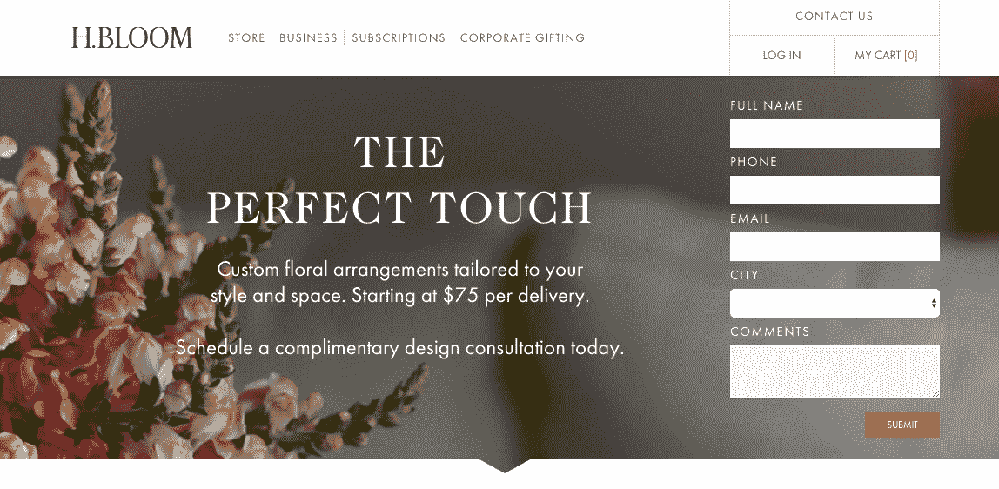
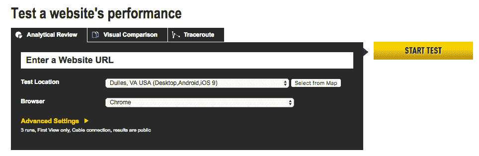
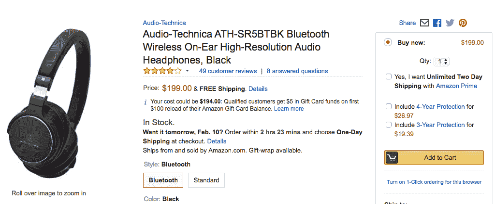
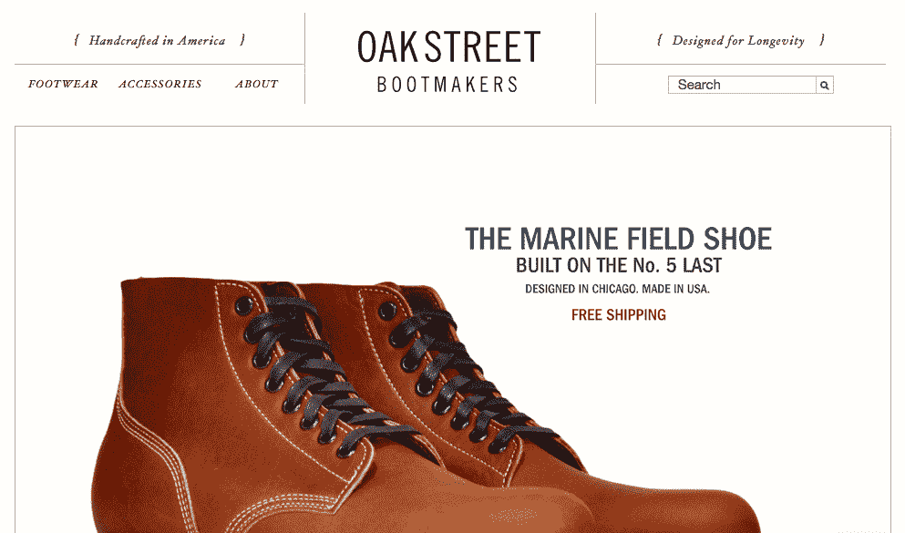

# 扼杀电子商务转换的 7 个 UX 常见错误

> 原文：<https://medium.com/hackernoon/7-painfully-common-ux-mistakes-that-kill-e-commerce-conversion-d4eb6f6dd19d>

[Image Source](https://images.pexels.com/photos/209151/pexels-photo-209151.jpeg?w=940&h=650&auto=compress&cs=tinysrgb)

尽管近来 SEO、PPC 和其他数字营销方法受到了很多压力，但不可否认的是，客户访问你的网站时的体验最终决定了你的电子商务平台的成败。

正如我在 2018 年网络峰会上成立的品牌小组所言:很简单，你的其他数字营销努力可能有多好并不重要。

如果你的网站充满了 UX 的错误，你的潜在客户不会留下来，你的生意也会受到影响。当[88%的客户在糟糕的用户体验后不太可能再次访问一个网站时，这可能会严重损害你的业务。](http://www.business2community.com/online-marketing/how-important-is-user-experience-9-things-you-need-to-know-about-ux-01231378%2523ArhFlvUwpWJBgUev.97)

可悲的是，尽管我们在 Web 开发领域取得了长足的进步，但仍有太多的公司被容易避免的 UX 错误所绊倒。

那么，你需要警惕哪些 UX 错误呢？

以下是令人惊讶地持久的七个例子:

# **1。无空白**

无论迎接网站访问者的是一堵巨大的文字墙，还是一堆繁琐的图片和网站元素的拼贴画，一个缺乏留白空间的杂乱设计都会让潜在客户立即失去兴趣。

空白给你网站上的元素提供了喘息的空间。

它使你的内容更容易理解，并且帮助你页面上最重要的信息——比如注册表单——更加突出。

[Image Source](https://www.myownbike.de/)

即使是简单的步骤——比如将大段文字转换成要点列表，或者在不同的设计元素之间添加空白区域——也可以使您的网站在视觉上更具吸引力，并且不太可能吓到访问者。

# **2。复杂表格**

注册表单对于试图让访问者注册时事通讯或免费软件试用版的 B2B 公司尤其流行，但许多电子商务公司也依赖于注册表单——尤其是那些让消费者注册每月订阅或会员的表单。

虽然你显然需要一些个人信息来注册，但许多公司用表单字段淹没访问者，使注册过程变得不必要的复杂。

[Image Source](https://www.hbloom.com/ResidentialSubscriptions/)

研究表明，一个网站的表单域越多，[转换](https://blog.hubspot.com/blog/tabid/6307/bid/6746/Which-Types-of-Form-Fields-Lower-Landing-Page-Conversions.aspx%2523sm.00009ie5vlukvfhcr3t1a5gwbslb9)的可能性就越小。互联网用户不想浪费时间填写冗长的表格——尤其是如果它要求太多的私人信息。

不要吓唬潜在客户，让他们认为你的网站存在安全风险——只询问你绝对需要的信息，以帮助你的客户注册或购买。

# **3。慢速加载时间**

我们生活在一个即时满足的时代，高速互联网连接让用户只需几秒钟就能加载大部分网站内容。

不幸的是，这是一把双刃剑——几乎网站加载时间的任何延迟都会导致用户在浏览你的内容之前就点击离开。

谷歌自己也指出，电子商务网站加载的时间不应该超过[两秒。](http://www.webdesignerdepot.com/2016/02/how-slow-is-too-slow-in-2016/)

这是用户所期望的，即使很小的延迟也会导致您错过按键转换。据估计，[甚至一秒钟的延迟](http://www.aberdeen.com/research/5136/ra-performance-web-application/content.aspx)都会让你损失百分之七的转化率。

像优化图片、减少 HTTP 请求和插件使用这样的简单步骤可以帮助你节省宝贵的网站加载时间，并确保更好的整体用户体验。

[Image Source](https://www.webpagetest.org/)

网页测试和其他性能评估网站可以帮助你评估你是否需要做更多来提高网站速度。

# **4。移动不友好**

令人痛苦的是，这一点仍然需要在 2019 年提出，但太多的电子商务企业没有采取措施为移动用户优化他们的网站内容。

尽管没有针对移动优化的网站很糟糕，但是许多公司试图强迫消费者下载一个应用程序来访问他们的内容，而不是简单地提供一个移动友好网站的访问，从而从一个错误走向另一个错误。

普通移动消费者的设备上已经有大量的应用程序。

他们不会想通过下载你的应用程序来增加混乱，特别是如果他们不确定他们是否真的想使用你的产品或服务。

不要让你的潜在顾客无法进入你的商店。为移动用户优化您的网站，以便客户可以尽可能少的步骤快速找到他们想要的内容。

# **5。无对比度**

许多电子商务网站在选择配色方案时都力求谨慎，这是有充分理由的。没有人想重蹈 20 世纪 90 年代花哨网站的覆辙。

然而，这种谨慎的做法导致许多电子商务网站错过了使用颜色的一个重要因素:实现[适当的对比度](/swlh/color-vs-contrast-which-makes-you-click-38cb719627a2%23.v91aibfys)。

如果你的整个网站都是深浅不一的蓝色，顾客很难找到最重要的信息，比如“立即购买”按钮。

另一方面，对比色(就像蓝色背景上的橙色按钮)可以让最重要的元素在视觉上突出出来。

[Image Source](https://www.amazon.com/dp/B01C6B3W9G/ref=gbpg_tit_m-5_6cf5_cb374bfb?smid=ATVPDKIKX0DER&pf_rd_p=d7e06d1b-4a19-4bdf-b2d5-8eea81d26cf5&pf_rd_s=merchandised-search-5&pf_rd_t=101&pf_rd_i=16183815011&pf_rd_m=ATVPDKIKX0DER&pf_rd_r=WNB8JB9MJJ81Q0N8GH7A)

UX 测试表明，对比设计元素往往会产生最高的点击量，所以如果你想让你的客户更容易购买，你最好为你最重要的设计元素提供一点对比。

# **6。内容质量差**

人们很容易陷入商店体验的设计元素中，让实际内容退居其次。但正如许多电子商务商店所了解的那样，再多的优质设计也无法弥补糟糕的内容。

从商店的“关于”页面到单个产品列表，网站上的文字内容为用户体验定下了基调。它[凸显你品牌的个性](http://www.digimar.com/5-tips-content-converts/)。它呼吁采取行动。它提供了说服消费者购买的信息。

[Image Source](https://oakstreetbootmakers.com/)

然而，把书面内容放在次要位置，你将很难说服顾客购买你的产品或服务，不管你的 UX 的其他部分有多好。

专注于创建引人注目的标题和有说服力的正文，以说服客户购买——否则，网站访问者会看到你漂亮的设计，然后迅速离开。

# **7。未测试**

与上述 UX 要素一样重要的是，测试是迄今为止确保客户获得优质体验的最重要的事情。

很难模仿第一次光顾你的商店的人的实际体验。

你不能假设你的设计会完美无缺，因为你认为你遵循了 UX 的最高原则。一组测试用户可能会遇到致命的缺陷，这将导致大多数客户完全退出您的网站。

在比较不同的配色方案、行动号召按钮或图像时，测试尤其有价值。通过进行 A/B 测试，你可以很容易地发现新的见解，这将极大地增加网站上线时的转化率。

在大多数情况下，需要多轮测试才能获得最佳结果。

# **结论**

最终，你网站的用户体验将完全决定客户对你品牌的看法。实际上，这可能会决定他们在初次接触后是否会再次与你的品牌互动。

当你调整你的设计来避免这些常见的 UX 错误时，你的网站将变得更容易导航，更具视觉吸引力，最重要的是，更好地将网站访问者转化为付费客户。