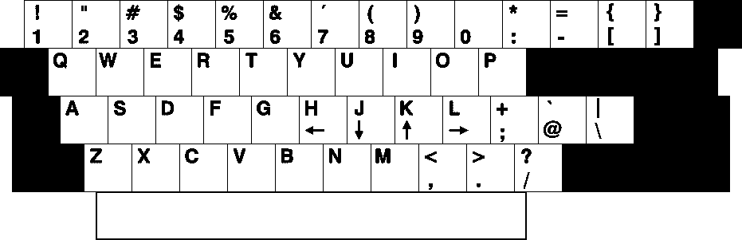

# 关于 Vim 你应该知道的 7 件事

> 原文：<https://medium.com/hackernoon/7-things-you-should-know-about-vim-a8493847b642>

在本文中，我想探究一些大多数人不知道的关于 Vim 的事情。从它被开发成现在这个样子的原因，到一些你可能还没有使用的隐藏功能。

## 1-原始移动关键点(h，j，k，l)有理由

乍一看，这似乎是随机的。为什么我们用原来的键而不用箭头键？1976 年，比尔·乔伊创建了虚拟仪器。Bill 使用 ADM-3A 终端开发 Vi。问题是，ADM-3A 键盘没有箭头键。所以 h，j，k，l 被用作移动键。

The ADM-3A keyboard

另外，请注意，<esc>键位于我们通常使用<tab>键的位置。这种令人愉快的巧合使得我们的手不需要离开主行就可以在模式和内部文件之间导航。这是 Vim 的一大卖点。无需过多移动我们的手就能接触到所有东西。这是一个伟大的生产力黑客。</tab></esc>

## 2-Vim 运动不是随机的

*:q* 、 *:w* 、 *:c* 等不是随机选取的。一旦你意识到 q 代表 quit，w 代表 write，y 代表 yank(复制), p 代表 put(粘贴),它们实际上是非常直观的。d 代表删除，a 代表追加。这些只是几个可能的命令，一旦我们理解了它们，就有可能开始组合起来，比如 *di"* 代表“内部删除”。

## 3-除非你打开它们，否则你得不到好的特性

标准的 Vim 包允许很多事情，但是它仍然很乏味。的。vimrc 文件是我们启用/禁用功能的地方。像增量搜索(*:设置增量搜索*)和高亮搜索结果(*:设置 hlsearch* )这样的东西必须打开才能使用。甚至像行号(*:集合号*)这样的东西也属于这一类。

注意 *:set* 命令将启用当前会话的功能。如果我们希望为所有会话启用它们，则需要将它们添加到。vimrc 文件。

## 4-单词补全

Vim 提供了非常基本的开箱即用的单词补全功能。在我们开始输入单词后，只需点击<c-n>即可触发。这种形式的完成将搜索当前文件和其他打开的文件，寻找完成的可能性。</c-n>

还有其他形式的高级文件完成可以使用，这只是更简单的一种。

## 5-标签完成/标签导航

Vim 与 ctags 配合得非常好。ctags 是一个外部软件，它生成一个包含我们可能需要的每个单词(比如函数名)及其位置的参考文件。因为我们现在知道了每个单词的位置，如果我们有一个 make_struct()函数调用，并且想要进入那个函数定义，我们可以在函数名的顶部使用<c->命令。</c->

Vim 还会在标记文件中查找可能的单词补全。

## 6 —寄存器

就像系统剪贴板一样，Vim 使用一个专用的寄存器来存储我们复制/剪切的所有内容。但是 Vim 走得更远。它有不同类型的寄存器，可以更加灵活地使用。编号寄存器(0-9)按时间顺序存储我们的拷贝/剪切，命名寄存器(a-z)可用于存储我们想要的任何内容(*ay*将内容复制到寄存器 a，*AP*将粘贴相同的内容)。每个寄存器的内容都可以通过:registers 命令查询。

## 7-会议

Vim 可以存储会话。会话包含每个打开的缓冲区、光标位置，即程序的当前状态。一个会话存储在一个. vim 文件中，以后可用于还原该会话。 *:mks* 是用于保存会话的命令。

这些是关于 Vim 需要了解的无数事情中的 7 个。总之，它们使 Vim 成为了一个令人敬畏的工具。

你呢，你知道一些我们应该知道的关于 Vim 的事情吗？请在评论中告诉我们。

想了解更多关于 Vim 的知识？想学习如何将其用作 IDE？看看我的新书[一个叫做 Vim](https://leanpub.com/anidecalledvim) 的 IDE。从基本的 Vim 使用到文件查找、自动完成、文件管理器等等，它都有。