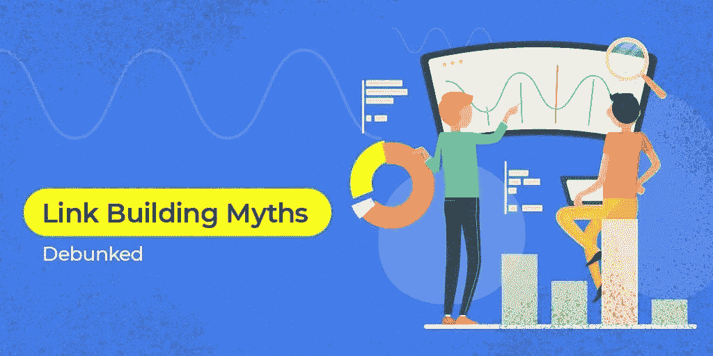

# 阻碍网站发展的 8 个常见链接建设误区

> 原文：<https://medium.com/hackernoon/8-common-link-building-myths-that-are-holding-back-your-website-173307ab1e64>

Link Building Myths

毕竟，神话是一个永无止境的故事！！

流言蜚语也是如此！！

流言蜚语没完没了，远远超出了学校的范围。令人难以置信的问题是，谷歌是改变了什么，还是仅仅是一次算法更新，这引发了全球各地无穷无尽的头脑风暴。

只要搜索引擎对它们的算法遮遮掩掩，全球产业就会持续充满流言、神话和垃圾邮件。

猜猜它会导致什么…

这鼓励了企业采取错误的策略，或者严重损害了他们的反向链接档案，或者更严重的，比如恶意的谷歌处罚，这是一项相当艰巨的任务。

事实是，一切，包括在搜索引擎优化和反向链接建设指南是不正确的。这导致很多人对 SEO 的价值失去信心。

通过这篇文章，你将会遇到一些流行的神话，让你对链接构建机制失去兴趣，不鼓励人们追求手工的反向链接构建实践。

在这里，我们试图打破八个流行的链接建设的神话和误解广泛吹捧，甚至今天造成更多的伤害比任何好处。

**神话#1:一个伟大的反向链接总是与高领域权威互补**

你已经听过这个了！相反，有很多像你一样的人…

据说高质量的反向链接有 30+的域名权限…你觉得这很简单吗？

这个链路质量是怎么定义的？是否有确定的机制或规则来决定它？

不要！！

像信任流和域权限(DA)这样的第三方指标只不过是猜测或晴雨表，用于快速比较您的网站和其他网站。它既不标志着一个好的排名，也不告诉你一个网站有多好的反向链接建设。

因此，将 DA 作为证明收费客户和垃圾链接活动的唯一标准是许多人犯的一个错误。

为什么不先睹为快，看看好的链接的一些关键决定因素:

锚文本是上下文相关的

上传到链接域的内容与您的业务相关

链接域的高流量值

链接页面为用户提供价值

对网站上发布的内容进行适当的编辑

追逐领域权威作为一个单一的专有指标会让你对面前的多种途径视而不见。

**神话 2:无关注链接意味着零链接果汁**

一个标有“”的链接暗示谷歌不要关注它。

很少有受欢迎的网站部署自动不跟随他们所有的外部链接机制，这使得它在 SEO 领域毫无价值。

然而，事实与所感知的相去甚远。没有后续链接仍然没有出来，即他们仍然拥有搜索引擎优化的价值，因为:

即使他们没有跟随链接；他们仍然驱动着流量，而流量恰好是一个关键的排名因素

可疑的反向链接配置文件可以使谷歌超限与做后续链接

没有后续链接仍然让你的特色

谷歌仍然知道它们的存在，也就是说，仍然有一些链接流在市场上流行

感觉心灰意冷，因为你发现一些链接被标记为没有后续链接？别担心，你还是留下了印记。

**神话#3:一旦链接建立，不要延迟传播**

避免谷歌处罚的愤怒是每个人的愿望。然而，格外小心并在几周或几个月内快速传播已建立的链接可能是不必要的。

深入到网络中，你会打破这个神话，你不需要传播链接。

事实是，就谷歌的企鹅算法而言，它是一个具有非自然反向链接配置文件的网站的看门狗。如果它看起来像垃圾邮件，它会被标记为人工审查。

然而，这决不会让你认为链接必须符合配额。网站很有可能一夜之间自然获得 100 个反向链接，特别是如果任何特定的内容像病毒一样传播，结果被相当多的出版物收录。

不要纠结于在短时间内建立太多的链接，而是保持冷静，只要:

反向链接配置文件看起来很自然

你自然地获得链接

重点是质量而不是数量

谷歌肯定不会仅仅因为指向你网站的链接数量而处罚你。

**神话 4:来自维基百科和。edu 网站自诩排名实力变态**

听说过圣杯吗？我们会告诉你的！！

许多人误认为维基百科是链接建设的圣杯。如果谣言是可信的，那么设法从任何维基百科的域名页面建立一个链接将会直接把你带到谷歌的 SERPs 的顶端。

无论是维基百科还是。edu 网站，是具有很强排名能力的权威网站，但是它不能在一个链接建立后，突然帮助你排名。

建立多样化的链接总是明智的，结合重要的 SEO 指标来识别其他权威网站，并专注于从各种不同的网站收集链接。

**误区 5:避免论坛链接、博客评论和目录**

获得了臭名昭著的角色黑帽战术反向链接建设，目录网站，论坛和博客评论被许多人避免。

这是真的吗？他们失去 SEO 价值了吗？

答案是否定的！！

从上述网站建立的链接，仍然拥有搜索引擎优化的价值；前提是按照以下方式正确完成:

他们有能力驱动更多的交通

他们为你的内容吸引更多的眼球，从而增加链接建设的机会

但是，要从这些链接中获益，需要考虑某些方面:

对于谷歌来说，反向链接决定了任何两个网站之间的联系。因此，在使用论坛、博客评论或目录网站建立反向链接时，要格外警惕选择适合你的相关网站

仅仅为了好玩而发表博客评论已经是一种失传的时尚。从寻找你所在行业的相关博客开始，并相应地留下深思熟虑的评论，而不是仅仅跟随“好帖子”的潮流。

**误区 6:访客发帖仅由 SEO 垃圾邮件发送者完成**

你也听说了吗，客座博文已经过时了？或者，也许这在你的 SEO 策略中不再有任何意义？

答案直截了当，熟了。客座博文仍然是建立强大反向链接的一个非常有价值的策略。你必须挑挑拣拣地选择那些接受客座博文并且也属于相关行业的网站。

理想的客座博文策略的几个方面:

把它放在相关的网站上

所选网站的忠诚、强大和固定的受众

写长篇的有意义的内容，分享/增加价值

不要为链接付费

避免成为私人博客网络的一部分(PBN)

如果你想看到不可思议的效果，那么要想让客座博文策略变得有效，就要把以上所有的策略结合起来。花些时间，找出最相关的网站，谁知道呢，你可能会用一个增强的搜索引擎能见度来震撼它。

**神话 7:反向链接越多，就越开心**

俗话说“任何一个环节都是好的环节。”

有没有想过这句话有多真实，或者它仅仅是事实，所以接受它。

不，不应该是这样。这绝对是值得思考的问题！

理想情况下，正确的说法应该是，“任何高质量的链接都应该被认为是好链接。”

仅仅有大量的反向链接并没有什么好处，相反，这是至关重要的反向链接应该是高质量的，否则你的反向链接配置文件将经历一个垮台。例如，如果 90%的反向链接来自阿达为 12 或 15 的网站，那么你的个人资料也会落入相同的范围。从这个陷阱中恢复是艰难的，但绝对是必要的。

那么，我们可以删除这些低质量的条目，或者让谷歌惩罚我们吗？

低质量的条目可以通过提交否认声明来删除，即当你否认一个链接时，你告诉谷歌不要将你的网站与链接它的网站联系起来。

因此，这是不可或缺的进行定期审计你的反向链接档案，并揭示低质量的链接，可能会影响你的排名尝试。

**神话 8:反向链接是 SEO 的唯一专有指标**

是的，我们理解。没有什么新的情况下，你也把你所有的链接建设练习，认为这是所有的搜索引擎优化。

这是各种研究的结果，显示了反向链接对你的网站在 SERPs 中排名的不可或缺性。

你真的认为谷歌算法仅仅依靠反向链接就那么简单吗？如果是，那么，很不幸，你错了！

谷歌有许多排名因素，构成其排名算法的一部分，而反向链接恰好只是其中的一小部分。反向链接只是其中的一部分，这四个要素是:

内容营销——为网站开发内容，瞄准长尾关键词、长篇博客文章等等

技术搜索引擎优化——增强用户体验，提高网站速度，减少抓取错误等等

页面搜索引擎优化—关键词定位、高质量的优化内容、图片搜索引擎优化等等

离页搜索引擎优化-建立反向链接和更多

忽视以上任何一点都会让你爬上通往第一的阶梯变得艰难！！

那么你认为你从上面写的那篇长篇中学到了什么呢？

数字世界是一个充满事实和谬误的地方，所以不要被你听到和看到的东西冲昏头脑。学会识别真相，并遵循最佳链接建设的做法。

既然我消除这些神话的努力已经成功，是时候我们真的需要停止相信它们了。作为一个搜索引擎优化专家，我建议所有邀请和欢迎的机会在这种负面的光线下无人问津！！

**作者简介**

[**Sandeep Mehta**](https://www.sandeepmehta.co.in/) 是一位从业 5 年的自由 SEO 专家。他曾参与多个利基项目，如电子商务、旅游等。