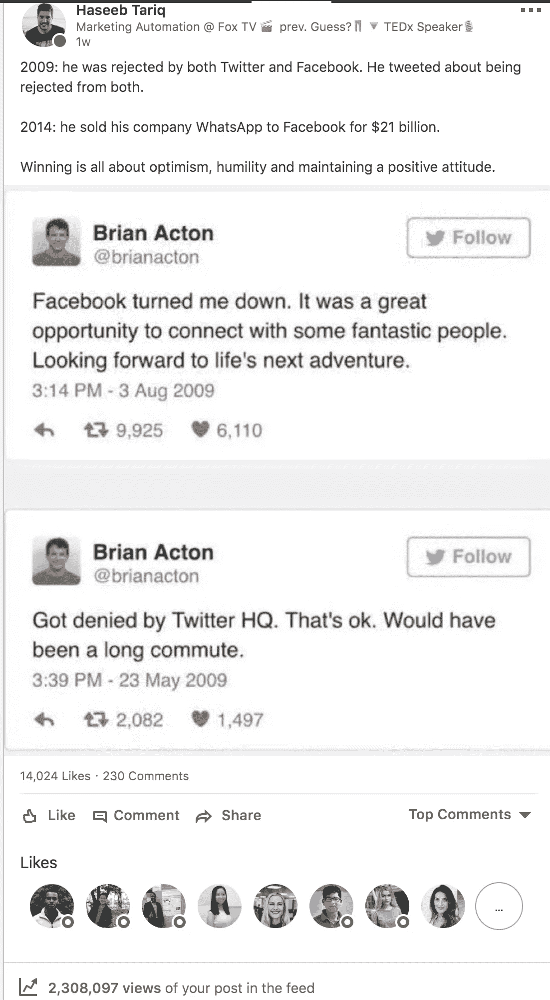
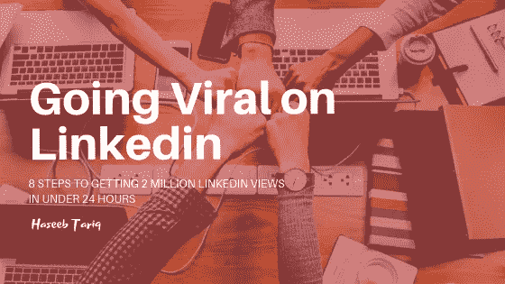
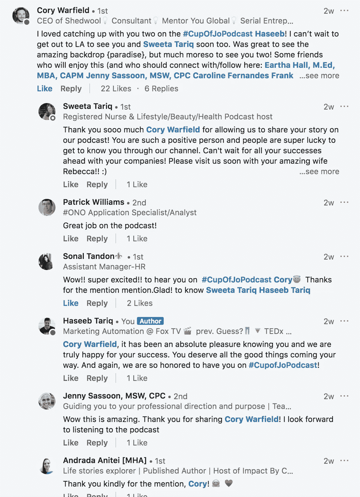
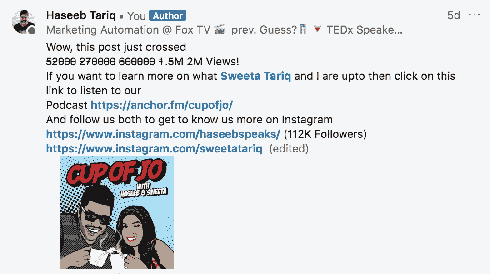

# 在 24 小时内获得 200 万 LINKEDIN 点击率的 8 个步骤

> 原文：<https://medium.com/hackernoon/8-steps-to-getting-2-million-linkedin-views-in-under-24-hours-7312c6b2dc0f>

> 在这篇文章中，我将分享一些如何成为 LinkedIn 影响者和创造病毒式内容的技巧。那么，我们开始吧。

12 月 30 日星期五对我来说是普通的一天，因为我正和妻子 Sweeta 一起为 2019 年制定目标清单。我在浏览《脸书》的时候，无意中发现了一个古老的故事，故事中“[脸书在 2009 年拒绝了 WhatsApp 联合创始人布莱恩·阿克顿的工作](https://www.theguardian.com/technology/2014/feb/20/facebook-turned-down-whatsapp-co-founder-brian-acton-job-2009)。我停下手头的工作，觉得有必要在我的 Linkedin 账户上分享这个十年前的故事。发完这个故事，我就睡觉了。然后我早上醒来就发现了这个。

**24 小时后，这个帖子有 200 万次点击。(** [**帖子链接**](https://www.linkedin.com/feed/update/urn:li:activity:6485155268949872640) **)**

# **如何在 LINKEDIN 上迅速走红**

LinkedIn 是一个受欢迎的社交媒体平台，如果创造性地使用，可以产生巨大的效果。这是一个令人难以置信的线索来源。每月有不少于 1.06 亿用户登录 LinkedIn 并积极参与内容。LinkedIn 为专业人士提供了一个积极寻找、阅读和分享内容的平台。

在 LinkedIn 上迅速走红的秘诀是知道发布帖子的正确方式，以便获得结果。LinkedIn 的一个惊人的特点是，任何人都可以在平台上迅速传播。事实上，一个用户的帖子被百万人看到之前，他(她)在平台上拥有百万粉丝并不是一个要求，比如 Instagram 的常用方法。你需要做的只是简单地发布一个你的受众感兴趣的话题，这将导致高质量的参与，并让帖子像病毒一样传播开来。

该平台有一个算法，在识别优秀作品方面非常准确。通过在这篇文章中遵循一些简单的规则，你将增加你在病毒规模上获得关注的几率。

# ***在 LinkedIn 上走红的 8 个可靠步骤:***

1.  制造非常有力的介绍性句子

确保你用一个吸引人的钩子开始你的内容。在读者点击“查看更多”之前，LinkedIn 上通常只能看到一篇帖子的前三行，每天都有数百篇帖子被发布。

**2。利用 LinkedIn 互动小组**

参与群是指一群人通过喜欢和评论彼此的帖子来提供帮助，以提高参与度。由于许多赞和评论表明内容强大，并使其在 LinkedIn 上迅速传播，你可以考虑在你发布帖子后立即使用几个朋友和有影响的人，包括 LinkedIn 编辑，来评论和赞你的帖子。这一策略已被证明行之有效。

**3。研究正确的主题**

LinkedIn 内容成功的基石是研究一个成功的主题，通过使用特定的关键词来探索不同的主题，这个主题将会像病毒一样传播。例如，BuzzSumo 可以帮助识别 LinkedIn 上的病毒帖子，这些帖子通过社交分享排名很高。简而言之，通过研究选择正确的主题，而不是仅仅选择一些能见度低的东西来写。

**4。回复评论**

提高你的帖子传播几率的一个重要方法是在发布帖子后回复评论。虽然回复帖子上的每一条评论并不容易，但你可以在一开始就回复其中的大部分，这样你的帖子就会吸引预期的关注，提高参与度，从而增加额外曝光的几率。

Listen to [Cup of Jo podcast](https://anchor.fm/cupofjo/) where I discussed with Cory Warfield (LinkedIn influencer) on how to identify viral posts on LinkedIn.

**5。使用已经证明成功的帖子**

将你以前在博客中发布的病毒式内容发布到 LinkedIn Pulse 会增加你制作病毒式内容的机会。例如，如果你以前在博客上疯传的内容发布在 LinkedIn 上，就有可能吸引大量观众。记住，LinkedIn 不会因为你在它的平台上改变内容用途而惩罚你。因此，这是一个很好的利用你的内容的策略。

**6。了解 LinkedIn 标签**

在脑海中创建一个特定的 LinkedIn 标签。这些标签是各种各样的主题，拥有大量的受众，分为领导和管理追随者以及企业家和营销和广告追随者。标签让 Linkedin 用户能够“倾听”对他们来说最重要的话题，反过来，为你创造更好的参与度。如果你的帖子能出现在这些群体中，它就会像病毒一样传播开来。请记住，您的主题必须仔细选择，并考虑到特定的受众。

#商业#工作#办公室#成功#灵感#企业家#人力资源#工作#营销#销售#领导#工作生活#办公室生活

**7。在最佳时间发布内容**

在 LinkedIn 上发布内容并获得结果有一个最佳时间。因此，确保你的文章在最有影响力的时候到达目标受众。根据 LinkedIn 的说法，发布内容的最佳时间是周二至周四的清晨、午餐时间和傍晚。最佳时间是每周二上午 10 点到 11 点。

**8。创建行动号召(放在第一条评论中)**。

yes, give me a follow me on [Instagram](https://www.instagram.com/haseebspeaks/) :)

确保你的文章包含一个给读者的行动步骤。例如，你可能会要求你的读者下载一本具有强大营销洞察力的电子书，目的是收集他们的电子邮件地址并保持联系。你甚至可以进一步引导他们到你的博客上阅读更多的文章或任何其他符合你的内容战略目标的行动。简而言之，最好为你在 LinkedIn 上发布的内容定义一个行动号召。

***这就是一夜成名是如何发生的。***

在 LinkedIn 上创建病毒式内容很难。不管你从事什么行业，你制作的大部分内容永远不会像病毒一样传播。你只需要保持专注，通过你的帖子展示你的个性。独一无二。

所以记住，如果第一次、第二次、第五次、第二十次都不行，就不要放弃！！

你知道这个秘密。你准备好做这项工作了吗？

> 你注意到哪些方法可以提高你的参与度，这些方法应该在这个列表中？还是你得到了一个你不懂的？我很想知道。我是[at]gmail.com 的 haseebtariq，twitter 上的[@ haseebtaisks](https://twitter.com/haseebspeaks)，instagram 上的[@ haseebtaisks](https://www.instagram.com/haseebspeaks/)，linkedin 上的[haseebtariq](https://www.linkedin.com/in/haseebtariq/)。

确保你给这篇文章 2M 鼓掌👏🏼，这样我就可以写下一篇关于“如何在媒体上传播”的文章了🤩如果你喜欢这篇文章并想看更多，请关注我。