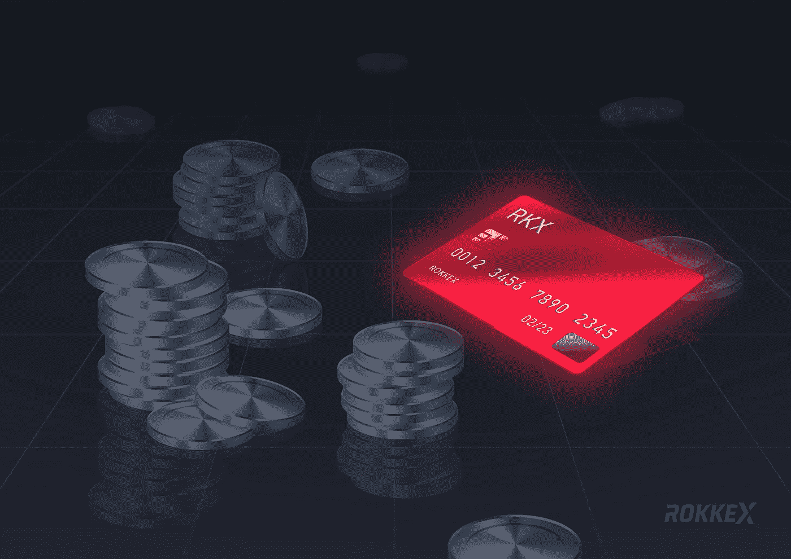

# 在 P2P 平台购买加密货币时被骗的 8 种方式

> 原文：<https://medium.com/hackernoon/8-ways-to-be-tricked-when-buying-cryptocurrency-on-p2p-platforms-d37f57f03475>

你怎样才能启动 HODLing crypto？嗯，你可能正在修理一台在垃圾场发现的旧电脑，并发现有 70 BTC 的私人钥匙，或者你发现[一个有 7500 BTC](https://blog.rokkex.com/what-is-a-multi-signature-wallet-and-why-exchanges-should-use-it-177d2f686c58/) 的硬盘。如果这些尝试都不成功，那就转向另外两种更传统的方式:在一个集中的加密交易所(例如， [ROKKEX](https://rokkex.com/) ☺)或者一个点对点(分散的)加密交易平台上购买。

# 什么是 P2P 加密交换？

P2P 密码交易所是一个买方直接向卖方付款的平台。有时它也被称为分散交换，因为该平台仅作为交易订单的匹配和路由层；它不持有客户的资金，也没有第三方控制它。

与集中式交易所相比，分散式加密货币交易所大多不需要 KYC 程序，费用也较低。然而，体积要小得多。

这些平台有时不是自动化的；你需要请求购买和销售，并在聊天中与人交谈。P2P 加密交换平台可能会很耗时，甚至令人恼火，但如果你选择了这条路，ROKKEX 需要警告你一些陷阱。

技巧列表是基于论坛讨论和密码爱好者对一个或另一个分散式密码交换的反馈而创建的。

## **1。圆点和逗号**

你在聊天中同意卖家先发 2.900 ETH，你再付款(看起来对你没有风险)。码落到你的账户或者进来 2900，看一眼后从你那边发转账。然后你惊讶的发现是两整九百，而不是二十九百。这种情况经常发生在显示器上用点或逗号分隔数字的系统中，用户会把一个数字与另一个数字混淆。

## **2。Ghost 加密交换平台**

Ghost 平台通常由 1-2 个网页和一个脚本组成，在外观和功能上模仿合法加密交换平台的工作。通常，这种平台的一个突出特点是性感的价格，有时买入价高于卖出价。一些幽灵加密交易平台只允许将法定货币兑换成加密货币，因为对于骗子来说，加密货币更安全，用户除了在论坛上投诉之外什么也做不了。一旦平台回报的想法，骗子消失改变名称和域名，创造一个新的幽灵加密交换平台。

**附注:这种把戏也可能发生在集中式加密货币交易所。**

## **3。网络钓鱼加密交换平台**

钓鱼交易所是一种更复杂的幽灵平台。骗子创建类似于真实交易所的域名，发布一些谷歌广告，在加密群、聊天和论坛中植入链接。此外，他们代表支持团队进行交流，并创建确保一切正常的假用户。用户表示，骗子还通过 DDoS 攻击和向当局投诉来威胁合法平台的所有者。不上瘾的简单方法是检查 URL 两次或更多次。

**附注:这种把戏也可能发生在集中式加密货币交易所。**

## **4。地址欺骗**

最经常发生在论坛和社交网络上，在那里，交易所代表的凭据被黑客攻击，用于接收加密货币的虚假地址被放置。通常情况下，帐户的访问权限不会被取消；该代表照常通信，不会立即注意到地址是伪造的。

这种把戏也可能发生在中央加密货币交易所。

## **5。脏钱**

您可以轻松地将 crypto 转换为 fiat，但您可能稍后会面临法律问题。最常见的，这种伎俩发生在 Qiwi 钱包上；然而，其他电子支付系统很少出现这种情况。例如，您下了 1k 美元的订单，并开始收到 100 美元、300 美元等金额。直到订单关闭，但随后您的帐户被冻结。为什么？因为你收到了用于毒品、儿童色情或者更糟的东西的黑钱。

## **6。社会工程**

让我们假设你在一个分散的加密货币交易所有一个“朋友”,你通常与他交换资产。随后，欺诈者会克隆出一个你的朋友，这个朋友在视觉上几乎无法与你的熟人区分开来(例如，字母“O”被替换为“0”)。结果很明显。

## **7。退款**

没有直接通过贝宝购买 BTC 的方法；然而，一些分散的交流可以帮助你。唯一的缺陷是发送了加密货币，但收到的交易被拒绝，并被 PayPal 拒付(*信用卡提供商要求零售商赔偿欺诈或有争议交易的损失*)。

## **8。中间人攻击**

有一个古老而巧妙的方案，如今已经不流行了，但仍有一些人试图使用它。因此，骗子联系加密交换平台的用户和平台本身。他/她将平台的账户资料发送给用户，并将他/她的账户资料交给平台。因此，当用户进行交易时，平台会看到交易，并将交换的资产发送到骗子的账户。

# 如何在加密货币交易平台上购买密码时不被骗

1.  始终保持专注和批判。检查两三次网址。有相当大的区别[https://www.whaleex.com/](https://www.whaleex.com/)**VS**[http://www.whalex.com/,](http://www.whalex.com/,)仔细看看
2.  把大笔的钱分成较小的部分。通过这种方式，您可以逐步兑换货币，并在收到前一笔交易的资产后发送下一部分。
3.  为每个平台创建困难且唯一的密码(当一个平台被黑客攻击时，其数据库被‘应用’到其他交易所)。在这里，我们告诉了[如何轻松应对众多强密码](https://blog.rokkex.com/outsourcing-password-management-101-7112ed320705/)。
4.  检查每个阶段的地址。有恶意软件在剪贴板上替换 BTC 和联邦理工学院的公钥，或者用户可能会把 BCH 的钱包和 BTC 的混淆。
5.  在 P2P 交易所，检查用户两次。如果你记得他/她有 1k 条信息，而现在只有 10 条，这应该会提醒你。
6.  谷歌加密交换平台的评论。在平台本身上阅读它们是没有用的——它们可能是假的。
7.  如果第三方要求你做交易，不要做。即使你收到了“你表哥”的信息。
8.  不要失去警惕，低估“最愚蠢”的把戏的风险，每天都有人被抓住。

我们 ROKKEX 希望这篇文章至少能帮助一个人不上骗子的当。

# **你可能也会喜欢**

[PoS、PoW 和其他 12 个你不知道的区块链协议](https://blog.rokkex.com/pos-pow-and-12-other-blockchain-protocols-you-didn-t-know-about-3634b089d119/)

[何处保存加密:加密钱包的类型](https://blog.rokkex.com/where-to-keep-crypto-types-of-crypto-wallets-52db723b928f/)

> **在**[**ROKKEX**](https://www.rokkex.com/?utm_source=Medium&utm_medium=blog&utm_content=kl)**，我们极其重视安全性，我们的加密交换建立在“安全第一”的原则之上。我们希望与更广泛的公众分享我们的专业知识，让世界变得幸福、安全和智慧:)**

如果您有任何想法和建议，请联系我们

[网站](https://www.rokkex.com/?utm_source=Medium&utm_medium=blog&utm_content=kl)。[领英](https://www.linkedin.com/company/rokkex/)。[脸书](https://www.facebook.com/rokkex/)。[推特](https://twitter.com/ROKKEX_com)。[电报](https://t.me/rokkex_chat)。 [Reddit](https://www.reddit.com/r/Rokkex/) 。 [Instagram](https://www.instagram.com/rokkexofficial/) 。