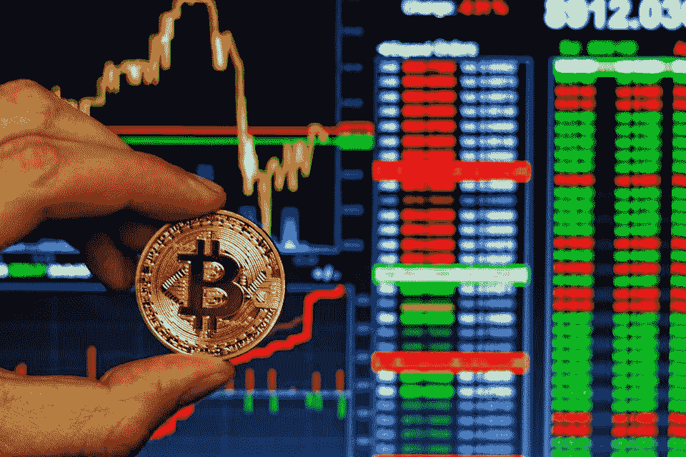

# 9 个世界上最好的加密货币交易所购买任何替代硬币

> 原文：<https://medium.com/hackernoon/9-best-cryptocurrency-exchanges-in-the-world-to-buy-any-altcoins-434c6ced72e7>

如果你正在寻找替代硬币，但不确定哪家是最好的加密交易所，那么你来对地方了。

***Image Credit: Cryptocynews.com***

一般来说，大多数加密交易所允许你交易、购买或出售数字货币。这可以是从加密到加密或从菲亚特到加密。在大多数情况下，投资者希望交易所平台对用户友好。那些提供卓越的安全措施和出色功能的产品名列前茅。

但你会发现这些交易所大多主要支持 coinmarketcap 排名前 20 的 altcoins。这里有一些值得尊敬的[加密货币交易所](https://www.coinreview.com/best-cryptocurrency-exchange/)，你应该考虑一下。

## **比特币基地**

比特币基地是世界上最受欢迎和最知名的加密货币交易所之一。数以百万计的用户使用这个平台，而且它得到了全球知名和值得信赖的投资者的支持。

事实上，比特币基地是首批推出的交流平台之一。它成立于 2012 年，总部位于旧金山。

比特币基地允许用户很容易地存取款。它提供有竞争力的费用、购买选择和高级交易功能。

此外，比特币基地提供了非常先进的安全性，它的用户友好，有良好的声誉，比特币基地保险确保其所有存储的数字货币。

## **币安**

币安是赵昌鹏创办的另一家快速发展的加密货币交易所。币安拥有其被称为“BNB”的数字硬币。

此外，币安为 Android 和 iOS 提供了一个移动应用程序，从而使加密货币的交易变得非常容易和高效。此外，币安支持超过 130 种加密货币。它们包括比特币、以太坊、Ripple、比特币现金、DASH、莱特币、GAS 和 EOS 等。

币安还提供较低的交易费用——0.1%的标准交易费用。与其他交易所相比，它的收费结构是独特和可承受的。

币安有一个最安全的用户友好界面。币安的用户注册过程也非常快速和简单。币安确实是世界上最好的加密货币交易所之一。

## **BitMex**

[BitMex](https://www.coinreview.com/bitmex-signals/) 是一个受欢迎的大规模加密货币交易所，由一组专家经济学家、网络开发人员以及高频交易商创建。有了 BitMex，你将不会面临任何关于资金流动性的问题。

虽然该平台中交易的主要数字货币是比特币，但它也支持以太坊、莱特币、Ripple、Cardano 和比特币现金等替代货币。

此外，这里的用户注册过程非常简单，因为你只需要你的电子邮件 ID。BitMex 费用结构费用结构也是负担得起的，简单明了。您的加密货币的安全性也得到了保证。

BitMex 是一个很棒的加密货币交易平台，界面友好。所以，如果你是新手，你不会有任何问题。

## **Bittrex**

Bittrex 是一个安全易用的美国交易平台。它允许您交易超过 190 种加密货币。关于 Bittrex 的安全性，没有什么可担心的，因为它受到美国现行规则的良好监管。

Bittrex 的交易费也相当体贴。它允许用户选择他们希望交易的各种利率，然后向用户收取 0.25%的标准服务费。

Bittrex 中的用户界面也相当干净。要开始注册，您需要您的电子邮件 ID。

## **波洛涅克斯**

[Poloniex](https://www.cryptocompare.com/exchanges/poloniex/overview) 是加密货币交易平台的另一个绝佳选择。它由 Tristan D'Agosta 创建，自 2014 年 1 月开始运营，总部位于美国。

Poloniex 向所有用户提供 100 多种加密货币。Poloniex 的费用结构也很简单。

如果你是一个购买替代硬币的新手，使用 Poloniex，你不会有任何挑战，因为它的用户界面友好，而且安全。此外，向 Poloniex 注册也很容易。

## **库币**

KuCoin 是另一个伟大且易于使用的加密货币交易平台。和币安一样，KuCoin 也为 iOS 和 Android 提供全功能的移动应用。

KuCoin 提供几个硬币，包括$KCS，龙链，等等。就费用结构而言，它们的费用相对低于其他受欢迎的交易所。

KuCoin 发展非常迅速，随着时间的推移，它有望成为头条新闻。注册过程很简单。

## **火币**

火币网是一个成立于中国的密码交易平台。它声称支持超过 250 种加密货币。

霍尼也相当独特，因为它有两个不同的版本。huo bi OTC——在这里，用户可以零费用地用法定货币交易加密货币。另一方面，Huobi Pro 版本设计有先进的加密货币交易功能。

火币支持各种硬币，包括长期信用币、BCH 币、BTC 币、XRP 币、EOS 币和 DASH 币等。 [Huobi 用户注册](https://www.huobi.co.kr/en-US/notice/)和费用结构简单明了，并提供全天候客户支持。

## **北海巨妖**

北海巨妖是一个著名的加密交换平台，提供大量的法定货币交换，包括美元、英镑、日元、欧元等等。

北海巨妖由 Jesse Powell 于 2011 年创立，支持超过 17 种加密货币。此外，北海巨妖的费用结构也很简单，制造商和接受者的费用约为 0 %至 0.26%。

北海巨妖支持加密货币，如比特币现金、比特币、DASH、莱特币、Monero、以太坊、Ripple、Zcash、Tether 等等。

## **位戳**

Bitstamp 总部位于斯洛文尼亚，成立于 2011 年。它支持多种加密货币，包括 BTC、LTC、ETH、BCH 和 XRP。

就费用结构而言，Bitstamp 是当今市场上交易费用最低的公司之一。它对国际电汇收取 0.05%的手续费，对国际取款收取 0.09%的手续费。

这是一个购买替代币的便捷平台，因为它允许欧元、美元、莱特币、以太币、比特币现金或波纹存款。

Bitstamp 的用户界面非常友好，对于初学者和其他密码爱好者来说非常容易使用。

## **成就最好的因素**

这些只是当今市场上[最好的加密交易平台](https://irishtechnews.ie/what-are-crypto-trading-platforms-things-you-should-know-about-crypto-trading-tools/)中的一小部分。然而，在决定使用任何平台之前，无论是交易、购买还是出售加密货币，都要确保对各种平台进行彻底的研究，以便选择最好的平台。

以下是在加密货币交易平台中需要注意的几个重要因素；

●安全性— [加密交换安全性](https://www.coinreview.com/crypto-exchanges-security-concerns/)至关重要。这样，你会安心，你的资金是安全的。记住，加密交换易受网络攻击。这也是为什么在购买后将你的钱存放在交易平台也不是一个好主意。

●支持加密货币——在决定任何交易所之前，确保它支持你想要投资的替代货币。

●费用和佣金——考虑一下收费相当高的交易平台，你不会希望因为支付交易费用而损失几乎所有的利润

●付款方式——留意付款方式，看看对你是否方便。

●易用性——平台的用户界面应简单易用

## **结论**

现在你已经知道了市场上最好的加密交换平台，你可以决定哪个平台最适合你。同样重要的是，要知道所有这些平台都有自己的优势和劣势。

此外，在投资任何加密货币之前，确保你了解所有的基础知识，并收集所有关于[加密货币交易](https://finance.yahoo.com/video/crypto-contraction-worsen-2019-192708916.html)的必要信息。请注意，加密交易可能会让你成为百万富翁，就像吃光你口袋里的最后一枚硬币一样。