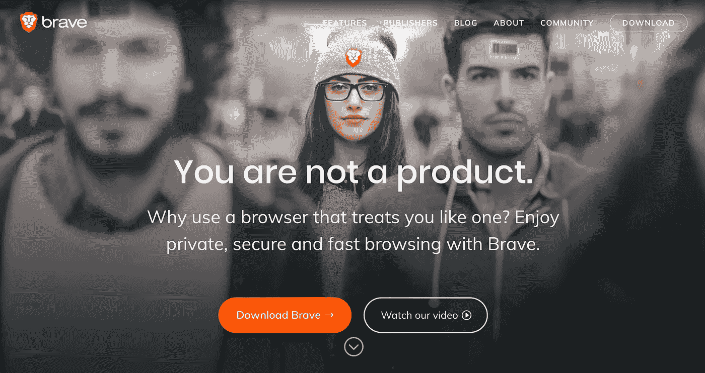
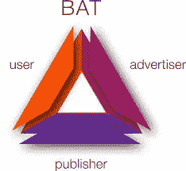
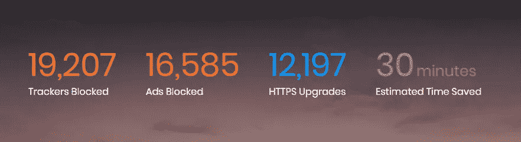
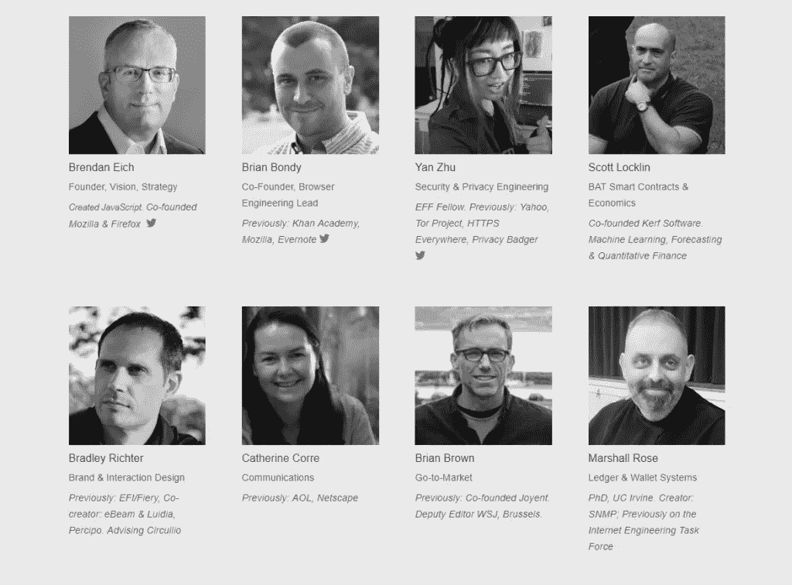
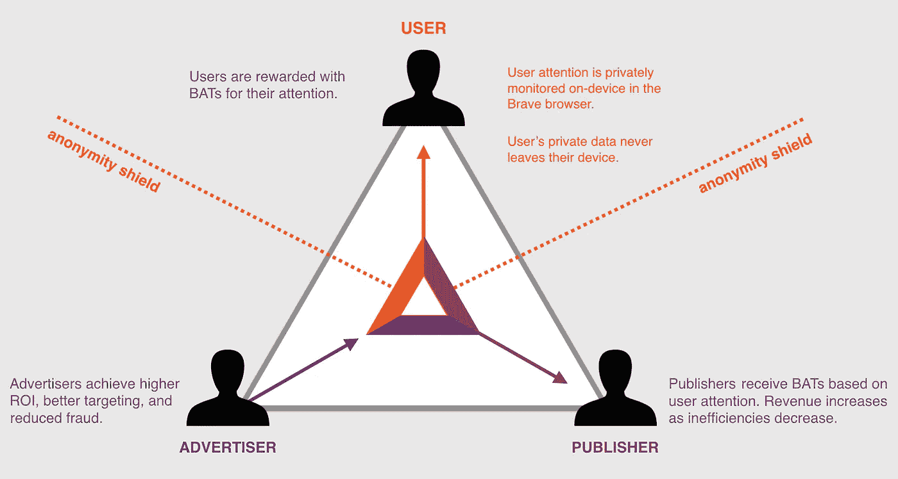
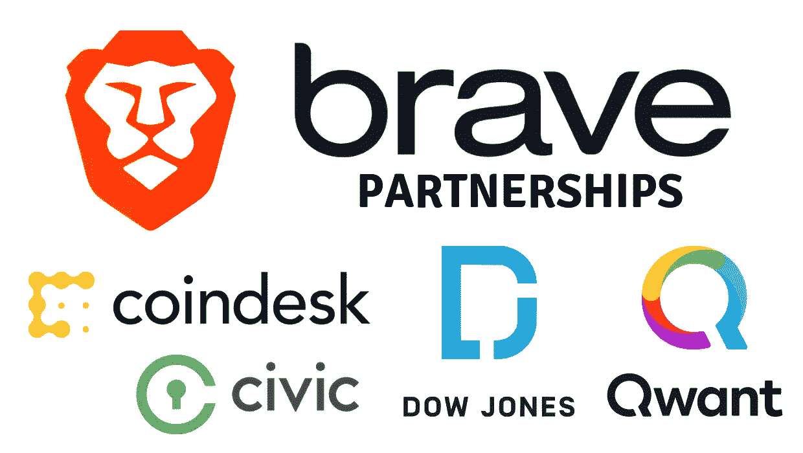

# BAT 是最好的 ERC-20 代币的 12 个理由

> 原文：<https://medium.com/hackernoon/9-reasons-bat-is-the-best-erc-20-token-531884e950b0>

众所周知，当前的加密熊市对投资者、项目和整体士气都不宽容。从这一经历中，市场清楚地表明了一个严酷的现实:它将不再接受一连串虚假承诺。市场要求看到目前在 CMC 上交易的数千种不同加密货币的真正解决方案和采用。

在整个加密领域，各种规模的项目都在宣传他们自己的一套不兑现的承诺。无论是以太坊发布 Casper 的重大延迟，Filecoin 自 2014 年以来的无线电静默，任何 Dapp 都未能捕获超过 100 个月活跃用户，还是 95%的加密项目未能交付工作项目，都表明市场需要一个再次兴奋的理由。目前，唯一一个提供日常价值的工作项目，并在集中化和互联性的高峰期保护在线用户隐私的项目是基本注意力令牌。这个项目在许多不同的方面都大放异彩，从团队的背景到项目的资金，到产品的采用，以及其间的一切。

# 基础知识:

1.  BAT 项目**始于 2017 年**，总部**位于三藩市**
2.  蝙蝠是基于勇敢浏览器的安全、匿名、选择加入广告系统中的**交换令牌**
3.  BAT **系统提供**:
    **用户**:观看广告时的强隐私性和安全性，提高相关性和性能，以及代币分成。
    **出版商:**收入增加，报告质量提高，欺诈行为减少。
    **广告主:**花费更少的客户关注，更少的欺诈，更好的归因。
4.  与许多区块链项目不同，英美烟草公司已经推出了一款全功能产品，并在全球拥有超过 500 万用户
5.  **股票代码:BAT**
    价格:0.13 美元
    市值排名:32
    市值:160930284 美元
    流通供应量:1221899089 只 BAT
    最大供应量:15 亿只 BAT
    24 小时交易量:483.47 万美元

# 团队:

1.  BAT 团队由布伦丹·艾希领导，他是技术领域的传奇人物。他是 JavaScript 的原创者，也是 Mozilla 和 Firefox 的联合创始人。
2.  联合创始人兼首席技术官是布莱恩·邦迪。他以前的工作经验主要是构建安全和隐私保护的 web 和分布式系统。他还在 Mozilla 与 Brendan 一起工作了几年。
3.  BAT 团队有一个**额外的 8 名区块链开发者和工程师**
4.  BAT 团队的其他成员还有商业开发人员和战略家

# 增长驱动因素:

1.  今天的网络体验以史无前例的垃圾邮件和隐私侵犯为标志。即使是传统的移动广告也给用户造成了巨大的负担，可能导致每月 23 美元的数据费用，缓慢的页面加载，以及多达 21%的电池寿命减少。
2.  为了应对当今糟糕的网络体验，全球有超过 6 亿台移动设备使用了广告拦截软件。**经通胀调整后，传统出版商在过去十年中损失了约 66%的收入。出版商面临收入下降，用户感到越来越受侵犯，广告商评估效果的能力下降。**
3.  BAT 在保护用户隐私的同时，很好地定位于**解决
    出版商内容的货币化问题**。他们的系统流程如下图所示:

4.BAT 通过将用户从 2018 年初的 100 万月活跃用户增长到今天的**超过 550 万用户，不断展示市场需求。**

5.随着 BAT 的 1.0 桌面浏览器的**发布，将奖励选择勇敢广告的用户，我相信这一额外的激励将推动网络的进一步发展。**

6.BAT 一直在改进他们的浏览器，最近**自他们之前的版本以来，已经将桌面**的内容加载时间提高了 22%。

7.BAT 知道移动用户(80%的用户)的重要性，并成功实现了显著的性能提升，这帮助他们的团队为他们的 Android 应用程序通过了**1000 万次下载。**

8.现在已经有超过 28，000 名经过认证的出版商参与了勇敢奖励计划，这使得他们能够与他们的读者重新建立联系。

9.我非常喜欢他们的浏览器兼容 Tor 的事实，这凸显了他们对用户隐私的承诺。

10.英美烟草还与一些**高调合作**，包括道琼斯媒体集团、HackerNoon、HTC、& Qwant，帮助为新用户带来优质内容。

11.英美烟草也开始与美国和欧洲的立法者合作，呼吁为用户制定更多的隐私保护法。他们甚至向 GDPR 投诉监控技术，并写信给美国参议院，要求美国通过某种 GDPR 法律。

12.该项目得到了几个高调基金的支持，如创始人基金、基金会资本、Propel Venture Partners、潘迪拉资本、DCG、丹华资本和银辉区块链风险投资。

# 逆风:

1.  不幸的是，软件崩溃的次数比我希望的要多，但是希望在 1.0 发布之前这些错误能够被修复。
2.  这个项目的成功不仅取决于英美烟草公司的产品有多好，还取决于它是否对用户友好。
3.  由于监管总是会落后于创新，数字货币领域未来可能会受到新监管的约束。

# **结论:**

英美烟草不仅仅是区块链的一个项目。它实际上是通过使用客户端加密保护您设备上的数据和浏览资料来捍卫您的基本隐私权。勇敢切断所有恶意的第三方追踪器，消除您的私人信息和恶意软件风险的数据泄漏。Brave 做到这一切的同时，为出版商的努力提供了比今天低效和不透明的市场更大的收入份额。随着互联性和集中化在数字世界达到顶峰，Brave 正在重置基于在线广告的网络生态系统，以创建一套新的网络标准。

**想了解更多信息，请访问我的网站:**

【www.MasiDigitalVentures.com 