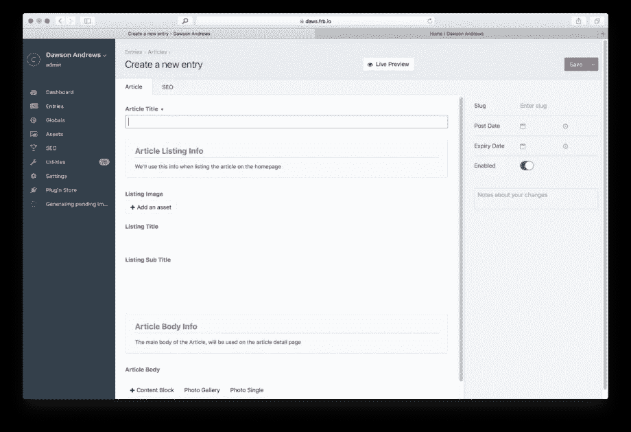
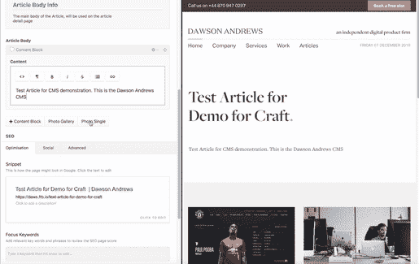
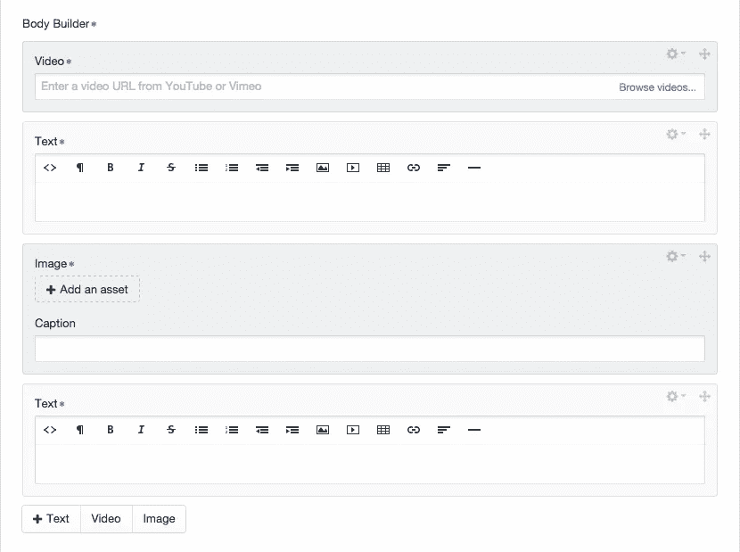
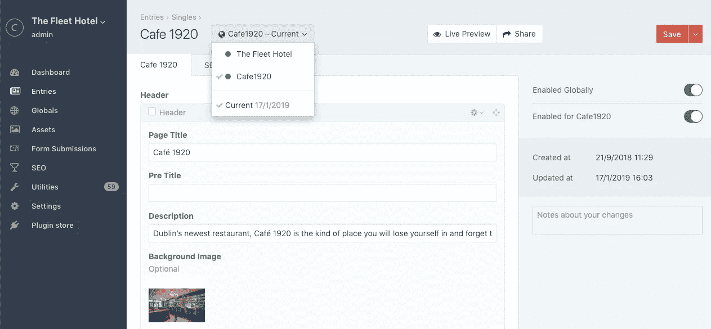
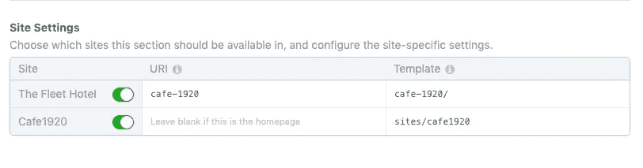
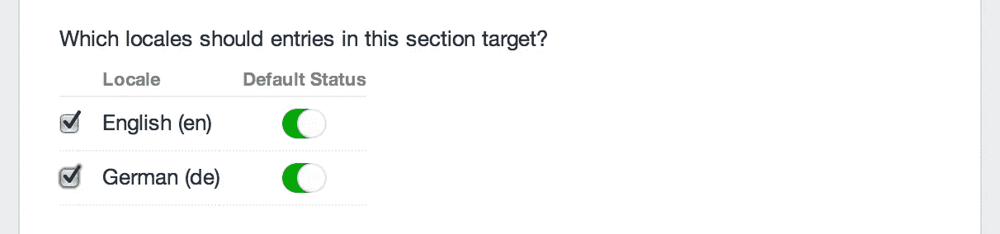
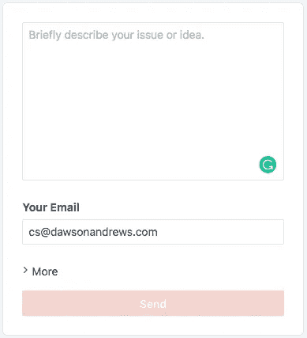

# 我认为 Craft 是当今市场上最好的 CMS 的 9 个理由

> 原文：<https://medium.com/hackernoon/9-reasons-i-think-craft-is-the-best-cms-on-the-market-today-103dd8a5f235>

## 你好，我是[卡姆](https://twitter.com/camstewart)—[道森安德鲁斯](http://www.dawsonandrews.com)公司的联合创始人兼产品人员。自从我涉足网站以来，CMS 就一直是我生命中的骄傲。笨重，灰色，没有灵感，不适应的垃圾，只会让我紧张。

…直到 Craft CMS 出现。

我从未想过有一天我会心甘情愿地花时间为一个 CMS 写下赞美，但现在我来了。

And breathe… a CMS that gets me.

Craft CMS 简单、简约、灵活，拥有现代 CMS 框架所需的所有功能。在过去的十年里，我们与你能想到的每一个 CMS(Wordpress、Drupal、Rails+ActiveAdmin、Ghost、Weebly、DjangoCMS、Jekyll、Joomla、Tumblr、Squarespace、Expression Engine、Statamic、Blogger)合作过……以下是我们坚定地将 Craft 作为首选的原因。

# 惊人的反应控制面板😲

Craft 的控制面板无疑是使用起来最优雅、最愉快的。这种设计不碍事，使编辑和管理你的内容变得容易。

*“工艺对我们来说是一个明智的选择。我们在团队中有广泛的技术技能，每个人都喜欢它。我们定期调整我们的网站，鉴于它的适应性很强，我们很少需要寻求技术支持。”
–Charlie McCloskey，数字负责人，* [*ICC 贝尔法斯特*](https://www.iccbelfast.com/)

它的响应速度也很快，所以你可以在手机上编辑你的网站。我们的客户在世界各地有多个内容贡献者，他们在火车上、酒店里、公共汽车上登录 Craft，然后直接在网站上添加内容。

# ‘查看预览’—实时预览

可能最具创新性的竞争优势是预览功能。“旧 CMS”会迫使你打开一个新的标签页，并在每次你想看你的改变是什么样子的时候重新加载你的网站。Craft 超越了这一点，建立了一个实时预览功能，带来了一个分屏视图，让你在输入时实时查看编辑内容。

它还允许您生成 URL，以便在发布前与同事分享您的预览。这让我们工作的速度是我们如此强烈支持手工艺的一个关键原因。

# [数]矩阵

Matrix 就像乐高——挑选一块积木，然后建造你想要的东西，布局从未如此简单。早在 2010 年，Pixel 和 Tonic(Craft 背后的团队)就为 ExpressionEngine(旧 CMS)开发了一个插件，它改变了游戏规则。当他们最终建造飞船并引入矩阵时，情况甚至更好。配置字段时，可以定义包含自定义字段的块。然后，当您创建一个条目时，您可以按照任何顺序添加任意数量的块。

在上面的例子中，我们定义了三个块:文本、视频和图像。这意味着我们仍然可以创建结构化的模板，但是给客户以他们想要的任何方式定制他们的页面的自由——不需要打电话给开发者。

# 多站点、多语言

一种鲜为人知但至关重要的工艺元素。您可以使用不同的模板集和不同版本的条目内容在不同的域中定义一个或多个站点，所有这些都在一个 Craft 安装下完成。这对于运行多语言或多币种的网站，或者需要子品牌或交易部分的网站来说至关重要。

Craft 中的多站点特性适用于拥有相同发布团队的站点。您可以在入口级别管理多站点内容，并且能够启用希望包含在站点中的部分。

A hotel site who wanted a separate site for their cafe. It was as simple as duplicating and removing the hotel-specific content from the Cafe site.

# 本土化

本地化根据您的目标受众翻译您页面的内容。通过设置和启用语言环境，您可以简单地从编辑条目部分的侧边栏切换到所需的语言环境，甚至是在特定的部分。例如，WordPress 依赖于沉重的插件，这些插件降低了网站速度，也扰乱了安全性。

# 无插件

虽然 Craft 有很多有价值的插件，但它的核心产品运行得非常好，不需要额外的部件，我们很少发现自己需要插件。与许多其他现成的 CMS 相比，你实际上不需要很多插件。以下是其他 CMS 可能需要你安装第三方插件的功能列表。

*版本控制和草稿
本地化
实时预览
关系
图像大小调整
使用资产 CDN
类别
标签
用户管理*

这似乎是一件值得庆祝的小事，但是对插件的低依赖最终使得更新网站变得轻而易举。对于开发人员来说，一旦您更新了核心文件，您只需访问控制面板来运行迁移。这使得跨多个环境更新核心真正无缝。与 Wordpress 时代相比，一键更新是革命性的，在 Wordpress 时代，你几乎必须专门更新所有其他元素。

# 支持

有问题吗？仪表板中有一个表单，可以直接向开发人员发送消息以及错误日志、数据库备份和模板文件。

Twitter 和 Reddit 上还有一个由粉丝组成的完整工艺社区(和我们一样),他们互相支持，这样你就不会被晾在一边。网络真的落后于工艺，支持是存在的。

[Craft CMS](https://medium.com/u/b08baf28609?source=post_page-----103dd8a5f235--------------------------------)

# 安全性

由于 Craft 的一键式更新功能非常高效，用户不会延迟保持 CMS 安全的最重要的部分，即更新。这只是一个点击的问题，剩下的就交给 Craft 了。

Craft CMS 提供定制的自由、中央更新系统和最先进的安全性，所有这些只需一次性支付 299 美元。另一方面，WordPress 是免费的，至少最初是这样。为了增加安全性——这是必须的——你必须每月支付 500 美元。

看看依赖插件带来的漏洞，Craft CMS 不仅看起来像一个安全的赌注，也是一个明智的决定。

# 嫩枝

客户不太关心这个，但是开发人员非常关心模板引擎。Craft 使用 Twig——它干净、简单且不专有。如果你发现一些 Twig 不能开箱即用的东西，扩展起来真的很简单。这是你自己的 HTML——你不会与自动生成的胡说八道一起工作——你在控制。Twig 语法非常熟悉、优雅且易于阅读。如果您确实有一个输入错误，您会得到一个错误消息，告诉您哪一行有错误，这也没有什么坏处。

# 总之…

作为一家公司，Craft 给我们带来了巨大的好处，尤其是对我们的客户:它的速度快得令人难以置信，它有一个漂亮的、易于使用的管理面板，我们都很喜欢使用它。这是一个安全、现代的系统，易于扩展，并由一个了不起的开发人员公司和社区提供支持。我们不能建议更多地使用它。

跟随[工艺](https://twitter.com/CraftCMS)T2 跟随[像素&主音](https://twitter.com/PixelAndTonic)T5 跟随[布兰登凯利](https://twitter.com/brandonkelly) (CEO)