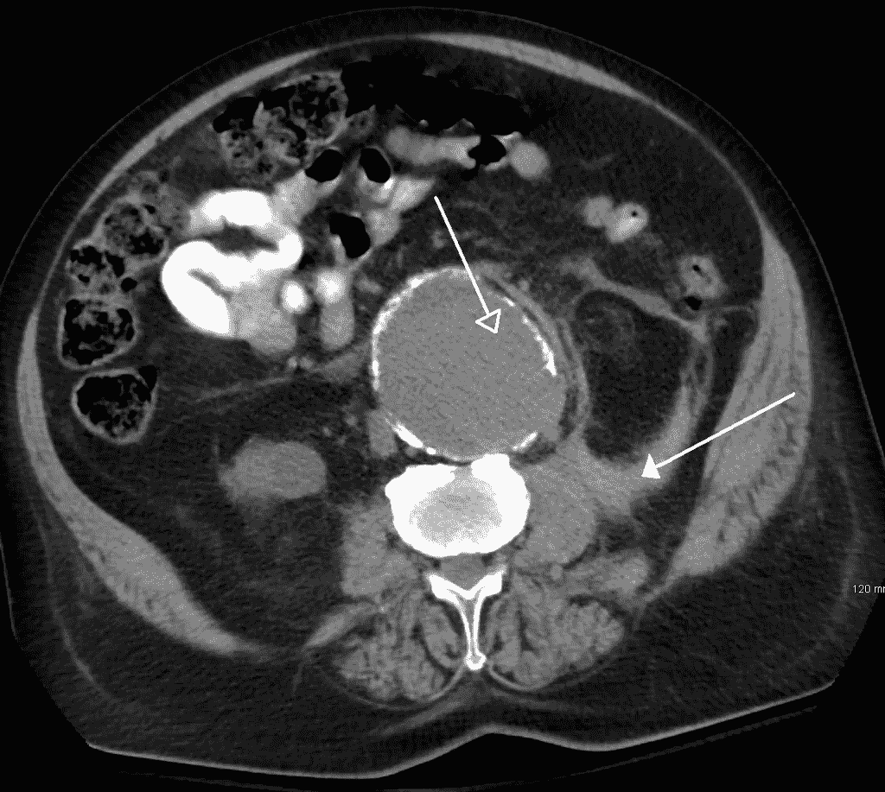

# 医学成像深度学习应用初学者指南

> 原文：<https://medium.com/hackernoon/a-beginners-guide-to-deep-learning-applications-in-medical-imaging-7aa3b143e028>

让我们先了解什么是医学成像，然后再深入研究[学习](https://hackernoon.com/tagged/learning)和其他类似的专家系统可以在多大程度上帮助医学专业人士(如放射科医生)诊断他们的病人。

维基百科是这样定义**医学影像:**

> 医学成像是为临床分析和医疗干预创建身体内部的视觉表示的技术和过程，以及一些器官或组织(生理学)的功能的视觉表示。医学成像寻求揭示被皮肤和骨骼隐藏的内部结构，以及诊断和治疗疾病。医学成像还建立了正常解剖和生理的数据库，使得识别异常成为可能。尽管出于医学原因可以对切除的器官和组织进行成像，但是这种过程通常被认为是病理学而不是医学成像的一部分。

A [CT scan](https://en.wikipedia.org/wiki/CT_scan) image showing a ruptured [abdominal aortic aneurysm](https://en.wikipedia.org/wiki/Abdominal_aortic_aneurysm) (Credits: Wikipedia)

简单来说:医学上使用了大量的设备来帮助医生观察我们体内的情况。这包括 x 光机，它有助于观察各种组织结构。CT(计算机断层扫描)等技术使用一组 X 射线扫描将组织的虚拟切片缝合在一起，使医生无需切开即可看到它。

我们必须明白，由于这种设备的广泛使用，存在着大量的带注释的医学图像，所有这些图像都为数据科学家(比如我们！)来构建神经[网络](https://hackernoon.com/tagged/networks)来消费这些数据。

> 如果你有一个小引擎和一吨燃料，你甚至不能起飞。…与深度学习[创造人工智能的关键过程之一]的类比是，火箭引擎是深度学习模型，燃料是我们可以馈送给这些算法的大量数据。—吴恩达

最近参加了 Kaggle 比赛:[组织病理学癌症检测](https://www.kaggle.com/c/histopathologic-cancer-detection/discussion)。目标是在淋巴结切片的组织病理学扫描中识别转移组织。我的解决方案在 1157 个团队中排名第 46 位。这个解决方案是我的解决方案和几个顶级内核的集合。没有集成，我的结果只比提交结果少 0.6-0.7%，我将在本文中分享我的解决方案。该代码将是我处理医学深度学习问题的一般方法的基础。

我将把我的设计方法分解成几个简单的步骤:

1.  了解手头的任务，并相应地处理您的数据:这是一个极其重要的步骤，许多新数据科学家在原型阶段都没有做到。您必须首先了解您的数据集，并确定在开发阶段可能出现的任何问题。这包括识别带有伪像的噪声数据以及任何异常值。
2.  对图像进行适当的放大。如果合适，也考虑进行列车测试增强。讨论图像增强超出了本文的范围，但是网上有大量关于这个主题的教程和指南。读者可以自行选择一个好的参考资料:)
3.  定义模型架构。你可以尝试已经定义好的架构，比如 VGG/resnet model。或者尝试一些新奇的东西，比如 NASNet 模型。如果你想要的是图像分割，试试 UNet。当然，您可以自由定义任何想要在数据集上尝试的新架构。只要确保你打败了最先进的^_^
4.  确认和验证您的结果。一旦你对你所拥有的感到满意，发表你的发现并传播出去。

这是一个关于如何使用深度学习进行医学图像分析的通用初级读本。快乐的编码人！！

关于我:我是德里科技大学的计算机科学学生。我也是英特尔 AI 大使。

在 GitHub 这里找到我:[https://github.com/ritabratamaiti](https://github.com/ritabratamaiti)在 LinkedIn 这里:[https://www.linkedin.com/in/ritabratamaiti/](https://www.linkedin.com/in/ritabratamaiti/)