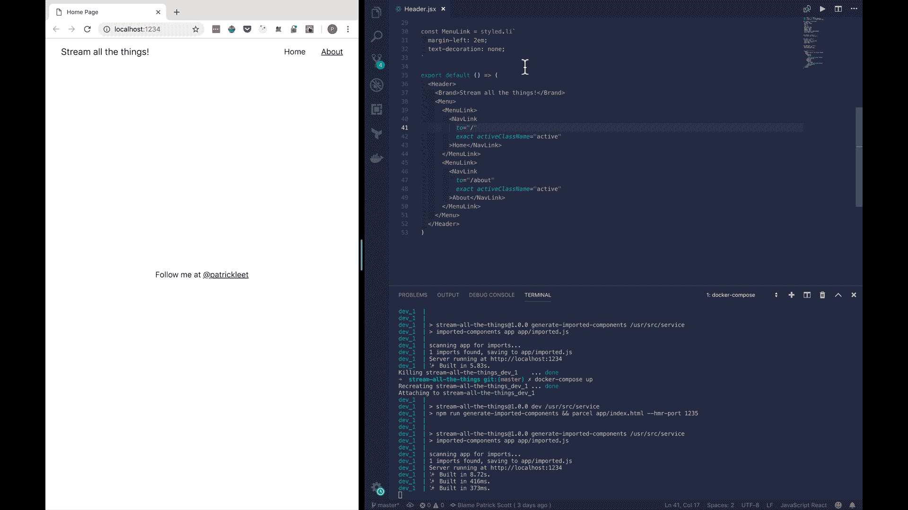

# 用 Docker 开发 Node.js 的更好方法

> 原文：<https://medium.com/hackernoon/a-better-way-to-develop-node-js-with-docker-cd29d3a0093>

## 并保持您的热代码重载


Licensed from Adobe Stock Photo

最近看到很多文章建议如何使用 Docker 进行开发。我还没见过能正确做到的。

显然，正确地说，是主观的，但是我想比较一下典型的智慧和我通常处理问题的方式。

# 传统智慧

在很多教程中，首先介绍的就是 Dockerfile。

> 在任何 docker 化应用的基础上，你都会发现一个`[Dockerfile](https://docs.docker.com/engine/reference/builder/) —` [https://blog . codeship . com/using-docker-compose-for-nodejs-development/](https://blog.codeship.com/using-docker-compose-for-nodejs-development/)

显然，这是基础。

谷歌上的前几个结果都表明，你首先需要的是一个 Dockerfile 文件。

毕竟，不创建 Docker 文件，怎么能有 Docker 环境呢？

我在这里告诉大家，虽然这对于生产来说是正确的，但对于开发来说却是错误的方法。您不需要创建自己的。

docker 文件是打包应用程序的一种方式。您不需要打包您的应用程序进行开发，老实说，您真的不应该这样做。

开发和生产不是同一个环境。

当你在 MacBook 上开发时，你安装的工具与你在生产中使用的不同。仅仅因为“它在任何地方都以同样的方式运行”并不意味着它应该如此。

您的应用程序在开发中的运行方式有所不同。

在一个需要灵活性和可塑性的时代对它进行打包，这就是为什么许多工程师得出 Docker 不适合开发的结论。

例如，当依赖关系发生变化时，您需要构建新的容器，从而失去了开发的灵活性。

当然，您可以在容器中执行并执行一些命令，安装一些库，但是在这一点上真的很容易吗？

现在，上面的一些文章比其他文章更正确，但是如果您使用 Dockerfile 进行开发，您可能已经走得太远了。有些情况下，你会想要一个，但可能不是以你想的方式。

> **提示**:如果你的 docker 文件包含一个`npm install`，那你就太过分了。

# docker-compose 构建器模式

先说一下 Docker *是什么*。

Docker 是一种打包代码的方式。这是使用 Docker 的典型*上下文*。

Docker 也是一种创建能够执行特定类型应用程序的隔离环境的方法。

Docker 允许您打包能够运行您的代码的环境。

当您使用 Docker 进行生产时，您使用的是您能制造的最专业的 Docker 容器。它们是为您的应用程序定制和专门构建的，以您构建应用程序的方式打包。为此，创建 docker 文件是有意义的。

当你为开发而设置你的计算机时，那不是你所做的。相反，您需要安装开发所需的工具。你只需要创建一个你的代码可以运行的环境。

这意味着您可以使用更通用的 docker 文件。通常，开发所需的这些通用 docker 文件已经存在。

例如，开发 Node.js 应用程序时，需要在机器上安装`node`。就是这样。

你不需要 alpine linux。您不需要将 node_modules 打包成不可变的版本。你不需要小容器来执行以做出重大改变。你只需要能够执行`node`和`npm`。

因此，在一个容器中，这也是你所需要的，这意味着 Docker Hub 上的官方`node`映像会做得很好。

事不宜迟，我用 Docker 开发的方法。

在我的上一篇文章中，我展示了如何使用 package 进行开发和生产。让我们继续前进，在此基础上再接再厉。

我认为这是一个很好的例子，因为热模块重载对于高效开发 React 应用程序至关重要。

## 第一步

首先，我们需要一个`docker-compose`文件。在其中，我们需要我们的开发环境。看起来我们正在制作一个`node`应用程序，这意味着官方的`node`图像可能是一个安全的赌注。

让我们添加一个文件`docker-compose.yml`:

```
version: '3'services: dev:
    image: node:11
```

接下来，我们需要我们的代码在环境中，但是我们不希望它被烘焙到映像中。如果我们使用这个进行开发，当我们的文件改变时，容器中的文件也需要改变。

为此，我们可以使用体积。我们将把当前目录`.`挂载到容器中的`/usr/src/service`。我们还需要告诉 docker 我们的“工作目录”在哪里。意思是——我们把代码放在哪个目录下了？

```
version: '3'services: dev:
    image: node:11
    **volumes:
      - .:/usr/src/service
    working_dir: /usr/src/service**
```

现在，每次我们在本地机器上进行更改时，相同的文件更改都会反映在`/usr/src/service`中。

接下来，我们需要执行命令`npm run dev`。这很容易用`command`完成。我们还想在端口`1234`上本地访问它。

最后，默认情况下，热模块重新装载包发生在一个随机端口上，这对我们来说是不可行的，因为我们还需要映射 HMR 端口。

修改`package.json`中的`dev`脚本，以包含选项`--hmr-port=1235`。

```
"dev": "npm run generate-imported-components && parcel app/index.html **--hmr-port 1235**",
```

准备就绪后，让我们更新 Docker 文件，将本地机器上的端口映射到容器上的相同端口。

```
version: '3'services: dev:
    image: node:11
    volumes:
      - .:/usr/src/service
    working_dir: /usr/src/service **command: npm run dev
    ports:
      - 1234:1234
      - 1235:1235**
```

如果你已经做了足够的节点开发，你会注意到我们有一个问题。你不能不安装依赖项就运行一个节点应用。

此外，您不能只在 Mac 或 Windows 上本地安装节点模块，然后期望它们在 linux 容器上工作。

当您运行一个构建时，在某些情况下，库是本地编译的，产生的工件只能在构建它的操作系统上工作！

作为第一次尝试，你可能想在一个命令中把`npm install`和`npm run dev`链接起来，当然这是可行的，但是这并不是我们想要的。这将要求我们每次使用容器启动开发模式时运行一次安装。

此外，有些服务除了需要安装之外，还可能需要一个构建步骤。在我们的例子中，开发客户端不需要这样做，因为 parcel 或 nodemon 会处理它，但不是所有的应用程序都是在过去一周用最新的技术构建的。

出于教育目的，链接命令的方式是使用`bash`或`ash`来执行命令。如果你尝试

```
command: npm install && npm run dev
```

你会知道那是行不通的。相反，你可以用。

```
command: bash -c "npm install && npm run dev"
```

这实际上是可行的，但不是我们想要的最佳解决方案。

这就把我们带到了第二步。

## 第二步

让我们创建另一个 docker-compose 文件，这次命名为`docker-compose.builder.yml`。

这次我们将需要使用`version: 2`来利用`docker-compose`中的一个特性，这个特性在版本 3 规范中是不可用的。

第 3 版比第 2 版更适合在生产中使用，第 2 版有更多开发友好的特性。

> 更新:V3 现在也以稍微不同的语法支持这一点——希望有一个 PR 来更新它:)这里是文档:[https://docs . docker . com/compose/compose-file/# extension-fields](https://docs.docker.com/compose/compose-file/#extension-fields)

我们想在`docker-compose.builder.yml`中定义的第一件事是一个基础图像。

```
version: '2'services: base:
    image: node:11
    volumes:
      - .:/usr/src/service
    working_dir: /usr/src/service
```

这看起来应该很熟悉。这与我们在`docker-compose.yml`文件中使用的基数相同。

现在，我们可以扩展基础来执行一大堆不同的命令。例如:

```
version: '2'services: base:
    image: node:11
    volumes:
      - .:/usr/src/service/
    working_dir: /usr/src/service/ **install:
    extends:
      service: base
    command: npm i** **build:
    extends:
      service: base
    command: npm run build** **create-bundles:
    extends:
      service: base
    command: npm run create-bundles**
```

现在，要使用与我们在`docker-compose.yml`中的开发服务相匹配的`node:11`映像来安装依赖项，我们可以运行:

```
docker-compose -f docker-compose.builder.yml run --rm install
```

安装所需的二进制版本。

> **亲提示:**诚然，`docker-compose -f docker-compose.builder.yml run — rm install`，并不会真的“脱口而出”吧？我通常把它放在 Makefile 中，这样就可以运行`make install`等。

运行安装程序后，`docker-compose up`将打开我们的开发环境，它的工作方式和在本地机器上完全一样。

```
➜  docker-compose up
Creating stream-all-the-things_dev_1 ... done
Attaching to stream-all-the-things_dev_1
dev_1  |
dev_1  | > stream-all-the-things@1.0.0 dev /usr/src/service
dev_1  | > npm run generate-imported-components && parcel app/index.html
dev_1  |
dev_1  |
dev_1  | > stream-all-the-things@1.0.0 generate-imported-components /usr/src/service
dev_1  | > imported-components app app/imported.js
dev_1  |
dev_1  | scanning app for imports...
dev_1  | 1 imports found, saving to app/imported.js
dev_1  | Server running at [http://localhost:1234](http://localhost:1234)
```

当我们进行更改时，热代码重载会像预期的那样工作！



全都没有文档！

## 奖金

我只是想快速添加一个 Makefile 示例，使命令更容易记忆和使用。

创建一个名为`Makefile`的文件:

```
install:
 docker-compose -f docker-compose.builder.yml run --rm installdev:
 docker-compose up
```

Makefiles 使用制表符，但是 [base:
image: node:11
volumes:
**- nodemodules:/usr/src/service/node_modules** - .:/usr/src/service/
working_dir: /usr/src/service/**volumes:
nodemodules:
external: true**](https://medium.com/u/d0bbc53072f4# ...</span><span id=)

[这也稍微改变了我们的启动过程，因为在第一次运行时，我们需要用`make setup`确保该卷存在。](https://medium.com/u/d0bbc53072f4# ...</span><span id=)

# [结论](https://medium.com/u/d0bbc53072f4# ...</span><span id=)

[使用 Docker 并不总是需要做一个 Docker 文件！通常，为了开发，你可以使用别人的！](https://medium.com/u/d0bbc53072f4# ...</span><span id=)

[我希望我已经向您展示了快速使用 Docker 和 docker-compose for development 的简单方法。](https://medium.com/u/d0bbc53072f4# ...</span><span id=)

[如果你觉得这有帮助，请给我一些掌声👏还是一份，一定要关注我！](https://medium.com/u/d0bbc53072f4# ...</span><span id=)

[要了解如何在 CI 管道中为生产创建多阶段构建，或者如何使用 docker-compose 运行阶段测试，请查看我的文章:](https://medium.com/u/d0bbc53072f4# ...</span><span id=)[我有一个坦白…我向 master 承诺。](https://hackernoon.com/i-have-a-confession-to-make-i-commit-to-master-6a804f334beb)

在下一篇文章中，我将向您展示[如何使用林挺、格式化和代码覆盖率单元测试](https://hackernoon.com/enforcing-code-quality-for-node-js-c3b837d7ae17)来加强代码质量，这是我们完成生产就绪的多阶段 docker 文件来打包代码之前的关键步骤。

最好，
[李雅达斯科特](https://twitter.com/pat_scott)

查看本系列的其他文章！这是第二部分。

[](https://hackernoon.com/move-over-next-js-and-webpack-ba367f07545) [## 第 1 部分:讨论 Next.js 和 Webpack🤯

### 简单流服务器端渲染(SSR)反应+样式-组件与包裹

hackernoon.com](https://hackernoon.com/move-over-next-js-and-webpack-ba367f07545) [](https://hackernoon.com/enforcing-code-quality-for-node-js-c3b837d7ae17) [## 第 3 部分:加强 Node.js 的代码质量

### 使用林挺、格式化和带有代码覆盖的单元测试来实施质量标准

hackernoon.com](https://hackernoon.com/enforcing-code-quality-for-node-js-c3b837d7ae17) [](https://hackernoon.com/the-100-code-coverage-myth-900b83d20d3d) [## 第 4 部分:100%代码覆盖率的神话

### 现在互联网上有很多建议说 100%的覆盖率不是一个有价值的目标。是吗？

hackernoon.com](https://hackernoon.com/the-100-code-coverage-myth-900b83d20d3d) [](https://hackernoon.com/a-tale-of-two-docker-multi-stage-build-layers-85348a409c84) [## 第 5 部分:两层(Docker 多阶段构建)的故事

### Node.js 的生产就绪 docker 文件

hackernoon.com](https://hackernoon.com/a-tale-of-two-docker-multi-stage-build-layers-85348a409c84)