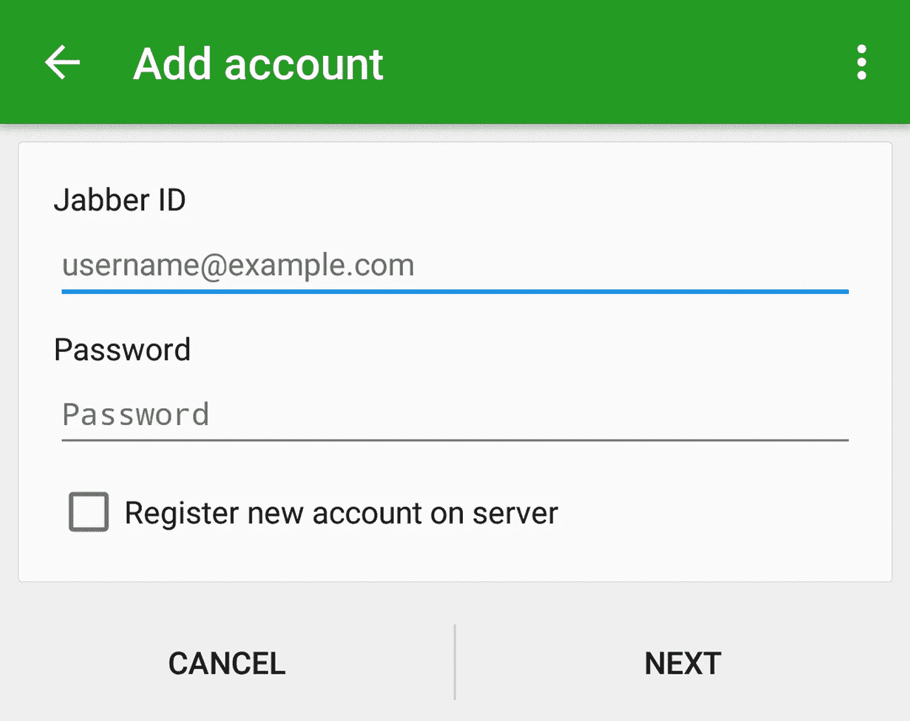
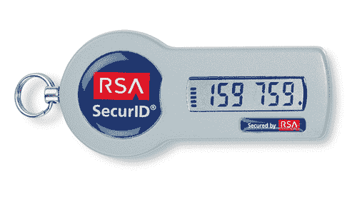
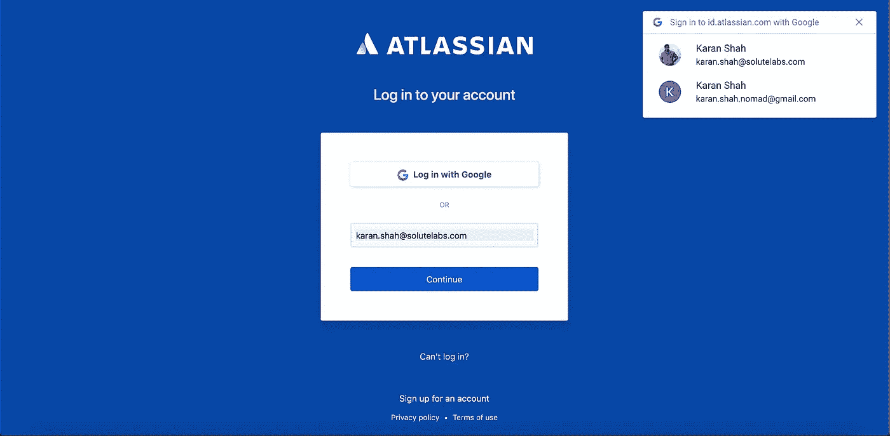

# 认证简史

> 原文：<https://medium.com/hackernoon/a-brief-history-in-authentication-b9920dee28ae>

## 根据维基百科的定义，认证[是确认实体声称的单个数据的属性的真实性的行为。一些从一开始就处于系统核心的东西已经发展了很多年，就像开发的其他部分一样，复杂性也增加了。](https://en.wikipedia.org/wiki/Authentication)

Photo Credits: [Edward Tin](https://yourshot.nationalgeographic.com/profile/1293520/)

认证可能从简单的电子邮件和密码开始。时至今日，它仍在大多数系统中使用，在这些系统中，我们依赖用户使用唯一的密码来访问电子邮件等应用程序。

我们都知道结果是怎样的——直到今天，人们还保留着相同的[重复的密码](https://www.passwordrandom.com/most-popular-passwords)，比如 password、123456 和 qwerty。此外，人们通常倾向于在任何地方保存相同的密码，因此，如果一个系统被入侵，其他系统也会被入侵——随着每天创建更多的帐户，这带来了严重的安全风险。

## 输入双因素身份验证

为了使用多种方式对用户进行身份认证，双因素身份认证应运而生。这可以通过以下方式实现:

*   问安全问题([苹果 ID](https://appleid.apple.com/) )
*   发送登录链接( [Slack](https://slack.com/) 的神奇链接)
*   发送 TOTP 到电子邮件(微软， [Skype](https://www.skype.com/) )
*   向注册手机发送 TOTP([HDFC](https://www.hdfcbank.com/)银行)
*   在手机上发送通知( [Google Apps for Work](https://gsuite.google.com/) )
*   使用 TOTP 生成器，如 Google Authenticator([AWS](https://aws.amazon.com/))，Google 等。)
*   使用随机数生成器基于 RSA 的物理钥匙串

由于不同的用户行为、法律要求和期望，每家公司都选择了不同的身份认证机制，并定义了用户体验，即 UX。对于更安全的环境，多因素身份认证结合使用(例如，移动+电子邮件)并与上述方法结合使用:

*   指纹、视网膜扫描等生物识别技术
*   使用诸如信用卡/借记卡号和 CVV 的实体卡

***然后，颠覆性的事情发生了，社交登录被引入——这改变了事情(甚至使事情变得复杂)***

许多系统增加了脸书和谷歌的社交登录(现在有很多，如 Twitter、LinkedIn、Github 和 Atlassian)，但没有考虑系统中现有用户会发生什么。

我个人有过非常糟糕的经历，他们不是从我的社交账户中获取电子邮件地址并与他们自己的数据库进行映射，而是创建一个全新的账户，并且没有办法合并这两个账户。不记得密码这一点完全失败了。

系统逐渐发展，并做出了急需的修复。尽管如此，不同的系统表现不同，如 [Trello](https://trello.com/) ，它允许使用电子邮件和密码登录，或者使用谷歌，但不能同时使用两者——我想知道为什么！

最近，我使用谷歌密码建议功能，但更喜欢使用谷歌自动登录功能

这在很多网站和手机应用中都有。即使你是 Mac 用户，留在谷歌生态系统中也会有所帮助。

另一个很棒的登录方式是使用手机号码登录 TOTP，比如 [Swiggy](https://www.swiggy.com/)

让我知道你喜欢哪种认证机制，为什么！

**关于我**:我是[溶质实验室](https://www.solutelabs.com/)的联合创始人，溶质实验室是一家提供全方位服务的数字机构，致力于提供卓越的体验和开发数百万人使用的网络和移动应用。