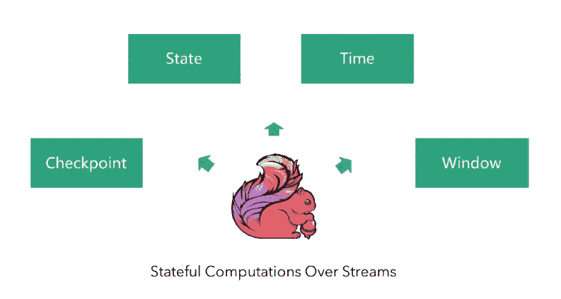
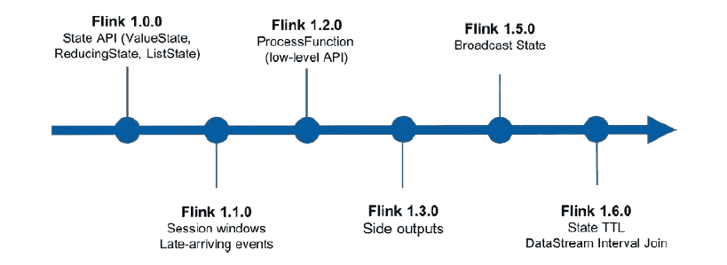
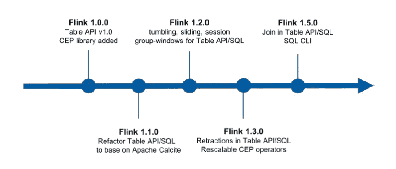
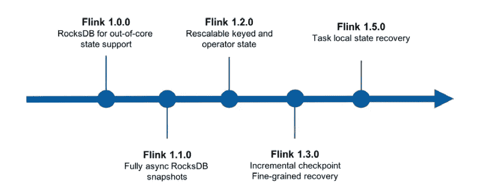
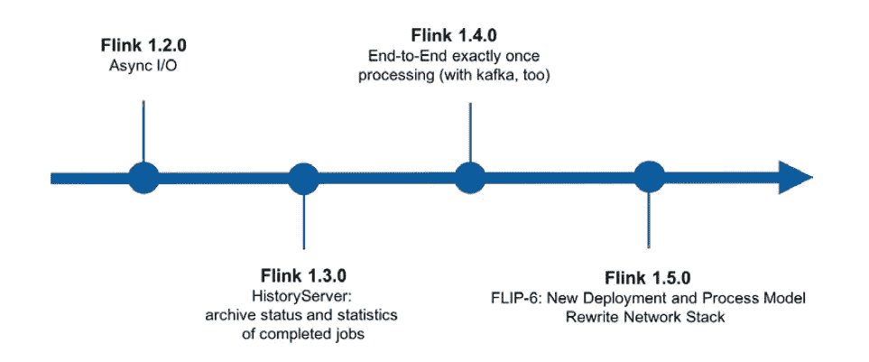

# Flink 简史:追踪大数据引擎的开源开发

> 原文：<https://medium.com/hackernoon/a-brief-history-of-flink-tracing-the-big-data-engines-open-source-development-87464fd19e0f>

## 从版本 1.1.0 到 1.6.0，Apache Flink 的不懈改进是开源开发的典范。

*本文是* [***阿里巴巴旗下 Flink 系列***](/@alitech_2017/a-flink-series-from-the-alibaba-tech-team-b8b5539fdc70) *的一部分。*

近年来，开源大数据计算引擎 Apache Flink(简称 Flink)作为批处理和流处理的强大框架越来越受欢迎，可用于创建许多基于事件的应用程序。

Flink 首先是一个纯流计算引擎，有数据流基础数据模型。流可以是无限的和无边界的，这描述了一般意义上的流处理，或者可以是有边界的有限流，如在批处理的情况下。因此，Flink 使用单一架构来支持流处理和批处理。

正如其口号“基于流的有状态计算”所传达的，Flink 具有支持有状态计算的额外优势。当处理一个事件或一段数据的结果只与该事件本身的内容相关时，处理就被称为无状态。或者，如果结果与先前处理的事件相关，则称为有状态处理。一些复杂的数据处理，比如聚合，将两个都是有状态处理的流连接起来。

除了依靠其对大规模数据操作的支持，阿里巴巴集团在过去几年中对 Flink 的发展做出了重大贡献，包括添加了异步 I/O 功能等重要组件。本文借鉴了阿里巴巴开发人员 Chong (Jark) Wu 的见解，首先介绍了该框架当前版本中可用的关键功能，然后介绍了该框架为改进特定性能领域而经历的历史变化。

# Apache Flink 的构建模块

Flink 越来越受欢迎主要是基于四个构建模块组件，即它的检查点、状态、时间和窗口机制。

检查点机制是 Flink 最重要的特性之一。Flink 基于 Chandy-Lamport 算法实现分布式一致性快照，提供恰好一次语义；相比之下，以前的流计算系统，如 Strom 和 Samza，不能有效地解决恰好一次的问题。

在提供一致的语义之后，Flink 引入了一个托管状态，并提供了 API 接口，用户可以在编程时使用这些接口管理状态，使编程像使用 Java 集一样简单。

Flink 还实现了水印机制，解决了在基于事件时间的处理中出现的数据无序和数据迟到问题。

最后，由于流计算一般基于 windows，Flink 提供了一套包括翻滚、滑动、会话窗口在内的开箱即用的窗口操作，并支持灵活的自定义窗口以满足特殊需求。

# Flink API 的历史变化

Flink 强大的框架受益于对其以前版本的许多突破性的 API 增强。

在其 1.0.0 阶段，Flink 引入了 State API，由 ValueState、ReducedState、ListState 等组成。状态 API 可以认为是 Flink 最大的创新。它允许用户使用 Flink 的托管状态作为 Java 集合 API，并自动享受状态一致的保证，而不会因为失败而丢失任何状态。作为其重要性的标志，甚至后来的 Apache Beam State API 也大量借鉴了这个组件。

Flink 的 1.1.0 版本开始支持会话窗口，并正确处理无序和迟到的数据，确保最终结果的准确性。

在 1.2.0 时期，提供了 Flink 的 ProcessFunction API，这是一个更低级的 API，用于实现更高级更复杂的功能。除了能够注册各种状态类型，它还支持注册计时器(EventTime 和 ProcessingTime ),通常用于开发基于事件、基于时间的应用程序。

1.3.0 时期，Flink 收到了侧面输出功能。这一点很重要，因为通常只有一种操作符输出类型，而有时可能需要另一种类型。例如，除了输出主流数据之外，以副流的形式输出一定量的异常和迟到的数据，然后将它们交给不同的下游节点进行处理也是有利的。侧输出特别支持这种多路复用输出。

Flink 的 1.5.0 阶段增加了 BroadcastState，这是一个状态 API 扩展，用于存储从上游广播的数据。因为是从上游广播的，所以这个运算符的每个任务中的 BroadcastState 数据是完全相同的。基于这种状态，可以更有效地解决 CEP 中的动态规则函数和 SQL 中的不等连接场景。

最后，在其 1.6.0 版本中，Flink 接收了其状态 TTL 和数据流间隔 Join 函数。状态 TTL 实现了在申请某个状态时对生存时间参数(TTL)的指定，并确保该状态可以被指定在给定的时间间隔后由系统自动清除。在此版本之前，用户必须在 ProcessFunction 中注册一个计时器，然后使用计时器的回调手动清除状态。从 1.6.0 开始，Flink 框架基于 TTL 解决了这个问题。数据流区间连接使区间连接成为可能。例如，五分钟间隔联接意味着左流中的每个记录都将联接位于联接前后五分钟内的右流数据。

# Flink 高级 API 的历史变化

与上一节讨论的变化类似，随着版本的发展，Flink 的高级 API 也经历了许多变化。

在 Flink 的 1.0.0 时期，其表 API(或结构化数据处理 API)和 CEP(复杂事件处理 API)框架被添加到库中。Table API 是一个结构化的高级 API，以类似于 Spark 的 DataFrame API 的方式支持 Java 和 Scala 语言。它也与 SQL 高度相似。表 API 和 SQL 都是关系 API，可以共享许多实现。因此，在 Flink 1.1.0 中，社区基于 Apache 方解石重构了整个表模块，它同时支持表 API 和 SQL，并允许它们共享大部分代码。

在 1.2.0 时期，Flink 社区支持对表 API 和 SQL 进行丰富的内置窗口操作，包括翻滚窗口、滑动窗口和会话窗口。

在 1.3.0 期间，Flink 社区提出了动态表的概念。有了它，流和表是双重的，可以在不丢失任何信息的情况下相互转换。这为流和批的统一提供了基础。实现动态表的核心是收回机制，只有收回机制才能让多级聚合和多级连接正确实现，只有收回机制才能保证流 SQL 的语义和结果的正确性。此外，在这个版本中，Flink 还支持 CEP 运算符的可伸缩性——换句话说，CEP 运算符的并行性现在可以在不丢失状态的情况下进行更改。

最后，在 Flink 1 . 5 . 0 版本中，表 API 和 SQL 上支持连接，包括常规流连接和时间窗流连接。此外，还添加了 SQL 客户端。SQL 客户端提供了一种简单的方式来编写、调试和提交表程序到 Flink 集群，而不需要一行 Java 或 Scala 代码。SQL 客户端 CLI 允许在命令行上检索和可视化正在运行的分布式应用程序的实时结果。

# Flink 检查点和恢复的历史更改

Flink 的检查点机制从早期开始就得到支持，此后成为核心特性，Flink 社区也一直在努力提高检查点和恢复的效率。

Flink 的 1.0.0 时期支持 RocksDB statebackend。在此版本之前，所有状态数据只能存储在内存中。因为 JVM 内存的大小是固定的，数据大小的增加会导致 FullGC 和 OOM 问题。这使得 Flink 很难在生产环境中稳定使用。要存储更多数据或更大的状态，需要 RocksDB statebackend。RocksDB 是一个基于文件的嵌入式数据库，它将数据存储到磁盘，同时提供高效的读写性能。因此，使用 RocksDB 可以避免 OOM 问题。

在其 1.1.0 版本中，Flink 获得了对 RocksDB 快照的异步支持。在以前的版本中，RocksDB 的快照过程是同步的，这会阻塞主数据流的处理并影响吞吐量。有了异步支持，Flink 的吞吐量从此有了很大的提高。

在 1.2.0 版本中，通过引入 KeyGroup 机制，增加了对可重缩放的 KeyedState 和 OperatorState 的支持。这就是说，可以在不丢失状态的情况下改变运算符的并行性。

在其 1.3.0 版本中，Flink 增加了对其增量检查点机制的支持，这表明 Flink 的流计算已经完全达到了生产就绪状态。增量检查点仅存储和保存新的增量状态快照。对于一般的流计算，吉字节级甚至太字节级的状态是很常见的，如果所有数据的状态每次都存储到分布式存储，那么网络的成本将变得非常高。在这个版本中，Flink 还支持细粒度恢复功能。Flink 不是在任务失败时重新启动完整的 ExecutionGraph，而是只重新启动受影响的子图，从而大大减少了恢复时间。

最后，在 Flink 1.5.0 版本中，引入了本地状态恢复机制。由于检查点机制，状态将被持久地存储在分布式存储中。以 HDFS 为例，发生故障切换时，需要从远程 HDFS 重新下载数据。如果状态特别大，下载时间将会很长，花费在故障转移恢复上的时间也会延长。本地状态恢复机制预先在本地备份状态文件，以便当作业经历故障转移时，可以在本地恢复它，而不是从远程 HDFS 下载状态文件，从而提高恢复效率。

# Flink 运行时的历史更改

Flink 运行时的显著发展始于版本 1.2.0 时期，当时阿里巴巴直接向 Flink 社区贡献了备受瞩目的异步 I/O 功能。异步 I/O 的主要目的是解决与外部系统交互时由网络延迟引起的系统瓶颈，例如当查询外部 HBase 表以填充某些列时。同步方法会导致每个查询操作被阻塞，并且数据流会由于频繁的 I/O 请求而停滞。使用异步 I/O，可以在不阻塞主数据流的情况下同时发起 N 个异步查询请求，从而提高整个作业的吞吐量和 CPU 的利用率。

flink 1 . 3 . 0 版引入了 HistoryServer 组件。HistoryServer 允许用户查询由 JobManage 归档的已完成作业的状态和统计信息，这在作业完成后进行深入故障排除时非常有用。

在 Flink 1.4.0 时期，增加了端到端恰好一次的语义保证。“恰好一次”意味着即使软件或硬件发生故障，输入数据的每条记录也将恰好对最终结果产生一次影响，从而确保数据不会丢失或被计算两次。在 1.4.0 版之前，Flink 在 Flink 程序中提供了“恰好一次”的保证，但不包括对外部系统的输出，因此如果发生故障转移，可能会将重复数据写入外部系统。当时，一般的解决方案是使用一个幂等的外部数据库。在 1.4.0 中，Flink 通过两阶段提交算法支持端到端恰好一次的语义保证。它通过内置的方法进一步支持 Kafka 的端到端保证，并为用户提供 TwoPhaseCommitSinkFunction 来创建他们自己的恰好一次数据接收器。

在其 1.5.0 期间，Flink 发布了新的部署模型和处理模型。Flink 部署和流程模型(内部称为 FLIP-6)的重写工作已经进行了一年多，是 Flink 社区的一项重大努力。这是自项目开始以来对 Flink 核心组件最重大的改进。简而言之，这些改进增加了对 YARN 和 Mesos 调度程序上的动态资源分配和动态资源释放的支持，以实现更好的资源利用、故障恢复和动态伸缩。

版本 1.5.0 还重构了网络堆栈，因为在旧版本中，多个上游和下游任务之间的通信共享一个 TCP 连接。当一个任务被反压时，所有共享其连接的任务都将被阻塞。对于 Flink 1.5，社区致力于两项工作来改进 Flink 的网络堆栈:基于信用的流量控制和改进的传输延迟。基于信用的流量控制将“线上”数据量降至最低，同时保持高吞吐量。这大大减少了在背压情况下完成检查点的时间。此外，Flink 现在能够在不降低吞吐量的情况下实现更低的延迟。

# 外卖食品

Flink 最大的优势之一是它对流和批处理的统一。当前的发展趋势倾向于将流计算作为更成熟的领先模型，这种方法已经在众多公司的大规模生产环境中得到了验证。

Flink 社区将继续改进流计算的性能和功能，包括为 Flink SQL 扩展更丰富的功能和引入新的优化。加入这些努力，社区将致力于增强其生态能力，从批处理到机器学习等等。

**(Original article by Wu Chong 伍翀)**

*本文是* [***阿里巴巴旗下 Flink 系列***](/@alitech_2017/a-flink-series-from-the-alibaba-tech-team-b8b5539fdc70) *的一部分。*

# 阿里巴巴科技

关于阿里巴巴最新技术的第一手深度资料→脸书: [**《阿里巴巴技术》**](http://www.facebook.com/AlibabaTechnology) 。Twitter:[**【AlibabaTech】**](https://twitter.com/AliTech2017)。