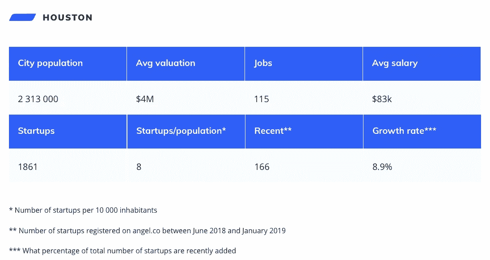
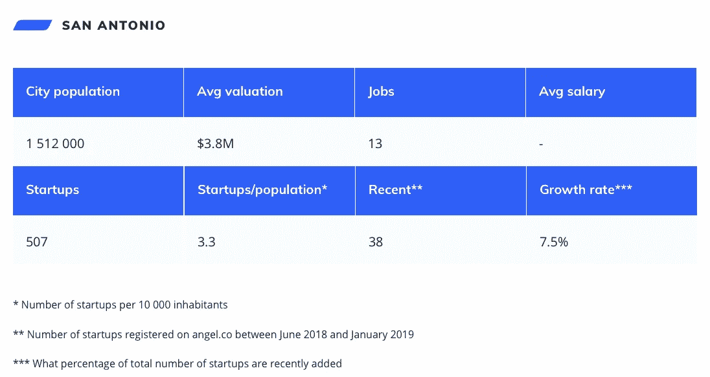
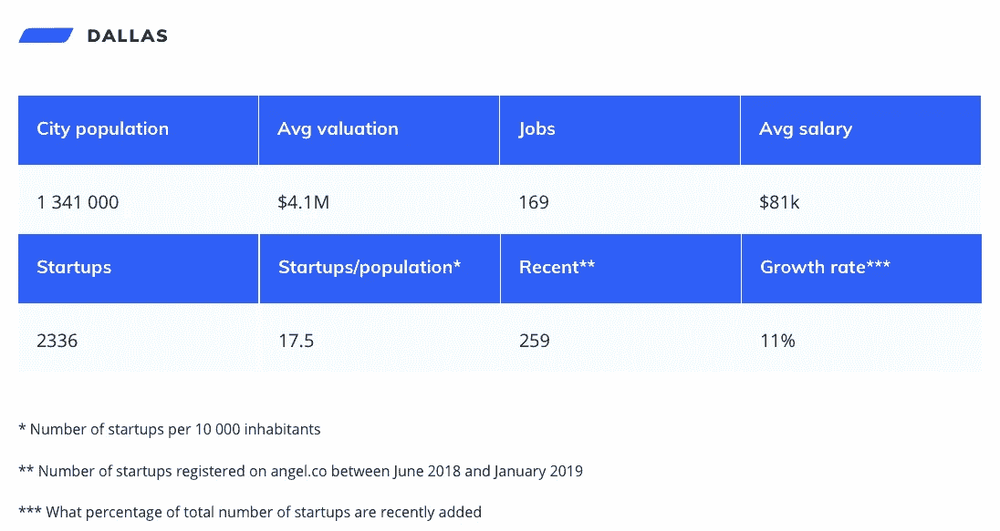
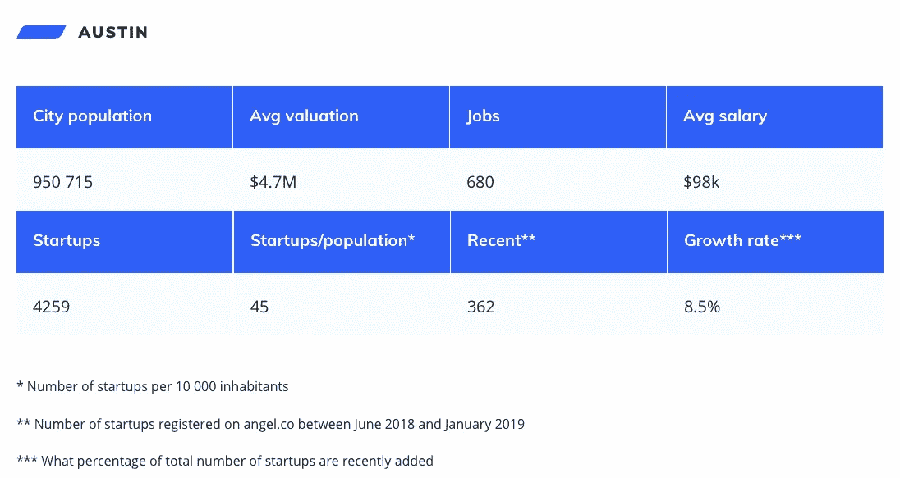
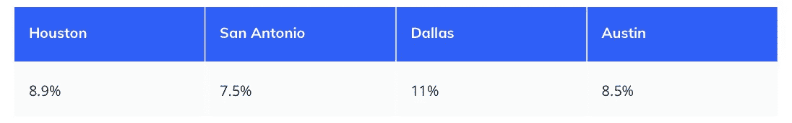

# 德州创业生态系统的简要数字概述

> 原文：<https://medium.com/hackernoon/a-brief-numerical-overview-of-the-texas-startup-ecosystem-7ae90e12a149>

© Altalogy

在[altology](https://www.altalogy.com/)，我们为两家总部位于休斯顿的客户提供软件开发服务。几周前，我和 Clever Box 公司的创始人[多蒙尼克·尼尔森](https://www.linkedin.com/in/dommonic-nelson-568b4499/)讨论了休斯顿创业生态系统的利与弊。

提出了以下观点

> “当谈到德克萨斯州的初创公司和技术时，奥斯汀的表现比休斯顿好几个数量级”。

我对这个事实感到有点惊讶，并决定看看德克萨斯州的其他城市是如何比较的。
作为信息来源，我选定了天使名单。我充分意识到偏见，一些公司可能不会出现在那里。

比较包括 4 个最大的城市——休斯顿、圣安东尼奥、达拉斯和奥斯汀。

**免责声明:我住在中欧，距离德克萨斯州有 7 个小时的时区，我唯一一次亲眼看到孤星之州是在飞机的窗户上。所以，原谅我，德克萨斯本地人，我甚至不在那里就试图分析你的州:)**

# 休斯敦

休斯顿人口超过 200 万，是美国第四大城市，也是德克萨斯州人口最多的大都市。这座城市还拥有全球经济，只有纽约市拥有更多的财富 500 强总部。这一事实应该会造就一个伟大的全球创业中心——让我们来看看这些数字。

正如你在上面看到的，根据天使名单，休斯顿有 1861 家创业公司。是好是坏的结果？我们以后会知道的。

在过去的八个月里(2018 年 6 月-2019 年 1 月)，有 166 家公司在天使名单上注册，占所有在 Angel 上市的休斯顿创业公司的近 9%。

# 圣安东尼奥

圣安东尼奥是德克萨斯州的第二大城市。它的经济围绕着国防、医疗和金融服务部门。几乎有 150 万居民，这让我很好奇为什么只有 507(！)根据天使名单，创业公司位于那里。

我不确定这样一个微小的生态系统背后的原因是什么，但我不会试图在这个问题上跑题。让我们前进到达拉斯。

# 达拉斯

世界上大多数人知道达拉斯主要是因为 1963 年发生的事情。它是德克萨斯州的第三大城市(约 1.3 米)。达拉斯的经济被认为是多样化的，主导部门包括国防、金融服务、信息技术、电信和运输。

我们可以看到，就创业公司的总数而言，它比休斯顿表现得更好。平均工资较低，但不显著。

# 奥斯汀

最后，让我们看看最小的兄弟(<1M inhabitants) of the big four Texas cities. According to various sources, the Texas capital is hailed as a high-tech mecca calling it “The Silicon Hills.” Not to mention [*《美国新闻》&《世界报道》*](https://en.wikipedia.org/wiki/U.S._News_%26_World_Report) )将奥斯汀评为 2017 年和 2018 年美国最适合居住的地方。

这里的初创企业是休斯顿的两倍多，工作岗位是达拉斯的四倍多。“硅丘”的昵称是合法的，毫无疑问。

# 比较

## **生态系统**

奥斯汀与休斯顿、达拉斯和圣安东尼奥属于不同的联盟。每 10 000 名居民中有 45 家初创企业，这让这座城市开始追逐像波士顿这样的城市。

Number of startups per 10 000 inhabitants

## **工资**

关于薪水，达拉斯和休斯顿很相似。奥斯汀的工资每年高出 1.5 万美元。不幸的是，圣安东尼奥的数据丢失了，但这可能是因为公司数量少。

Average salary (source: Angel List)

## **增长率**

就增长率而言，达拉斯是我们的赢家。奥斯汀似乎表现稍弱，但从另一方面来说，它已经确立了科技中心的地位，因此增长速度可能与这里无关。

Growth rate for the last eight months (June 2018-January 2019)

# 结论

奥斯汀是德州企业家的理想去处。

它是比休斯顿、圣安东尼奥和达拉斯加起来还多的创业公司的所在地。但我们能假设那里的市场已经饱和，这个城市会给其他城市留下更多的发展空间吗？这个问题很难回答，因为奥斯汀也是美国发展最快的大城市。

另一方面，达拉斯在增长率方面表现最佳，这表明它正在获得动力。

我认为休斯顿有巨大的潜力，这要归功于它的人口和年龄分布(45%的人口在 18-44 岁之间)。由于它已经是一个大型企业中心，它需要一定的激励和动力来触发转变——资源已经存在。

对我来说，最令人惊讶的事实是圣安东尼奥的糟糕结果。我很想听听你的建议，那里年轻公司数量如此之少的原因可能是什么。

最后，我想强调一下潜在的偏见。这些数据是从天使名单手动收集的，可能不准确。我的目的是找到一个适用于所有情况的标准。

最后但同样重要的是:你觉得这个故事有价值吗？有没有什么关键因素是我在对比中不小心跳过的？你想让我也写其他州/地区吗？

我鼓励你在下面的评论区分享你的反馈。

感谢阅读！