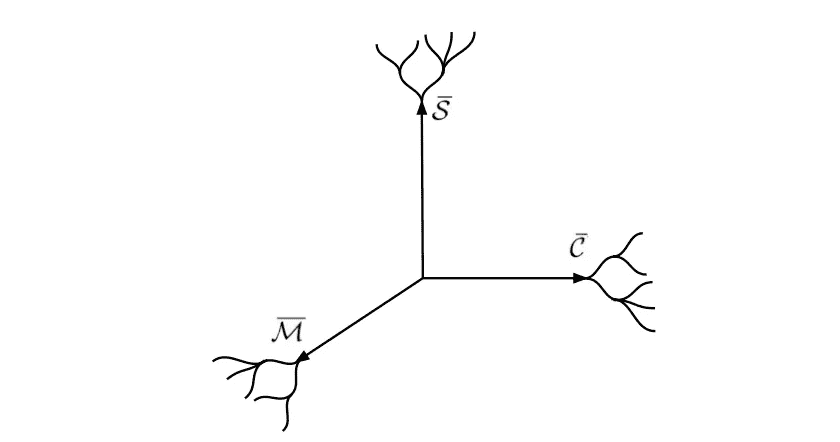
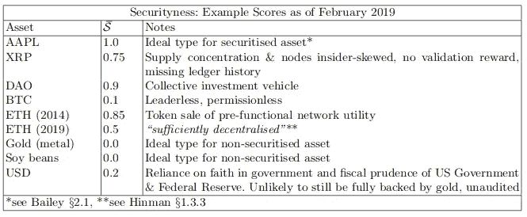
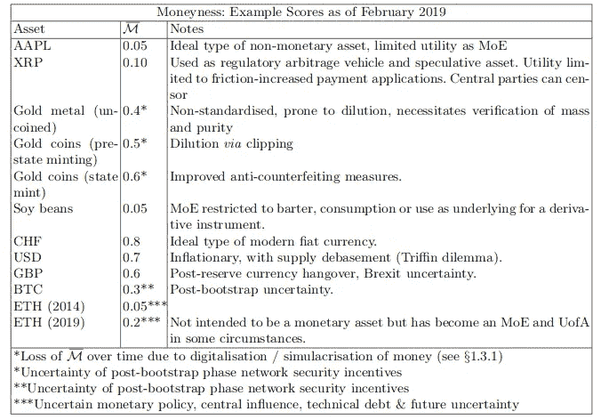
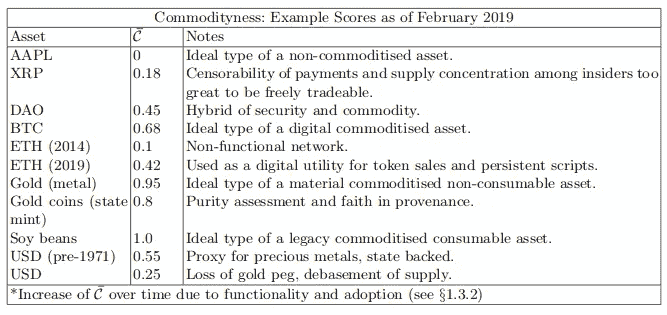
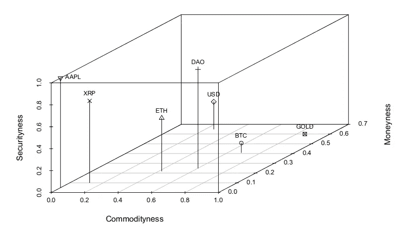
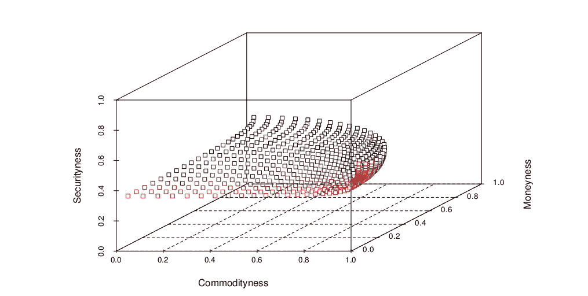
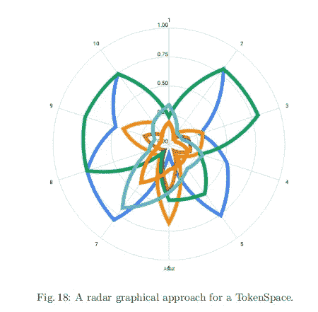
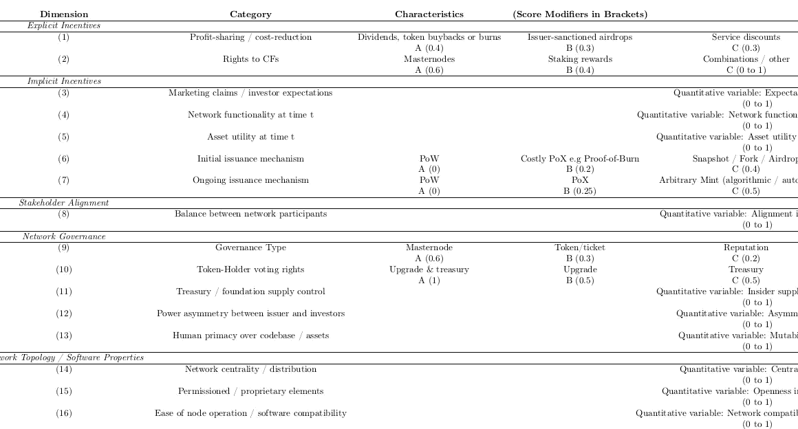
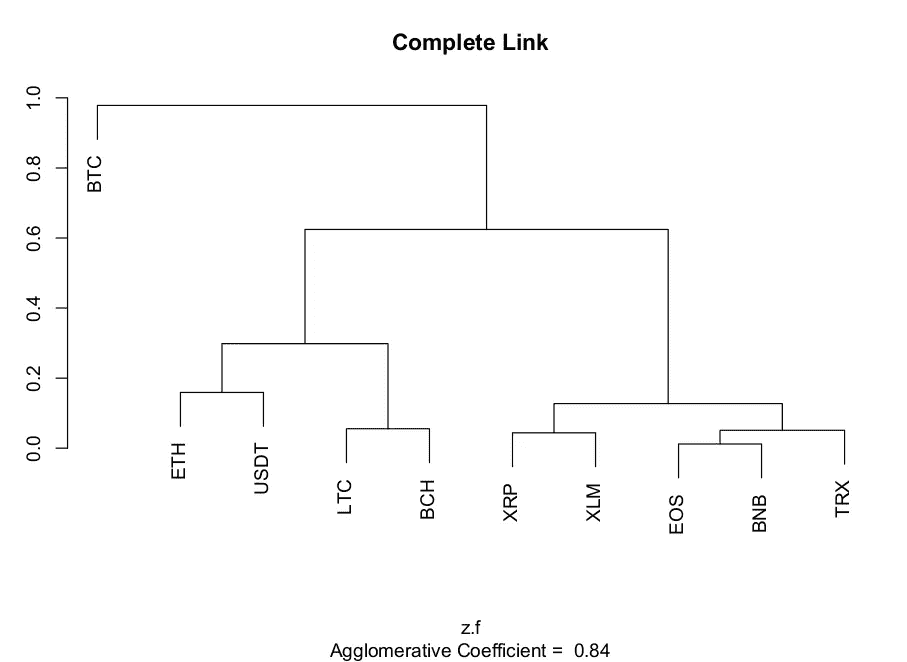

# 关于导航令牌空间的简要介绍

> 原文：<https://medium.com/hackernoon/a-brief-primer-on-navigating-tokenspace-2290a90b5a65>

这是关注 TokenSpace 的系列文章的第二篇，token space 是一种新颖的加密资产概念分类框架。这个 Q & A 提供了一些额外的背景，而这个[压缩的短文](/@parallelind/tokenspace-in-a-nutshell-35f513c20237)提供了对[手稿](http://www.pllel.com/industries/tokenspace-manuscript-v1-0-released/)内容的简要概述。如果你需要比这些文章提供的更多的答案，[在这里寻找最新的东西](http://www.pllel.com/industries/tag/tokenspace/)。

令牌空间可以通过类比我们自己对现实的时空概念来考虑，由正交轴 Sbar、Mbar 和 Cbar 描绘的**三维空间组成(为了方便和视觉清晰起见)。资产可以在每个轴上拥有 0 和 1(包括 0 和 1)之间的**分数或范围**,产生一个对象，该对象位于由(x，y，z)坐标(C，M，S)描述的令牌空间的区域中。**对象属性的时间依赖性**也可以被并入以反映加密货币协议网络及其本地资产、在其上发行的令牌以及诸如分类账分叉的网络碎片的动态性质。**

Sbar、Mbar 和 Cbar 对应于主观分类元特征**安全性**、**货币性**和**商品性**的直观推理分配，它们共同构成了当前开发中的令牌空间分类
方法的基础。每个资产在 TokenSpace 中的位置旨在根据用户的选择和主张，从基于分类法、类型学、直观、启发和/或定量方法的**加权评分系统中导出**，这些方法可能与本研究中提出的方法相同，也可能不同。

TokenSpace visual impression. Yes, those branches coming out of the axes represent taxonomies!

建议元特征的定义:
**Sbar —安全性**。一个项目或工具符合或表现出证券化资产特征的程度。为了清楚起见，该元特征不涉及特定网络或资产对于敌对或恶意行为的安全性(鲁棒性/抵抗力)。
**M 吧——有钱**。一个项目或工具符合或显示货币资产特征的程度。
**Cbar——商品性。**物品或工具符合或显示商品化资产特征的程度。

下表列出了一系列资产的得分示例，并在图 2 中进行了直观描述。**理想类型是假设的特定资产类型的典型例子**，并在手稿的第 2 部分讨论。本研究和未来研究的目的是为分类方法提供建议，并提供一些示例，说明如何从各种生态系统利益相关者的角度利用记号空间来比较表征资产。**在某些情况下，时间相关性可能也很重要**，可以通过评估不同时间点的令牌空间中的资产位置并绘制资产轨迹，将其纳入本框架。

**TokenSpace 预计将对监管者、投资者、研究人员、令牌工程师和交易所运营商**有用，他们可以基于这些概念构建自己的评分系统。建议仔细审查特定地区的监管指导意见，并明智地考虑边界功能，例如描述资产对特定监管制度的“安全”、“边缘”或“危险”合规性，图 3 给出了一个示例。Parallel Industries 已经为每个元特征开发了混合多级混合分类/数值分类法，具有时间相关和概率分布函数，用于未来可能方向的各向异性得分建模。

Example of a regulatory boundary function. Arbitrary polynomial for illustrative purposes.

Folding higher dimensionality into a bespoke TokenSpace

“TS10" Securityness Taxonomy Excerpt (third iteration)

“TS10” Hierarchical Clustering Results

# 感谢阅读。在你走之前！

> 如果你觉得这篇文章有趣，请👏并在你能分享的地方分享。记住，你最多可以鼓掌 50 次——这对可见度和温暖模糊的感觉真的有很大的影响。欢迎大家来 www.pllel.com 和推特上闲逛。