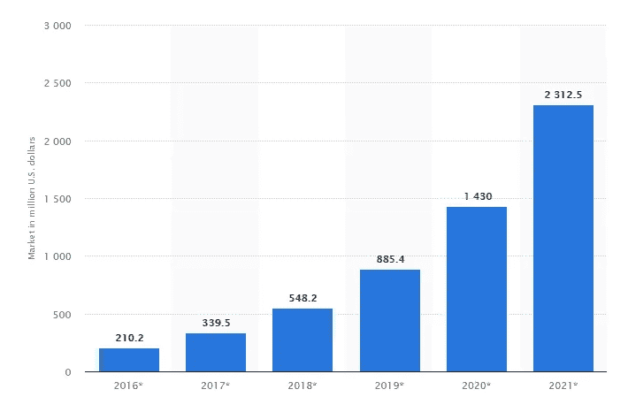
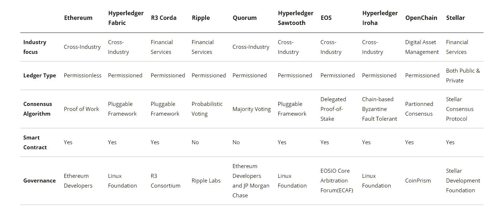

# 关于区块链实施的完整指南

> 原文：<https://medium.com/hackernoon/a-complete-guide-about-blockchain-implementation-6b0ccf9d4dd>

如果你还没有开始尝试区块链，这仅仅意味着你落后于技术发展。我们关于区块链实施的全面分步指南将帮助您了解在您的业务用例中应用区块链的最佳实践。

# 2016 年至 2021 年全球区块链技术市场的规模(以十亿美元计)

Image Source: Statista

许多组织正在尝试区块链技术，因为它有可能在任何商业生态系统中带来信任和透明度。普华永道**调查了 600 名全球高管，发现 84%的组织正在参与区块链，**而只有 15%的组织正在进行区块链项目。

> **斯蒂夫·戴维斯，普华永道全球区块链负责人，《区块链在这里》一书的作者。你的下一步是什么？”**表示，区块链的项目因为各种原因一直处于停滞状态。实施区块链协议的障碍在于区块链将如何受到法律监管，以及它将如何赢得大量用户的信任。

然而，戴维斯说，你不能坐以待毙；你应该用它做实验，因为它的效果会很强烈。

> **Gartner 还预测，到 2030 年，区块链的商业价值将超过 3 万亿美元。这意味着，到那时，全球五分之一的经济基础设施将运行在基于区块链的解决方案上。**

你需要正确的战略，让企业在不停顿的情况下实施区块链项目。

我们将解释逐步[区块链实施](https://www.leewayhertz.com/cost-of-blockchain-implementation/)战略，以克服区块链项目中的任何不确定性。

# 以下是区块链实施策略的分步指南

# 了解什么是区块链

区块链技术允许将信息记录存储在通过加密机制相互链接的区块中，以建立分布式账本。任何有权访问的人都可以共享或验证分类账，而不需要昂贵的第三方验证。

每个块都有一个加密签名，该签名与前一个块相关联，使得一旦所有的块都被创建，区块链就不会被篡改。

区块链可以是许可的，对利益相关者可以查看和更新的内容进行限制，也可以是无许可的，允许任何人查看或更新网络上的任何内容。

我们已经在上面简要解释了区块链，因为我们建议您在计划在您的企业中实施它之前，应该首先了解什么是区块链。

# 如果您的业务用例需要或不需要区块链

当你决定开发一个区块链解决方案时，弄清楚它能解决什么问题，以及它是否是解决问题的方法。

要分析您是否需要区块链解决方案，您需要彻底了解整个流程。你需要找到当前业务流程中的瓶颈，一旦确定，尝试研究区块链如何解决它们。

> **在您考虑跨业务运营实施区块链之前，请考虑以下问题:**

*   您的业务案例是否需要来自多方的数据更新？
*   中介是否增加了您业务案例的复杂性？
*   多方是否交换数据？
*   交易有交互吗？
*   您的用例需要验证吗？
*   业务互动对时间敏感吗？

如果您对六个问题中的四个回答“是”，这表明区块链可能是提高您业务效率的一个很好的解决方案。

# 选择合适的区块链平台

由于存在多种区块链解决方案，您必须确保为您的使用案例选择正确的区块链类型。

**这里是公司用来构建基于区块链的应用程序的最佳区块链平台的比较**

Image source: [Blockchain Platform](https://www.leewayhertz.com/blockchain-platforms-for-top-blockchain-companies/)

区块链可以是公共的、许可的或混合的，取决于业务用例。一旦您确定了适合您业务需求的区块链类型，请确保您的 [**选择支持您的区块链类型的区块链平台**](https://hackernoon.com/top-blockchain-platforms-to-watch-out-in-2019-aa80e336a426) 。

如果你是区块链技术的初学者，考虑咨询有区块链经验的人，无论是你的团队还是区块链开发公司，提供区块链解决方案。

区块链顶级公司使用的一些流行的区块链平台是:

*   以太坊
*   超分类帐锯齿
*   超分类帐结构
*   科尔达
*   黎明的女神
*   主要的
*   创

确保您谨慎选择区块链平台，以构建安全且可扩展的区块链解决方案。

# 开发概念证明

概念验证是一种展现区块链项目潜力的方法，它可以是原型，也可以是理论构建。这是区块链开发的初始阶段，在这里您可以展示您的区块链解决方案如何让用户和您的企业受益。

**下面是如何为区块链解决方案进行概念验证:**

*   **理论构建** 每个项目都需要理论案例，让最终用户了解工作流程和解决方案的可行性。提出包含项目关键参数的建议。
*   **原型** 

在概念验证成功完成后，下一步是重点设计应用程序的前端。

# 视觉和技术设计

区块链需要精心设计，不仅要解决业务问题，还要与现有解决方案无缝集成。在你开始为一个区块链应用的前端准备视觉设计之前，确保你考虑为信任而设计。

应用程序的设计应该能够在应用程序用户中建立信任。我们建议每个人都考虑技术 GDPR 合规要求，以了解它应该适用于哪里。

组织在为区块链应用程序设计屏幕时，应该考虑网络安全、合规性和隐私问题。

# 开发区块链应用

这是区块链实现的核心阶段，在这里您将应用程序的前端与后端连接起来。

在这个特定的步骤中，您必须为应用程序构建 API。此外，您需要在区块链网络上启动节点，并让它们与区块链应用程序的组件进行交互。

就像任何其他应用程序一样，区块链应用程序也应该开发不同的版本。该应用的第一个版本没有经过正式测试，据说处于预测试阶段。

然后，应用程序进入下一个阶段，即 alpha 阶段，开发团队通过白盒技术测试软件，应用程序在该阶段可能没有完整的功能集。

在发布应用程序的 alpha 版本后，会准备一个 beta 版本，它包含完整的功能集，但可能会有某些未知的错误。

该应用程序的测试版分发给组织外的特定小组，用于测试应用程序的功能。

一旦测试版获得批准，应用程序就为发布候选版本做好了准备，这是一个高级测试版。

# 在 Testnet 和 Mainnet 上部署区块链应用程序

部署应用程序意味着将应用程序放在应用服务器上，供每个人使用。但是，在将区块链应用程序部署到主网络之前，请确保检查其功能。

在 testnet 上测试应用程序的功能，因为数据一旦写入区块链就不能删除或更改。

一旦经过测试，该应用程序需要托管在主链上。例如，如果您在公共区块链上开发了一个应用程序，它应该在主网络上部署和发布。

我们相信您一定已经了解如何在整个业务运营中实施区块链。建议按部就班地进行，如上文关于成功实施区块链的文章中所述。

我们有一个区块链开发团队，他们可以为任何工业用例构建可扩展和安全的区块链解决方案。在 LeewayHertz，我们还有区块链顾问，他们可以为您提供 30 分钟的免费咨询**，帮助您了解区块链对您业务的潜力。今天就咨询我们，讨论您的需求。**