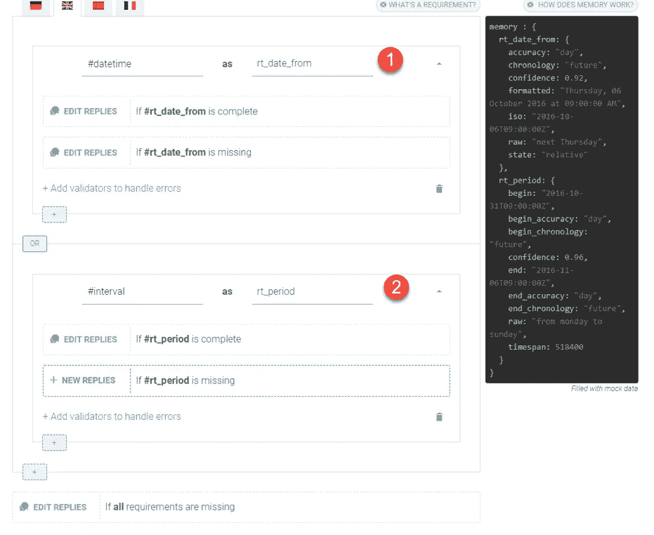
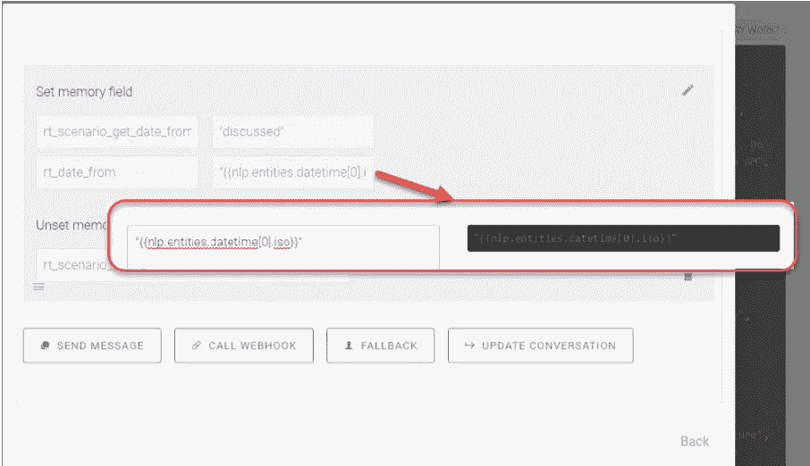
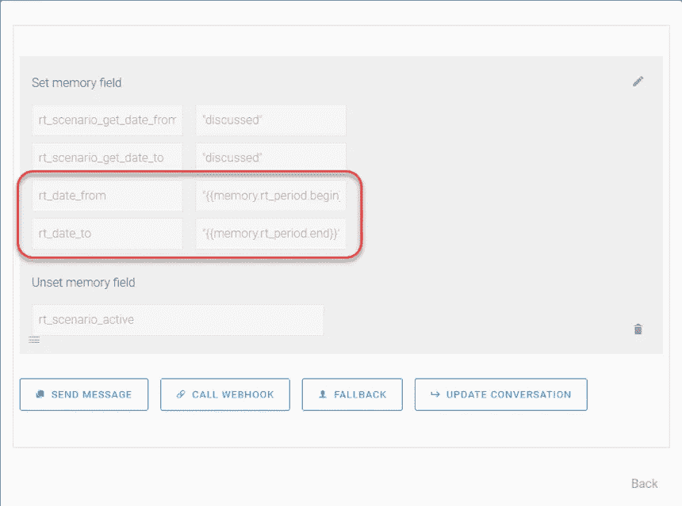
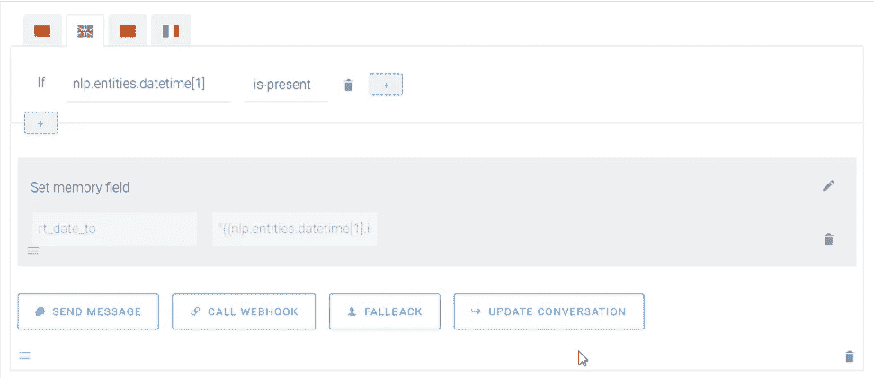
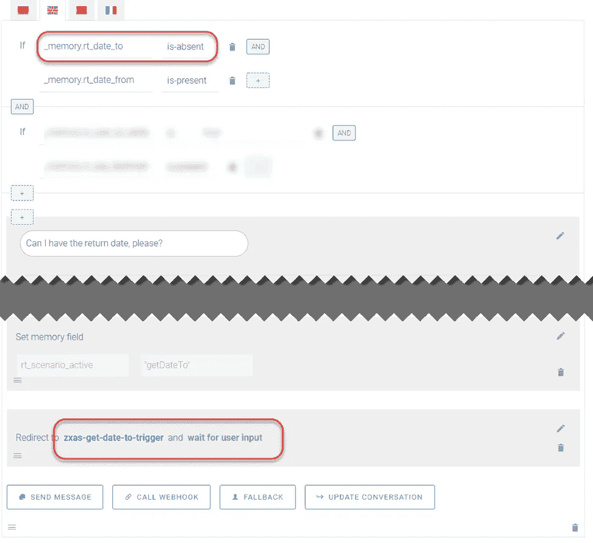
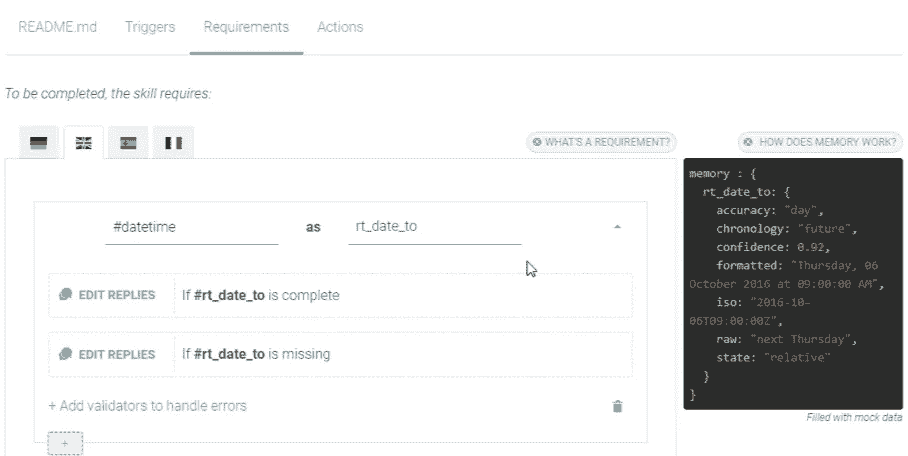
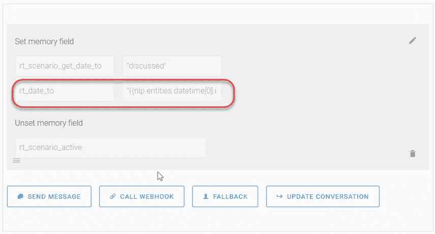
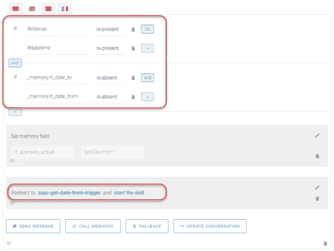
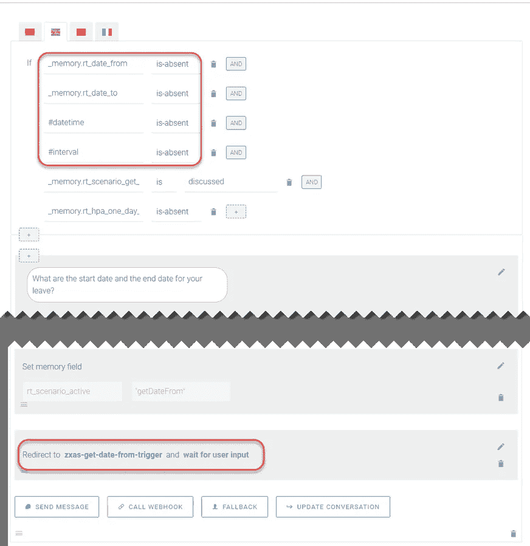

# 用聊天机器人记录时间和日期的完整指南

> 原文：<https://medium.com/hackernoon/a-complete-guide-to-recording-time-date-periods-with-a-chatbot-1751d3f1f629>

日期是许多业务场景中必不可少的关键参数，如创建休假或旅行请求，为日期或期间的后端数据生成对话报告。然而，有时记录各种日期格式和组合(一个日期、几个日期、周期)似乎是一个挑战。

# 先决条件

本教程是为高级用户设计的，所以如果你还没有制作你的第一个机器人，请跟随本教程。
如果你想学习如何在 SAP 对话式 AI 平台上使用 bot builder 掌握内存管理，请先阅读[这篇文章](https://cai.tools.sap/blog/mastering-memory-management-bot-builder/)！

# 解决办法

从可重用性和统一技能开发的角度来看，这里的最佳实践可能是仅使用一种技能来解决在不同情况下获取单个日期、多个日期或一段时间的任务。在这种情况下，我们首先捕获从聊天用户那里收到的任何日期输入实体(可以有两个日期，一个日期，或者也是一个标准实体的周期)。

我们尝试在*需求*选项卡中捕获至少一个**#日期时间**实体(日期自)(1)或一个**#间隔**实体(作为日期自和日期至参数)(2):

保存来自 **#datetime** 实体的 Date From 值，我们捕获日期数组的第一个元素，并记录标准实体的 ISO 部分。这是记录标准化值的很好的实践，因为它对于集成可能是至关重要的:

在 **#Interval** 实体处理中，我们记录时间段的开始和结束，以区分这些内存参数:

此外，如果用户在一条消息中提供了两个独立的日期(不是一个时间段)，我们会将 Date To value 记录为技能的 *Actions* 选项卡中的 **#datetime** 数组的第二个元素:

如果我们的场景假定有两个日期，但是用户最初只提供了一个日期，那么我们需要额外检查所需的内存参数是否存在(Date To):

如果缺少这样一个内存参数(第二个日期，在我们的示例中为 Date To ),我们要求用户在主技能中输入适当的日期(例如，创建休假请求),我们调用一个附加技能在*需求*选项卡中记录第二个日期:

在这种情况下，一旦我们已经向用户询问了第二个日期(在我们的例子中是 Date To ),我们就将 **#datetime** 数组的第一个元素记录为 Date To memory 参数:

在这个阶段，我们可能会问自己以下问题:“*如果用户决定立即提供日期，而不等待机器人的澄清问题，该怎么办？*

对于这种情况，我们也有解决方案。在主要业务技能中，有两种类型的动作块:

**1。**如果实体被分配，目标参数为空，则直接调用获取日期技能，直接记录日期:

**2。**如果目标实体未被识别，则我们要求提供日期，并通过等待用户输入选项重定向到获取日期技能:

在这里，我们有一个统一的机制，允许我们记录任何日期组合和任何类型的日期输入！

# 用例

## **案例 1:记录一个日期:创建半天休假申请**

该技能允许用户创建最多一天的休假请求。休假时间以小时为单位。在这个场景中，我们需要从用户输入中记录一个日期。

[https://www . sky buffer . com/leave-request-creation-half-day-leave/](https://www.skybuffer.com/leave-request-creation-half-day-leave/)

## **案例 2:记录期间(日期自—日期至):差旅申请创建**

这种人工智能技能使 SAP 用户能够为他们即将到来的旅行创建一个旅行请求。聊天机器人会询问必要的细节，如日期、目的地、预期的旅行费用等。在这种情况下，机器人请求旅行的开始和结束日期。

[https://www.skybuffer.com/travel-request-creation/](https://www.skybuffer.com/travel-request-creation/)

## **案例 3:选择决定—一个或两个日期:教育假创建**

所谓教育假，我们指的是为了自学和提高个人资格而休假的时间。用户可以请一天或更长时间的假——我们的聊天机器人总是会澄清这一点。

[https://www . sky buffer . com/leave-request-creation-educational-leave/](https://www.skybuffer.com/leave-request-creation-educational-leave/)

## **案例 4:记录两个(或更多)单独的日期:供应商发票创建**

这项功能性技能允许聊天用户创建供应商的发票。这里，我们需要记录两个独立的日期:文档日期和发布日期。

[https://www.skybuffer.com/create-supplier-invoice/](https://www.skybuffer.com/create-supplier-invoice/)

# 什么是 Skybuffer？

Skybuffer 是一家国际 SAP 实施和开发公司，成立于 2013 年。

自 2018 年以来，Skybuffer 一直专注于为 SAP on-premise 系统(SAP Business Suite 和 SAP S/4HANA)开发基于 SAP 对话式 AI 的新用户体验，为企业用户提供通过文本(聊天机器人)和语音支持的渠道与 SAP 系统合作的机会。

Skybuffer 托管了一个公共的创新演示门户，任何人都可以尝试新的基于 SAP 对话式人工智能的用户体验，以了解与 SAP 系统聊天或语音交谈如何减轻压力、提高工作效率以及方便访问 SAP 内部数据。

如果你想了解其他教程，请随时查看[本页](https://cai.tools.sap/blog/category/tutorial/)。快乐机器人大厦！🤖

*原载于 2019 年 5 月 22 日*[*https://Cai . tools . sap*](https://cai.tools.sap/blog/complete-guide-to-recording-time-date-periods-with-a-chatbot/)*。*