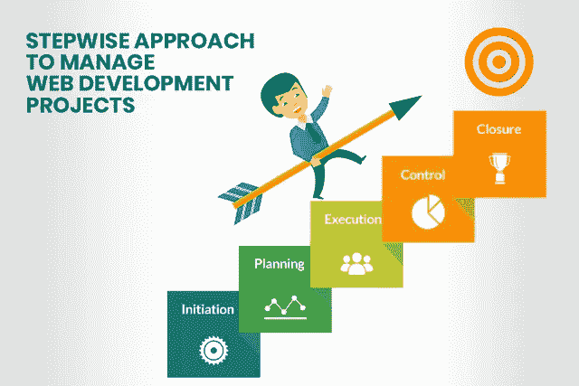
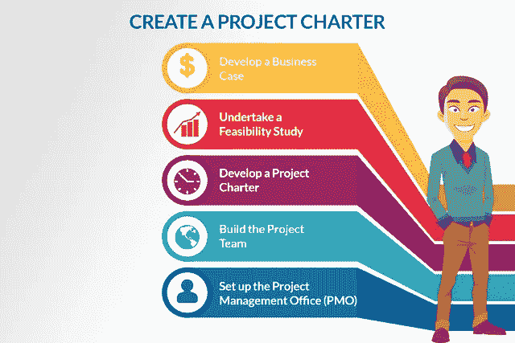
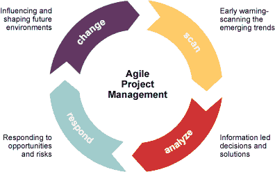

# 管理 Web 开发项目的综合指南

> 原文：<https://medium.com/hackernoon/a-comprehensive-guide-to-managing-web-development-projects-8364f2230eb7>

A Comprehensive Guide to Manage Web Development Project

你知道吗根据 Wrike 的一项调查，只有 64%的项目达到了各自的目标。是啊！并且，糟糕的网站开发项目管理实践是任何项目失败的主要原因之一。

这些统计数据让您了解了有效项目管理技术的重要性:

> 平均而言，项目会超出预算约 27% 。(来源:哈佛商业评论)
> 
> 平均来说，六个软件开发项目中就有一个项目的预算**超出了 200%**。(来源:哈佛商业评论)
> 
> 总的来说，IT 故障率估计在 5%到 15%左右**，仅在美国每年就造成 500 到 1500 亿美元的损失**。(来源:哈佛商业评论)
> 
> 大多数组织都有 70%的项目失败率。(来源:下午 4 点)
> 
> 只有 28%的公司使用项目绩效技术。(资料来源:PMI，2017)
> 
> 只有 **2.5%** 的公司成功完成 **100%** 的项目。(来源:盖洛普)

所以，现在你知道组织需要一个有效的项目管理方法，不仅节省他们的钱，而且节省他们的时间和在市场上的声誉。学习好的项目管理技术对任何组织都是至关重要的，因为它可以成就或毁灭任何组织。

在这个博客中，我们将讨论一些有效的项目管理技术。我们将从 web 开发项目的定义开始，然后我们将转移到项目经理的角色和职责，然后是 web 开发项目的各个阶段，最后我们将讨论一些使您的项目管理万无一失的技巧。

> **“做最好的打算，做最坏的打算，做好大吃一惊的准备。”~丹尼斯·威特利**

## **什么是 web 开发项目管理？**

项目管理是管理项目的过程，唯一负责的人被称为项目经理。大型 [**web 应用开发**](https://www.xicom.biz/offerings/web-development/?utm_source=KC03) 项目一般有多个项目经理，而小型项目则由一个项目经理管理。

项目的两个最重要的元素是项目干系人和资源。

利益相关者:任何从完成的项目中获益的人都是利益相关者。可能是客户、高层领导以及所有可能使用这个项目的人。

资源:完成一个项目所需的人力和其他有形资源。例如，一个创造设计的人和一个赋予它物理形式的打印机，两者都是资源。

因此，项目管理基本上意味着以一种有效的方式管理资源，以便交付符合涉众真实需求的结果。

## **项目经理的角色和职责**

现在你知道了什么是 web 开发项目，谁是项目经理。这里我们将讨论项目经理的角色和职责。项目经理有几个角色和职责:

*   定义项目的范围
*   计划和排序活动
*   资源管理
*   计划创建
*   时间和成本的估计
*   创建和管理预算
*   分析和管理风险
*   创建和领导团队

# 阅读更多: [PCI DSS 合规性:电子商务业务指南&清单](https://hackernoon.com/pci-dss-compliance-a-guide-checklist-for-ecommerce-businesses-833c3f5d9e85)

# **-管理网络开发项目的步骤**

## **1。启动**

这是项目管理的开始阶段。在这个阶段，项目经理制定项目概述并选择团队。这个阶段非常重要，因为在这里整个项目有了正确的方向。

## **2。规划**

在这个阶段，项目经理为团队创建一个路线图。在这里，经理设定目标，定义范围，创建工作分解计划，确定里程碑，并制定沟通和风险管理计划。

## **3。执行**

在这个阶段，项目经理创建团队并给他们分配任务。此外，他召开会议并建立跟踪系统。大多数真正的工作都发生在这个阶段。

## **4。监控**

这个阶段从执行阶段开始。它包括监控团队绩效和管理其产出质量。在这里，经理跟踪项目成本、单个团队成员的表现以及整个项目。

## **5。关闭**

在这一阶段，项目经理移交涉众，项目就此结束。此外，在这里，项目经理回顾团队的表现并分析他们的努力。

> “计划只是好的意图，除非它们马上变成艰苦的工作。”~彼得·德鲁克

# **项目启动**

这个阶段由五个独特的步骤组成，围绕这些步骤创建一个业务案例和一个核心项目团队。

## 1.创建业务案例

> 为此，您需要记录以下内容:

*   对问题和机会的简单解释
*   备选解决方案列表
*   对业务优势、价格和潜在风险的简短分析
*   项目要求及其潜在结果
*   推荐解决方案的简短说明以及应用它们的流程
*   列出所需资源、财务分析和时间表的小计划

创建商业案例时，需要尽可能具体。一旦创建好了，你就可以进行可行性研究了。

## **2。进行可行性研究**

可行性研究是指列出商业案例中出现的问题和机会的可能解决方案的过程。这里的目的是记录一个解决方案是否可行。

> 要进行可行性研究，需要:

*   研究商业问题或机会的解决方案
*   识别并列出任何其他可能的解决方案
*   深入了解每个解决方案，检查其在预算、功能、资源需求和时间表方面的可行性
*   认识到每个解决方案的潜在风险

## **3。创建项目章程**

对于任何项目来说，准备章程真的是一件很重要的事情。它也是初始阶段结束时的一个重要的可交付成果。项目章程是前两步的结合。

这些步骤是商业案例和可行性研究。此外，这个章程定义了项目的远景、范围、截止日期和可交付成果。

> 为了制定项目章程，需要列出以下内容:

*   项目的目标、远景和目的
*   项目范围
*   关键交付成果及其截止日期
*   双方的重要项目利益相关方
*   关键角色和职责
*   项目组织结构

## **4。创建项目团队**

在这里，一切都是为了找到合适的人来按时交付项目。为此，你需要一份工作描述。此外，该描述应包括以下所有内容:

*   角色的目的
*   与角色相关的职责
*   那么这个人将向谁汇报呢
*   相关资格
*   绩效评估标准
*   工资和工作条件

## **5。安排一个项目管理办公室**

虽然它不是最重要的，但它对一个项目的成功有很大的影响。要设置办公室，您需要执行以下操作。

*   你需要找到办公室的位置
*   您需要确保该位置拥有正常运行所需的基础设施和设备
*   获得履行项目管理职责所需的正确工具、设备和公用设施
*   定义项目管理办公室及其员工的角色和职责
*   创建标准的 web 开发项目管理流程
*   为项目管理设置和应用模板

# **策划**

在这里，您可以创建计划、估计成本和设置绩效指标。在项目从启动到结束的过程中，为了做出决策，规划是非常重要的。在复杂的项目中，计划对你有很大的帮助。

这个阶段的最终结果是项目管理计划。

> **“今天的好计划胜过明天的完美计划。”~谚语**

# **执行**

这个阶段可能很难，也可能很容易。这取决于你在计划中付出了多少努力。在这个阶段，您管理项目团队，召开团队会议，并向风险承担者传达项目状态。

> 不同的项目执行活动包括:

*   资源管理
*   时间和任务管理
*   管理风险和变化
*   管理通信

# **项目监控&控制**

该阶段与项目执行一起进行。在这个阶段，您基本上检查项目是否满足要求的质量指导方针和期限，而不要求额外的预算。

> 它只是关于跟踪项目，并确保它是否符合项目计划。它包括以下活动:

*   选择各种 KPI
*   控制和监控通信
*   吸引利益相关者

# **项目收尾**

一旦你完成了所有的里程碑，并交付了所有的可交付成果，就该结束项目了。这个阶段包括范围验证。

在范围验证中，您与涉众联系，并确保所有的承诺是否都包含在最终的可交付成果中。

> **“找对人。然后不管你以后做错了什么，人们都会救你。这就是管理的意义所在。”~汤姆·狄马克**

**Web 开发项目管理技巧**

每个企业都想 [**雇佣能够将梦想变成现实的网站开发者**](https://www.xicom.biz/offerings/hire-web-developers/?utm_source=KC03) 和项目经理。为了使你的网站开发项目成功，你只需要在规定的时间内满足客户的确切要求。

> 在这里，我们将讨论一些有效的技巧，使您的项目有效和成功。这些是:

## **1。对 web 应用程序开发项目了如指掌**

你应该确定你的客户的需求，了解他们对项目的期望。之后，您应该制定一个可靠的项目计划，明确定义工作角色和职责。

## **2。确定网站开发项目需求**

您应该创建一个能够有效实施项目计划的团队。它从定义角色和给团队分配正确的任务开始，牢记他们的优势、个性和专长。

> **“天赋赢得比赛，但团队合作和智慧赢得冠军。”~迈克尔·乔丹**

## **3。找一个了解项目本质的专家项目经理**

一个好的项目经理应该知道如何通过将任务分配给合适的人来管理不同实力和个性的运营团队，并确保过程既有趣又富有成效。

## **4。有效的沟通是项目成功的关键**

为了平稳地运行一个 web 开发项目，需要在客户和利益相关者之间进行一致且有效的沟通，并且新的或额外的更改应该传达给团队成员，以避免“突然袭击”。

## **5。使用正确的项目管理工具**

如今有这么多可用的项目管理工具，您可以选择最适合您的组织的项目管理工具。ProofHub、Invoicely、GitHub、在线打样工具、甘特图、报告、定制工作流等。是一些在线项目管理工具，它们将使您的团队能够协作并交付具有一些强大功能的成功项目。

# **收尾**

希望现在你对 [**网站开发**](https://www.xicom.biz/offerings/web-development/?utm_source=KC03) 等相关方面的项目管理有了更清晰的认识。这些项目管理技术正被印度大多数顶级网站开发公司所采用，以使他们的项目取得成功。如果你也遵循这些技巧，你就能让你的 web 或者 [**手机 app 开发**](https://www.xicom.biz/offerings/mobile-app-development/?utm_source=KC03) 项目成功。

> 如果你想对这篇文章提出建议或反馈，你可以发表评论。