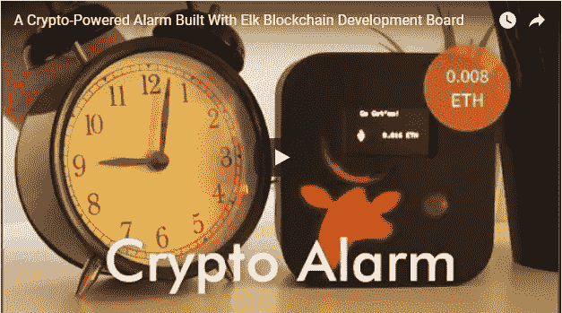
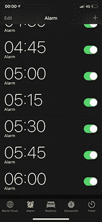
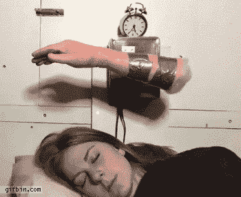
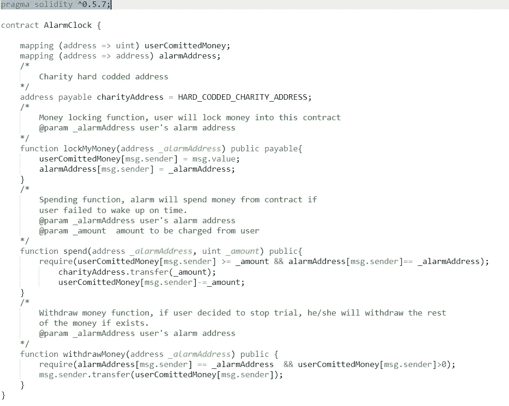
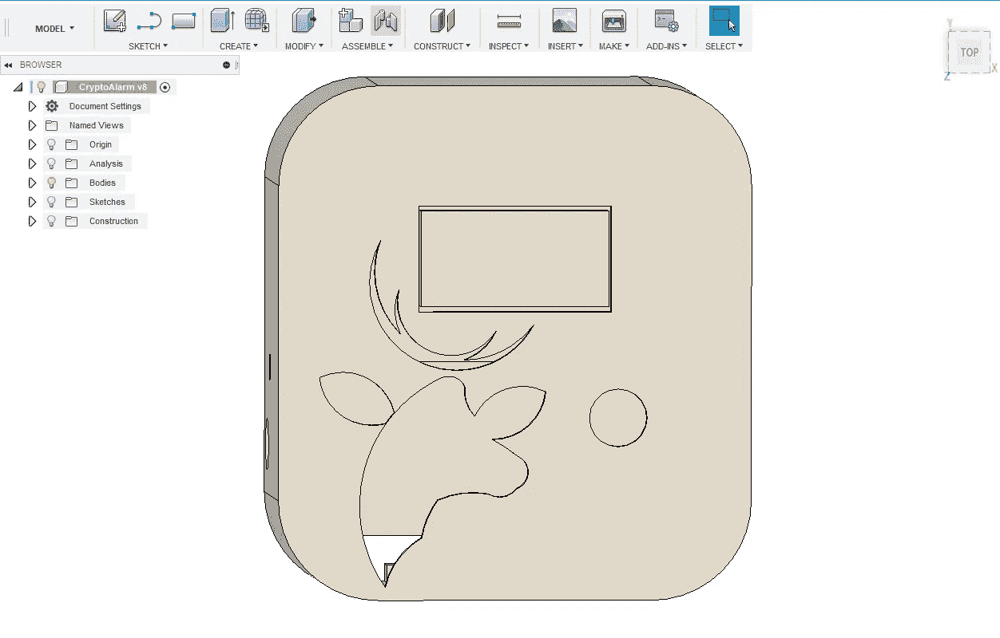

# 一个你不能打盹的加密闹钟！

> 原文：<https://medium.com/hackernoon/a-crypto-powered-alarm-you-cant-snooze-a22240b527c9>

[](https://youtu.be/fNesUejfYeQ)

如果这看起来像你典型的闹钟应用程序屏幕，那么你需要一些帮助来唤醒！

对于我们的日常斗争，制造商社区从来没有用完替代的硬件解决方案，这些解决方案是有趣的、可调整的和具有挑战性的。

有些人试图这样醒来:



然而，对睡眠动力学和“如何被闹钟叫醒”背后的科学的研究可以致力于复制密码驱动的闹钟，这种闹钟会迫使你醒来，否则你最终会失去一笔财富:d。它也可以成为摆弄以太坊和接触一些硬件和区块链概念的良好入门。

该报警器使用 [Elk](https://elk.cc/?utm_source=alarm&utm_medium=medium) 区块链开发板和一个声音传感器。它是声音激活的，这意味着你可以马上用它来启动你的个人闹钟，没有太多的麻烦或调整。当声音传感器检测到您的闹钟响起时，它会在一段时间内开始计数(您在代码中设置)，在这段时间内，您必须起床，并通过您选择的硬件操作或简单地按下按钮来关闭它。

发生的情况是，最初每次警报响起时，一定量的乙醚被锁定在智能合约中。智能合约仅根据您的硬件状态进行控制。您是否在试验的时间框架内完成了硬件操作，或者未能完成；董事会一直在倒计时。如果你在试验结束前做了，那么你不会失去你从你的帐户锁定的指定乙醚，它会撤回到你的帐户。如果没有，你就完全失去了它，它会被送到你选择的任何一个慈善机构的地址。

**使用的智能合约功能有:**



链接到代码片段:[https://pastebin.com/R585FCsp](https://pastebin.com/R585FCsp)

典型的 Arduino C 用于支持 Elk SDK 的 Platform.io IDE 上警报的其余逻辑。声音传感器与一个中断引脚相关联，一旦它发出声音检测信号(来自传感器的低信号)，中断就会发生，并启动 millis()计数器进行试用，并使用

```
function lockMyMoney(address _alarmAddress) public payable{userComittedMoney[msg.sender] = msg.value;alarmAddress[msg.sender] = _alarmAddress;
```

如果您按下按钮使闹铃静音，则会出现另一个中断，并将 Win 标志设置为 true，并收回您的钱

```
function withdrawMoney(address _alarmAddress) public {require(alarmAddress[msg.sender] == _alarmAddress && userComittedMoney[msg.sender]>0);msg.sender.transfer(userComittedMoney[msg.sender]);
```

如果你输了，钱会转到预定的慈善地址

```
function spend(address _alarmAddress, uint _amount) public{require(userComittedMoney[msg.sender] >= _amount && alarmAddress[msg.sender]== _alarmAddress);charityAddress.transfer(_amount);userComittedMoney[msg.sender]-=_amount;
```

处理动作的代码如下。

```
ContractMethodParam param1("AlarmAddress");
ContractMethodParam param2(AMOUNT_OF_MONEY_IN_GWEI);void loop(){if(win) //winning condition{win = false;Ethereum.sendContractMethodCallTransaction("m/44'/60'/0'/0/0",CONTRACT_ADDRESS,AMOUNT_OF_MONEY_IN_GWEI,50000,20,"withdrawMoney(address)",&param1);display.clearDisplay();display.fillScreen(BLACK);display.setCursor(37,7);display.println(“WINNER!”);display.setCursor(20,30);display.println(“You’ve Earned”);display.setCursor(20,40);display.println(“0.016 ETH”);display.display();for(int i = 0; i<=3 ; i++)analogWrite(LedPin, 90);delay(500);analogWrite(LedPin, 0);delay(500);}if (!win && millis()-timer >= trial ) //losing condition{//You LOSING money!Ethereum.sendContractMethodCallTransaction("m/44'/60'/0'/0/0",CONTRACT_ADDRESS,AMOUNT_OF_MONEY_IN_GWEI,50000,20,"spend(address,uint)",&param1,&param2);display.clearDisplay();display.fillScreen(BLACK);display.setCursor(35,7);display.println(“SLEEPY HEAD!”);display.setCursor(33,30);display.println(“You’ve lost”);display.setCursor(33,40);display.println(“0.016 ETH”);delay(3000);display.clearDisplay();display.fillScreen(BLACK);display.display();}
```

最后，在 Fusion 360 上制作了一个简单而时尚的外壳，以一种可展示的形式包含所有组件。



这个闹钟让你别无选择，只能要么按时醒来，要么做一个慷慨的人，在这两种情况下，你都做了一些好事，不管是对你自己还是对这个世界。

有了 Elk，构建区块链互联设备变得简单了。麋鹿将很快在 Kickstarter 上发布，一旦它发布，请在这里注册**[](https://elk.cc/?utm_source=alarm&utm_medium=medium)****。******