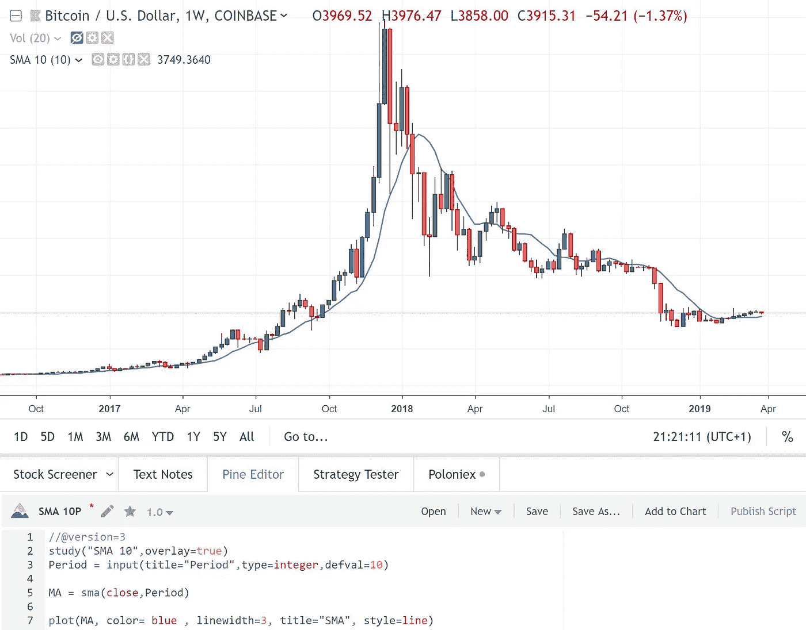
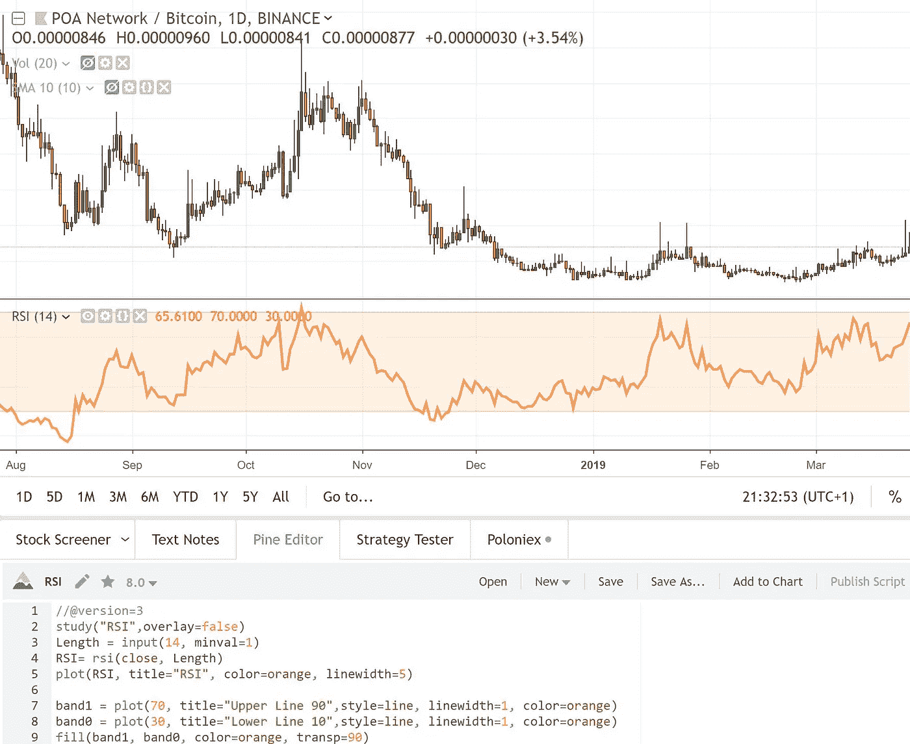
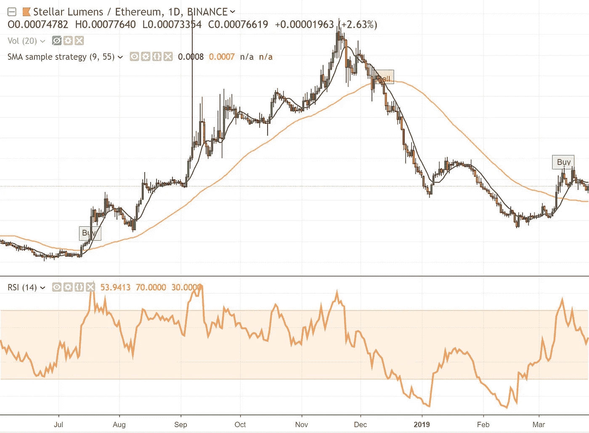
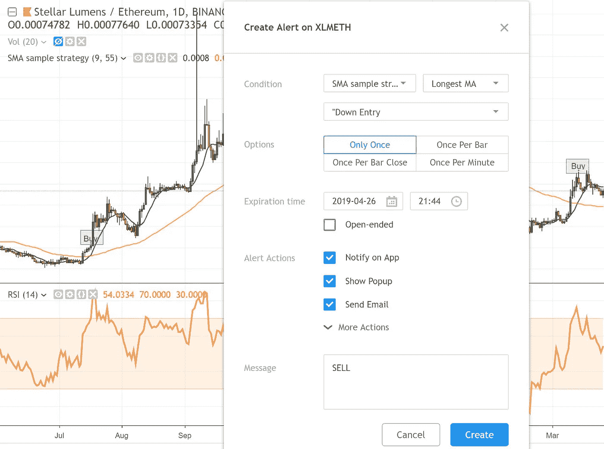
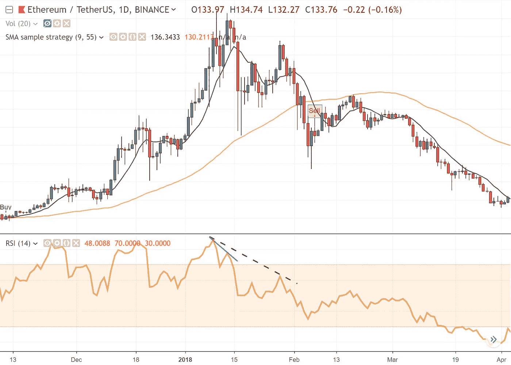
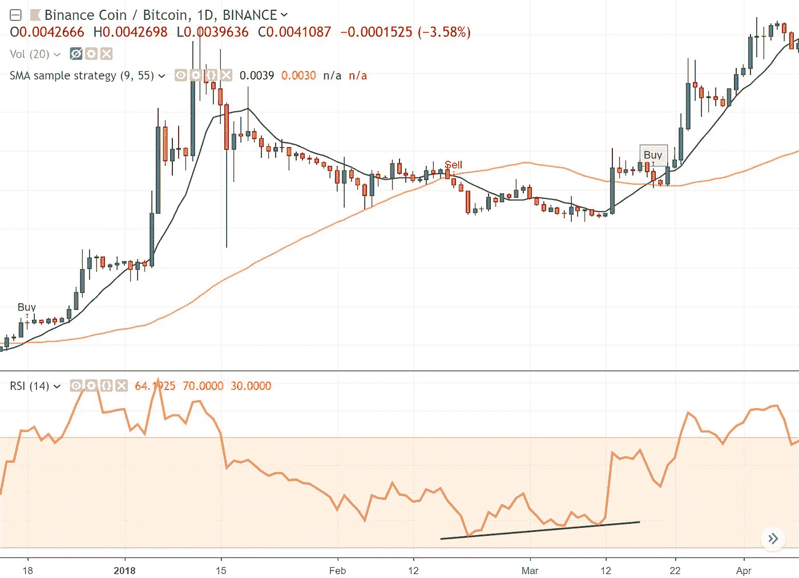

# 加密货币交易策略

> 原文：<https://medium.com/hackernoon/a-cryptocurrency-trading-strategy-bcffc415e58b>

使用 TradingView 构建交易系统


学会如何更有效率，而不是整天看图表。

我们将在这篇文章中讨论什么？

*   什么是交易系统
*   策略，为什么你需要一个
*   指标，它们是什么以及如何编码
*   为交易系统编码

首先，您将学习什么是策略，它的用途以及如何在没有大量代码知识的情况下开发一个策略。

# 什么是交易系统？

开发一个有利可图的交易算法系统不仅仅是找到一个好主意，它包括几个要素。心理学和资金管理是成功投资的基础。然而，没有好的策略，你很难跟随市场。

交易系统是一套管理交易者交易金融市场的整体方法的规则。定义交易者最有可能盈利的条件，并概述如何利用这些条件。

自动交易系统显示交易者可以进行什么类型的交易，在哪里交易，交易的具体设置，风险管理，时间框架规则，交易管理等等。

# 对战略的需求

如果你的手机上有一个买入/卖出通知，通知你已经观察了几天的资产，会怎么样？

当我开始制定新的策略时，这让我振奋起来。

交易策略的最终目标是给你一个最终的交易行为，买入或卖出一定数量的可交易资产。

简单的交易策略由以下参数组成:

*   风险:你打算在交易中承受多少损失。
*   *价格*:交易将要执行的价格。
*   *数量*:将要进行交易的资金数量。
*   *进场交易*:根据策略，它将在预定的价格执行买入或卖出动作。
*   *退出交易*:根据交易结果，策略决定是否要退出该头寸。

首先开始建立你自己的策略，选择你想交易的市场是很重要的。那么，你不必从零开始，你可以用一个基于不同类别的公共的作为趋势跟踪。外面有很多策略。

优化战略以在新的、看不见的数据上持续盈利非常重要。

一旦你有了自己的交易系统，最后一步就是建立风险管理系统。

风险管理包括算法中的交易前和交易后检查，分配合理的止损或最佳资本分配。有效的风险管理可以防范灾难性损失。斯坦·温斯坦曾经说过:

> 恐惧让你恐慌，在底部卖出，而贪婪让你在接近顶部时买入。这些都是人群悠悠球心态背后的驱动因素。

# 指示器

指标是用图表解释的数学公式。从一项资产的历史数据开始，你想要的一切都会被计算出来，结果会在你的资产图中显示出来。

我们将要实施的指标通过交叉或背离产生买入或卖出信号。

*   *交叉:*价格穿过一条移动平均线或当两条移动平均线交叉时。
*   *背离:*价格趋势的方向和指标的方向相反。

指标有助于识别资产的势头、趋势、波动性和其他方面。它们有很多种类型，但是对于我们将要在策略中使用的，有两个最有用的趋势和动力指标就足够了。

**SMA**

单一移动平均线是一个技术指标，用于确定资产价格是将继续还是反转牛市或熊市趋势。

SMA 是资产价格在一段时间内的算术平均值。


趋势识别和确认:如果斜率为正，它将显示价格高于平均水平，如果为负，平均水平将高于价格。

**RSI**

相对强弱指数(RSI)是一个动量指标，衡量最近价格变化的幅度，以评估资产价格的超买或超卖情况。

RSI 将看涨和看跌的价格动量与资产价格图进行比较。

当指标高于 70%时，信号被视为超买或高估，当指标低于 30%时，信号被视为超卖或低估。


RSI 根据特定时间段，比较资产以较高价格收盘的天数(平均收益)和以较低价格收盘的天数(平均损失)。

**对指示器进行编码**

让我们给这些指示器编码。为此，我们将使用 [TradingView](https://www.tradingview.com/) Pine 编辑器。

Pine 中有两种类型的脚本。如果要对指标或策略进行编码，则不同。当你执行做多或做空交易的条件时，*研究*对应于指标和*策略*。

*形状记忆合金*

```
study("SMA 10",**overlay**=true)Period = input(**title**="Period",type=integer,defval=10)

MA = sma(close,Period)

plot(MA, color= blue , **linewidth**=3, **title**="SMA", **style**=line)
```

*   *study* : overlay=true 如果你想在图表上绘制结果，否则如果你正在构建一个像任何振荡器一样的指标，那么你可能想让它保持为 false。
*   *周期*:输入函数，默认值为 10。它的输出存储在 Period 中，并作为参数传递给内置的 pine 函数“sma()”。
*   *MA* :我们定义了一个变量“MA”，它将存储蜡烛收盘价的 10 个周期的简单移动平均值。

最后，我们将结果绘制在图表中。例如，比特币在每周的时间范围内:



*相对强度指数*

```
study("RSI",**overlay**=false)Length = input(14, minval=1)RSI= **rsi**(close, Length)plot(RSI, **title**="RSI", color=orange, linewidth=5)
band1 = plot(70, **title**="Upper Line 90",style=line, linewidth=1, color=orange)
band0 = plot(30, **title**="Lower Line 10",style=line, linewidth=1, color=orange)
**fill**(band1, band0, color=orange, transp=90)
```

*   *研究*:在这种情况下*叠加*参数被设置为假。
*   *长度*:输入功能，默认值为 14。它的输出以长度存储，并作为参数传递给内置的 pine 函数“rsi()”。
*   RSI:我们定义了一个变量“RSI ”,它将存储 14 个周期和相对强度指数结果。
*   波段 0/波段 1:确定超买或超卖条件的线。

将绘制的结果绘制成 POA 日线图:



# 让我们建立一个交易策略

在我看来，在加密货币市场，除非你热爱风险，不使用止损，否则执行交易策略的最佳方式是开发一个半自动的策略。一旦你收到一个关于你写下的条件的通知，最好在交易前检查图表。

我假设你已经知道“泵和转储”是什么意思，市场内幕人士，XRP 军队，或者让我们写一个 tweet 然后卖掉那个硬币。如果你是一个保守和守纪律的交易者，随着加密货币的高波动性，你所有的止损都会被填补。相信我，即使你定义了 3%的止损，在你的交易日志中，超过 70%的交易是红色的。这就是为什么我更喜欢创造“警觉策略”并且睡得很香。

正如我之前所说，我们将使用交叉信号。我们将创建两条均线，并检查最低的一条何时穿过最长均线。这将是我们的买入信号。当两根均线交叉时，将发出卖出信号。

让我们看一下代码:

```
study("SMA sample strategy",**overlay**=true)

LowestPeriod = input(**title**="Lowest Period",type=integer,defval=9)
LongestPeriod = input(**title**="Longest Period",type=integer,defval=55)

LowestMA = sma(close,LowestPeriod)
LongestMA = sma(close,LongestPeriod)

plot(LowestMA, color=black, **linewidth**=3, **title**="Lowest MA", **trackprice**=false, **style**=line)
plot(LongestMA , color=orange, **linewidth**=3, **title**="Longest MA", **trackprice**=false, **style**=line)

Trend = LowestMA > LongestMA ? 1 : LowestMA < LongestMA ? -1 : 0
Trend1p =(Trend == 1 **and** Trend[1] != 1 ? Trend : na)
Trend1n =(Trend == -1 **and** Trend[1] != -1 ? Trend : na)

alertcondition(Trend1p, **title**='"Up Entry', **message**='BUY')
alertcondition(Trend1n, **title**='"Down Entry', **message**='SELL')

plotshape(Trend1p, **color**=green, **style**=shape.arrowup, **text** ="Buy")
plotshape(Trend1n, **color**=red, **style**=shape.arrowdown, **text** = "Sell")
```



在代码中，我们添加了 *alertcondition()* 函数，这样我们就可以选择在设备中产生通知的策略条件。

```
alertcondition(Trend1p, **title**='"Up Entry', **message**='BUY')
alertcondition(Trend1n, **title**='"Down Entry', **message**='SELL')
```

让我们为策略刚刚买入的 Stellar coin 创建一个卖出警报。在条件参数中我们选择我们的系统 *SMA 样本策略*:



*但是，如果策略只包含两条移动平均线，我需要 RSI 做什么？*

有了 RSI 指标，我们就能知道硬币在相应时刻的强度。分析供求如何反应，对于检查硬币是否有足够的流动性来满足你的订单至关重要。这是发散信号发生的地方:

*   *看跌背离*:硬币价格看涨，但 RSI 向相反方向移动。



*   *看涨背离*:钱币价格看跌，但 RSI 向相反方向移动。



如果您想知道如何构建一个自动化版本，下面是示例代码:

```
strategy("SMA Strategy", overlay=true)**longCondition** = crossover(sma(close, 10), sma(close, 20))if (longCondition)strategy.entry("Long Entry", strategy.long)**shortCondition** = crossunder(sma(close, 10), sma(close, 20))if (shortCondition)strategy.entry("Short Entry", strategy.short)
```

# 夏天到了

交易算法没那么简单。这只是关于如何在 TradingView Pine 编辑器中实现的一个简短视图。

代码中的周期可能会改变，使用的周期可能会与每日时间图表一起工作，但您必须自己进行回溯测试，并得出正确的参数。

为了制定一个好的战略，有一份清单是必不可少的，它使我们能够检查行动的结果。不要跑的太多，在你的策略里日复一日的工作，把你的操作写下来，有纪律的执行。

当对策略输出和资产趋势毫无头绪时，你能做的最好的事情就是离开它。最终的目标是当交易逆势时最小化损失，当价格对你有利时最大化利润。

贸易安全。