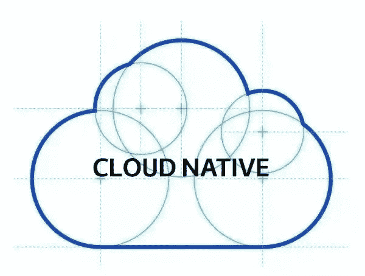
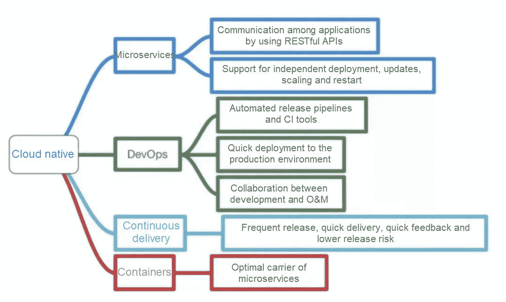
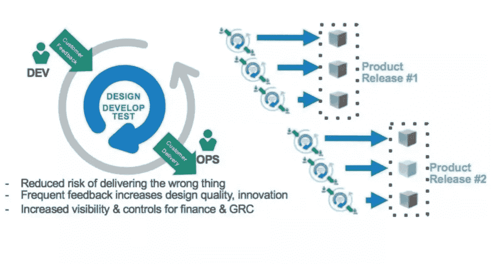
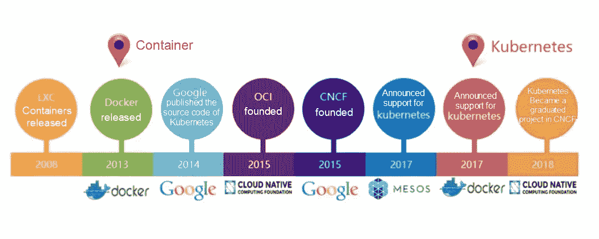

# 深入了解原生云:从基础到应用

> 原文：<https://medium.com/hackernoon/a-deep-dive-into-cloud-native-from-basics-to-applications-70d4d9f20e4>

随着云计算的快速发展，云原生概念应运而生。原生云已经变得非常流行。从今年开始，如果您不了解云原生，您将被视为过时。

虽然很多人都在说云原生，但是很少有人告诉你到底什么是云原生。即使找到并阅读了一些云原生的资料，你们中的大多数人可能仍然会感到困惑，对云原生缺乏完整的了解。在这一点上，你可能会开始怀疑自己的智力。就我而言，我总是倾向于将我对某些文章的无法理解归咎于作者的愚蠢，尽管这不一定是真的。然而，这种思维方式防止我被自我怀疑所拖累，我可以试着保持积极。

不能明确描述云原生的原因是缺乏明确的定义。由于云原生正在经历不断的发展和变化，因此没有任何个人或组织拥有定义云原生的绝对权利。

技术变革总是被某些意识形态所预示，就像不可战胜的马克思主义导致无产阶级革命的繁荣一样。

# 什么是云原生？

原生云是一种构建和运行应用程序的方法。它是一套系统化的技术和方法。云原生是由“云”和“原生”组成的复合词。“云”一词代表驻留在云中而不是传统数据中心的应用程序。“原生”一词表示应用程序被设计为在云上运行，并在应用程序设计的一开始就充分利用了弹性和“分布式”优势。

云原生概念是 Matt Stine 在 2013 年的 Pivotal 上首次提出的。在 2015 年云原生刚刚流行的时候，Matt Stine 在《迁移到云原生应用架构》一书中定义了云原生架构的几个特征:12 因素应用、微服务、自助式敏捷基础设施、基于 API 的协作、抗脆弱性。在 2017 年的 InfoQ 采访中，Matt Stine 做了一些改变，并指出了云原生架构的六个特征:模块化、可观察性、可部署性、可测试性、可替换性和可处理性。官方 Pivotal 网站上关于云原生架构的最新描述显示了四个关键特征:DevOps、持续交付、微服务和容器。

2015 年，云原生计算基金会(CNCF)成立。CNCF 最初定义了云原生架构的四个特征:容器化封装、自动化管理和微服务。2018 年，CNCF 更新了云原生架构的定义，增加了两个新功能:服务网格和声明式 API。

正如我们所看到的，不同的个人和组织对云原生架构有不同的定义，甚至同一个人或组织在不同的时间点对云原生架构也有不同的定义。这种复杂性让我很难清楚地理解云原生架构。过了一段时间，我想到了一个简单的解决方案:只选择一个容易记住和理解的定义(在我的例子中，DevOps、持续交付、微服务和容器)。

总之，要求云原生应用满足:利用 K8s、Docker 这样的开源栈实现容器化，基于微服务架构提高灵活性和可维护性，采用敏捷方法，允许 DevOps 支持持续迭代和自动化 O&M，利用云平台设施实现弹性伸缩、动态调度和高效的资源使用优化。

云原生支持简单快速的应用构建、轻松部署，并允许应用按需扩展。与传统的 web 框架和 IT 模型相比，云原生架构带来了许多优势，而几乎没有劣势。云原生架构绝对是这个行业一个强大的秘密武器。

# 四种云元素

微服务:几乎所有云原生概念的定义都包含微服务。微服务与 monolith 应用相反，基于康威定律，康威定律定义了如何拆分服务，不容易理解。事实上，我认为任何理论或法律都不是简单易懂的，否则它们听起来就不会像理论或法律那样专业。要点是系统架构决定产品形态。我不确定这是否也源于马克思关于生产力和生产关系之间关系的观点。

在微服务架构中，按功能拆分后，服务具有更强的解耦性和内聚性，因此变得更容易。据说 DDD 是另一种拆分服务的技术。可惜我对 DDD 了解不多。

容器:Docker 是使用最广泛的容器引擎。例如，它在思科和谷歌等公司的基础设施中被大量使用。码头工人利用 LXC。容器为实现微服务提供了保障，起到了隔离应用的作用。K8s 是 Google 打造的容器编排系统，用于管理容器和平衡容器之间的负载。Docker 和 K8s 都是用 Go 语言开发的，真的是很好的系统。

DevOps: DevOps 是“开发”和“运营”的组合，与开发和生产的关系不同。其实 DevOps 也包括测试。DevOps 是一种敏捷的思维方法、一种沟通文化和一种组织形式，其目标是实现云原生应用程序的持续交付。

连续交付:连续交付支持不停机的开发和更新，并且不同于传统的瀑布开发模型。持续交付需要开发版本和稳定版本的共存。这需要很多支持流程和工具。

# 如何才能实现云原生？

第一，云原生是云计算的一个结果。没有云计算的发展，就不会有云原生。云计算是云原生的基础。

随着虚拟化技术的日益成熟和分布式框架的流行，将应用程序迁移到云已经成为不可逆转的趋势。这一趋势也受到开源社区的推动，如容器技术、连续交付和编排系统，以及微服务等开发理念。

云计算中的三个层次，即 IaaS、PaaS 和 SaaS，为云原生提供了技术基础和方向指导。真正的云化不仅涉及基础设施和平台的改变，还需要应用程序的适当改变。在架构设计、开发模型、部署和维护的不同阶段和方面，应用程序需要摒弃传统方法，根据云的特性进行重新设计。这允许我们创建新的基于云的应用，即云原生应用。

1.  部署在本地的传统应用程序通常用 C/C++和 Java EE 编写，而云原生应用程序则用 Go 和 Node.js 等新型网络编程语言编写。
2.  在本地部署的传统应用程序在更新期间可能会经历停机，而云原生应用程序始终保持更新，并且需要支持频繁更改、连续交付和蓝/绿部署。
3.  部署在本地的传统应用程序无法支持动态扩展，并且通常需要冗余资源来应对流量高峰。然而，云原生应用允许通过使用云的弹性和自动扩展来共享资源，以降低成本和提高效率。
4.  部署在本地的传统应用依赖于 IP、端口甚至硬编码等网络资源，而云原生应用不受网络和存储限制。
5.  部署在本地的传统应用程序通常需要手动部署和维护。然而，云原生应用支持自动部署和维护。
6.  部署在本地的传统应用依赖于系统上下文，而云原生应用依赖于抽象基础设施而不是任何系统上下文，提供了良好的可移植性。
7.  一些部署在本地的传统应用程序是单块(巨石)应用程序，或者具有很强的依赖性。而基于微服务架构的云原生应用，垂直拆分服务，模块更合理。

很明显，我们需要新的云原生开发来实现云原生应用。云原生包括很多方面:基础设施服务、虚拟化、容器化、容器编排、微服务。幸运的是，开源社区对云原生应用程序做出了许多重大贡献，许多开源框架和工具都是直接可用的。在 2013 年发布后，Docker 很快成为一个实际的容器标准。k8s 于 2017 年发布，在众多容器编排系统中脱颖而出。这些技术大大降低了开发云原生应用的门槛。

虽然云原生介绍文档可能看起来有些夸张，但尽管我很挑剔，我还是对文档中列出的优点感到非常惊讶。云原生架构是完美的。这是否意味着应用程序应该立即切换到云原生架构？理想是完美而诱人的，直到你试图将现实切换到那个理想。我对此的看法是，根据实际需要做出决定，并考虑当前的问题是否真的影响了您的业务发展，以及您是否有能力重新设计您的应用程序。

# 趋势和影响

软件设计有两个关键目标:高内聚和低耦合。这两个关键目标进一步导致了许多具体的设计原则，包括单一责任原则、开闭原则、利斯科夫替换、依赖倒置、接口分离和最少知识。

软件工程师一直在努力实现这两个目标，编写更清晰、更健壮、更易于扩展和维护的软件。

后来，更多的需求被添加进来。软件开发预计会更简单、更快。程序员希望写更少的代码行，非专业人士也希望有开发应用的能力。更简单的编程语言是为没有编程技能的人开发的。开发了更多的编程技术和思想，包括库、组件和云基础设施。

因此，许多技术的实用价值较低，尽管它们本身非常先进。许多软件工程师有了新的角色，如参数调整工程师、API 调用专家、库管理员和组件专家。这是高效分工和技术发展的必然结果。

从近 20 年的互联网技术发展来看，主流趋势是技术在特定领域的应用。特别是随着近年来云计算的发展和普及，基础设施变得更加坚实，业务开发越来越容易，对技术的要求也越来越低。与此同时，小型企业和团队不再受到与性能、负载、安全性和可伸缩性相关的问题的困扰。这种情况让许多在互联网行业工作的中年人感到担忧，他们可能会觉得自己可能很快就会失业。

虽然不可否认的是，技术正在成为这个行业中一个不太重要的门槛，但我们不必那么悲观。类似的争论也发生在 VB、Delphi、MFC 出现在 PC 编程时代的时候:你看到的就是你能用到的，只要点一下鼠标就能开发出 PC 程序。这不是很酷吗？当时，程序员可能有更多的顾虑。然而，在将后端开发与互联网行业的发展分开后，他们很快发现他们的新战场出现了许多关于网络、分布式服务、数据库、支持大量服务和灾难恢复的新想法。

如果说 PC 编程时代的基础架构是控件库，互联网时代的基础架构是云，那么 AI 时代的基础架构呢？AI 时代会涌现出哪些高端技术？

# 阿里巴巴科技

> 关于阿里巴巴最新技术的第一手深度资料→脸书: [**“阿里巴巴科技”**](http://www.facebook.com/AlibabaTechnology) 。推特: [**【阿里巴巴技术】**](https://twitter.com/AliTech2017) 。