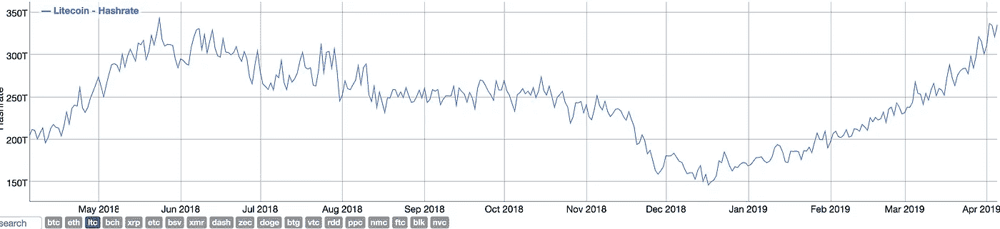
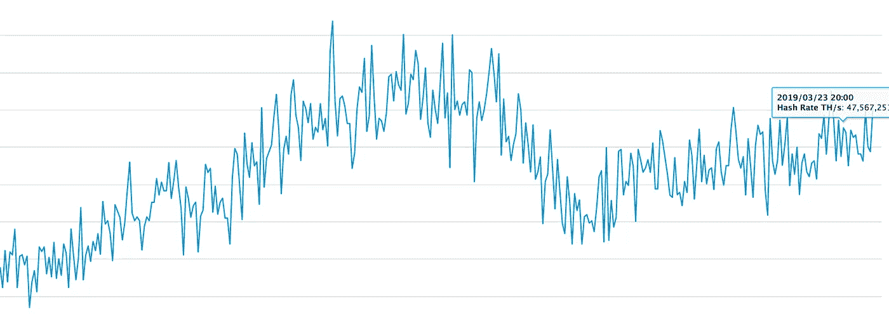
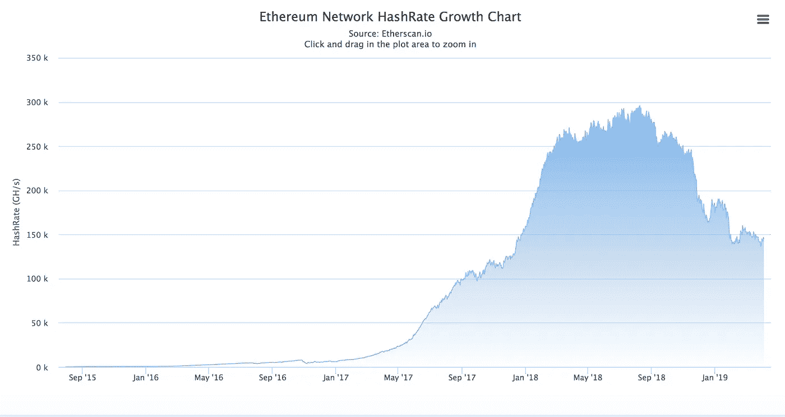

# 2019 年 HashRates 的分歧

> 原文：<https://medium.com/hackernoon/a-divergence-of-hashrates-in-2019-1a91143395d4>

# 介绍

加密资产的 [hashrate 和价格通常是相关联的](https://hackernoon.com/background-i-run-operations-and-fund-evaluation-for-block-zero-capital-an-investment-firm-3ab2f767c1d7?source=friends_link&sk=07f07132d9bd97ed9877ca90cfc60b67)；随着加密货币在 2019 年复苏，评估领先加密资产的散列能力以了解采矿社区对每个加密资产未来前景的信心是值得的。在这篇文章中，我评估了三种领先的加密资产莱特币、比特币和以太坊的散列能力。我发现莱特币、比特币和以太坊的 hashrates 正在分化，表明莱特币和比特币将在即将到来的牛市中跑赢以太坊。

# 莱特币

Litecoin 有着最显著的散列率复苏，表明矿业社区非常看好这种加密资产的未来前景。莱特币将在 2019 年 8 月经历减半，因此其价格和散列能力都经历了令人难以置信的飙升。

Litecoin’s hashrate is close to setting a new record

# 比特币

比特币被广泛认为是加密资产的避风港。作为现存最古老、最受信任的加密资产，它的价格和哈希拉特预示着更大的加密货币市场将如何表现。与莱特币不同，比特币不会经历每隔几年就会发生的即将减半的事件。然而，在 2020 年 5 月之前的几个月，比特币的价格将会上涨。

Bitcoin’s HashRate is slowly reascending in 2019

# 以太坊

[在之前的一篇文章](https://hackernoon.com/ethereum-falls-back-to-earth-can-it-re-ascend-8410cf96b1de?source=friends_link&sk=239e39c2e76c37639d0d00aafc7da12c)中，我指出以太坊存在可伸缩性问题，这一弱点威胁着该协议的未来前景。采矿界显然同意这一观点。以太坊的 hashrate 在 2019 年不会重新飙升，这表明采矿社区可能认为 EoS 和 Tezos 等竞争对手将从以太坊手中接过衣钵，成为新的主导智能合约平台。

Ethereum’s hashrate has not recovered

# 结论

Hashrate 是衡量加密社区对加密资产未来前景的信心的最佳指标。我的分析认为，矿界极度看好莱特币，有点看好比特币，对以太坊不冷不热。如果投资者将 hash-rate 作为一种加密资产未来价格前景的指标，莱特币肯定会买入，比特币不太会，但也是买入，以太坊则是卖出。