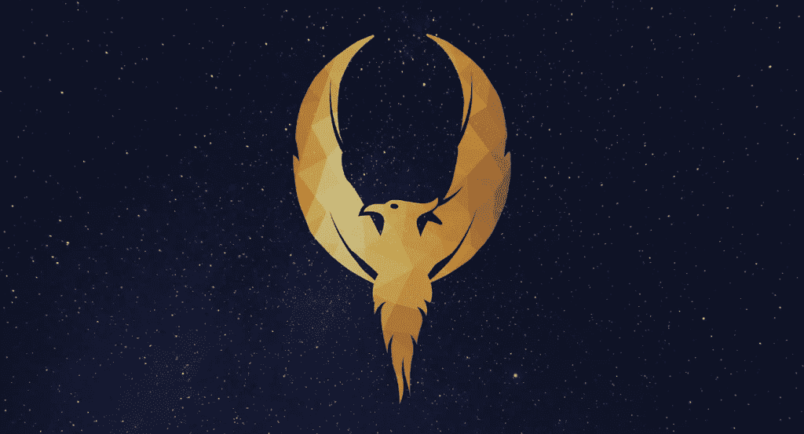
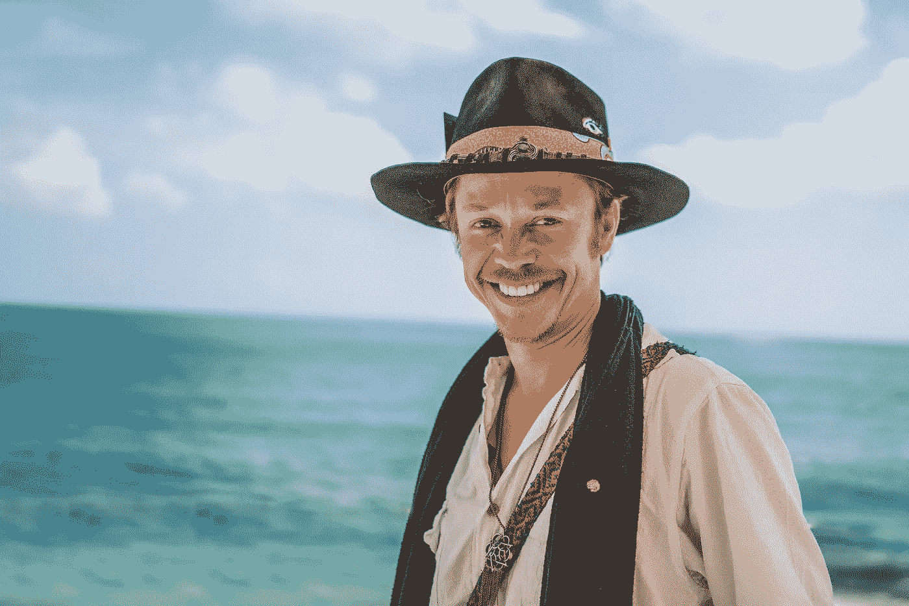

# 硬币的游戏:布洛克·皮尔斯如何给 21 世纪的数字货币带来新的希望

> 原文：<https://medium.com/hackernoon/a-game-of-coins-how-brock-pierce-aims-to-bring-a-new-hope-to-digital-monies-in-the-21st-century-36b5cf69f0be>

## 在一个遥远的星系中，有超过 2000 枚硬币组成的密码王国——但随着专家、监管者和玩家的数量增加，比特币的声誉如何在所有这些人中得到协调和保护？

**Photo Credit: Gilles Bonugli Kali / IG:** @gbk.style

很久以前，在一个遥远的星系里…

*一个新的数字资产类别出现了。中本聪关于这种新资产类别的* [*白皮书*](https://bitcoin.org/bitcoin.pdf) *于 2008 年发布，诞生了世界上第一种加密货币比特币。随着数字原住民和游牧民族争相学习其* [*起源和秘密*](https://www.wired.com/story/guide-bitcoin/) *，比特币的诞生席卷了全世界。*

但是，在 2011 年 2 月，一股黑暗势力到来并与比特币联手，成为互联网的“狂野西部”和毒品贩子、枪支走私者和文件伪造者的终极黑市。

*三年* ***，****[*丝绸之路*](https://www.wired.com/2015/04/silk-road-1/) *(TSR)是一股不可阻挡的力量，在黑暗的网络上赋予了“创业”新的含义。它被设计成一个自由市场，其本身的存在将在政府控制范围之外，从而破坏了国家的结构。**

*由于 TSR 是一项 TOR 隐藏服务，其用户认为 TSR 上的通信和交易几乎完全是匿名的，只能使用比特币进行交易。*

**在*[*2013 年 10 月*](https://money.cnn.com/2013/10/02/technology/silk-road-shut-down/) *当 TSR 最终被击败并关闭时，它给比特币留下了一个黑暗的遗产——它是一股邪恶的力量吗？或者，它是一个最终腐蚀了持有者的工具？**

**在幕后，另一股力量正在从这个星球上的王国那里获得力量和支持——mt . Gox。一家位于日本东京的比特币交易所已经处理了超过 70%的比特币交易，是世界上最大的比特币中介和交易所。**

**但是，它很快就功亏一篑，在 2014 年，该交易所被抢走了超过 85 万枚比特币，即当时的*[*【4.5 亿美元*](https://www.wired.com/2014/03/bitcoin-exchange/) *。现在被公认为世界上最大的加密货币黑客，Mt. Gox 仍然在加密货币社区留下了印记，因为交易所的受害者和债权人仍然没有得到补偿。**

**然而，随着加密社区和监管机构试图控制这个动荡市场的风向，有些人认为比特币及其声誉可以从内部得到拯救……也许有一个人及其赎回 Mt. Gox 的愿景可能会唤醒打造新的数字金融未来所需的知识、技能和专业知识……**

*如果你不是*权力的游戏*或*星球大战*的粉丝，那是最不幸的，但是这里的信息仍然很简单:*

*强者总是掠夺弱者。这就是他们最初变得强大的原因。–**提利昂·兰尼斯特，《权力的游戏》第五季第一集***

****所有获得权力的人都害怕失去权力。”*–**议长帕尔帕庭，*星球大战:西斯的复仇******

***就像*权力的游戏*和迪士尼对*星球大战*宇宙的延续一样，加密货币空间的命运还有待书写。***

# *****Gox 山黑暗面的裹尸布*****

******

***Photo Credit: *Pixabay****

***丝绸之路关闭七年后，数字货币，特别是比特币如何被用于合法(和非法)目的的问题浮出了水面，但仍有一些黑暗的残余影响着比特币和相关货币的广泛采用和使用。***

***不幸的是，威胁仍然继续阻挠这个空间，推动加密货币市场价格下跌，对其生存的担忧上升。***

***现在，在加密货币历史上最大的黑帽比特币黑客攻击发生五(5)年后，Mt. Gox 遗留下来的黑暗面继续笼罩着比特币世界。***

***然而，仍然有一些人仍然相信新的希望存在，愿意为 Mt. Gox 的回归而战，仅仅是为了让事情变得正确，并向世界证明它可以成为一股正义的力量。***

***乔治·R·R·马丁和 HBO 有它的白衣骑士和黑暗骑士，琼恩·雪诺和提利昂·兰尼斯特。***

***乔治·卢卡斯和迪斯尼有绝地大师尤达、欧比万·克诺比和卢克·天行者。***

***至于加密生态系统，我们有没有可能拥有自己的绝地武士？布洛克·皮尔斯，他在风险资本主义和金融领域的经验使他能够涉足极具争议和高度辩论的话题。***

***上周，我有一个独特的机会与皮尔斯深入交谈，探讨他为什么认为鉴于已经造成的破坏，总部位于东京的交易所仍然有机会，以及他为什么决定用他的最新项目“Gox Rising”从头开始重建它。***

***在我们开始任何对话之前，皮尔斯告诉我，当他决定进入太空，特别是努力开始复活 Mt. Gox 时，他知道他的观点可能会使他成为太空中的一个重要目标。***

***虽然仍有一些悬而未决的问题需要回答，但皮尔斯的愿景似乎表明了他对空间整体福利的真诚关注和热情，特别是 Mt. Gox 的受害债权人。***

# ***从灰烬中，Gox 山可能会成为新的希望***

******

***2 月 7 日，Pierce 在接受 [TechCrunch](https://goxrising.com/press.html) 的独家采访时宣布，他打算用“Gox Rising”项目重振东京的交易所。***

***Gox Rising 在过去五(5)年中一直在工作，旨在补偿 20000 名在 2014 年攻击中受害的 Mt. Gox 债权人，希望建立广泛的共识，重新团结社区。此外，它还旨在使美国和日本的破产程序以最佳方式及时结束。***

***根据该项目，皮尔斯将被视为该公司的完全、彻底的所有者。然而，由于 Pierce 和 Mt. Gox 前首席执行官 Mark Karpelès 在社交媒体上的[激烈辩论](https://cointelegraph.com/news/former-mt-gox-ceo-mark-karpeles-rejects-brock-pierces-plans-to-reboot-exchange)，所有权问题仍然没有答案。***

***当我问皮尔斯他对 Karpelès 拒绝皮尔斯在 2014 年的意向书中收购该公司的最新想法时，他告诉我，文件将证明他的说法，但最终，所有权真的不是他关心的问题:***

> ***“首先，所有权并不重要。我们只关心债权人得到所有东西。我不在乎谁拥有它，只要马克·卡佩斯什么也得不到。我从历史的角度提到它的唯一原因是因为它关系到连续性，为什么是现在。我已经为此工作了五年多，所以它重要的唯一原因是因为我提交了第一份民事康复计划并做了所有这些事情。但是，我个人并不在乎我是否拥有任何东西。我唯一关心的是为什么卡佩莱斯这么在意。唯一重要的是重新推出 Mt. Gox 是否是个好主意。”***

***皮尔斯表示，Gox Rising 的最终愿景是，债权人将获得该公司未来的股份，他希望该公司最终将成为一个有竞争力的现代交易所，积极追求非托管交易模式。***

# ***他投资，他知道事情***

******

*****Photo Credit: PETER RUPRECHT*****

***彼特·丁拉基在*权力的游戏*系列中有许多可归因的时刻，但他在第六季第二集的“我喝酒，我知道事情”蒙太奇的流行导致了励志海报和励志炉边聊天的大量使用。***

***至于皮尔斯，他不是菜鸟。他肯定会投资，他肯定知道一些事情。对于那些刚刚进入这个领域的年轻投资者，或者刚刚沉浸在其中的法律从业者，皮尔斯与我分享了一些个人在进入数字货币世界时应该考虑的建议，无论他们在哪个王国工作或居住在哪个星系:***

## *****# 1——牛市是扯淡，熊市结出果实*****

***在牛市中，每个人都开始赚很多钱，人们开始忘记我们为什么在这里，燃烧发生了。随着贪婪的出现，人们赚了很多钱，也有很多错误的人因为错误的原因出现。正是在这里，我们不再是一个诚信经营的行业，而是要改变世界。[……]我很高兴我们现在处于熊市，因为它净化和清除了废话。[……]牛市是扯淡，熊市结出果实。我是上周在日本想到的。***

## *****# 2——投资者和从业者:投资于你的教育，而不是硬币*****

***我不鼓励任何人投资这些。我鼓励人们投资自己。我的意思是，投资于你的教育，变得见多识广——对世界上正在发生的事情和可能发生的事情保持清醒的认识。***

***我鼓励人们做的唯一一件事就是来学习。最好的方法之一就是玩游戏。游戏是学习的好方法，我推荐的游戏是这个 —***

*****(1)** 取前 10 名代币/硬币，***

*****(2)** 从这十(10)个中，挑出五(5)个你最喜欢的，但要有这样做的理由，并且***

*****(3)** 记录他们的表现。如果你想玩钱，玩 100 美元，放 20 美元，看看会发生什么。***

***[……]*不要拿真金白银去玩，当然也不要拿你输不起的东西去玩。但是，仔细检查并理解十大标志是什么，它们的价值是如何获得的，它们是什么，它们有什么不同，以及它们的价值主张是什么，这个过程本身就是你在这个领域可以自己进行的最大投资之一。****

***[……]对于律师来说，我的第一个建议是去研究什么是“智能合同”。***

***随着法律不再用特定的语言写在纸上，法律的语言将开始变化，开始变得可编程。一个了解法律和语言的律师，同时了解语言是如何被编码的——这是你能为自己做的最重要的事情。试着写一个你可以放在简历上的。五年或十年后，这可能是你对自己最大的投资。***

## *****# 3–我们正在重现马斯洛的 21 世纪需求层次理论*****

***最重要的是，这个空间提供了积极影响世界和他人生活的能力:***

***一个很容易理解的简单例子是，世界上 2/3 的人口( [66%](https://www.forbes.com/sites/thomasdichter/2019/01/17/is-universal-financial-inclusion-for-the-third-worlds-poor-achievable/#3c8f42a26eb3) )无法获得金融服务，从某种意义上来说，他们“一心”或“一心不足”，如果你今天重现[马斯洛的需求层次](https://www.simplypsychology.org/maslow.html)，持续获得互联网和金融服务是过上富足生活的必要条件。***

***[……]*我们通过区块链技术和加密货币的世界正在做的事情之一，是以一种每个人都可以平等使用的方式使全球金融系统民主化，而没有机会使用的最不幸的数十亿人将成为最大的受益者*。***

***“亿万富翁不是拥有十亿美元的人，而是积极影响十亿人生活的人，这可能是我们所有人。***