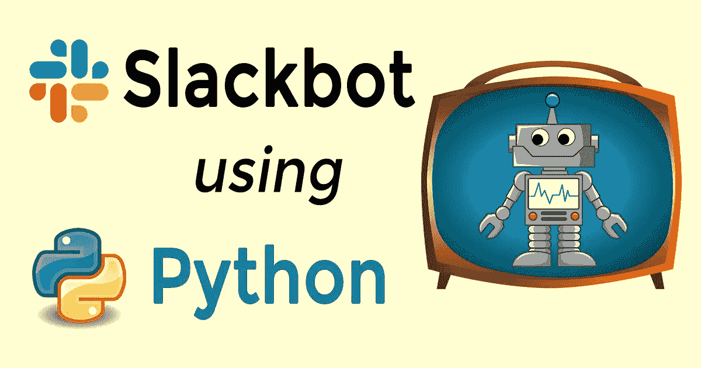
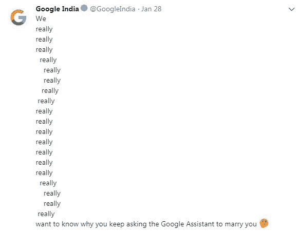
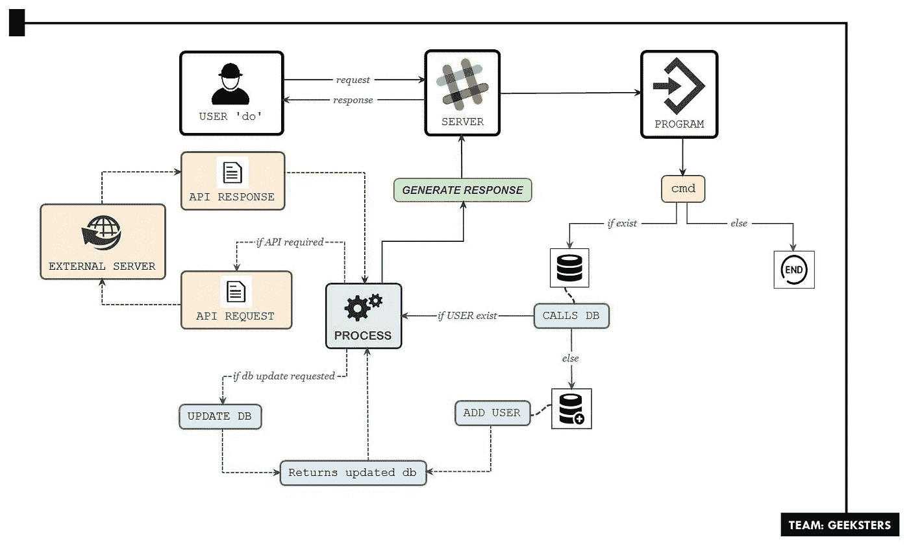
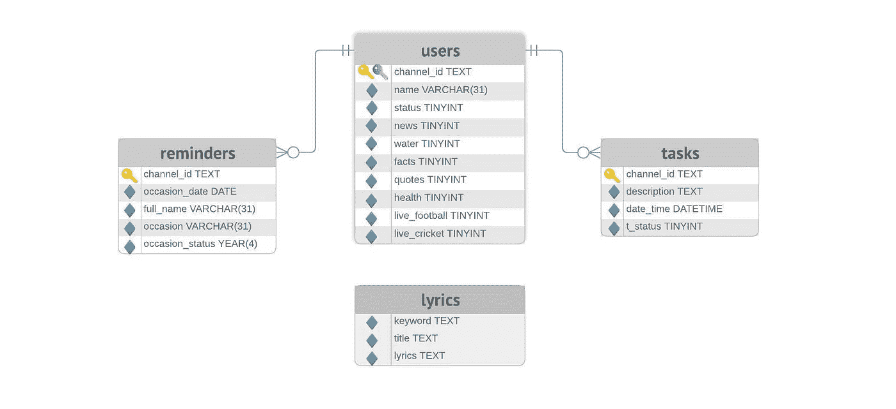
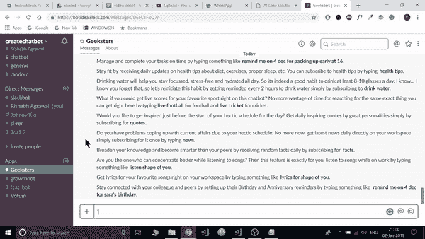
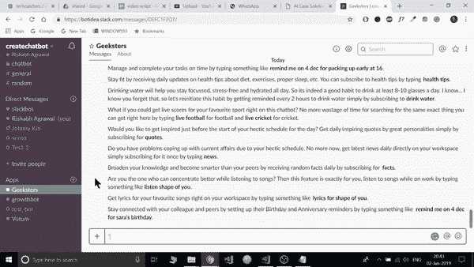
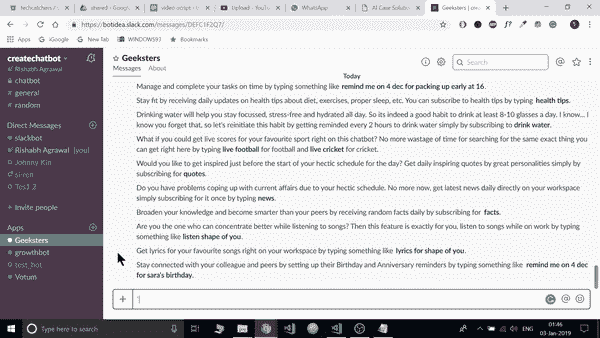
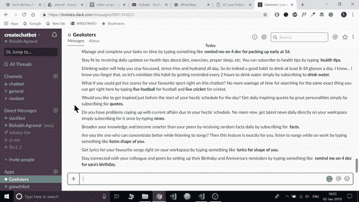
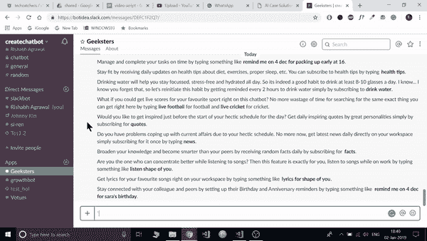

# 用 Python 构建多功能 Slackbot 的指南

> 原文：<https://medium.com/hackernoon/a-guide-to-building-a-multi-featured-slackbot-with-python-73ea5394acc>



如今，聊天机器人几乎无处不在，从社交信息平台到整合到网站中，用于订票、寻找附近的餐馆、产生线索、购买和销售产品。一些聊天机器人，如微软的 Ruuh 已经能够使用人工智能和深度学习进行类似人类的对话。

你还记得《远足》中的**娜塔莎吗？我四年前用过它，惊讶地发现她处理我们对话的方式比机器人处理得好得多。那时我还没有听说过机器学习的概念。**

现在聊天机器人让我们如此依赖它们，以至于它已经成为我们今天生活的一部分。

*“好的谷歌，提醒我 20 号发布我的聊天机器人文章”*

*“什么时候？”*

*《子夜》*

“当然，我会在周三午夜提醒你。”

聊天机器人不仅通过管理我们的任务使我们的生活变得更容易，而且与它们交谈也变得非常有趣。

*“好吧谷歌，给我讲个笑话。”*

*“这是一个刚好赶上情人节的笑话，我忘了告诉你我情人节有个约会。现在是 2 月 14 日。”*

但是所有这些都是以我们的**数据被存储和用于**公司利益为代价的。最近谷歌印度在推特上问'**为什么印度用户一直要求谷歌助理嫁给他们？**'



我们能对此做些什么吗？最有可能没有

# 如果我们能建造自己的聊天机器人会怎么样？

我们可以添加我们需要的所有功能，并根据我们的喜好进行调整。

所以，让我们建造一个聊天机器人，当它在空闲时间运行时，它将帮助你提高工作效率。我们即将构建的聊天机器人与谷歌助手相去甚远。它甚至没有语音功能。

> Slack 是一个为团队协作和相互合作而构建的消息平台。它是当今公司与员工沟通时最常用的工具。

# **入门**

让我们一起在 Slack 上建立一个聊天机器人。

***免责声明:*** *这个项目是由一个 2 人的团队为一场比赛创作的，但遗憾的是我们没能进入决赛。*

这是我们 Slackbot 的**架构**。



*Image Credit: Sweta Sharma*

这是我们的**实体关系图**，它将帮助你创建你自己的数据库。



Image Credit: Sweta Sharma

从 [GitHub](https://github.com/Techcatchers/Geeksters-Slack-Chatbot) 中克隆存储库。

在项目的`/src`目录下创建一个`.env`文件。

安装要求:

```
pip install -r requirements.txt
```

这是你的主文件: **slackbot.py.**

**slackbot.py** first 导入运行 slackbot 所需的所有包。然后，它使用存储在您的`.env`文件中的 [**slack API 密钥**](https://api.slack.com/apps?new_app=1) 启动 Slack 客户端，如下所示:

```
API_KEY=”Your Slack API Key”
```

它初始化常量并尝试与 **Slack 的 RTM API** 连接，如果未能建立连接，则返回`Connection failed with the error message printed above.`

如果连接成功，我们的 slack 客户端将无限循环运行，并尝试每秒读取是否接收到任何用户的消息，如果接收到任何消息，它将提取通道 id 和从 Slack 的 RTM API 接收到的消息文本，并进一步检查接收到的消息是否有任何可以处理以生成响应的指定命令。

# **带有代码和说明的特性**

## **歌词**

我们的用户可以通过 Slackbot 传入拼写或拼写错误的歌曲名来获取歌词。这个代码片段已经在你的 **slackbot.py** 文件中定义好了。

```
elif message.startswith("lyrics for "):get_song_name = message[11:]lyrics_gen = Song_Lyrics(settings.GCS_API_KEY, settings.GCS_ENGINE_ID)song = lyrics_gen.get_lyrics(get_song_name)response = '*' + song[0] + '*' + '\n\n' + song[1].replace('<br>','\n')
```

您需要创建一个 [**自定义搜索引擎 ID**](https://cse.google.com/cse/create/new) ，根据您的选择添加以下任意或所有网站:

*   https://genius.com/
*   http://www.lyricsted.com/
*   http://www.lyricsbell.com/
*   https://www.glamsham.com/
*   http://www.lyricsoff.com/
*   http://www.lyricsmint.com/

**注:**更多信息可以看一下[歌词提取器](https://github.com/Techcatchers/PyLyrics-Extractor) Python 库。

获得自定义搜索引擎 ID 后，获得一个 [**Google 自定义搜索 JSON**](https://developers.google.com/custom-search/v1/overview) API 密钥，一切就绪。



## **获取歌曲的音频&视频**

我们的用户可以通过在 Slackbot 上输入拼写或拼写错误的歌曲名称来获得歌曲的音频和视频版本。

这是你的 **get_music.py** 。

在导入所有依赖项后，它需要一个 [**YouTube 数据 API**](https://console.developers.google.com/apis/credentials?project=_) 来获取歌曲，并从收到的搜索结果中提取拼写或拼写错误的歌曲名称的第一个链接。

**注意:**我们已经假设我们的第一个 YouTube 搜索结果对于我们请求歌曲的用户来说是最准确的。



然后它利用 [Pafy Python 库](https://pypi.org/project/pafy/)从歌曲的视频链接中提取音频。它需要一个 [**Bitly 用户名和 Bitly API 密钥**](https://bitly.com/a/sign_in?rd=/a/oauth_apps) 来缩短为几小时内到期的流媒体音频生成的长 URL，以及缩短用于提供歌曲视频版本的 YouTube 视频链接。

**注意:**你可能会发现[这篇文章](https://www.geeksforgeeks.org/python-how-to-shorten-long-urls-using-bitly-api/)对安装 GitHub 的 Bitly 包很有用。

## **足球实况比分**

我们的用户会在每隔一段时间后收到实况足球比赛的最新比分通知。我只选择了顶级足球联赛，这些联赛可以直播英超、英冠、意甲、西甲和西甲的比赛。

我只选择了几个联赛，因为目前有许多比赛直播，发送所有直播比赛的分数对用户来说没有意义。

**注意:**这是一个基于订阅的服务，所以你需要在开始时按照我的共享模式设置一个数据库。然后，您可以使用一个 [Schedule Python 库](https://pypi.org/project/schedule/)来安排在每个设定的时间间隔后将您的实时分数发送给订阅用户。

你需要获取 [**足球数据 API**](https://www.football-data.org/client/register) 的 API 键。

你可以从[足球数据 API](https://www.football-data.org/coverage) 中提供的联赛中选择你喜欢的足球联赛。

这是你的 **football.py** 文件。

`live_football`函数获取并提取存储在`comp_id`字典中的所选联赛的实况足球比赛的实况比分，并返回实况比赛的元组列表，其中包含两队所需的信息。



当用户从 Slackbot 订阅实况足球比分时，我们的`football_res`类对象存储用户的频道 id 和我们的 slack 客户端 API 密钥，该密钥进一步验证用户的响应，并将用户选择的联赛存储在我们的数据库中，并向订阅用户发送后续确认响应，其中包含实况比赛的最新比分。

## **新闻**

我们的用户将每天更新时事和突发新闻，以便他们能够了解当前发生的最新情况。

这是你的 **news.py** 文件。

它需要一个 [**News API**](https://newsapi.org/) **键**来获取最新新闻，还需要一个 [**Bitly 用户名和 Bitly API 键**](https://bitly.com/a/sign_in?rd=/a/oauth_apps) 来缩短长 URL。

**注意:**你可能会发现[这篇文章](https://www.geeksforgeeks.org/python-how-to-shorten-long-urls-using-bitly-api/)对安装 GitHub 的 Bitly 包很有用。

它以格式化消息的形式返回带有标题、描述和新闻链接的新闻。


**注意:**这是一个基于订阅的服务，所以你需要在开始时按照我的共享模式建立一个数据库。然后，您可以使用一个 [Schedule Python 库](https://pypi.org/project/schedule/)来安排在每个设定的时间间隔后将您的实时分数发送给订阅用户。

## **任务**

我们的用户可以在 Slackbot 中安排任务，它会提醒他们在设定的日期和时间完成设定的任务。这将帮助我们的用户管理和按时完成任务，从而提高他们的工作效率。

这是我们的 **task.py** 文件。

如果用户消息以“提醒我”开始，那么我们的`parse_tasks`函数从接收到的用户消息中提取**日期、任务描述和时间**，并验证所提供的日期和时间是否有效。

如果一切都解析正确，那么任务将存储在我们数据库的**任务表中，我们的用户将收到一条确认消息，让他们知道任务已设置了事件的格式化日期和时间。**



**注意:**您需要在开始时按照我的共享模式在您的数据库中建立一个任务表。当当前日期和时间等于设定的日期和时间时，将任务发送给指定的用户。

## **提醒**

用户可以为同事和朋友的生日和纪念日设置提醒。这将有助于他们保持联系，保持沟通。

这是我们的 **reminder.py** 文件。

我们的提醒模块的工作类似于任务，但**唯一的区别是提醒每年发送，而任务只在设定的日期和时间发送一次**。

如果用户消息以“提醒我打开”开始，并且不包含时间，那么我们的`parse_reminders`函数从接收到的用户消息中提取**日期&提醒**，并验证所提供的日期是否有效。

如果一切都解析正确，那么提醒会存储在我们数据库的**提醒表中，我们的用户会收到一条确认消息，让他们知道该提醒设置了该场合的格式化日期。**



**注意:**您需要在开始时按照我的共享模式在您的数据库中设置一个提醒表。当当前日期等于设定日期时，则每年向指定用户发送提醒。

# **结论**

唷！我们终于走到了尽头。祝贺你构建了自己的 Slackbot，它提供了一些很棒的特性。这里是我的 [Slackbot Github 库。](https://github.com/Techcatchers/Geeksters-Slack-Chatbot)

Slackbot 中提供了许多特性，比如**事实、引用**，我在本文中没有讨论这些特性，因为它们的实现非常简单。还有一个`help` **命令提供给我们的用户**，在这里他们可以了解所有可用的特性和分配给他们的命令。

如果你在这个开源社区做出贡献，让这个 [Slackbot](https://github.com/Techcatchers/Geeksters-Slack-Chatbot) 变得更好，我会很高兴审查你的请求。

此外，一定要查看我的[歌词提取器](http://bit.ly/lyrics-extractor) Python 库，只需输入拼写或拼写错误的歌曲名称就可以获得歌词。

## 非常感谢你花时间阅读这篇文章！如果你喜欢它，请给它一些掌声，因为它会帮助更多的人看到这个故事。如果你喜欢这个项目，可以看看 GitHub 上的这个资源库。❤