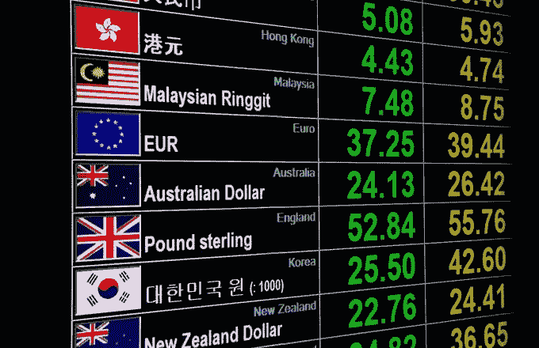
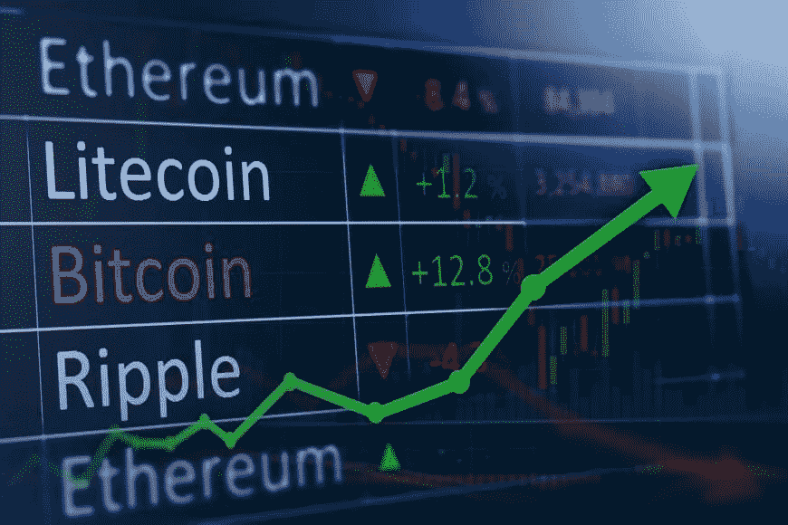

# 加密货币和外汇交易指南

> 原文：<https://medium.com/hackernoon/a-guide-to-cryptocurrency-and-forex-trading-af9adcd05db0>

如今，人们通过不同的方式交易外汇和金融领域的其他资产。随着通过使用区块链引入不同的加密货币，交易平台呈现出完全不同的面貌。

传统上，外汇交易平台在不太远的过去有各种各样的困难和挑战。然而，在区块链技术平台上运行的不同加密货币似乎提供了解决方案。为了充分阐明这一点，重要的是要考虑什么是区块链技术。

**什么是区块链技术？**

顾名思义，区块链技术是一系列链接在一起的模块，并通过公开的分类帐提供。该分类帐分布在该技术的网络上的用户中。区块链网络非常有益，原因有几个:

数据的安全性

不可变分类帐

快速交易

全球覆盖

增加金融安全

**什么是外汇交易？**

这是一个分散的全球市场，来自世界各地不同人的不同货币在这里交易。通过不同的外汇交易平台，每天有超过 5 万亿美元的交易。外汇市场，或者更好的说法是货币交易所，是世界上流动性最强的市场。

通过外汇交易及其不同的交易平台，存在包括利益相关方盈利的投资机会。你完全可以在短时间内从一个完全的新手变成一个专业的外汇交易员。要做到这一点，你需要在网上外汇交易平台交易。

**什么是外汇交易平台？**

通过这些平台，你可以在世界任何地方进行货币兑换。通过外汇交易平台，您可以交易您喜欢的货币。

你可以通过几个平台进行交易。交易平台现在有不同的经验丰富的交易员，可以指导你的交易模式，以获得最佳结果。有许多有用的顶级信息可以提高你的交易知识。

**加密货币交易**

与金融资产或传统货币不同，加密货币是完全去中心化的数字货币。他们在区块链技术平台上工作，有各种用途。

这些加密货币不受任何中央管理员的控制。这使得不同加密货币的实用性增加，并且用于不同的目的。

不同加密货币的交易与传统的交易方式截然不同。加密货币交易平台使用不同的加密货币进行交易，而不是使用传统的法定货币进行交易。加密货币交易平台也运行在区块链技术平台上。

众所周知的加密货币比特币是世界上交易量最大的加密货币之一。学习如何交易比特币和其他加密货币对你来说是一项强大的技能。由于在外汇交易平台上盈利基本上取决于价格差异，加密货币和数字资产以其波动性和不断变化的价格而闻名。如果你能明白什么该买，什么该卖，你就能很好的获利。

比特币的交易早在 2009 年就开始了。当时，比特币的价值约为美分，如果早期买家现在决定出售，他们现在可能会赚上百万美元。通过加密货币交易，许多交易者今天已经成为百万富翁。

**如何在交易平台上交易加密货币？**

与传统的外汇交易平台类似，加密货币交易平台是为了加密货币的交易和交换而存在的。在双方之间，加密货币交易可以通过用另一种加密货币交换加密货币来进行。也可以通过用法定货币交换加密货币来实现。所有这些都取决于交易平台和制定的政策。

另一种值得注意的交易加密货币的方式是通过加密[合约的差价](/@WarriorTrading/cfd-account-definition-day-trading-terminology-10ff868877d8)(差价合约)。通过这种方法进行交易，您可以通过首选的加密货币经纪人或比特币交易经纪人进行交易。通过差价合约方法，你不一定要有任何加密货币进行交易。使用差价合约进行交易有很多好处。其中一些包括交易者的加密货币交易活动的更大利润。此外，你不必担心你的数字货币的安全性和存储。

**在线寻找合适的经纪人**

有几个顶级的在线经纪人，你可以信任你的加密货币交易活动。找到合适的经纪人和合适的在线交易平台是主要问题。

与可信可靠的加密货币经纪人签约非常重要。通过访问安全交易平台上的各种数字资产和货币，您可以直接进行外汇和加密货币交易。

这是非常重要的，你注册一个顶级经纪人为您的网上交易行动的成功。经纪人为您提供有效和成功的外汇和货币交易活动所需的一切。提供的优势包括

访问图表和分析工具

交易教育资源的深度

压力较小的银行流程

独特的交易偏好和交易方式

有管理经纪人活动的交易所经纪人管理机构。你可以放心，不同的活动由你的首选交易所经纪人进行。你可以获得[在线经纪人评论](https://trustedbrokerz.com/broker-reviews/)在线交易所经纪人，你可以信任你的交易活动。

**包装完毕**

交易交换平台种类繁多，这些平台上有大量注册经纪人，因此选择一个值得信赖的在线交易经纪人非常重要。你应该总是寻找一个透明和安全的交易平台。这也可以有一个多语言服务，有广泛的可交易资产和货币的选择。

此外，你必须记住，你的交易行为会带来双方的利润和一些损失。你应该能够承受这些损失，并在利润到来时享受它。

交易愉快！