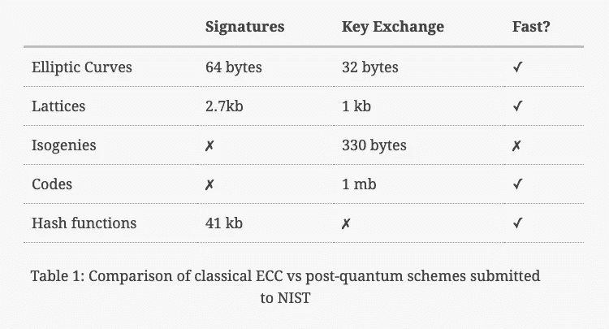
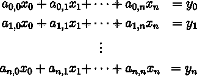
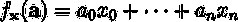
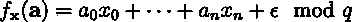
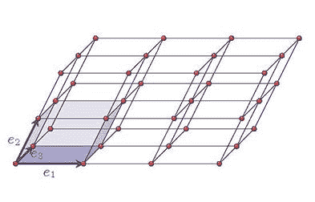
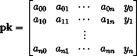
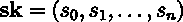
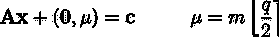
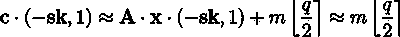

# 后量子密码术指南

> 原文：<https://medium.com/hackernoon/a-guide-to-post-quantum-cryptography-d785a70ea04b>

> 这篇文章由本·佩雷兹撰写，最初发表在比特博客的 T2 小道上。在作者的许可下，它被重新出版，并包含了来自国际扶轮实验室研究人员的附加注释。

对于许多高保证应用程序，如 TLS 流量、医疗数据库和区块链，前向保密是绝对必要的。这不足以阻止攻击者立即解密敏感信息。在这里，威胁模型包括这样的情况，其中对手可能在收集密文后花费许多年来解密密文。一个潜在的破解秘密的方法是，计算能力的提高和数论的突破相结合，使得攻击当前的密码学变得容易。然而，除非有人找到分解大整数的多项式时间算法，否则这种风险对于当前的最佳实践来说是最小的。我们应该更关心量子计算机的成功开发，因为这样的突破会让我们今天使用的大部分加密技术变得不安全。

# 量子计算入门

[量子计算机不仅仅是大规模并行经典计算机](https://www.scottaaronson.com/papers/npcomplete.pdf)。人们通常认为，由于一个量子位可以同时占据 0 和 1，那么一台 n 位量子计算机可以同时处于 2n 个状态，因此可以极快地计算 NP 完全问题。事实并非如此，因为测量一个量子态会破坏许多原始信息。例如，一个量子系统完全知道一个物体的动量和位置，但是任何动量的测量都会破坏关于位置的信息，反之亦然。这就是所谓的[海森堡测不准原理](https://en.wikipedia.org/wiki/Uncertainty_principle)。因此，成功的量子算法由一系列量子位的转换组成，这样，在计算结束时，测量系统的状态不会破坏所需的信息。事实上，[已经证明](https://arxiv.org/pdf/quant-ph/9701001.pdf)不可能存在一个量子算法同时尝试一些 NP 完全问题的所有解并输出正确的输入。换句话说，任何解决经典难题的量子算法都必须利用手头问题的特定结构。今天，有两种这样的算法可以用于密码分析。

快速分解大数的能力将会破坏 RSA 和基于离散对数的密码术。整数因式分解最快的算法是通用数域筛，它以亚指数时间运行。然而，在 1994 年，Peter Shor 开发了一种用于整数因式分解的量子算法( [Shor 的算法](https://www.scottaaronson.com/blog/?p=208)),该算法在多项式时间内运行，因此能够破解任何 RSA 或基于离散对数的密码系统(包括那些使用椭圆曲线的系统)。这意味着，如果有人要建造量子计算机，所有广泛使用的公钥密码学都是不安全的。

第二种是 Grover 算法，能够在 O(√n)时间内求逆函数。该算法将通过一个根因子来降低对称密钥加密的安全性，因此 AES-256 将仅提供 128 位的安全性。类似地，寻找一个 256 位散列函数的前映像只需要 2128 次。由于将散列函数或 AES 的安全性提高两倍并不是很麻烦，因此 Grover 的算法不会对对称加密造成严重威胁。此外，除了 Grover 算法导致的 O(√n)因子之外，量子计算机的发明不会影响任何一个建议用于加密的伪随机数发生器。

# 后量子算法的类型

后量子密码术是对可以在经典计算机上运行，但是即使对手拥有量子计算机也是安全的密码系统的研究。最近， [NIST 启动了](https://csrc.nist.gov/Projects/Post-Quantum-Cryptography)后量子加密标准化进程，目前正在审核第一轮申请。其中最有前途的包括基于格、同源、散列函数和代码的密码系统。

在更深入地研究每一类提交之前，我们简要总结了每种类型的密码系统固有的权衡，并与当前(非后量子时代)的椭圆曲线密码系统进行了比较。请注意，代码和同源能够产生数字签名，但没有向 NIST 提交这种方案。

在安全性证明方面，上述密码系统都没有归结为 NP 难(或 NP 完全)问题。在格和码的情况下，这些密码系统是基于 NP 困难问题的轻微修改。基于散列的构造依赖于好的散列函数的存在，并且不做任何其他加密假设。最后，基于同源的密码学是基于一个被推测为困难的问题，但与 NP 困难问题或先验密码学假设不同。然而，值得一提的是，正如我们无法证明任何经典算法在多项式时间内是不可破解的(因为 P 可能等于 NP)，被认为对量子计算机来说很难的问题可能并不是如此。此外，一个密码系统不能归结为某个 NP 难或完全问题，本质上不应该成为反对它的标志，因为整数因式分解和离散对数问题不被认为是 NP 完全的。

# 格子

在后量子密码术的所有方法中，格是研究最活跃和最灵活的。它们具有很强的安全性，能够进行密钥交换、数字签名和更复杂的结构，如[全同态加密](https://blog.cryptographyengineering.com/2012/01/02/very-casual-introduction-to-fully/)。尽管格密码系统的优化和安全证明都需要极其复杂的数学，但基本思想只需要基本的线性代数。假设你有一个形式的线性方程组

求解`**x**`是一个经典的线性代数问题，可以使用高斯消去法快速求解。另一种思考方式是我们有一个神秘的函数，

在给定一个向量`**a**`的地方，我们看到了`**ax**`的结果，而不知道`**x**`。查询这个函数足够多次后，我们可以在短时间内学习`f`(通过求解上面的方程组)。这样我们就可以把一个线性代数问题重新架构成一个机器学习问题。

现在，假设我们在函数中引入少量噪声，这样在将`**x**`和`**a**`相乘后，我们会添加一个误差项`**e**`，并对一个(中等大小的)质数`q`取模，从而减少整个运算。那么我们嘈杂的神秘函数看起来像

学习这个嘈杂的神秘函数已经被数学证明是极其困难的。直觉上，我们在无噪声情况下使用的高斯消去法中的每一步，误差项都会变得越来越大，直到它掩盖了关于函数的所有有用信息。在密码学文献中，这被称为带有错误的[学习](https://cims.nyu.edu/~regev/papers/lwesurvey.pdf)问题(LWE)。

基于 LWE 的密码术被称为基于格的密码术的原因是因为 LWE 是困难的证明依赖于这样一个事实，即在称为格的东西中寻找最短向量是 NP 困难的。我们不会在这里深入研究格子的数学，但是我们可以把格子想象成 n 维空间的镶嵌

格子由坐标向量表示。在上面的例子中，通过组合`**e1**`、`**e2**`和`**e3**`(通过法向量加法)可以到达网格中的任何一点。最短向量问题(SVP)说:给定一个格，找出作为向量的长度最短的元素。这很难的直观原因是，对于一个给定的晶格，并不是所有的坐标系都同样容易处理。在上面的例子中，我们可以用三个坐标向量来表示晶格，这三个坐标向量非常长并且非常靠近，这使得寻找靠近原点的向量更加困难。事实上，有一种规范的方法可以找到一个格的“最坏可能”表示。当使用这种表示时，最短向量问题被认为是 NP 难的。

在讨论如何使用 LWE 制造抗量子密码之前，我们应该指出 LWE 本身并不是 NP 难的。它不是直接还原到 SVP，而是还原到 SVP 的近似值，这实际上被推测为*而不是*是 NP 难的。尽管如此，目前还没有多项式(或次指数)算法来求解 LWE。

现在让我们用 LWE 问题来创建一个实际的密码系统。最简单的方案是由 Oded Regev 在他的[原始论文](https://cims.nyu.edu/~regev/papers/qcrypto.pdf)中创建的，证明了 LWE 问题的难度。这里，密钥是一个 n 维向量，具有整数项 mod `q`，即上面提到的 LWE 秘密。公钥是前面讨论的矩阵`**A**`，以及 LWE 函数的输出向量

这个公钥的一个重要属性是，当它乘以向量`(**-sk**,1)`时，我们得到的是误差项，大概是`0`。

为了加密一位信息`m`，我们取`**A**`的随机列之和，如果`m`为`0`则加 0，如果`m`为`1`则加`q/2`，将`m`编码在结果的最后一个坐标中。换句话说，我们选择一个 0 或 1 的随机向量`**x**`,然后计算

直观地说，我们刚刚计算了 LWE 函数(我们知道它很难破解),并在这个函数的输出中编码了我们的位。

解密之所以有效，是因为知道了 LWE 秘密，接收者就能得到消息，外加一个小的误差项

当误差分布选择正确时，它绝不会使信息失真超过`q/4`。接收器可以测试输出是否更接近`0`或`q/2 mod q`，并相应地解码该位。

这个系统的一个主要问题是它有非常大的密钥。仅加密一位信息需要安全参数中大小为 n2 的公钥。然而，格密码系统的一个吸引人的方面是它们非常快。

自从 Regev 的原始论文以来，围绕基于格的密码系统已经有了大量的工作。提高其实用性的一个关键突破是环 LWE 的发展，这是 LWE 问题的一个变种，其中密钥由某些多项式表示。这导致了密钥大小的二次减少，加速了加密和解密，只使用`n*log(n)`操作(使用快速傅立叶技术)。

在 NIST PQC 标准考虑的许多基于格的密码系统中，两个特别值得一提的是 Crystals 构造， [Kyber](https://pq-crystals.org/kyber/) 和 [Dilithium](https://pq-crystals.org/dilithium/index.shtml) 。

Kyber 是一种密钥封装机制(KEM ),它遵循与上述系统类似的结构，但使用一些奇特的代数数论来获得比环 LWE 更好的性能。对于合理的安全参数，密钥大小约为 1kb(仍然很大！)但是加密和解密时间大约为 0.075 毫秒。考虑到这个速度是在软件中实现的，凯伯 KEM 似乎有希望用于后量子密钥交换。

Dilithium 是一种基于类似于 Kyber 技术的数字签名方案。它的细节超出了这篇博文的范围，但值得一提的是，它也实现了相当好的性能。公钥大小约为 1kb，签名为 2kb。它也很有表现力。在 Skylake 处理器上，计算一个签名所需的平均周期数约为 200 万。验证平均花费 390，000 个周期。

# 编码

纠错码的研究在计算机科学文献中有很长的历史，可以追溯到 Richard Hamming 和 Claude Shannon 的开创性工作。虽然在一篇简短的博客文章中，我们甚至不能开始触及这个[深层领域](https://www.cs.cmu.edu/~venkatg/teaching/codingtheory/)的表面，但我们给出了一个快速的概述。

当传送二进制消息时，错误可能以比特翻转的形式出现。纠错码以牺牲消息的紧凑性为代价，提供了承受一定数量的比特翻转的能力。例如，我们可以通过将 0 编码为 000，将 1 编码为 111 来防止单比特翻转。这样，接收方可以通过三位的多数表决来确定 101 实际上是 111，或者 001 是 0。不过，这种代码不能纠正两位翻转的错误，因为 111 变成 001 将被解码为 0。

最主要的纠错码类型被称为线性码，可以用`k x n`矩阵表示，其中`k`是原始消息的长度，`n`是编码消息的长度。一般来说，在不知道基本线性码的情况下，解码消息在计算上是困难的。这种硬度支撑着 [McEliece 公钥密码系统](http://www.math.unl.edu/~s-jeverso2/McElieceProject.pdf)的安全性。

在高层次上，McEliece 系统中的密钥是一个随机码(表示为矩阵`**G**`),来自一类称为 [Goppa 码](https://en.wikipedia.org/wiki/Goppa_code)的码。公钥是矩阵`**SGP**`，其中`**S**`是具有二进制元素的可逆矩阵，`**P**`是置换。为了加密消息`**m**`，发送者计算`**c = m(SGP) + e**`，其中`**e**`是一个随机错误向量，精确地表示代码能够纠正的错误数量。为了解密，我们计算`**cP-1 = mSG + eP-1**`，使得`**mS**`是`**G**`的码字，它可以纠正添加的误差项`**e**`。通过计算`**mSS-1**`可以很容易地恢复该消息。

像格子一样，基于代码的密码术受到密钥是大矩阵的事实的影响。使用[推荐的安全参数](http://pqcrypto.eu.org/docs/initial-recommendations.pdf)，McEliece 公钥大约为 1 mb，私钥为 11 kb。目前[正在进行的工作](https://eprint.iacr.org/2012/409.pdf)试图使用一类特殊的码，称为准循环中密度奇偶校验码，它可以比 Goppa 码更简洁地表示，但是这些码的安全性不如 Goppa 码研究得好。

# 同源基因

椭圆曲线加密领域因使用了相当多的神秘数学而有些臭名昭著。同源基因把这带到了一个全新的水平。在椭圆曲线加密中，我们使用 Diffie-Hellman 类型的协议来获取共享的秘密，但是我们不是将群元素提升到某个幂，而是遍历椭圆曲线上的点。在基于同源的密码术中，我们再次使用 Diffie-Hellman 类型的协议，但是不是遍历椭圆曲线上的点，而是遍历椭圆曲线本身的序列。

*出自* [*基于超奇异同源的密码学介绍*](https://ecc2017.cs.ru.nl/slides/ecc2017school-costello.pdf)

*同源*是将一条椭圆曲线转换成另一条椭圆曲线的函数，使得第一条曲线的群结构反映在第二条曲线中。对于那些熟悉群论的人来说，它是一个群同态，带有一些[添加的结构来处理每条曲线](https://en.wikipedia.org/wiki/Morphism_of_algebraic_varieties)的几何形状。当我们把注意力限制在[超奇异椭圆曲线](https://en.wikipedia.org/wiki/Supersingular_elliptic_curve)(这里不做定义)时，保证每条曲线都有固定数量的从它到其他超奇异曲线的同源。

现在，考虑通过从我们的起始曲线检查这个形式的所有同源，然后从那些曲线检查所有同源，等等而创建的图。这个图被证明是高度结构化的，如果我们从第一条曲线开始随机行走，碰到其他特定曲线的概率可以忽略不计(除非我们采取指数级的许多步骤)。在数学术语中，我们说通过检查所有这些同源生成的图是一个[扩展图](https://people.seas.harvard.edu/~salil/pseudorandomness/expanders.pdf)(也是 [Ramanujan](https://mast.queensu.ca/~murty/ramanujan.pdf) )。这种扩展特性正是基于同源的密码术安全的原因。

对于[超奇异同源 Diffie-Hellman](https://en.wikipedia.org/wiki/Supersingular_isogeny_key_exchange) (SIDH)方案，密钥是同源链，公钥是曲线。当 Alice 和 Bob 组合这些信息时，他们获得不同的曲线，但是具有相同的 [j 不变量](https://en.wikipedia.org/wiki/J-invariant)。对于密码学来说，j 不变量是什么并不重要，重要的是，一旦 Alice 和 Bob 完成了密钥交换，他们就可以很容易地计算出 j 不变量。

与其他后量子方案相比，基于同源的密码术具有极小的密钥大小，仅使用 330 字节的公钥。不幸的是，在本文讨论的所有技术中，它们是最慢的，[密钥生成和共享秘密计算都需要 11-13 毫秒](https://blog.cloudflare.com/sidh-go/)。然而，它们支持完美的前向保密性，这是其他后量子密码系统所不具备的。

# 基于哈希的签名

已经有许多[友好地介绍了基于散列的签名](https://blog.cryptographyengineering.com/2018/04/07/hash-based-signatures-an-illustrated-primer/)，所以我们保持对它们的讨论在相当高的层次上。简而言之，散列签名使用散列函数的输入作为秘密密钥，输出作为公共密钥。这些密钥只对一个签名有效，因为签名本身揭示了部分密钥。这种基于哈希的签名的极端低效导致了使用 [Merkle 树](https://en.wikipedia.org/wiki/Merkle_tree)来减少空间消耗(是的，比特币中使用的是相同的 Merkle 树)。

不幸的是，不可能从散列中构造出 KEM 或公钥加密方案。因此，基于哈希的签名不是一个完整的后量子密码解决方案。此外，它们不节省空间；一个更有前途的签名方案， [SPHINCS](https://sphincs.cr.yp.to/sphincs-20150202.pdf) ，产生 41kb 的签名和 1kb 的公钥/私钥。另一方面，基于散列的方案速度极快，因为它们只需要计算散列函数。它们还具有非常强的安全性证明，仅仅基于存在抗冲突和抗原像的散列函数的假设。由于没有迹象表明当前广泛使用的散列函数(如 SHA3 或 BLAKE2)容易受到这些攻击，因此基于散列的签名是安全的。

# 外卖食品

后量子密码术是一个令人难以置信的令人兴奋的研究领域，在过去的十年里取得了巨大的发展。虽然这篇文章中描述的四种类型的密码系统已经得到了很多学术上的关注，但没有一种被 NIST 批准，因此还不推荐普遍使用。许多方案在其原始形式下并不具有高性能，并且已经进行了各种优化，这些优化可能会也可能不会影响安全性。事实上，为 McEliece 系统使用更节省空间的代码的几次尝试已经被证明是不安全的。照目前的情况来看，要从后量子密码系统获得最佳的安全性，需要牺牲一些空间或时间。就灵活性而言，基于环格的加密是最有前途的工作方式(签名和 KEM，以及全同态加密)，但它所基于的假设只是在几年前才得到深入研究。现在，最安全的赌注是使用 McEliece 和 Goppa 码，因为它经受住了几十年的密码分析。

然而，每个用例都是独特的。如果你认为你可能需要后量子密码学，[与你友好的邻居密码学家联系](https://www.trailofbits.com/contact/)。其他人应该等到 NIST 完成标准化进程。

— — — — — — — — — — — — — — — — — — — — — — — — — — — — — — —

# **注意事项**

不仅如此，关键不是量子计算和计算机，而是后量子密码术，它依赖于经典计算，在今天也非常适用(作为一种预防措施，这样量子计算机的可能出现就不会危及密码术)。在这篇文章中，格、码、同源、基于散列的签名都得到了很好的解释，但是，有几个问题我们觉得应该提出来。

# **评论**

1.“量子系统完全知道物体的动量和位置”——这似乎是一个可疑的说法。这个想法在 20 世纪 20-30 年代确实存在，它被称为隐藏变量理论，但是，有大量的实验表明这些理论不起作用。根据更现代的观点，关于动量和位置的完整知识是不存在的。

2.“除非有人找到分解大整数的多项式时间算法，否则对于当前的最佳实践来说，这种风险是最小的”——现在很少使用加密分解(RSA)。几乎所有的非对称加密都与离散对数化问题有关。

3.“快速分解大数的能力会破坏 RSA 和基于离散对数的密码学”——这与上一段中的观点一致。快速看了一下，好像没那么简单(可能有我们不知道的)。从参考文献中，我们找到了 Eric Bach 的作品“离散对数和因式分解”，他在其中做出了类似的陈述，但关于不同的事情:因式分解，从我们的理解来看，并没有解决一般情况下(如实践中)群序是大素数的情况。因此，在讨论这个问题时，也许需要稍微谨慎一点。在量子计算的情况下，你真的可以使用相同算法(Shor 算法)的修改来寻找周期例程，但是对于一般的经典任务简化来说，这是值得怀疑的。

4.作者经常提到 NP-hard 类和关于多项式计算时间的推理。这些结构很漂亮，但现在或多或少地清楚了，在密码学中应该小心使用它们。我们对一般复杂的问题更感兴趣，而不是那些复杂的问题只是偶尔出现。此外，即使问题可以在多项式时间内解决，但多项式的次数非常大，在实践中问题仍然是不可解的，可以用于密码学。