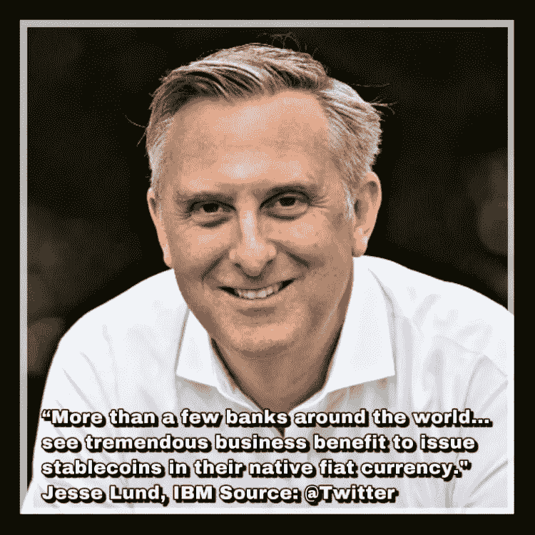
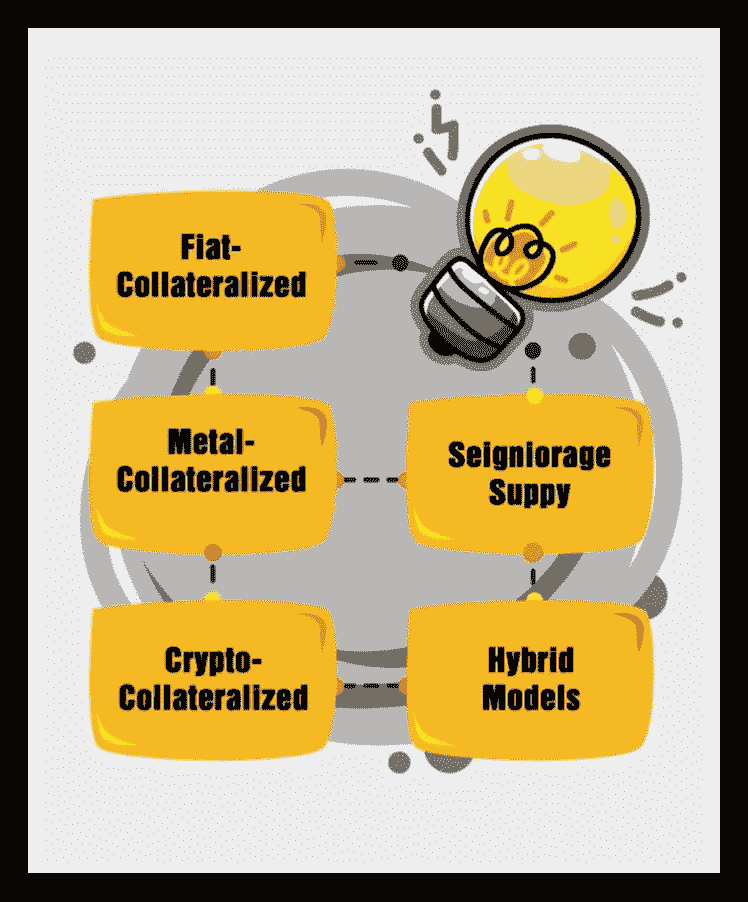
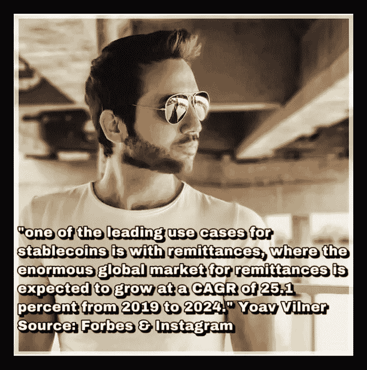
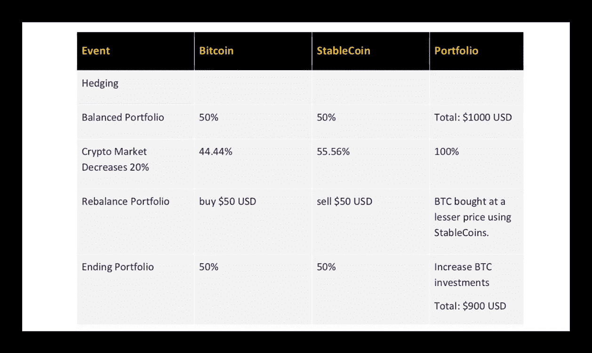
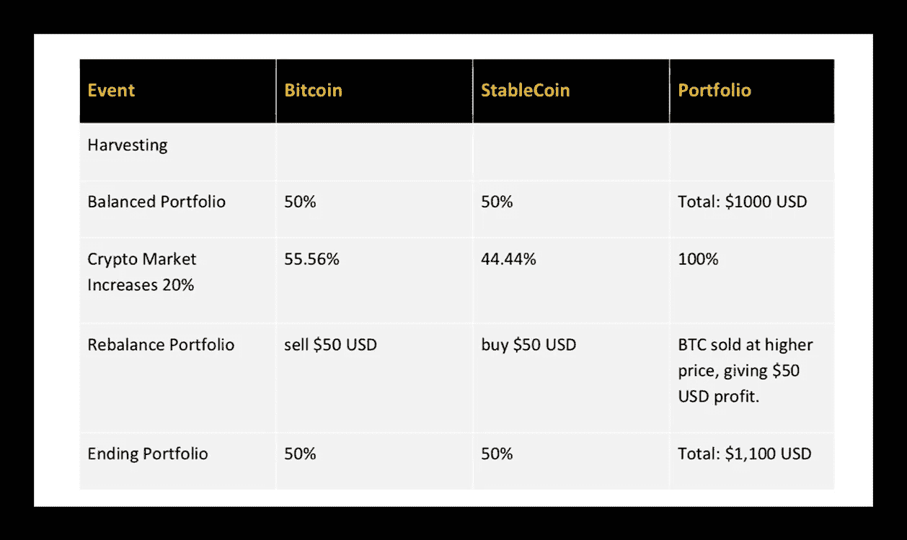

# 使用 StableCoins 增加和保护您的资产指南

> 原文：<https://medium.com/hackernoon/a-guide-to-using-stablecoins-to-increase-and-protect-your-assets-9fac28be1a5d>

# 2019 完整版稳定币指南

第 7 部分，共 7 部分

当 [cREAtiveCastleStudios](http://cREAtiveCastleStudios.com) 的 Kyle Rea 完成图形时，请欣赏我书中的短片！

如果你没有读过我的书的第一部分，你可以在这里赶上[。](/@alyzesam/2019-complete-stablecoin-guide-3f77896fb4ad)

# 稳定币定义。

简单来说，稳定币是一种与另一种资产挂钩的加密货币。或者，一种完全与中央实体无关的全球数字货币。稳定货币有助于加密货币的实际使用，因为它允许安全、便捷的交易，而没有传统加密货币的高波动性。

> 现在让我们继续…

# 稳定存款的类型:资产抵押与非抵押

# 资产抵押债券。

大多数国家使用的社会认可的货币被称为'*法币*，字面意思是'*不费力就创造出来的东西*。“直到 1971 年，世界货币都是由黄金支撑的。在印刷货币之前；钻石、白银、黄金、土地、地产和其他商品被用作易货交易的手段。从资产担保货币向当前法定货币体系的转变，让中央银行、政府、金融技术专家、私人实体和经济专家有了资产担保稳定货币的概念。这些特定的稳定货币旨在将区块链上的稳定资产标记为数字货币，以实现快速、安全和稳定的日常交易。**该类别的稳定币应保证 1 : 1 兑换其基础资产的稳定币。**

# 无抵押稳定债券。

一种观点认为，菲亚特没有任何有形资产的支持，因此；为什么加密货币只应该有作为资产支持货币的价值？一种相反的观点认为，货币只需要有一个公认的“价值”就能成功。非*抵押的稳定存款*作为一种媒介产生。此类数字货币没有任何“*真实世界*”或加密货币资产的支持；而是通过其用户保持某一值的期望来保持值。目前唯一提到的*非抵押*方法是[铸币税供应(算法)稳定货币模型。](/@alyzesam/seigniorage-supply-algorithmic-stablecoins-w-complete-list-e1c98db3b9da)

The graphics are getting done… I swear.

# 每个类别都细分了

我把稳定的硬币分成了三个不同的类别。三个是*资产抵押* d，一个是*非抵押*，剩下的一组是*混合型*类别。这是希望对我们所有人有一个更简单的理解。

*第一笔资产——抵押资产****——抵押资产*** *。我的中刊是* [*这里的*](/@alyzesam/fiat-collateralized-stablecoins-68a63b042cbb) *。*

*其次，我们介绍了* ***法定抵押债券。*** *那篇文章可以查看* [*这里*](/@alyzesam/crypto-collateralized-stablecoins-w-complete-guide-74e261f34b1b) *。*

然后我们稍微改变了一下，参观了唯一的非抵押 [**稳定硬币类别，铸币税供应(算法)稳定硬币模型**](/@alyzesam/seigniorage-supply-algorithmic-stablecoins-w-complete-list-e1c98db3b9da) 。在此欣赏对未来货币模型[的描述。](/@alyzesam/seigniorage-supply-algorithmic-stablecoins-w-complete-list-e1c98db3b9da)

接下来是资产抵押组中一个简单易懂的类别；**金属抵押债券**与一长串有前途的项目一起在这里[找到](/@alyzesam/a-simple-understanding-to-hybrid-stablecoins-with-2019-complete-guide-2a9b55af1de2)。

最后是一个简短的故事，把所有的事情和我们的**混合稳定连接**类别联系在一起。在此找到这个令人兴奋的项目列表和描述[。](/@alyzesam/a-simple-understanding-to-hybrid-stablecoins-with-2019-complete-guide-2a9b55af1de2)

> 现在如何处理这些东西…

# 如何使用 StableCoins 保护您的资产？

我在这本电子书中收集的信息会让读者对他们的稳定知识充满信心。穆罕默德·塔希尔·乌尔·卡德里说， ***“如果知识不付诸实践，它不会给一个人带来好处。”***

## 作为一个受过教育的人，你可以做一些事情，这样你新获得的智慧和时间就不会浪费。

*   **快速交易法币到加密货币**。几乎所有现存的交易所都允许加密交易。很少有交易所允许你直接用密码交易菲亚特。这就是 StableCoins 在当今数字货币交易市场中特别有益的地方。许多 StableCoins 与 fiat 1:1 等价，因此，投资者几乎可以立即出售 StableCoins 的密码，并快速交易到 fiat，而无需离开首选的加密货币交易所。
*   **成为金融科技领域的第一人**。毫无疑问，数字货币是未来。米尔顿·弗里德曼(Milton Friedman)，1976 年诺贝尔经济学奖获得者，因其对消费分析、货币历史、理论和稳定政策的复杂性的研究而被引用，“我认为互联网将成为减少政府作用的主要力量之一。现在缺少但很快就会被开发出来的东西是一种可靠的电子现金。”。StableCoins 的日常使用允许与 fiat 进行无风险、可互换的支付，但具有安全和数字优势。StableCoins 可以方便使用，引起同行的注意。StableCoins 随后可以被用作加密货币的教育桥梁，因为区块链技术从其婴儿期开始继续发展。
*   **使用稳定的硬币来保护你的资产**。使用“**止损**”、“**套期保值**”和“**收获**”策略将在以下几页详细讨论。

# 如何用“止损法”保护自己的资产？

交易时，准确把握一个市场的时间很难，更不用说两个了。任何人都不想看到投资利润在眼前消失。

## 对于不太先进的密码交易员；

“典型的”加密货币兑换步骤如下:

*   通过集中的法定货币到加密货币交换平台获得比特币或顶级替代币。(允许存款)
*   将加密货币转移到首选数字货币交易交易所。
*   交易、获得、交换等。在优先交易交易所。
*   在波动的市场中，用新获得的密码进行交易或保护资产；在首选交易交易所将密码交易回比特币或顶级替代币。
*   将加密货币转移到中央加密货币对法定货币交易所。(允许提款)
*   在交易所出售比特币或 Altcoin，并提取到您的银行账户。
*   等待银行转账 3-7 天。

> 每次交换/转移/交易/购买/出售的额外费用

# 止损方法已定义。

**要在动荡的加密货币市场中止损，只需将数字货币换成稳定的货币。**

> 利用“对冲”和“收获”(下面讨论)在下跌的市场中获利。

Source; https://www.reddit.com/r/Bitcoin/comments/au99gp/bart_is_that_you_again/?utm_source=share&utm_medium=ios_app

# 举例。

如果比特币迎来了它的“巴特图”时刻。(*见图*)每两到三分钟，总数值变化 10%到 20%。在等待比特币从一个交易所转移到另一个交易所的过程中，投资组合可能会受到冲击。

通常只需要 10 分钟就可以完成转账。也就是说，除非 exchange 平台的数据量很大，并且需要额外的五分钟来处理发送。如果交易所被备份，比特币网络也有可能被备份，这可能会使每笔交易增加五分钟或更多时间。

> 我们都经历过这种情况…当交易所等待足够多的确认来认为它被批准时，你不断刷新页面。现在你可以开始用它换菲亚特了！现在你的利润是安全的！
> 
> 这里几分钟，那里几分钟……加起来就是了。在这 10 到 20 分钟，也许 30 分钟内，比特币的价格发生了什么变化？很多。
> 
> 一条“鲸鱼”，中国的另一条禁令，或者美国消费者新闻与商业频道报道“比特币今天(又)死了”，都可能让你的投资组合缩水 30%。

稳定的收入虽然肯定不能保证保值，但却是一种更有可能巩固利润的方式。在市场下跌时使用它们作为止损的方法可以为交易者节省大量的损失。

# 如何保护自己的资产？对冲和收获。

考虑到波动性，对冲和收获是明智的，但先进的投资策略将降低加密货币投资组合的整体风险。这种方法管理安全，有效的利润增长，并节省投资者；时间、交易费用、转账费用和交易成本。

**简单地解释道；**人们将波动的加密货币投资交易为稳定的货币，以在市场下跌时重新平衡投资组合，从而获得更多投资，并在市场高点时将获得的利润进行再投资。

# 用稳定的硬币对冲

**定义**:教科书上说" ***对冲是一种降低资产价格不利变动风险的投资***

[Investopedia](https://medium.com/u/9809a7c9065e?source=post_page-----9fac28be1a5d--------------------------------) 表示，“ ***一个人必须以战略的方式使用各种工具来抵消市场中不利价格变动的风险。最好的办法就是有针对性、有控制地再进行一次投资。”***

> **标题**是一种复杂的投资技术，用于降低风险。成功的对冲显示没有投资组合损失。

# 示例:

投资组合从 1000 美元开始；50%的比特币和 50%的稳定币。

在加密货币市场下跌 20%的情况下，投资组合中稳定的比特币配置过多(55.56%)，比特币配置不足(44.44%)。

要重新平衡投资组合，买入 50 美元。BTC 有稳定的心脏。投资组合又是五五开。

由于稳定的货币安全，整个投资组合的损失很小。比特币只是相对于美元有所贬值。投资者实际持有的比特币数量不变。

在重新平衡投资组合的过程中，投资者会在市场下跌时积累更多比特币。这有利于市场增长和我们的收获情况。

# 收获比特币利润，同时用稳定的比特币进行对冲

**定义**。 ***这种收割* *的方法通常被称为退出策略，因为投资者在投资成功后寻求退出。投资者将使用收获策略从他们的投资中收集利润，以便资金可以再投资到新的企业中。Investopedia 说。***

> 采用收获策略将允许一个人在市场到达下跌阶段之前收获最大利润。

# 示例:

如果加密货币市场增长 20%，这个投资组合将持有更多比特币。

收获包括获取比特币利润并进行再投资。通过获取 20%的比特币利润并购买 StableCoins 来重新平衡投资组合。

投资组合再次成为 50/50，但是你的投资回报率(ROI)增加了。

# 稳定的未来:最后的想法

[cointelegraph](https://medium.com/u/69c95f043525?source=post_page-----9fac28be1a5d--------------------------------) 写道，“*去年各种型号的 stablecoins 人气激增……研究公司 Diar 发表分析称，基于链上交易数量的不断增加，stablecoins 的采用量正在增长。根据这项研究，到目前为止，这四个主要的 stablecoins 在三个月的时间内就突破了 50 亿美元的线上交易大关”。*

稳定的硬币已经被视为商品，并在密码交易所进行交易。自然，在加密货币市场波动期间，稳定的硬币更好地保持其价值。一个例子是在最大的加密货币市场崩溃期间，许多货币下跌了 30-70%。美元支持的稳定货币 Tether 维持在 8%以内。

*无论你是“支持”还是“反对”这种数字货币，大多数人都会同意，在当今世界，高质量的稳定货币将带来巨大的便利，允许在加密交易所使用菲亚特。利用加密经济的许多积极方面，Stablecoins 允许用户对他们的资产保持相对安静。*

## 密码爱好者会认为稳定币不是加密货币，因为它们是；

*   **集中**。一些用户不确定与传统银行系统绑定是否能为所有者提供分散的匿名服务。
*   **以‘幻觉’为后盾**。一些人认为加密货币是“假币”，然而，直到 20 世纪 70 年代，菲亚特都是由黄金支持的，现在没有任何资产支持它。
*   加密货币代表一种写在不可破解的计算机网络内存中的独特代码，或数字账本。添加传统资产通常需要特殊的存储条件、提供这些条件的资金，并且需要第三方参与审计。再次挫败了加密货币经济的全部目的。

***拥有真实世界价值资产的 StableCoins 可以在日常生活中使用；这为全面采用加密货币打开了大门。*** 在大多数人使用数字现金后，比如以稳定货币的形式，加密货币社区可以更好地教育去中心化的好处和对无信任现金交换的需求。*有了数字现金体验，在一个新的、高度复杂且不断发展的金融科技生态系统中，没什么好学的。密码爱好者不会不同意，稳定的硬币可能是未来更多人使用比特币和替代币的关键。*

总之，稳定的硬币可能是动态加密货币未来的关键因素。 ***在高度动荡的市场中，推进主流加密货币的采用可能需要稳定的货币作为可行的对冲机制。***

# 结束。

***这是一本即将发行的电子书的小“短片”的结论。请继续关注，并帮助一位试图为区块链和科技新闻社区的女性服务的女士。怎么会？***

# 说说你的想法。

*   我错过了什么？
*   你想补充什么？
*   你个人对 StableCoins 有什么看法？

> 我很乐意与大家进行专业的讨论、合作和交流。喜欢任何反馈，积极的和消极的；因为我在这里只是为了提高和教育自己/他人。

# 那么，我们如何才能互惠互利呢？

## 💻让我们在社交媒体上联系📱

-@ [LinkedIn](http://linkedin.com/in/AlyzeSam/)

-@ [instagram](http://instagram.com/AlyzeSam/)

-@ [推特](http://twitter.com/@AlyzeSam)

-@ [脸书](http://facebook.com/AlyzesAntidote/)