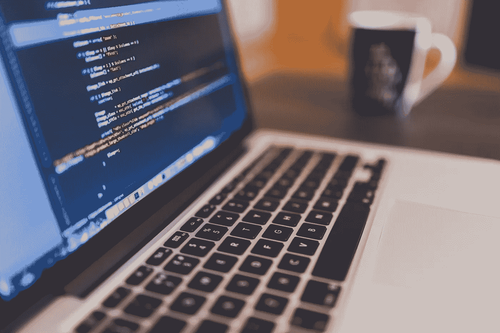
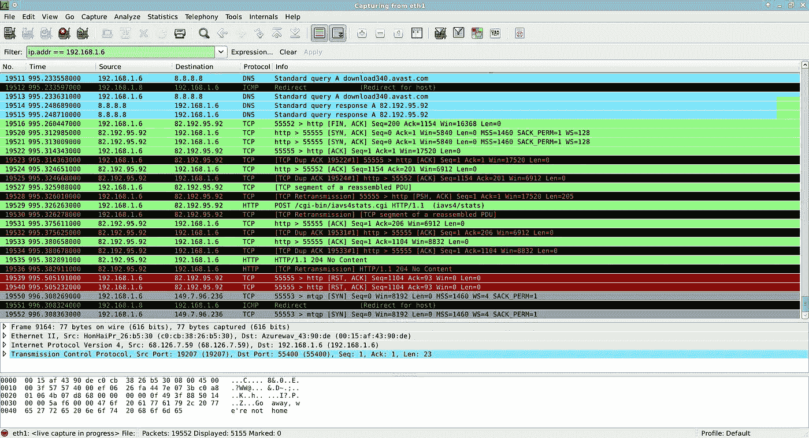

# 一个黑客拦截了你的 Wi-Fi 流量，窃取了你的联系人、密码和财务数据。以下是方法。

> 原文：<https://medium.com/hackernoon/a-hacker-intercepted-your-wifi-traffic-stole-your-contacts-passwords-financial-data-heres-how-4fc0df9ff152>



# 介绍

正当假日季节如火如荼之际，一名身穿连帽衫的黑客坐在一辆汽车里，仪表板上有天线，腿上放着一台电脑，他坐在一家受欢迎的连锁咖啡馆外面的停车场里。忙碌且沉浸在节日欢乐气氛中的过路人进进出出，有时甚至会逗留一会儿。

当他连续几个小时观察 Wi-Fi 流量时，没有人报警，甚至似乎没有人注意到。人们通过 HTTP 不安全地访问网飞和谷歌等网站，暴露他们所有的浏览活动，打电话透露电话号码，并发送大量未加密的流量供他随意拦截或修改，以实施网络钓鱼或视觉攻击。这就是我认为这样一个故事可以实现的方式。

> 我实际上没有黑过任何人，但我确实造了一个工具来展示人们在使用互联网时有多容易被黑。
> 
> 这就像一个信用评分，但你的安全漏洞。


A rare photo of me in my teen years with friends (I’m not sure how United Artists Pictures found this gem)

我是一名安全研究员和赛博朋克迷，对人的因素及其在日常人们的隐私和安全中的作用着迷。

我(仅在几年前)针对我自己的电话提供商进行了社会工程实验，让我的朋友欺骗他们，让他们以危险的方式访问我的账户和信息(导致这些公司无意中违反了联邦隐私和消费者保护法规)。

在过去的生活中，我从玩付费电话中获得了很多乐趣。我也是加密互联网上所有东西的大力支持者，一直都是。

在我的日常工作中，我在 [***魔法***](https://magic.co/?utm_source=hackernoon&utm_medium=blog&utm_campaign=content) ***致力于让互联网更安全、更高效——这是为未来构建一个去中心化的互联网主干。***

在假期，我建立了一个收集公共 Wi-Fi 流量的实验。由于现在网络上的所有东西都应该加密(许多人错误地认为所有的流量都是加密的)，人们可能会认为没有多少东西可以被看到。

不幸的是，事实并非如此。虽然自 Firesheep 推出以来，不安全状况有所改善，但当你使用公共网络时，攻击者仍然可以利用你的数据包进行网络钓鱼和玩游戏。抱歉，我带来了坏消息…

> 分数相当糟糕:今天大量的在线流量仍然完全没有加密，使公众容易受到攻击。

# 监控公众的网络流量太容易了



Spying on web traffic sent over a network. Credit: Wireshark Team [GPL ([http://www.gnu.org/licenses/gpl.html](http://www.gnu.org/licenses/gpl.html))], via Wikimedia Commons

## 首先，找一个容易的目标

假期的一个便利之处是大量潜在的受害者聚集在购物中心。这使得攻击者只需在人们习惯于发现未加密 Wi-Fi 的位置附近“开店”，就可以相对容易地瞄准大量个人设备。

这些购物者也很可能有钱消费，而且消费的频率如此之高，地点如此之多，以至于他们可能已经抵消了银行(和他们自己)及时发现欺诈的能力，这也使他们成为盗窃的完美目标。

## 然后，部署你的(非常慷慨的)免费公共无线网络

公共无线网络的秘诀是什么？

*1。完全不用加密，或者
2。使用预共享密钥并告诉所有人(与#1 没有不同)*

> 公共 Wi-Fi 是故意不安全的，容易受到几种攻击模式的影响

## 并且，使用一种简单的公共 Wi-Fi 攻击方法

有多种攻击媒介可以用来嗅探公共网络上的流量。这里有几个令人惊讶的省力低成本的方法:

*   攻击者可以使用现成的无线网络适配器(例如 Alfa 的 USB 网络适配器)或现成的软件定义无线电被动侦听流量(即使在很远的地方，也不需要连接网络或以其他方式向网络指示攻击者的存在)
*   攻击者只需使用免费提供的软件(如 Wireshark)而无需额外的硬件，就可以连接到网络并随意从其他人那里获取网络数据包(这在交换网络中有时会被阻止)
*   攻击者可以部署一个专用的流氓 [Wi-Fi 菠萝](https://www.wifipineapple.com)通过广播一个新的 Wi-Fi 网络主动拦截数据包，唯一的目的就是实施攻击

## 但这很可能是非法的，对吗？

> 法律是否有效保护了 Wi-Fi 上的人？
> 
> 简而言之:不尽然。

虽然某些判例法已经发现[根据美国联邦法律，在某些情况下接收未加密的 Wi-Fi 通信可能不违法](https://arstechnica.com/tech-policy/2012/09/sniffing-open-wifi-networks-is-not-wiretapping-judge-says/) *，但在这个问题上存在一些相互矛盾的观点，并且还有许多州的法律保护隐私。

也就是说，我上面提到的三种模式非常简单，一个[拉默](https://en.wikipedia.org/wiki/Lamer)或者[脚本小子](https://en.wikipedia.org/wiki/Script_kiddie)都可以使用。因此，虽然模糊应该吓得你不敢攻击你的朋友，但你不应该把自己的网络安全防御建立在(写在纸上的法律)会以某种方式保护你免受网络子弹的假设上。

**免责声明:根据联邦法律，拦截未加密 Wi-Fi 通信的合法性/非法性仍然没有“陪审团”(可以这么说，因为联邦法院没有达成一致意见)。我不是律师，本文中出现的内容都不是法律建议；但是，举个例子，* [*谷歌以区区 700 万美元解决了一起诉讼*](https://techcrunch.com/2013/03/12/google-pays-a-total-of-7m-to-37-u-s-states-to-settle-street-view-wifi-data-collection-case/) *涉及谷歌街景拦截并记录他人网络上发送的未加密流量，其中包含密码和各种有趣的信息。谷歌可能请得起比你更好的律师，所以考虑一下自己被预先警告不要做淘气的事情！我拒绝为自己行为的* [*后果负责*](https://twitter.com/geraldinreverse/status/1045907408474664961) *。*

# Cortados、菠萝和数据包:人们如何仅仅为了一些 Wi-Fi 而免费向攻击者提供他们的所有数据


Cortados and compromised Wi-Fi go really well together (pictured here is an inexpensive Alfa USB wireless card, with high-gain/long-range antenna, capable of passive monitoring mode)

> 菠萝是好客的象征，所以我建了一个 Wi-Fi 菠萝来交新朋友。

## 设置:免费客人 Wi-Fi

作为一个关心遵守法律和保护人们隐私的人，我设计了一个白帽实验来坚持诚实、同意、匿名和数据隐私的原则。

与 Google Street View 不同，我选择不偷偷记录(在内存或磁盘中)应用程序的有效负载、任何个人身份信息，甚至任何关于哪些主机连接到哪些服务器的元数据。

我建立了一个自制的强制门户网站，类似于所谓的 [Wi-Fi 菠萝](https://en.wikipedia.org/wiki/Evil_twin_(wireless_networks))，但关键的区别是它没有假冒任何附近或常见的无线网络的名称(因为我不想让用户对谁在操作网络有任何误解)。

SSID“免费访客 WiFi”看起来足够普通，它用一个漂亮的强制门户启动页面迎接用户，该页面包含一个非冗长的协议，该协议从用户同意监控用户的信息和通信中获得。

> 总的来说，这是一种非常友好的实验方式。一个真正的攻击者会更有侵略性。

## 潜在漏洞:我编写了专门的软件来确定你有多容易被黑客攻击

为了进一步保护用户的隐私，[我编写了一个小工具来收集应用程序在网络上使用的协议和端口的统计数据](https://github.com/pdub/packetbeacon)。

实际上只需要三行代码:

```
p = pcap.pcap(name=interface)
p.setfilter(‘’)
p.loop(0,handler)
```

[我的工具](https://github.com/pdub/packetbeacon)，按照设计，不记录任何 IP 地址、MAC 地址、主机名或应用程序数据，并且不能以某种方式配置来做这些事情。它只有一个目的:以尽可能不打扰的方式总结数据包和端口的类型。

事实上，我的工具比企业接入点和路由器(如 Ubiquiti Networks 产品)提供的深度数据包检查和智能更少侵入，这确保了我不会比系统管理员更令人毛骨悚然，也不会比 ISP 更令人毛骨悚然。为了进一步帮助保护隐私，我确保任何强制网络门户日志都被写入 tmpfs 卷，以防任何使用日志泄漏。

> 再说一次，我觉得我真是太好了。

> 黑帽黑客只需使用 Wireshark 就可以看到所有的应用程序数据和正在访问的网站。

# 好吧，但说真的，谁会用“免费的客人 WiFi”呢？

这是一个下午有多少人联系上了:

> 连接了 49 台设备
> 
> 100%接受强制网络门户中的 ToS 并发送数据
> 
> 0 台设备使用了 VPN

你们当中的科学家会注意到我的实验引入了选择偏差。收集的统计数据仅包括明确扫描开放 Wi-Fi 网络、选择我的网络并接受强制网络门户页面上的条款的人。这些选择公共网络的人可能更有可能从事危险的互联网行为。但是，需要人类互动的事实凸显了这些类型的攻击是多么容易。

> 我积极地做出选择，使得收集用户数据变得困难，尽管附近存在其他开放网络，但仍有近 50 人保持连接。

此外，由于使用我的网络首先需要人的交互，因此它必然会将任何[物联网(IoT)设备](https://twitter.com/internetofshit)排除在统计数据之外，而只包括与人直接交互的设备(例如手机和笔记本电脑)。

# 这有点让人担心，但不管怎样，互联网上重要的东西都是加密的，对吗？对吗？😬


Unfortunately HTTPS is not enough to protect you. In fact, its often implemented incorrectly even by major websites you know and trust. (Image credit: TACstock1/Shutterstock.com)

> 更多坏消息如下:通过我的菠萝的所有流量中有 42%是未加密的 HTTP 流量。

我的工具从统计数据中忽略了非 IP 流量。在收集了 489，330 个 IP 数据包后，它报告说:

*   **> 42%位于未加密 HTTP** 使用的端口 80 上(相比之下，HTTPS 使用的端口 443 上有近 57%的流量)
*   **2，638 个未加密的 DNS 数据包**
*   **18 个未加密的网络时间协议(NTP)数据包**

原始传输、端口、计数和百分比如下:

```
Totals:
udp 8992  4      0.000817444260519
udp 5090  482    0.0985020333926
udp 67    49     0.0100136921914
udp 5353  64     0.0130791081683
udp 5355  37     0.00756135940981
**udp 53    2638   0.539104489813**
udp 137   73     0.0149183577545
udp 3544  54     0.011035497517
**udp 123   18     0.00367849917234**
udp 443   203    0.0414852962214
tcp 993   63     0.0128747471032
tcp 5223  79     0.0161445241453
tcp 9001  350    0.0715263727955
tcp 5228  199    0.0406678519608
**tcp 80    207538 42.4126867349**
tcp 53    12     0.00245233278156
tcp 443   277467 56.7034516584
489330
```

由于 DNS 和 NTP 不安全，通过端口 80 发送的 42%的流量可能是未加密的 HTTP 流量，这非常令人担忧。web 浏览器应该执行的 HTTP 严格传输安全(HSTS)策略怎么样？流量是非 web 流量还是某种其他误报？

## 由于无法在更深层次上(从道德上)检查数据包，我的手脚被束缚住了…

后来，我在自己的实验室里建立了第二个实验，亲自检查一些流行网站的行为。我将在本系列的第 2 部分进一步讨论这些发现(在第 2 部分，我还将解释为什么我们会有今天，并解释一些流行网站做得不对)。

但是，我在这里总结一下发现:

*   热门网站并不总是恰当地实现 HSTS(如果有的话)(包括谷歌和网飞)
*   公共 Wi-Fi 网络的用户仍然容易受到**中间人(MITM)** 、**截取私人数据**和其他攻击

可恶！

## 但是，不要相信我的话…

在你费力寻找数据来反驳这一分析之前，LMGTFY:我非常努力地证明自己是错的，但后来我发现了谷歌的[网络透明报告](https://transparencyreport.google.com/https/overview)上的 HTTPS 加密，它使用 Chrome 用户的匿名使用报告以及谷歌自己的内部数据作为来源来确定网络上 HTTPS 的使用状态。

**根据谷歌自己的报告(截至*2018 年 12 月 29 日* ):**

*   **11–31%的网站在未加密的情况下被访问**
    *(通过未加密的 HTTP 访问)*
*   **~7%的谷歌产品流量是未加密的**
    *(某些谷歌产品高达 10%)*
*   **发送给谷歌的流量中，82.6%来自移动设备** *(这让我很难再考虑使用谷歌开发的操作系统)*

这与我的工具记录的统计数据相差不远，特别是考虑到选择偏差以及我的不科学观察，即更多的人在喝咖啡和使用移动设备*(再看看那个 82.6%的数字！比我们坐在笔记本电脑前要多。*

我不是说我们需要害怕 FUD……但是，实际上，我是说我们需要害怕 FUD。

> 我还说，你应该害怕那些穿着连帽衫、车上布满天线的黑客，他们在光天化日之下用双筒望远镜看着你，但是我跑题了。

# 攻击者如何利用这种流量来攻击您？


我没有攻击任何人，也没有侵犯任何人的隐私，在发表这篇文章之前，我确实咨询了法律顾问。但是，今天，使用公共 Wi-Fi 的人们可能会通过一些方式受到廉价硬件和/或免费工具(例如，无线适配器、Wireshark、Bettercap 等)的危害。).

## 网络钓鱼

首先，为了成功实施网络钓鱼攻击，攻击者可以瞄准一些可以通过 HTTP 访问并且没有正确实现 HSTS 的流行站点，也可以利用 DNS 请求，因为所有这些站点都是不安全的(从某种意义上说，以前强制网络门户通过在每次想要显示其 splash 页面时执行 DNS 伪造的 MITM 攻击来工作，现在使用 DNS 很容易实现这一点，因为从那以后 DNS 就再也没有得到正确的保护)。

## 制造一种紧迫感

理想情况下，我们假设的攻击者可以创造一种紧迫感，让用户匆忙地犯更多的错误(例如，忽略地址栏中又长又稍微修改过的 URL)。例如，在用户被踢离线之前，提示用户输入其电子邮件地址并提供非常短的时间来检查电子邮件的验证链接的强制网络门户可能是所述电子邮件提供商的网络钓鱼登录页面的完美伴侣。

更好的是，一旦获得用户的凭证并确认它们是正确的，用一个虚假的错误消息引导他们离开网络可能会减慢他们注意到危害或重置他们的电子邮件密码的速度。>:~>

## 编造一个熟悉的借口

提供假想的攻击者自己的钓鱼页面并使用 Let's Encrypt 证书来保护它们应该很容易。至少，他们应该看起来“安全”足够长的时间，足以欺骗一个疯狂的网络成瘾者，用他们的数字身份换取几分钟的 Snapchat。如果有人想将凭据锁定在一个知名度更高的网站上——也许该网站实际上正确实现了 HSTS，但毫无疑问，就像许多流行的网站一样，它不在预加载列表中——攻击者可以等到潜在受害者的计算机发送 NTP 请求后再锁定他们。

通过玩弄时间旅行和交替宇宙(伪造时间设定在未来的 NTP 响应)，用户浏览器缓存的所有 HSTS 策略(其缓存条目在新的“当前”时间之前过期)可能会失效。然后，攻击者可以执行降级攻击，通过 HTTP 将 301 重定向到一个钓鱼页面，剩下的就是小菜一碟了。

## 混淆 s/副手/用户/

我们假设的攻击者可以欺骗人们安装一些后门或僵尸网络软件。从那时起，攻击者基本上可以在任何方便的时候破解他们的设备、信息和联系网络，身份盗窃或金钱盗窃将变得轻而易举。为此，攻击者可能会在计算机上弹出一些关于病毒或间谍软件的“警告”，并友好地建议用户安装一个真正的病毒来“修复”它。

这将要求用户实际上允许安装攻击者的软件。或者，我们假设的攻击者可以在用户的网络浏览器中挖掘加密货币，这不需要欺骗用户同意安装软件。

## 中了未加密明文大奖

此外，我的工具看到的通过端口 5090 发送的流量很有意思，因为这是一个普通商业 VoIP 移动应用程序通过 SIP 协议发送电话呼叫所使用的端口。一些蜂窝提供商也以这种方式卸载语音流量。我惊喜地在我的统计中看到了这一点！即使 SIP 有效载荷被加密，它们的报头也没有被加密，并且通常明文包含 CID 和 DID(电话号码)。

这对于我们假设的黑客对受害者或他们的联系人进行攻击可能特别有用，因为 cid 很容易被欺骗，使攻击者呼叫者看起来很熟悉。如果我们假设的黑客想通过电话攻击你或你的生活，他或她可以收集这些电话号码，以后再用它们来找乐子。>:~> >:~>

# 公共无线网络的所有问题

我不是想过度宣传公共 Wi-Fi 的问题，但我确实想让这些问题在人们的脑海中占据首要位置。

> 我们在改善互联网的基本安全方面取得了进展，但还远远不够。

仍然有我们(技术专家)长期以来未能解决的大问题。即使在今天，在公共 Wi-Fi 网络上，攻击者也可以:

*   查看您要访问的网站(只需拦截 DNS 请求)
*   通过初始 HTTP 页面加载进行降级和 MITM 攻击
*   通过 NTP 注入虚假的未来时间来规避 HSTS(你知道，那些 HSTS 的政策是有到期日的)
*   敏感信息的费西合唱团
*   唯帅你，你的朋友，你的家人
*   使用您的 CPU 注入虚假内容/广告，甚至挖掘加密货币
*   欺骗你运行不安全的插件，比如过时版本的 Flash
*   恶搞当地机构关于食源性疾病报道的新闻标题，看着人们突然起身离开
*   伪造一个看起来像是来自附近网络的强制网络门户页面，并获取一些联系信息
*   通过强迫您点击电子邮件中的链接以保持联系来验证联系信息，从而产生一种紧迫感，并可能诱使您输入您的电子邮件凭据

# 你被吓坏了，想知道如何保护自己？

很高兴你问了。

你可以做一些常识性的事情来让自己不那么容易成为目标。默认情况下，你应该*至少*使用 VPN 和 HTTPS 无处不在浏览器插件。如果不是，您可能应该彻底重新考虑您的安全状况。

> 我们正在 [Magic](https://magic.co/?utm_source=hackernoon&utm_medium=blog&utm_campaign=content) 积极致力于解决这些问题，在那里我们默认实现了类似 VPN 的功能和基于能力的安全范例。

> 【magic.co**或**[**https://github.com/magic-network**](https://github.com/magic-network)】了解更多信息并加入关于如何构建更安全、更高效的互联网的讨论

# 然后呢？

在这个系列的第二部分中，我研究了这个问题，“我们为什么在这里？”以及哪些流行的网站和协议做错了造成这样的混乱。然后，在本系列接下来的第 3 部分中，我将根据我在第 1 和第 2 部分中讨论的内容，详细讨论为了保证在线安全，我们需要做的事情。