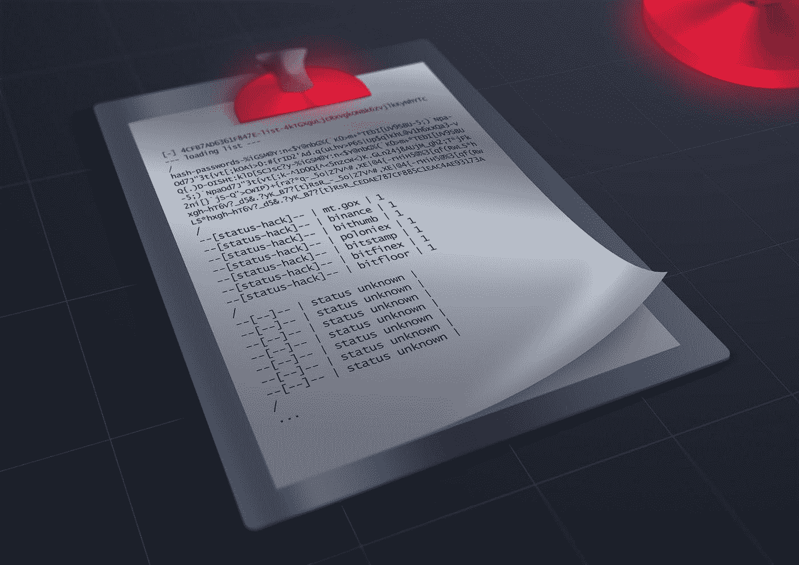
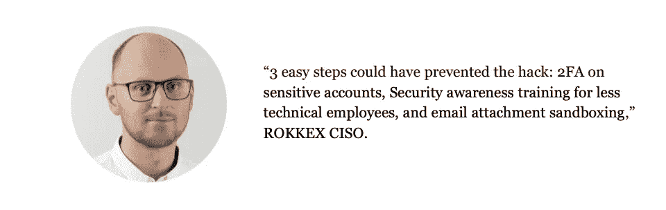
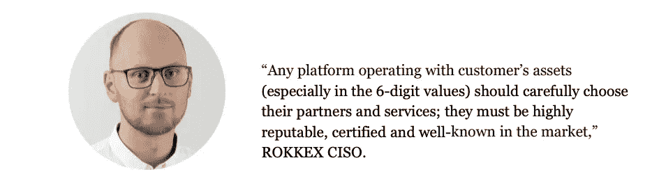
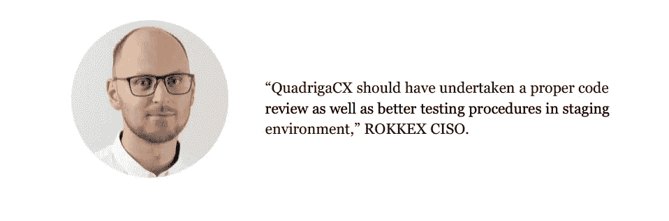

# 一份庞大的加密货币盗窃清单

> 原文：<https://medium.com/hackernoon/a-huge-list-of-cryptocurrency-thefts-16d6bf246389>

任何加密货币交易黑客都会对加密货币的价格产生不利影响，使价格在几个月后才能恢复。黑客进行攻击不仅仅是为了偷钱。许多黑客攻击是为了抽取或倾倒加密货币汇率，有些是内部人员的工作，有些是简单的退出骗局。毕竟，缺乏经验的市场参与者(他们现在是大多数)在迅速听到坏消息时就开始向菲亚特收回代币。

这种精心设计的战术攻击的可能性只会随着市场的发展和激烈的竞争而增加。硬币和代币甚至可能从最大的、看似受到保护的交易所消失。然而，**问题总是出在黑客**身上吗？

ROKKEX 决定创建一个加密货币兑换欺诈时间表，以及最大的加密兑换黑客，以查明是否只有黑客应该受到指责。

***剧透:有时候，老板或员工也有罪。***

# 2011

# 六月

*   什么:Mt.Gox
*   金额: 2643 BTC

Mt.Gox 公开了加密货币黑客名单。[在遥远的 2011 年](https://www.ledger.com/hack-flasback-the-mt-gox-hack-the-most-iconic-exchange-hack/)，一名黑客成功**劫持了拥有管理权限的审计员账户**。通过网络钓鱼，他或她获得了管理帐户，从 wallet.dat 文件中窃取了热门的 wallet 私钥。，将 BTC 价格更改为 1 美分，获得 Mt.Gox 用户的帐户，创建卖出订单，并以人为创建的价格为客户的资金购买 2643 BTC。

# 七月

*   什么:Bitomat
*   **金额:**17000 BTC

当时，位于波兰的加密货币交易所是第三大交易平台。一天，由于**服务器重启**时钱包意外被毁，他们丢失了所有 BTC 钱包的钥匙，导致 17k BTC 丢失。

简而言之，Bitomat 使用亚马逊 Web 服务弹性云计算来托管虚拟机；AWS 警告说，如果一个实例脱机，所有存储的数据可能会永久丢失。看起来 Bitomat 碰巧将他们钱包的备份和当前状态存储在 EC2 虚拟机中，所以他们几乎没有机会从钱包中恢复旧的资金。

# 十月

*   **什么:**比特币 7
*   金额:11，000 BTC

10 月 6 日，Bitcoin7 在其网站上发布了一条消息，告知用户**俄罗斯和东欧黑客攻击了**加密货币交易所。黑客[攻破了 Bitcoin7 服务器](https://siliconangle.com/2011/10/07/bitcoin7-hacked-funds-recovery-requires-sensitive-personal-information/)，获得了对 BTC 主要存管机构和 3 个备用钱包中的 2 个的完全访问权。

今天，Bitcoin7 域提供了一个增加 BTC 数量的诈骗服务。难道说，它还被黑客附身了？

*   **什么:** Mt.Gox
*   金额: 2609 BTC

2011 年 10 月，Mt.Gox 的厄运愈演愈烈。由于编程错误，交易所丢失了其他 2609 BTC。简单来说，Mt Gox 不小心制造了永远无法赎回的交易。为了更深入地理解这个问题，[到这里](http://www.righto.com/2014/03/the-programming-error-that-cost-mt-gox.html)。

# 2012

# 三月

*   什么？
*   **金额**:Slush 3000 BTC，Bitcoinica 43000 BTC

3 月 1 日，虚拟主机提供商 Linode 遭到黑客攻击，导致 Slush 的 3000 BTC 和 Bitcoinica 的 43000 BTC 被盗。此前曾发生过两起 BTC 大劫案，一次是 6 月份 BTC 25000 英镑失窃案，另一次是 8 月份 BTC 交易所 bito mat 17000 英镑 BTC 失窃案，导致该交易所被纾困并被 MtGox 收购。

目前，安全已成为 BTC 社会的主要关切。尽管人们希望用加密货币进行经济活动，但他们的钱是否安全的问题困扰着他们。

# 五月

*   什么:比特币
*   金额: 18，457 BTC

43000 英镑的 BTC·利诺德失窃还不够，另外还有 18457 英镑的 BTC 从 Bitcoinica 的储备中被盗。首席执行官周统勉强能够阻止损失 [3 万多](https://bitcointalk.org/index.php?topic=81045.msg894312#msg894312)。出于安全原因，该网站立即被关闭。

Vitalik Buterin 是一名作家，也是当时《比特币》杂志的创始人之一，他写道:

> “不幸的是，考虑到两个月前 Linode 失窃后 Bitcoinica 已经陷入的财务压力，即使是这个较小的损失也成了压垮骆驼的最后一根稻草。”

# 七月

*   什么东西？BTC
*   **金额**:4500 BTC

下面是第一个被证实的故事，当**交易所经营者变得贪婪**并侵吞不属于他们的钱。BTC-e 的运营商亚历山大·威尼克被捕主要是因为洗钱，但也有电脑黑客行为。他是执行 DDoS 攻击、窃取 API 信用凭证、启动自由储备存款并向系统中注入大量美元的员工之一，这些美元很快就被卖给了 BTC。

BTC-e.com 被认为是可靠性的黄金标准，有机会改变俄国是洗钱国的名声。

# 九月

*   **什么:**比特地板
*   **金额:** 24，000 BTC

BitFloor 自 2011 年开始运营，2012 年 9 月 4 日，BitFloor 的运营商报告了一个**安全漏洞，导致** [**24K BTC 被盗**](https://bitcoinmagazine.com/articles/bitfloor-hacked-250000-missing-1346821046) 。由于交易所的储备金不足以容纳所有存入的资金，网站被关闭，客户资金无法进入。

# 2013

# 五月

*   **什么** : Vircurex
*   金额:1454 BTC

2014 年，在损失了大量储备资金后，该交易所宣布几乎破产。部分损失来自**“2013 年年中交易所经历的两次所谓的黑客攻击**”

结果，Vircurex 冻结了 BTC、LTC、FTC 和 TRC 的提款。当时，该公司宣布，它将开始用这些利润来偿还用户。该交易所向少数客户退还了少量加密货币，但大部分欠款仍留在该交易所。

# 十月

*   什么:丝绸之路(市场)
*   金额:大约 1606 BTC

如果我们不提丝绸之路和乌布里切特先生的犯罪活动，这就不是加密货币欺诈的清单。

丝绸之路，位于 Tor 网络，可以被称为替代易贝或亚马逊，但出售非法商品，如海洛因，武器，色情制品等。所有的支付交易都是在 BTC 进行的，丝绸之路是一个连接用户的中间人，并从他们的非法交易中收取佣金。在市场存在的两年中，交易总量达到 950 万 BTC。

**很快** [**联邦调查局对丝绸之路**](/@marcell74/the-silk-road-a-real-thriller-and-the-truth-about-the-anonymity-of-bitcoin-198b519ca397) **产生了兴趣。**2015 年，公司创始人乌利姆·罗斯·乌布里希特因黑客攻击和共谋洗钱等多项罪名被判终身监禁。

故事并没有就此结束，作为秘密特工，他一直在处理这个案件，最终[偷走了肮脏的 BTC 本人](https://gizmodo.com/secret-service-agent-who-stole-silk-road-bitcoins-sente-1820241618)。

# 十一月

*   什么:比特币
*   金额: 484 BTC

11 月 11 日，总部位于捷克的加密货币交易所[遭遇黑客攻击](https://www.coindesk.com/czech-bitcoin-exchange-bitcash-cz-hacked-4000-user-wallets-emptied)清空了 4000 名用户的钱包。

网站服务器被黑客攻击，用代表比特币的欺诈性电子邮件进行网络钓鱼攻击，以欺骗用户。这些电子邮件声称，BitCash 向他们的美国寻回公司求助，以取回被盗的 BTC。收件人被要求发送 2 BTC 到一个钱包地址，他们的 BTC 将被退回。然而，电子邮件中所列的 BTC 地址并没有在网上使用过，也没有任何交易。

# 2014

# 三月

*   **什么** : Mt.Gox
*   金额 : 85 万 BTC

2013 年，MtGox 是最受欢迎的加密货币交易所之一(BTC 47%的交易是通过该平台完成的)。它总共损失了 85 万 BTC，这是目前的最高纪录。

你可能还记得上面的内容，我们的[加密货币交易黑客](https://www.ledger.com/hack-flasback-the-mt-gox-hack-the-most-iconic-exchange-hack/)名单正是从 Mt.Gox 开始的，它的**私钥被盗了。**黑客/内部人员获得了大量 BTC，开始控制资金的输入和输出以及存款。在 2 年时间里(2012 年至 2013 年)，一名黑客正在清空钱包，但 Mt. Gox 系统[将这笔支出解释为*存款*](/@jimmysong/mt-gox-hack-technical-explanation-37ea5549f715) ，向一些用户额外贷记了大约 40，000 BTC。

5 年后的今天，Mt.Gox 仍然是有史以来最大的黑客攻击(我们希望它保持这样)。

*   什么东西:波洛涅克斯
*   **金额**:所有 BTC 的 12.3%(97 BTC)

总部位于美国的加密货币交易所 Poloniex 在 2014 年夏天遭到黑客攻击。黑客们设法利用了 Poloniex 的一个不正确的取款密码。

该公司没有报告 BTC 被盗的确切数字，但你可以在 [Bitcointalk 论坛](https://bitcointalk.org/index.php?topic=499580)上查看黑客攻击的详细解释。此外，Poloniex 可能还被黑过几次，就像一些非官方的消息来源所说的那样，比如[这个](https://themerkle.com/poloniex-users-suffering-from-frozen-accounts-suspended-withdrawals-and-disabled-markets/)、[这个](https://coinidol.com/suspicion-of-insider-trading-at-poloniex/)和[这个](https://www.reddit.com/r/CryptoMarkets/comments/6kv2p4/poloniex_account_hacked_25000_stolen/)。

# 七月

*   什么东西:地穴
*   **金额**:1.3 万 BTC 和 30 万立特

2014 年 7 月，昵称为 **Lucky7Coin** [**的攻击者将木马代码**](https://pastebin.com/gFgSazs0) **插入 Cryptsy** 的代码——一种加密货币交易所。一名黑客获得了 BTC 和 LTC 的密钥。结果，一名罪犯得到了 13，000 BTC 和 300，000 立特。

有趣的是，exchange 管理员熟悉这个诈骗犯。在黑客入侵前两个月，攻击者发送了一封尴尬的信，介绍自己是杰克，并报告说这个昵称的前主人已经去世。

该公司老板保罗·弗农(Paul Vernon)被指控销毁非法活动证据，并窃取了 1.1 万 BTC。Cryptsy 的客户认为，这种货币可以通过另一个交易所——比特币基地——进行洗钱。

# 十二月

*   什么东西？Mintpal
*   **金额**:3894 BTC

在 2014 年秋季管理层变动之前，MintPal 一直被认为是最好的交易平台之一。该公司被卖给了 Moopay 的执行董事瑞恩·肯尼迪，笔名为亚历克斯·格林。

**内功期间偷了 3894 BTC，还搞砸了交易所**。值得注意的是，几个月后，在资金撤出后，Kennedy 因强奸罪被判处 11 年监禁，而且判决中没有关于在 BTC 盗窃 150 万美元的条款。

# 2015

# 一月

*   **什么**:位戳
*   **金额**:1.9 万 BTC

欧洲第一家获得许可的加密货币交易所 Bitstamp，由卢森堡金融监管局([CSSF](http://www.cssf.lu/en/))[监管，于 2015 年 1 月被黑](https://www.reddit.com/r/Bitcoin/comments/3bpdb4/bitstamp_incident_report_22015/?_gclid=5b02af972d1021.65480885-5b02af972d1089.16502791&_utm_source=xakep&_utm_campaign=mention72517&_utm_medium=inline&_utm_content=lnk91256117970&st=jhg6fp81&sh=996ee3b3)。黑客向员工的内部邮件发送了一个恶意文件。Bitstamp 的一名员工忽略了安全规则 1——不要打开陌生人的文件，并且**跟踪了可以访问交易所 BTC 钱包的设备上的链接**。结果，19，000 BTC 被盗，或在失窃当天约值 5，100，000 美元。

*   什么:本地比特币
*   **金额** : ~17 BTC

17 BTC 似乎不是一个大数目相比，上述妥协的交流；然而，这是支持关注(和分配资金)网络安全的又一个理由。

当地比特币公司副总裁尼古拉·坎加斯解释道:

> “攻击者使用那个 **LiveChat 访问来传播某种 Windows 可执行文件**，这可能是某种新的键盘记录软件，它还没有被病毒保护机制检测到。如果用户安装了可执行文件，通过一些社会工程，攻击者就能设法访问这些受害者的不同账户。”

三名用户在黑客攻击中损失了资金。该公司表示，欺诈性提款的一个可能原因是缺乏 2FA。同样，2FA 是一种可靠的安全措施，应该在每个加密货币交易平台上实施。

*   什么东西 : 796
*   **金额**:1000 BTC

这看起来像是一个错误，但却是一次精心策划的精确攻击。一月底，[中国加密货币交易所 796 的服务器被攻破](https://cointelegraph.com/news/chinese-exchange-suffers-1000-btc-loss-in-uncertain-service-compromise)。根据解释，**黑客获得了一个子模块的访问权限，用自己的**篡改了客户的取款地址。

# 二月

*   什么？Bter
*   **金额**:7000 BTC

另一个与员工失误有关的攻击发生在中国。一个小型加密货币交易所 Bter 被[黑了几次](https://www.coindesk.com/bter-bitcoin-stolen-cold-wallet-hack)。交易所的员工组织了最大的一次抢劫。2015 年 2 月，一个冰冷的钱包里的 7000 BTC 被盗。在那之后，公司的所有活动都暂停了，仅仅几年之后，Bter 管理层又开始从他们的资产中提取资金。

*   **什么** : KipCoin
*   **金额**:3000 BTC

作为一个交换平台的所有者，你会立即承认违规行为，还是在调查给出更多细节后再发布消息？KipCoin [的主人选择了第二个选项](http://digitalmoneytimes.com/chinese-exchange-platform-kipcoin-admits-to-hackers-stealing-over-3000-bitcoin/)。

记得利诺德吗？2015 年，很明显，它在 2014 年 6 月再次遭到黑客攻击，导致 KipCoin 服务器被攻破。黑客更改了 Linode 账户密码，阻止所有者访问；这导致 **KipCoin Linode root 密码也被更改**，因为黑客获得了整个平台的控制权。

在一个月的时间里，交易所的管理层试图重新获得控制权，他们成功了(令人惊讶的是，这个月没有发生任何恶意的事情)。这并不意味着黑客消失了，他们潜伏着。2014 年 10 月，**由于交易所没有更改他们的 BTC 私钥**，黑客获得了资金。

鉴于 BitStamp 丢失了许多硬币，KipCoin 决定不立即披露这些信息，并已采取一切必要措施向警方提交正式投诉。

# 2016

# 三月

*   什么:货币交易商
*   **金额**:未知

黑客还是退出骗局？当交易所意外关闭时，用户经常会问这个问题。

3 月 28 日，Cointrader 加入了据称被黑客攻击的加密货币交易所的行列，向其用户[发送了以下消息](https://www.reddit.com/r/Bitcoin/comments/4cbnhs/was_cointrader_hacked/):

> 亲爱的 Cointrader 客户:
> 
> 最近的一次内部审计显示，我们钱包中的比特币不足，导致取款延迟。这个问题目前正在调查中，我们打算尽快解决您的帐户余额。我们真诚地为这一不幸的不便道歉，并将随时向您通报这一问题的进展。与此同时，我们已经停止了存款、取款和交易活动，直到这个问题得到解决。
> 
> 真诚地
> 
> Cointrader.net 支持

在随后的 6 个月里，该交易所的日交易量很低，仅为 81.43 BTC。从未报告过受影响用户的数量。

# 四月

*   **什么**:变形
*   **金额**:469 BTC+5800 ETH+1900 LTC

《变形人的故事》是一个关于内幕工作或不忠员工的极好例子。3 月 14 日，一名员工从 315 BTC 公司偷窃。当盗窃被揭露时，他被解雇了。然而，损失不止于此:4 月 7 日，又有 97 家 BTC、3，600 家 ETH 和 1，900 家 LTC 消失。站点离线，事件响应措施到位，然后采取了额外的 57 个 BTC 和 2，200 个 ETH！

该报告指出:

> “由于在数字取证调查中没有找到特定攻击媒介的直接证据，因此我们对现有事实进行了分析，以确定符合事实的所有可能的攻击媒介。值得注意的是，攻击者不仅能够相当快地破坏这两个基础架构，而且能够同样快地识别它们的 IP 地址。”

# 五月

*   什么:GateCoin
*   **金额**:4320 BTC(250 BTC 和 185000 埃特)

Gatecoin 是第一批受监管的加密货币交易平台之一。它提供购买基于 ETH 的代币来投票，并在 DAO 众筹期间资助开发提案，在黑客攻击后，它承诺[建立](https://twitter.com/Gatecoin/status/732136409650208768)一个用于撤回 Dao 相关代币和法定货币的门户网站。这种交易在当时很有名，也很突出，难怪[会引起不法分子](https://thenextweb.com/hardfork/2019/03/14/gatecoin-cryptocurrency-exchange-dead/)的注意。

Gatecoin 声明:

> “我们之前已经沟通过，大多数客户的加密资产资金都存储在多签名冷钱包中。然而，参与此次违规的恶意外部方设法**改变了我们的系统，以便在违规期间 ETH 存款转账绕过 multi-sig 冷库，直接进入热钱包**。这意味着 ETH 基金的损失超过了我们对我们的热钱包施加的 5%的限制。"

# 八月

*   什么 : Bitfinex
*   **金额** : 12 万 BTC

这家香港公司声称是最可靠和最安全的加密货币交易所，每个客户都可以选择带有多个标识符的钱包。原来只是营销的问题。2016 年 8 月，[网络罪犯绑架了 12 万 BTC](https://www.coindesk.com/bitfinex-bitcoin-hack-know-dont-know) 。**资金主要通过 Bitfinex 合作的 BitGo 处理服务泄露**。

# 2017

# 六月

*   **什么** : QuadrigaCX
*   **金额**:6.7 万瑞士法郎

一些错误不会给加密货币交易所的用户带来伤害，但会给所有者带来伤害。由于程序员的错误，一个加拿大的交换平台[丢失了 67k 的 ETH](https://steemit.com/cryptocurrency/@barrydutton/breaking-the-biggest-canadian-coin-exchange-quadrigacx-loses-67-000-usdeth-due-to-coding-error-funds-locked-in-an-executable) 。在官方声明中，QuadrigaCX 解释说错误发生在 Geth 升级之后。用专业术语来说:

> 程序员使用损坏的事务数据负载调用了拆分器智能协定中的函数，这是由于未能以 0x 作为某个值的前缀(这对于指示字符串是十六进制编码的是必要的)

# 十二月

*   什么 : Nicehash(一个挖掘哈希能力的市场。)
*   **金额**:4000 BTC

Nicehash 不是一个交易所，而是一个集成了市场的加密货币 hash power broker 尽管如此，这个故事也属于加密货币盗窃的名单。人们将他们的计算能力出租给那些想要挖掘加密货币而不投资硬件的人。原来，人们付钱去开采直接进入黑客口袋的硬币。

总部位于斯洛文尼亚的公司[给出了进一步的评论](https://www.coindesk.com/eu-authorities-crack-down-on-bitcoin-transaction-mixer):

> “重要的是，我们的支付系统遭到破坏，NiceHash 比特币钱包的内容被盗。我们正在核实 BTC 被带走的确切人数。显然，这是一个令人深感关切的问题，我们将在今后几天努力纠正这一问题。除了开展我们自己的调查，该事件已报告给有关当局和执法部门，我们正在作为紧急事项与他们合作。”

8 月，该公司宣布[归还 60%被盗硬币](https://news.bitcoin.com/nicehash-returns-60-of-coins-stolen-in-the-hack/)。

# 2018

# 一月

*   **什么**:硬币检查
*   **金额**:5.23 亿 NEM

另一起重大黑客攻击发生在日本领先的密码交易平台 CoinCheck。国外的黑客用一种通过电子邮件传播的病毒感染了交易所的内部网络，并允许他们窃取私人密钥。结果，5.23 亿 NEM 硬币被盗，价值 5.33 亿美元。

该事件的发生是由于忽视了这种加密货币的存储，因为交易所没有使用多签名的智能合约，所有硬币都存储在同一个钱包中。

# 二月

*   **什么**:圣杯
*   **金额**:1700 万纳米

[2018 年超过 1.7 亿美元从意大利加密货币交易所 Bitgrail 被盗](http://fortune.com/2018/02/11/bitgrail-cryptocurrency-claims-hack/)。

据所有者 Francesco Firano 称，由于**“未经授权的交易”，账户中被提取了 1700 万 XRB (Nano / RaiBlock)** Nano 公司的代表否认了这一消息，并声称**没有错误**。😏

值得注意的是，存放在交易所的其余代币没有受到影响。袭击发生后，Bitgrail 宣布破产。

# 四月

*   什么:CoinSecure
*   金额:438 BTC

我们已经知道，交易所的雇员可以利用他们的地位，侵吞相当大的金额。2018 年 4 月，一家印度交易所 Coinsecure 按汇率计算损失了 438 BTC 或 350 万美元。该公司的所有者假设首席安全官在提取 BTG 时实施了黑客攻击。嫌疑人否认自己有罪，并声称资金“是在某种攻击过程中被盗的”。

# 六月

*   **什么** : Coinrail
*   **金额**:1927 ETH，26 亿 npx，9300 万 ATX，8.31 亿登特币+大量其他六种代币

尽管 Coinrail 在韩国是一个小交易所，但考虑到通过它流动的资金量，它是一个诱人的目标。黑客们认出了它，并偷走了 1927 枚 ETH、26 亿枚 npx、9300 万枚 ATX、8 . 31 亿枚登特硬币以及大量的其他六种代币。

当局没有透露更多细节，称这次攻击是“网络入侵”，导致许多 ERC-20 代币从交易所被盗。

# 九月

*   什么东西？Zaif
*   **金额**:5966 BTC

日本交易所 Zaif [于 9 月 14 日](/meetbitfury/crystal-blockchain-analytics-investigation-of-the-zaif-exchange-hack-a3b4d1faed8f)遭到黑客攻击。这导致 BTC、BCH 和 MonaCoin 的 6000 万美元被盗。奇怪的是，被盗 BCH 的确切数量是未知的，这确实激励 Zaif 在未来改进他们的安全措施。

扎伊夫已经向地方当局提起刑事诉讼；很明显，由于黑客未经授权获取资金的方式，可能有员工叛变了？

# 十月

*   什么 : MapleChange
*   金额:913 BTC

一家名为 MapleChange 的小型加拿大交易所自 2018 年 5 月推出以来，每天的交易量约为 67，000 美元。10 月，他们[声称被黑客攻击](https://blockonomi.com/maplechange-hacked-scam/)或**遭遇漏洞，导致所有客户的存款被提取**。

10 月 28 日，他们提出了一个奇怪的要求，即他们必须在调查期间删除他们所有的社交媒体账户。由于没有他们团队的详细信息，也不知道他们是否被法律允许运营，这个“黑客”散发出精心策划的退出骗局的味道。

# 十一月

*   **什么**:纯比特
*   **金额**:3000 万美元(ICO+13000 ETH)

Pure Bit 在一个 ICO 中筹集了超过 3000 万美元，在韩国创建了一个加密货币交易所，但随后他们 [**执行了一个退出骗局**](https://bitcoinmagazine.com/articles/fraudulent-south-korean-exchange-pure-bit-nabs-28m-ico-exit-scam) 。

Pure Bit 甚至试图更进一步，在 UpBit 上出售一部分被盗资金。幸运的是，UpBit 知道这些资金是欺诈性的，立即冻结了账户。

Pure Bit 网站现已下线，他们的 KakaoTalk 账户也更名为一个短语，大致翻译成**“对不起”**

# 十二月

*   什么:QuadrigaCX
*   金额: 26 350 BTC

我们的加密货币盗窃名单中最引人注目的一次黑客攻击发生在 2018 年 12 月。**QuadrigaCX 的主人 Gerry Cotten 突然去世**；他是唯一能接触到交易所冷冻钱包的人。有趣的是，在公告发布的时候，用户已经试图提取资金几个月了，破产的谣言正在迅速传播。

当安永会计师事务所开始审计时，他们发现放在冷钱包里的 BTC 从未超过 100 英镑。QuadrigaCX 开始破产程序拥有他们的客户超过 26，000 BTC。

有一种阴谋论认为 Gerry Cotten 还活着，QuadrigaCX 的案子只不过是一个退出骗局。

# 2019

# 一月

*   **什么** : HitBTC
*   **金额**:未知

在[年度钥匙证明活动](https://www.proofofkeys.com/)之前提及 HitBTC 行为是至关重要的。用户[在 Reddit 和其他社交媒体平台](https://www.ccn.com/bitcoin-exchange-hitbtc-freezes-customers-accounts-ahead-of-proof-of-keys-event/)上抱怨说 **HitBTC 阻止了所有撤回他们资金的尝试**。

*   什么:隐视
*   **金额**:至少 19,390 ETH

1 月 13 日，Cryptopia 的用户报告了访问和使用他们的帐户的困难。来自 Cryptopia 的第一条消息是，他们将进行不定期维护，以解决一个技术问题。后来，该交易所在推特上澄清说，他们遭遇了安全漏洞。

Cryptopia 表示，他们已经向新西兰相关部门报告了这一事件。损失资金的全部数额不明；然而，19，390 ETH 已被视为转移到一个未知的钱包。由于 Cryptopia 是一个相当小的交换，内部工作的可能性是版本之一。

*   什么东西？隐视症
*   **金额**:1675 ETH

在 1 月 13 日被黑后，Cryptopia 在 15 天后再次被[黑。这证实了交易所不再对他们的钱包有任何控制。](https://blog.saturn.network/cryptopia-exchange-hacked-again/)

# 二月

*   **什么**:硬币妈妈
*   **金额** : 45 万用户邮箱和密码

Coinmama 是最大的加密经纪人之一，服务于总共 130 万活跃用户。2 月 15 日[他们的客户数据库被黑](https://www.ccn.com/breaking-major-crypto-brokerage-coinmama-hacked-450000-users-affected-in-massive-worldwide-breach)，导致**超过 45 万用户邮箱和密码泄露**。我们只能假设敏感数据的使用方式:获取加密货币兑换账户，或在黑市上出售用于其他目的。

# 五月

*   **什么**:币安
*   **金额**:7000 BTC

一个月前，币安发生了密码交易所黑客历史上的最新案例。黑客们使用了 [**【网络钓鱼】和恶意软件**](https://techcrunch.com/2019/05/10/binance-security-hack/) **的几种战术，提取了 7000 BTC(目前超过 4000 万美元)，这使他们能够获得大量的用户 2FA 代码和 API 密钥**。他们还提到其他信息已经受到威胁，这可能意味着客户的私人信息也被窃取。恢复资金的可能解决方案之一是 BTC 网络的一个硬分叉。

犯罪分子的技能和知识在不断提高，实施盗窃的方法变得更加复杂。归还被盗的加密货币相当困难，因为参与欺诈的无良专家有时是加密货币交易所的所有者。因此，在每个用户开始投资之前，有必要熟悉一下这些公司的团队和安全历史。

现在，您对问题“**哪个加密交换机被黑了**”有了答案。我们深入调查，试图涵盖自 BTC 起源以来发生的所有加密货币兑换盗窃和欺诈。然而，**仍有可能我们没有听说过其他黑客攻击**，所以请与我们分享信息，我们会将其添加到列表中。

请记住，将资金投入偿付能力不透明的地方是一个冒险的想法。exchange wallet 的公共地址和每月收入数字应始终在公司网站上公开。因此，如果你做了计算，你就可以随时跟踪业务进展情况。这就是区块链精神，透明和诚实的精神。

保持安全！

# 你可能也喜欢

[币安黑客:加密货币分叉解释](https://blog.rokkex.com/binance-hack-the-advantages-of-the-rollback-f9c4b6be681d/)

[在 P2P 平台购买加密货币时被骗的 8 种方式](https://blog.rokkex.com/8-ways-to-be-tricked-when-buying-cryptocurrency-on-p2p-platforms-d37f57f03475/)

[加密货币交易所 VS 证券交易所](https://blog.rokkex.com/cryptocurrency-exchange-vs-stock-exchange-3e6e72d78743/)

> 在 [ROKKEX](https://www.rokkex.com/?utm_source=Medium&utm_medium=blog&utm_content=kl) ，我们非常重视安全性，我们的加密交换建立在“安全第一”的原则之上。我们希望与更广泛的公众分享我们的专业知识，让世界变得幸福、安全和智慧:)

如果您有任何想法和建议，请联系我们

[网站](https://www.rokkex.com/?utm_source=Medium&utm_medium=blog&utm_content=kl)。[领英](https://www.linkedin.com/company/rokkex/)。[脸书](https://www.facebook.com/rokkex/)[推特](https://twitter.com/ROKKEX_com)。[电报](https://t.me/rokkex_chat)。 [Reddit](https://www.reddit.com/r/Rokkex/) 。 [Instagram](https://www.instagram.com/rokkexofficial/) 。