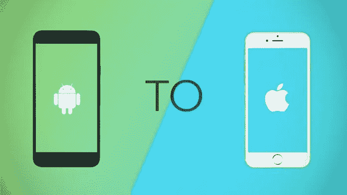
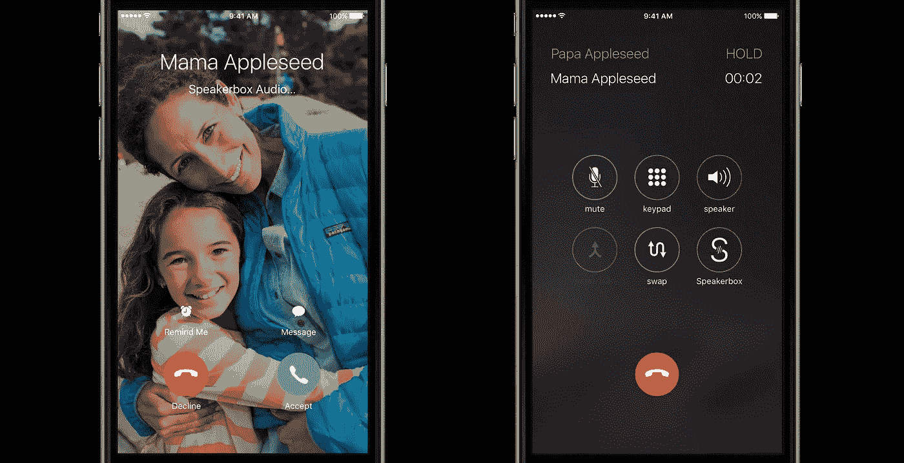
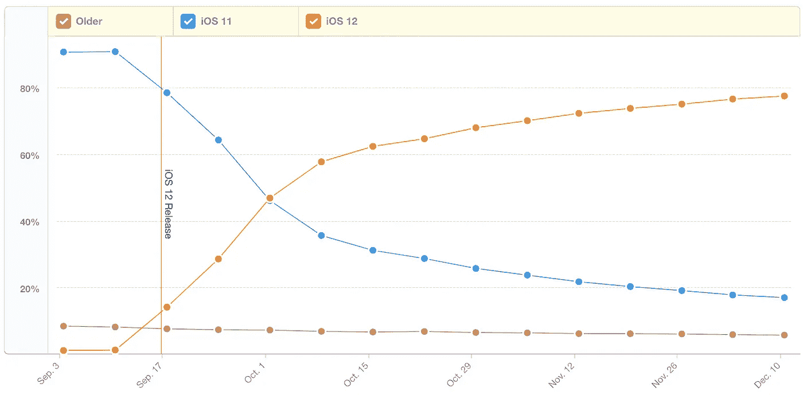
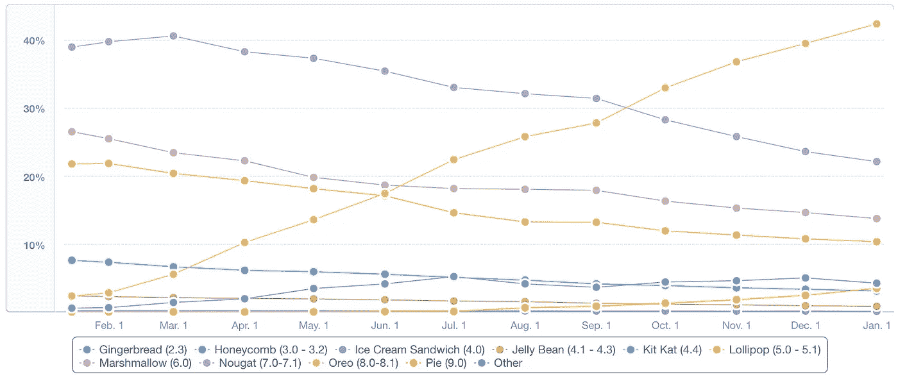

# 2018 年从 android 开发到 iOS 开发的旅程——亮点

> 原文：<https://medium.com/hackernoon/a-journey-from-android-development-to-ios-development-in-2018-kotlin-and-swift-e2601eb97174>

早在 2014 年，我就开始了我的 android 应用程序开发职业生涯，我参与了许多项目，包括需要深入了解 android SDKs 和 NDK 的核心 android 应用程序。除此之外，我还参与了 IOT 的项目，包括连接外部和设备上的传感器。

我喜欢接受挑战，喜欢参与需要我在舒适和知识范围之外工作的项目，因此我在 2017 年晚些时候开始关注 iOS 开发。了解了移动生态系统，对我来说相处并不困难，多亏了姐妹语言 kotlin 和 swift，在 swift 上工作几乎不费吹灰之力。

# TL；从 Android 到 iOS 的发展——强调更好的东西



# 根视图控制器

我正在为 iOS 编写一个网络包装器来管理所有的网络呼叫。
无论何时发出网络请求，都会显示加载器对话框，并在呼叫结束时移除。*(不是理想的方式，不过是个小 app)*
想象一下在安卓做:@你会怎么做？在每个函数中传递一个上下文，一个函数接一个函数还是放在一个常量文件中？使用应用程序上下文(这引入了一系列新问题)。

```
**let** currentVC = rootVC.presentedViewController ?? rootVC!currentVC.present(screenLoader, animated: **false**)
```


# 创建自定义视图

曾经为 android 创建过自定义视图吗？一些沉重的图表？还记得奥德罗的问题吗？它被发射了不止一次？或者您还记得 onLayoutSubviews，其中您请求了视图大小吗？
嗯，iOS 管理的很漂亮。这并不是说我们在 iOS 中没有 onDraw，但它是不同的，frame 和 bounds 真的很强大。

```
**override** **func** draw(**_** rect: CGRect) {
    **super**.draw(rect) **self**.layer.borderColor = UIColor.blue.cgColor
    **self**.layer.cornerRadius = **self**.frame.height/2
    **self**.layer.borderWidth = 2.0
    **self**.clipsToBounds = **true
    self**.setTitleColor(.white, for: .highlighted)
    (buttonColor = buttonColor)
}
```

或者您也可以在自定义视图中使用自动布局。[参见此处的示例](https://developer.apple.com/library/archive/referencelibrary/GettingStarted/DevelopiOSAppsSwift/ImplementingACustomControl.html)。


# 故事板

Android 开发者已经远离了这种祝福，无论如何他们现在正在迎头赶上。没有像 XML 这样的标记语言需要学习。你有一段时间不必看代码，这也是一种很好的感觉。拖放非常容易，你可以说，构建简单的 ui 需要常识。
没有视图 id—唷。 **IBOutlets 和 I actions**是天上掉下来的东西，kotlinx synthetic 也让它变得简单了很多，但还不够成熟。
story board 的另一个美丽之处是 **seagues** ，视图控制器之间的导航，一个适当的、更好的 backstack 和对应用程序流的理解。
有没有实现过底栏/标签栏？必须处理这些碎片。维护多个生命周期？试试在 iOS 上做:)


# 依赖注入

Dagger 和 Koin 是 android 中最流行的依赖注入库，它们需要复杂的设置和大量代码，特别是自动生成的代码，并且它们有自己的一系列错误。在 iOS 中，我们不需要任何库，只需要不容易出错且更容易实现的技术。


# 呼叫套件

我们开发了一个包含音频/视频通话的聊天应用程序。在安卓系统中，我们有太多的事情要处理。设置唤醒锁、接近传感器来禁用屏幕、保持屏幕打开、运行计时器等。
鉴于 iOS 附带的呼叫套件已经处理了所有这些情况:)

总之，呼叫工具包有所帮助，但它也限制了开发人员。



# 目标设备

苹果在 iOS 上运行的设备数量有限:iPhone、iPod 和 iPad。此外，[最新统计数据](https://mixpanel.com/trends/#report/ios_12)显示，超过 50%的用户在 iOS 11 发布后的前 3 周内将其操作系统升级到最新版本。它让 iOS 开发者的生活变得更加轻松。开发过程会更快，因为你必须为有限的设备和操作系统开发你的应用。



但如果说安卓，那就是一塌糊涂。Android 上有几十款智能手机和平板电脑，屏幕尺寸和长宽比各不相同。这意味着你的应用应该适合所有人。或者至少在很大程度上。
操作系统也是如此。在这里你找不到任何，超过 50% 的 Android 设备拥有者使用的[。这意味着在构建应用程序时，你必须再次考虑这种差异。](https://mixpanel.com/trends/#report/android_os_adoption/from_date:-365,to_date:0)



# XCode IDE

说到 IDE，android studio 在很多方面都做得更好，比如给出建议、通过点击类来导航、改进代码片段等等。但说到速度，XCode 要好得多，android studio 内存不足。导入一个项目要花很多时间，甚至运行项目有时会非常令人沮丧，尤其是在调试模式下。

# 结论

并不是说 iOS 在开发方面就比 Android 好，两者各有利弊。这篇文章关注的是我去年经历过的几个职业选手。如果我错过了什么，请评论，如果你喜欢，请鼓掌:)