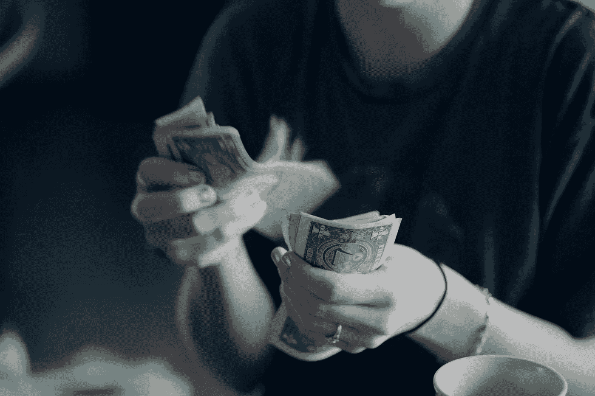

# 给密码交易所的信

> 原文：<https://medium.com/hackernoon/a-letter-to-crypto-exchanges-511eff9b0f5>

## 这个故事现在一定再熟悉不过了。虽然我想你们中的一些人可能从不同的角度体验过。也许你是一个严密的加密社区的一部分，争取让你最喜欢的资产上市。也许你是交易的一部分，要求一笔你需要的费用来达到你的收入目标，或者不必解雇在牛市期间到来的员工…也许你是一名开发人员，他被收取了疯狂的费用，而这根本不是你的责任。

然而，视角并不代表一切。在其核心，我们发现一个不可持续的商业模式，由贪婪和逐月增长的关键绩效指标驱动。

# ICO 与交易所

当时我正在为 Vertcoin 做贡献。主要是作为一个作家。在整个交易所上市交易开始变得疯狂的时候，我才真正开始做贡献。

清单过去常常会突然出现。新的小企业会认为，通过免费列出一些资产或以一些相互促销活动作为交换，与紧密的在线社区接触是值得的。

到 2017 年底，这些“友好的邻里政治”完全被大企业推到了一边。我们都责怪 ICOs……即使你以 2.50 美元的价格兑现了那艘潜艇，在某个地方，你必须知道你对我们作为一个行业所做的整个巨大的混乱有所贡献。从我们的资金中众包的巨额预算被用来贿赂交易所上市资产。交易所上调了他们的报价。时代变了，他们现在可以要求更多的钱。与此同时，ICO“投资者”对进展感到满意，直到他们不满意为止。

Photo by [Sharon McCutcheon](https://unsplash.com/photos/-8a5eJ1-mmQ?utm_source=unsplash&utm_medium=referral&utm_content=creditCopyText) on [Unsplash](https://unsplash.com/search/photos/exchanges?utm_source=unsplash&utm_medium=referral&utm_content=creditCopyText)

不过，我不是在指责谁。我承认，我什么都买了，无论什么时候。我的新闻订阅和 Reddit 决定了我应该选择的投资路线。

但这不是可持续的选择。也没有给市场的整体状况带来多少积极的影响。问题不仅在于它变成了一场高风险的游戏，还在于那些有风险的人并没有做出太多贡献。

# 英联邦心态

> 当维多利亚女王还年轻力壮时，两兄弟接管了他们父亲的可可生意，开始制作巧克力棒。他们姓吉百利，所以——剧透一下——这是一个成功的故事。他们在英国工业中心伯明翰的工厂已经发展不下去了，所以他们开始计划建造一个更大的工厂。他们买了土地，很多土地。对于一个巧克力工厂来说太多的土地了。他们设想在花园里建一座工厂，在花园里建一座城镇。乔治·吉百利颁布法令，“十分之一的地产应该被设计用作公园、娱乐场所和开放空间。”这些空间不仅仅是给吉百利的员工的。它们是给每个人的。 [**快公司，品牌宗旨是骗人的**](https://www.fastcompany.com/90293137/brand-purpose-is-a-lie) **。**

我的职业是营销人员。当我读到上面关于《快公司》品牌形象的故事时，我很好奇。

你可以看到这个非常成功的家庭。他们创立了像巴克莱和劳埃德、耐克和索尼这样的公司。然而……他们不相信简单的索取。他们认为成功是自身财富和直接环境财富的结合。毕竟，健康的树生长在良好的土壤上。

Photo by [Tom Parsons](https://unsplash.com/photos/pVmjvK44Dao?utm_source=unsplash&utm_medium=referral&utm_content=creditCopyText) on [Unsplash](https://unsplash.com/search/photos/kind?utm_source=unsplash&utm_medium=referral&utm_content=creditCopyText)

这正是我们在加密领域的绝佳机会。

# 变革即将到来

到目前为止，我对加密交易的状况相当悲观。但我们必须诚实……大多数交易所只关心中饱私囊，并一直在利用不成熟的市场来这样做。不过也不全是坏事，一些交易所/企业已经表明有不同的做事方式。在这里，我想强调其中的一些。

## **币安学院**

广受欢迎的加密货币交易所[币安](https://www.binance.com/en)一直试图弥补其上市费的可疑历史。媒体经常提到该公司，称其为上市收费高得离谱的交易所之一。然而，最近币安似乎已经吸取了教训。它现在已经开始专注于通过其名为[币安学院](https://www.binance.vision)的平台来教育人们关于加密货币的知识。这样，币安通过教育和传播这个词，把他们的一些时间回馈给了密码社区。我为他们的努力鼓掌，虽然他们可能有很多需要弥补，但这无疑是一个令人惊讶的开始！

## **Vertbase 回馈**

Vertbase 是一家提供加密货币法定网关的公司，否则获得加密货币会有点麻烦。有意思的一点是，这家公司是从[把交易获得的一部分费用返还给](https://www.vertbase.com/giving-back/)给平台上市的币的开发团队开始的。我认为这是回报环境的一个很好的方式，让你的公司获得成功，这非常符合吉百利兄弟的精神。Vertbase 的道德立场已经激发了其他类似的发展，比如创造了一种叫做 Changeangel 的互换服务。

总而言之，我们可以看到该行业正在发生一些积极的发展。尽管 ICO 的疯狂和疯狂的上市过程对该行业产生了负面影响，但好消息是，我认为我们仍能及时拯救它。你对公司如何为行业做出更多贡献有什么想法吗？或者如何说服公司应该这样做？**留下评论，我们一起讨论。**