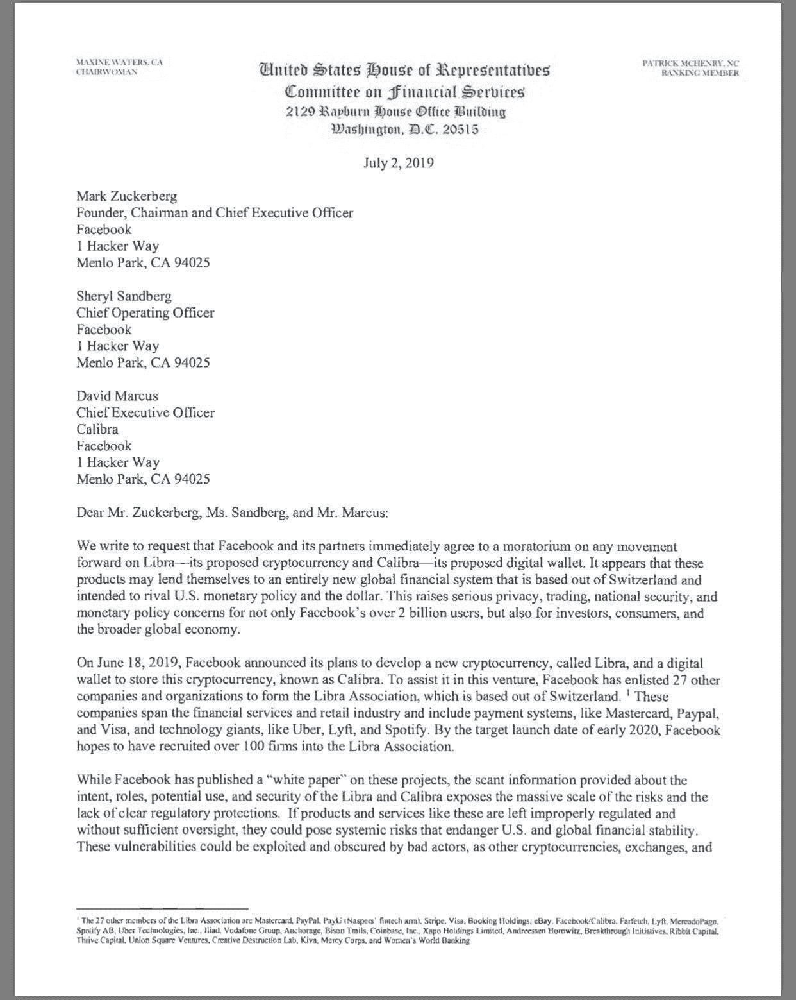
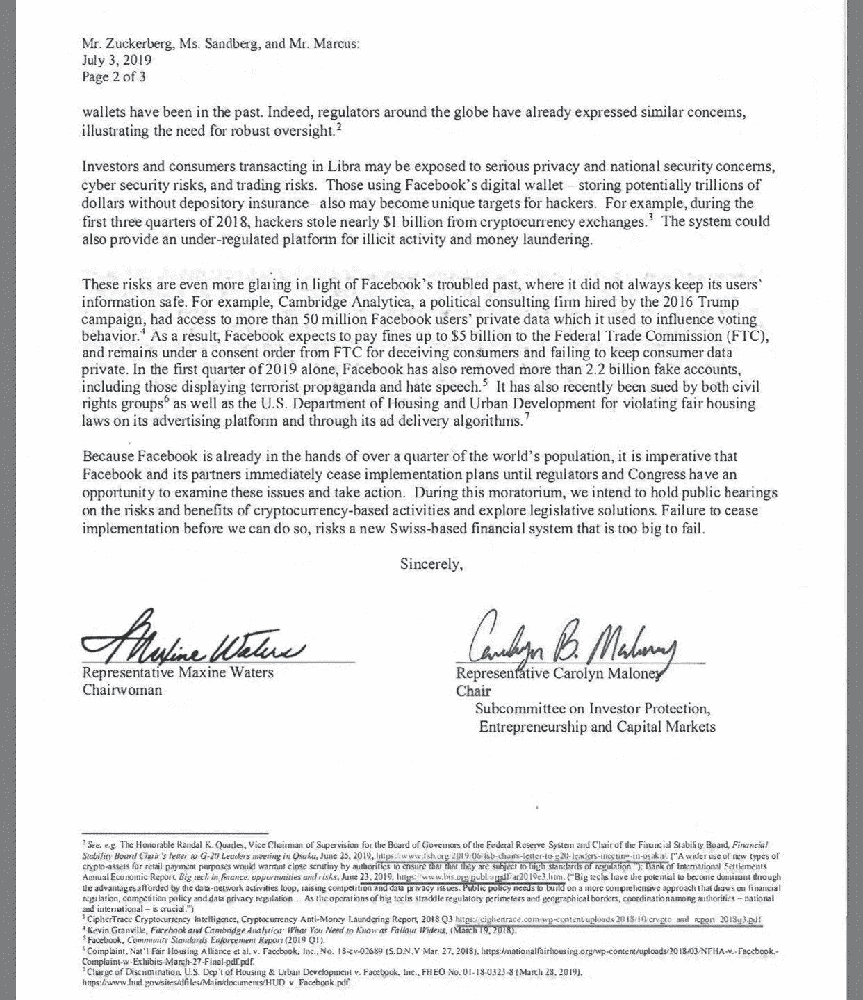
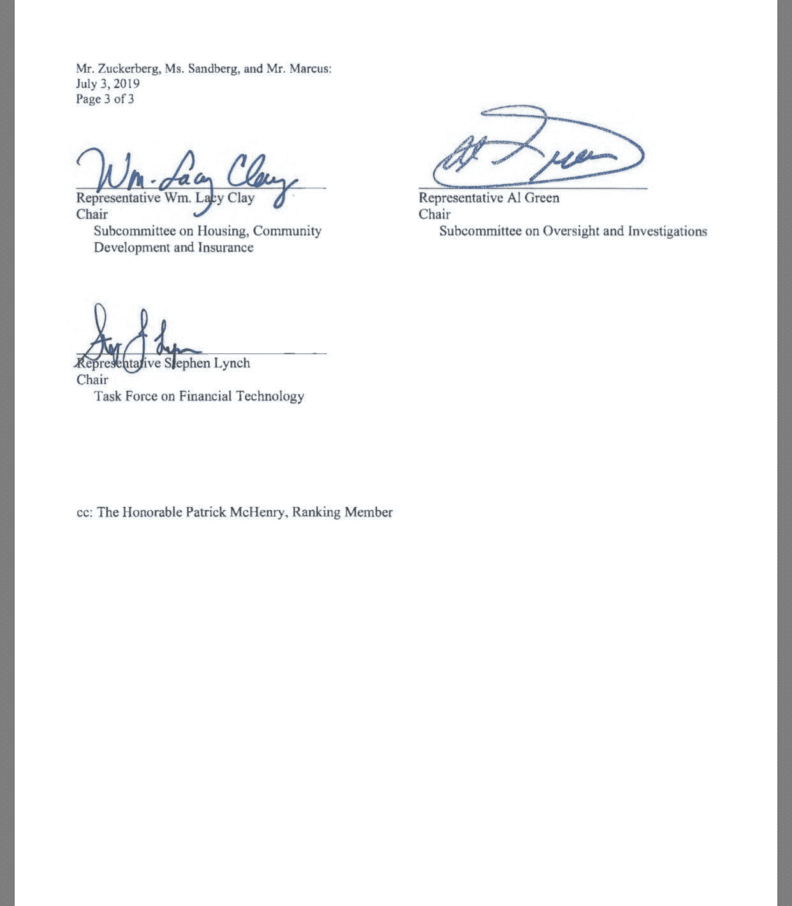

# 众议院议员正式要求脸书搁置 Libra 加密货币项目

> 原文：<https://medium.com/hackernoon/a-letter-to-facebook-611374b307fe>

美国众议院，即该国的立法者，越来越坚持阻止脸书以 Libra token 进入加密货币市场的进程。它已经发出一封信，现在又一封信给脸书的高管，呼吁停止开发代币。

共和党女议员 Maxine Waters 是第一个呼吁立法者调查 Libra 的人。现在，另外四名国会议员和她一起给马克·扎克伯格写了一封信，他现在肯定害怕快递员的到来。他们还把这封信寄给了脸书的首席运营官·雪莉·桑德伯格和 Calibra 的首席执行官大卫·马库斯。

这封信声称，几个月前在瑞士注册的 Libra 系统旨在与美国货币政策和美元抗衡。它说，“这不仅给脸书的 20 多亿用户，也给投资者、消费者和更广泛的全球经济带来了严重的隐私、交易、国家安全和货币政策问题。”

立法者还声称，该系统可能会成为“一个非法活动和洗钱的监管不足的平台。”他们说这些担忧是因为天秤座白皮书缺乏细节。

此外，为了进一步证明他们的担忧，他们提到了剑桥分析公司(Cambridge Alanlytica)丑闻，在该丑闻中，这家政治咨询公司访问了脸书的用户数据，以影响 2016 年大选的投票行为。自那以后，这一直是争论的焦点。此外，代表们指出，脸书在 2019 年第一季度删除了 22 亿个虚假账户，并表示他们对加密货币的普遍怀疑，指的是黑客窃取的金额。

这是他们叫停 Libra 项目并要求脸书高管参加参众两院听证会的主要原因。上次扎克伯格和他的同事被要求在华盛顿作证时，情况并不太好，这次他们显然也不情愿。

据消息来源称，收到这封信的三个人都还没有回复(也许它在邮件中丢失了？)扎克伯格自从 5 月份收到一封关于天秤座的问题的信后一直保持沉默。大卫·马库斯似乎会出现在 7 月 16 日和 17 日关于天秤座的听证会上，但扎克伯格和桑德伯格是否会出现是另一回事。

当然，从某一方面来说，他们是容易攻击的目标。如果国会对加密货币及其相关监管感到烦躁，那么针对已经是商业巨头的脸书对他们来说更容易，或者对他们来说更有意义，而不是把以太坊的 Vitalik Buterin 拉进来。

但是事情是这样的。就等着国会发现他们不能给比特币发信吧！