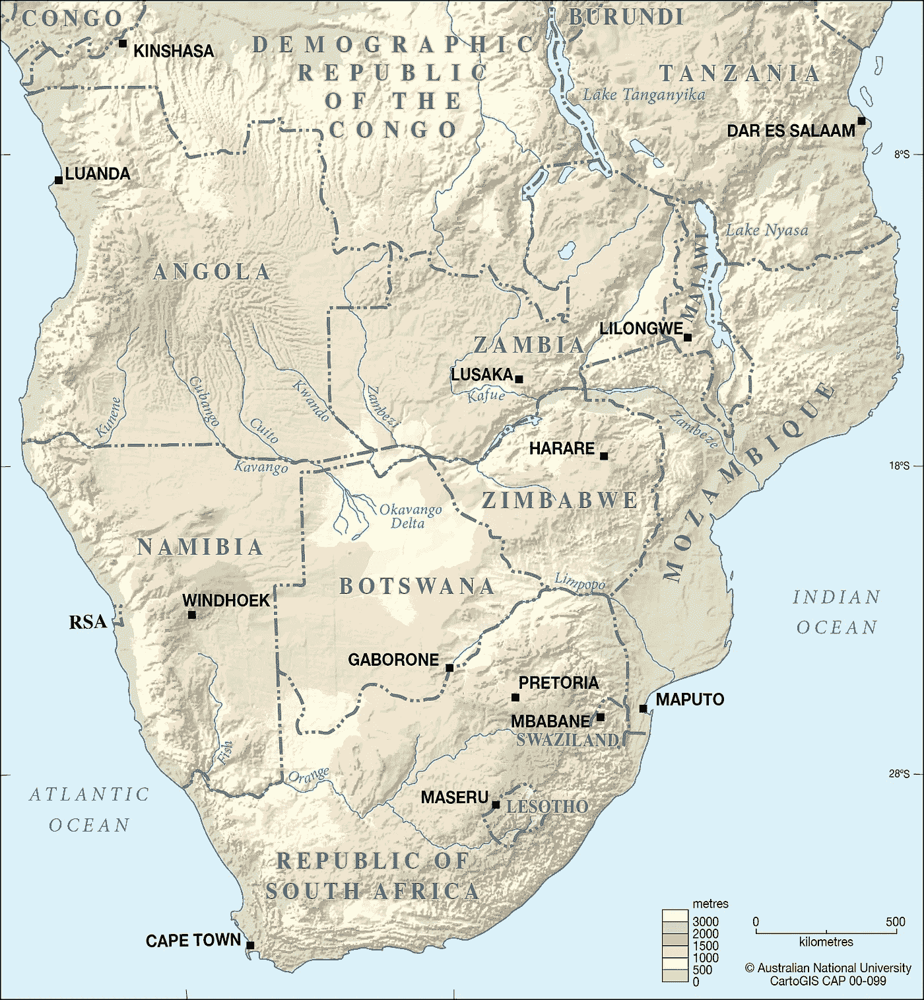
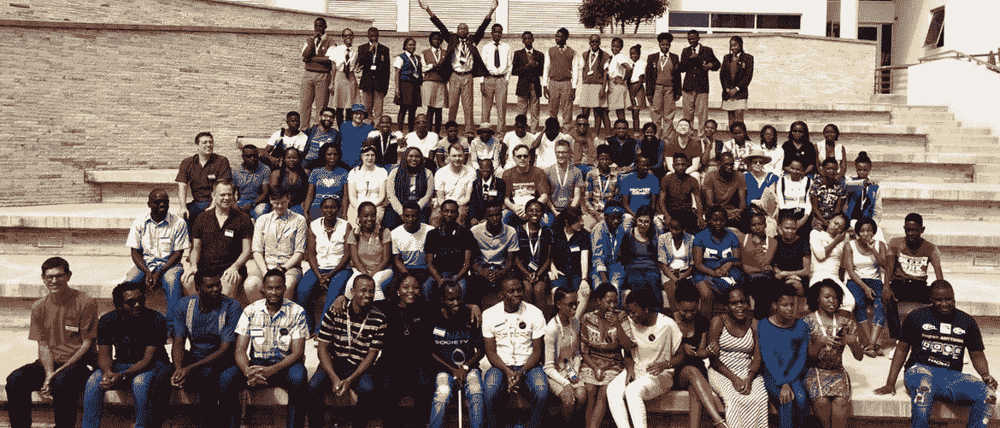
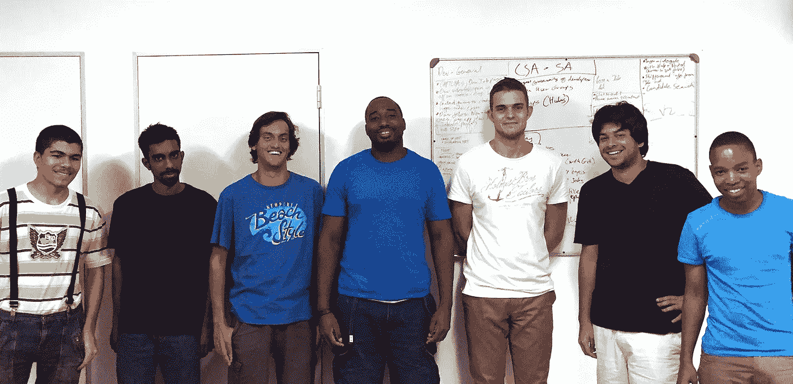
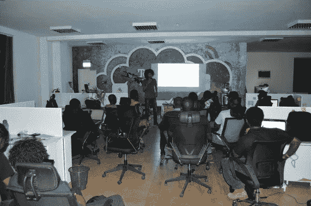
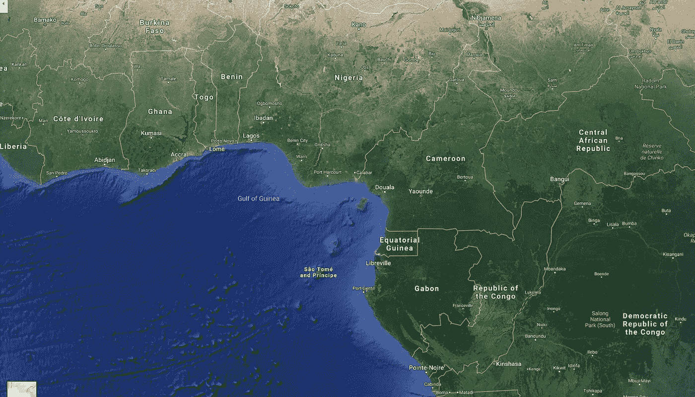

# 给非洲 Python 社区的一封信

> 原文：<https://medium.com/hackernoon/a-letter-to-the-python-community-in-africa-fe88cd0b3096>

来自澳大利亚的问候，

我不是非洲问题的权威人士。我既不是非洲居民，也不是非洲国民。我一年中大约有 1-2 个月在南非工作，但被隔离在办公室或酒店里。

在过去的 12 个月里，我被整个非洲大陆的 Python 社区的创造力和热情所陶醉，并希望利用这封信来探索和分享正在发生的一些令人惊讶的事情。

我相信更广泛的国际 Python 和软件社区可以从非洲这么多了不起的人所做的事情中学到很多。

这不是一个克服逆境的故事，这是一个充满机遇和激情的故事。根据我的经验，非洲是文化和历史的多彩拼图，你了解和探索得越多，你就越会被吸引去走得更远。

在非洲与非软件人员谈论 Python 时，你可能会得到一些有趣的表情。“非洲岩蟒”是已知最大的原产于非洲的蛇类**、**，平均成年身长 20 英尺，记录长度可达 30 英尺。如果你是来看蛇的照片和故事的，很抱歉让你失望了，但是没有。

# 南部非洲的故事

*【南部非洲】*，一般包括[安哥拉](https://en.wikipedia.org/wiki/Angola)[博茨瓦纳](https://en.wikipedia.org/wiki/Botswana)[斯威士兰](https://en.wikipedia.org/wiki/Eswatini)[莱索托](https://en.wikipedia.org/wiki/Lesotho)[马拉维](https://en.wikipedia.org/wiki/Malawi)[莫桑比克](https://en.wikipedia.org/wiki/Mozambique)[纳米比亚](https://en.wikipedia.org/wiki/Namibia)[南非](https://en.wikipedia.org/wiki/South_Africa)[赞比亚](https://en.wikipedia.org/wiki/Zambia)[津巴布韦](https://en.wikipedia.org/wiki/Zimbabwe)等国家。联合国的定义不包括莫桑比克、赞比亚和津巴布韦。

其中一些国家很小，莱索托是位于南非中部的一个多山的内陆小国。南非是一个拥有近 6000 万人口的大国，GDP 比丹麦还高。如果说这是一个多样化的国家群体，那就太轻描淡写了。

南部非洲有一些大都市，主要是开普敦、罗安达、约翰内斯堡和德班。

纳米比亚在首都温得和克举办 [PyCon Namibia](https://na.pycon.org/2018/) 会议。2018 年是迄今为止最大的 PyConNA。

参加 PyCon NA 的男性和女性各占 50%。是的，我也被这个数据震惊了。在我的一生中，我从未参加过出席率超过 75/25 的科技会议。

> 所以就像我之前说的，国际社会的其他成员应该记笔记…

他们有来自 12 个不同国家的 82 名与会者，大多数来自非洲大陆，但也有一些国际旅行者。

在整篇文章中，我将号召 Python 非洲社区中影响重大变革的人们。PyCon NA 的主席 Jessica Upani 就是这样一个人。你可以在这个视频中看到 Jessica 为激励学生所做的一些工作，

纳米比亚的 Python 是由像纳米比亚大学荣誉生 Ngazetungue Muheue 这样的人推动的。[纳米比亚 Python 协会副总裁 Ngatatue Mate](https://twitter.com/ngatatuemate) 讲述了他是如何进入 Python 并将其应用到生活中的:

纳米比亚社区的辛勤工作在青年和成人专业团体中都有所体现，比如这个故事，一名 12 年级学生构建了一个 Python 应用程序，并被刊登在国家新闻中:

otswana 正在使用 Python 处理全球性问题。博茨瓦纳-哈佛艾滋病合作项目正在使用 Python 和 Django 为其临床试验部门提供动力。

因巴韦是世界闻名的维多利亚瀑布和大量濒危动物保护区的所在地。

津巴布韦的 Python 社区正在蓬勃发展，这要归功于一群热情的 Python 爱好者，比如 PSF 的导演玛琳·姆汉加米和安娜·马卡鲁泽 T20。

Marlene 创建了 ZimboPy，这是一个为当地想要学习 Python 的女性提供的教育项目。这些课程是免费的，由当地教师授课。其中一名学生继续在哈佛学习，其他人继续职业发展。

我没想到会在哈拉雷发现两个东西，一个是使用 Python 的世界领先的网络安全程序，另一个是运行 Jupyter 的世界上最大的超级计算机之一。

在去年一次不幸的短暂访问中，我参观了哈拉雷及其新的 HPC 设施。这是现有的套房，新的将是世界上最大的套房之一。当地学生和研究人员被邀请到该设施，用完全集成到他们的 PC 实验室中的 Jupyter 笔记本电脑进行测试、假设和算法。这是尖端技术。

网络安全和 Python 在津巴布韦的采用是由 HIT 教授 Tendai Marengereke 等人推动的。你知道在你当地的大学里有使用 Python 教授的网络安全学位吗？我不知道，他们还在教帕斯卡和 Java。

南非首都约翰内斯堡是非洲的商业之都之一，是微软、甲骨文、亚马逊和 Dimension Data(我为其工作)等大型科技公司的所在地。

南非的软件工程就业市场正在快速增长。以至于谷歌和 PSF 资助了一个创业公司来帮助人们快速找到[的开发工作](http://ventureburn.com/2016/02/this-google-backed-startup-from-sa-is-training-thousands-of-coders/)。当然是由 Python 驱动的。

Hyperion team

我们在 Dimension Data 正在做的事情之一是引入 Python 作为业务自动化工具。Python 用于自动化人力资源系统、财务系统、技术操作和报告。这意味着我们需要很多人了解 Python！到目前为止，我们有多达 4000 名员工在学习初级到中级 Python。

 [## Dimension Data 如何为 31，000 名员工推出# LearnToCode 计划

### 回到 2016 年 9 月，我接受了一集《开发商火了》的采访，分享了我正在转换角色…

medium.com](/@anthonypjshaw/how-dimension-data-launched-a-learntocode-initiative-for-31-000-employees-ecaea31c11ca) 

# 去东非…

“东非”有很多国家，像[坦尚尼亚](https://en.wikipedia.org/wiki/Tanzania)、[肯亚](https://en.wikipedia.org/wiki/Kenya)、[乌干达](https://en.wikipedia.org/wiki/Uganda)、[卢旺达](https://en.wikipedia.org/wiki/Rwanda)、[布隆迪](https://en.wikipedia.org/wiki/Burundi)、[南苏丹](https://en.wikipedia.org/wiki/South_Sudan)。

甘达收容了超过 1，000，000 名难民，Python 被用作对急需机会的人进行再教育的一种方式。由 Linus Wamanya、Kato Joshua 和 Buwembo Murshid 所做的演讲讲述了 Python 在东非的一些应用。很难不被这个演讲所感动，

恩雅位于非洲东海岸，濒临印度洋，以狩猎旅行闻名。肯尼亚的两大城市，内罗毕和蒙巴萨是 Python 开发者社区的所在地。

肯尼亚首都内罗毕有一个定期的 [Python 聚会，有超过 1300 个](https://www.meetup.com/Python-Nairobi/events/)成员，人们可以在那里学习复杂的 Python 技术，比如并发和 Gevent。

肯尼亚的 PyCon“PyCon-KE”由微软和谷歌等国际科技公司以及创新的非洲金融科技公司 Jumo 赞助。

PyCon-KE 2018 的主题专注于物联网、人工智能、数据科学和 Web 开发。显而易见，有了非洲科技初创企业和当地创新者，这些公司可以蓬勃发展。数据科学在内罗毕的 PyCon 上占据了重要位置，甚至让当地的年轻人参与了当地一名高中生的“**儿童数据科学”**演讲。

2017 年的 PyCon KE 也为当地青年举办了节目，比如这种以音乐为导向的概念使用了 Sonic Pi。

 [## 皮康克

### 图纳潘达研究所有机会开展了一个三小时的研讨会，与会者学习如何…

medium.com](/tunapanda-institute/pyconke-b9ba737ffe98) 

我可以分享 100 个来自肯尼亚的故事，但我们还有另外 40 多个国家要探索…

安扎尼亚的首都达累斯萨拉姆正在招聘 Python 开发人员，作为全非洲数据新闻和公民技术基金“非洲代码”的一部分

 [## 坦桑尼亚呼吁:帮助我们在达累斯萨拉姆启动数据新闻和公民技术

### 我们正在将非洲代码扩展到坦桑尼亚，并正在寻找当地的媒体创新者和数字先锋来帮助…

medium.com](/code-for-africa/tanzania-calling-help-us-kickstart-data-journalism-and-civic-tech-in-dar-es-salaam-83403de59ded) 

> CfA 的项目包括“无人机新闻”倡议，为公民提供关于空气和水污染等问题的“可操作信息”。

万达是一个繁荣的开发商社区的主人。这是一个拥有 1200 万人口的小国，但这并没有阻止他们在数据科学和人工智能领域的创新。

当地的 DjangoGirls 团队“Django Girls Kigali”在该国首都举办讲习班，向她们传授软件开发、互联网技术和网络开发。

基加利也有社交初创公司，如 [Nyaruka](https://nyaruka.com/) ，他们使用 Django 和其他开源技术为当地公司和非政府组织开发软件。

人工智能再次在卢旺达被研究和教授，当地有一个名为“ [AI Saturdays](https://twitter.com/AISaturdaysKG) ”的小组，这是一个人工智能开发者和研究人员的社交俱乐部。

# 中非和西非

中非有大片茂密的雨林，刚果的雨林是仅次于亚马逊的世界第二大雨林。由于环境的原因，中心的人口密度很低，所以如果你再往西走，沿着海岸往上走，你会发现皮托尼斯塔有很多。

igeria 是非洲人口最多的国家，超过 15%的非洲人口居住在那里。拉各斯有一个庞大且快速增长的 Python 社区。

[Aisha](https://twitter.com/AishaXBello) [Bello](https://twitter.com/AishaXBello) ，非洲 Python 现场另一位鼓舞人心的人物，协办 PyCon-NG，PyLadies，Django Girls。

PyCon-NG，在拉各斯举办的 PyCon 是一些非洲最好的技术人才的东道主。这也是世界上最多样化的 PyCon 之一

 [## PYCON 尼日利亚 2018 年报告

### “Python:构建我们热爱的宇宙”是 2018 年尼日利亚 Python 大会的主题。它还没有…

medium.com](/@pynigeria/pycon-nigeria-2018-report-c4ecfa18a2cb) 

为了快速一瞥你错过了什么(显然，一些非常辣的辣椒酱)，看看这个视频。所有 PyCon NG 的演讲都可以在 YouTube 上看到。

尼日利亚的另一个大城市是首都阿布贾，也是一些不断发展的 Python 社区的所在地。其中一个社区是阿布贾女孩组织。

DG Abuja 由一组志愿者教练管理，如 [Akoh James](https://twitter.com/akohrr) 和 [Adeshola Funmilayo](https://twitter.com/@desamoye) 。看着所有这些成功并认为它“就这么发生了”可能很容易，但如果没有所有这些鼓舞人心的人的奉献和辛勤工作，这是不可能的。

贝宁西部的 ogo 是 Python 领域的新面孔，它正在与 Python 加纳和 Python CI 联手。这三个国家接壤，位于非洲的西南海岸。在洛美有一个即将到来的 [GDG 活动](https://www.meetup.com/GDG-Lome/events/254972383/)议程上有 AI(我想，是用法语写的)。

G hana，隔壁是 2019 年第**届** [**PyCon 非洲**](https://twitter.com/pyconafrica) **的东道主。读完所有这些故事后，我决定我不能错过，所以我在我的日历上做了标记，我将在阿克拉见每个人。**

2018 年加纳 PyCon 是加纳的第一次 PyCon，但它看起来像是一次巨大的成功

多亏了像米米·达特这样的人和阿比盖尔·道格比这样的人，皮拉迪斯·加纳才得以建立和运行。在北部的佤邦、东部的何以及主要城市阿克拉和库马西都有车间。

加纳的皮拉迪斯夫妇最近去了一家名为 Esoko 的公司实地考察，这家公司利用技术和移动应用帮助偏远社区的农民。

与加纳(象牙海岸)相邻的科特迪瓦也有一个 Python 社区，与加纳和多哥合作。

在首都阿比让成立了一个 Django 女孩分会，今年你会在 PyCon Africa 看到许多社区。

# 北非

可悲的是，这与其他地区的情况不同，利比亚和苏丹存在严重的人道主义危机。

orocco 在 Casablanca 主办了一个新的 [Pydata 会议](http://nodesandedges.me/article.php?id=18)，该会议涵盖了来自当地研究人员和开发人员的 Python 演讲中的数据科学

埃及首都开罗有一个 [PyData 章节](https://twitter.com/PyDataCairo)也有一些有趣的谈话和研究

# 结论

Python 非洲的故事还在继续扩展和发展。这是一个充满惊喜、机遇和激情的故事。

没有众多的志愿者、倡导者、教师和导师(只提到了其中的一小部分)，这一切都不可能实现。

此外，还要特别提到 Python 软件基金会和 Django 软件基金会，感谢他们慷慨资助了这些聚会和团体。

我迫不及待地想看到这个故事如何展开，我会在 2019 年的 PyCon Africa 上看到你，我希望在那里也能看到你…

> …我希望你们能记笔记。

你真诚的，

安东尼·肖

在 [Twitter](https://twitter.com/anthonypjshaw) 、 [GitHub](https://github.com/tonybaloney) 或 [LinkedIn](https://www.linkedin.com/in/anthonypshaw/) 上关注我，如果你有任何关于这篇文章的其他故事想要分享，请联系我。