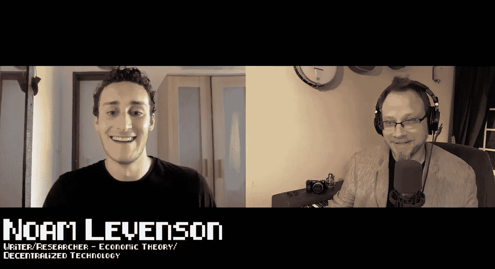

# 与作家诺姆·李文森一起看当前和未来的加密货币前景

> 原文：<https://medium.com/hackernoon/a-look-at-the-current-and-future-cryptocurrency-landscape-with-writer-noam-levenson-cb06d8cf287a>

## 黑客正午播客第 43 集:采访作家诺姆·李文森。

## 如果没有真正的质数 T1，这一集的黑客正午是不可能的。

在 [iTunes](https://itunes.apple.com/us/podcast/product-iteration-with-hacker-noon-interim-cto-dane-lyons/id1436233955?i=1000421970409&mt=2) 上听采访，或者[谷歌播客](https://play.google.com/music/m/Dfuna5a4pzsmjr76bxabkxdrhim?t=Product_Iteration_with_Hacker_Noon_Interim_CTO_Dane_Lyons-Hacker_Noon_Podcast)，或者在 [YouTube](https://www.youtube.com/channel/UChu5YILgrOYOfkfRlTB-D-g) 上看。

在这一集《黑客正午》的制片人中，[德里克·伯纳德](http://www.haberdasherband/production)采访作家，[诺姆·李文森](https://hackernoon.com/@noamlevenson)。讨论的主题围绕加密货币对经济和国际社会的当前和未来全球影响。

*“我认为这是一个更大的问题，人们有时会以错误的方式对待它”*

我不确定在这种情况下中央集权一定是不好的。我认为重要的问题不是分散还是集中。这就是垄断的可能性。”

***——****诺姆·李文森*

 [## 与作家诺姆·李文森一起看当前和未来的加密货币前景

### 黑客正午播客第 43 集:采访作家诺姆·李文森。黑客正午这一集是…

www.podbean.com](https://www.podbean.com/media/share/pb-bks5u-b13b45) 

制作和音乐德里克·伯纳德—[haberdasherband.com/production](http://haberdasherband.com/production?fbclid=IwAR2d8t0cNGHRm1ajmUNWKZ-TMUMawREhvIHSy54LKcOElf7v_TOvkAjZ78Y)

[https://hackernoon.com/](https://hackernoon.com/)

[https://community.hackernoon.com/](https://community.hackernoon.com/)

[https://contribute.hackernoon.com/](https://contribute.hackernoon.com/)

[https://sponsor.hackernoon.com/](https://sponsor.hackernoon.com/)

[https://podcast.hackernoon.com/](https://podcast.hackernoon.com/)

[https://twitter.com/hackernoon/](https://twitter.com/hackernoon/)

https://facebook.com/hackernoon/

## 还可以查看[五月头条](https://hackernoon.com/archive/2019/05)、[最新故事](https://hackernoon.com/latest-tech-stories/home)和[今日首页](http://hackernoon.com/)。