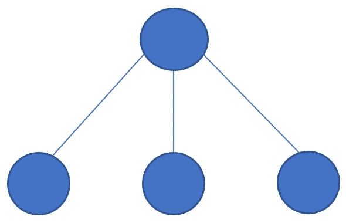

# IBM 员工流失和绩效的机器学习方法

> 原文：<https://medium.com/hackernoon/a-machine-learning-approach-to-ibm-employee-attrition-and-performance-b5d87c5e2415>

## 预测有价值员工的流失…..

在一家 IT 公司中，有许多可用的员工架构。一些 IT 公司或特定部门或特定级别遵循*首席程序员*结构，在这种结构中，有一个围绕“首席”职位的“星形”组织，该职位被指定给最了解系统需求的工程师。

**Chief Programmer Architecture**