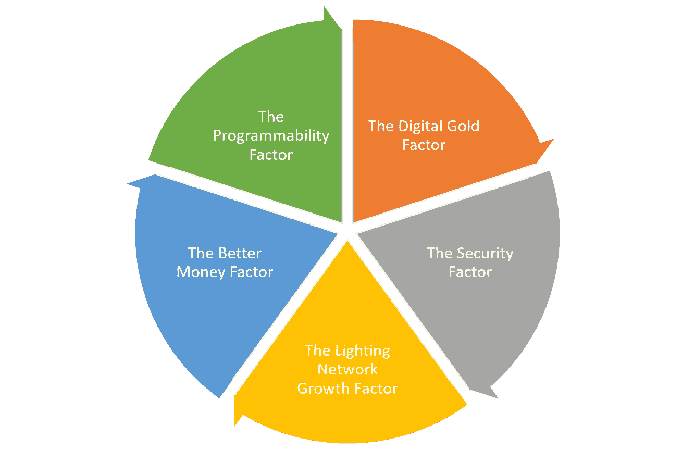

# 比特币区块链中的安全令牌

> 原文：<https://medium.com/hackernoon/a-match-not-made-in-heaven-but-possible-security-tokens-in-the-bitcoin-blockchain-673a55c44dab>

## 天造地设的一对…但这是可能的

在最近的一次安全令牌活动中，我问一群小组成员，他们是否认为在不久的将来我们会在比特币区块链中看到安全令牌，这让他们感到惊讶。专家组似乎对我选择的问题感到困惑。这在技术上可能吗？这有什么关系吗？虽然我的问题没有引发我所希望的辩论，但毫无疑问，比特币区块链中的安全令牌至少看起来很有趣。今天，我想更详细地探讨这个想法。

在安全代币市场经历了一年的发展之后，以太坊作为发行加密证券的首选平台，实际上仍未受到挑战。其他区块链运行库在安全令牌竞赛中的进入似乎是一个备受期待的，并且几乎是不可避免的，在不久的将来市场的发展。虽然安全令牌运行时的显而易见的候选对象是基于智能合同的区块链，如 EOS、Cardano 或 Stellar，但比特币区块链不应被完全抛弃。

几个月前，在比特币区块链中使用安全代币的想法似乎很可笑。然而，比特币作为市场上最主要的加密资产的巩固，当前安全令牌浪潮相对简单的结构，以及支持比特币区块链的基础设施技术的快速发展，都使比特币成为下一代加密证券的有趣选择。虽然仍有重大的技术挑战需要解决，但根据最近的市场发展，比特币区块链中安全令牌的想法可能比我们想象的要近。

# 比特币区块链中影响安全令牌路径的一些因素

比特币区块链的安全令牌背后的基本原理相对简单。市场上占主导地位的加密网络难道不应该成为下一代加密资产的基础吗？扩展到该论文的理论价值之外，一些非常有形的市场和技术发展正在影响比特币区块链中加密证券的出现。如果我们从技术和金融角度分析比特币的现状，有五个基本因素可能会催化比特币区块链成为加密证券的可行运行时。

## 数字黄金因素

比特币是黄金的数字和可编程版本的论点是比特币纯粹主义者最喜欢的福音之一。不管你是否同意这个论点，毫无疑问，比特币已经被证明是当前加密货币市场中最有效的价值储存手段。如果比特币作为加密领域最受欢迎的资产配置工具继续扩张，比特币区块链将为重新想象复杂的金融场景提供最佳机会。就安全令牌而言，在金融资产配置最多的区块链上运行有一些明显的好处。

## 安全因素

在金融市场，随着资产类别的演变，它们往往倾向于最稳定、最安全的基础设施。推断安全令牌的这种想法，比特币区块链已被证明的安全性和鲁棒性可以成为最复杂的加密证券的一个令人难以置信的吸引力因素。虽然计算效率低下，但比特币区块链的工作证明(PoW)共识模型的高回报已经建立了其他加密网络无法比拟的安全和稳定水平。作为高度监管的工具，安全令牌可以极大地受益于比特币区块链的安全性和稳定性。

## 照明网络增长系数

可扩展性是比特币区块链的最大限制之一。像[照明网络](https://lightning.network/)这样的努力旨在克服其中一些限制，并将比特币的价值扩大到每秒数百万次交易。最近几个月，Lightning 网络的增长速度惊人，正在迅速接近网络中的 6000 个节点和超过 20000 个支付通道。照明网络的功能，如侧面支付通道、智能合同或跨区块链交易，与安全令牌密切相关。随着照明网络的发展，它可能成为下一代加密安全的可行运行时。

## 更好的货币因素

比特币仍然是加密资产世界中最好的货币形式。尽管比特币已经发展出明显的货币属性，比如通缩性和稀缺性，但以太仍然具有通胀性和充裕性。从这个意义上说，比特币是一种远比以太优越的货币形式。比特币类似货币的特性使其成为与安全令牌空间相关的支付和金融场景的更好候选。正如许多金融证券场景只可能出现在拥有美元或瑞士法郎等强势货币的经济体中一样，许多安全令牌场景将依赖于最佳形式的数字货币，也就是如今的比特币。

## 可编程性因素

比特币区块链的价值通常局限于货币轨道，而不是去中心化应用的运行时。然而，这种情况正在迅速改变。近年来，比特币区块链中智能合约平台的发展引人注目，这些项目的开发者社区也在增长。随着越来越多的开发者尝试比特币区块链，他们似乎不可避免地会找到进入安全令牌的途径。

# 哪些平台会启用比特币区块链中的安全令牌？

比特币区块链开发者平台的快速增长，使得在这个加密网络上运行更复杂的场景成为可能。虽然理论上有几个平台可以在比特币区块链中实现安全令牌，但我认为有两个平台在技术和金融上更有优势，可以在加密证券和比特币之间架起一座桥梁。

## 块流

[Blockstream Elements](https://blockstream.com/elements/) 是比特币区块链中最有趣的安全令牌选项之一。从概念上讲，Elements 是比特币区块链的侧链，但它的价值远远超出了计算能力。该平台支持资产发行、保密交易或联合双向挂钩等功能，这些功能似乎是为安全令牌世界设计的。

## 根茎

在加密领域，我最喜欢的技术之一，根茎(RSK)是将智能合约和可编程性引入比特币生态系统的最前沿。RSK 智能合约语言提供了一种相对简单的方法来适应安全令牌协议，如比特币区块链中的 DS 或 ST-20。此外，RSK 不断增长的开发者社区可以成为安全令牌发行的巨大资产。

一年前，比特币区块链中安全令牌的想法似乎是不可能的，但现在不再是了。比特币基础设施和开发者生态系统的发展，比特币作为市场上占主导地位的加密资产的巩固，以及安全令牌的快速发展，看起来是一个很好的组合，可以在比特币区块链中实现第一组安全令牌。