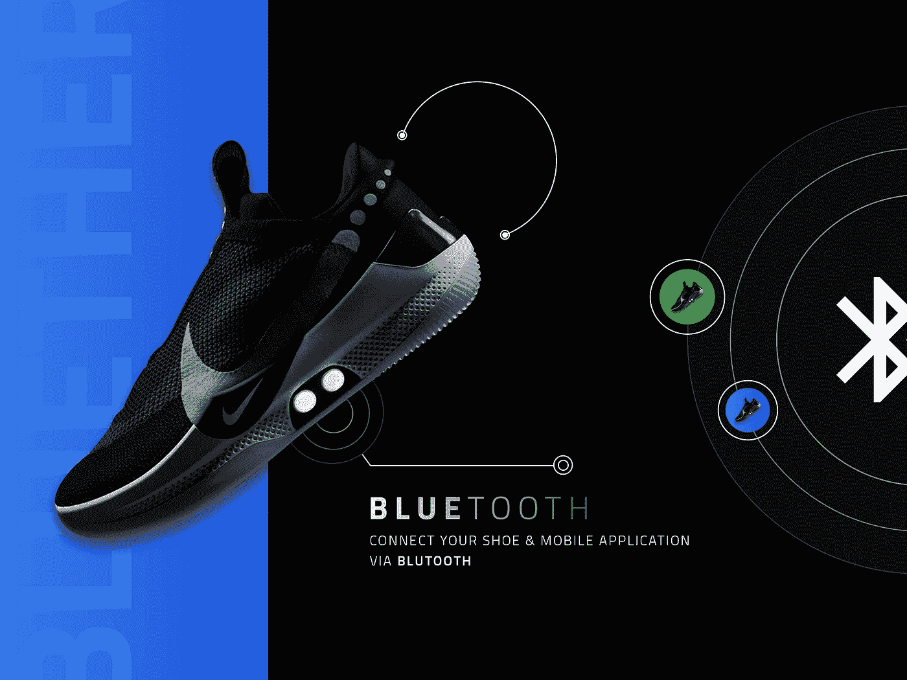
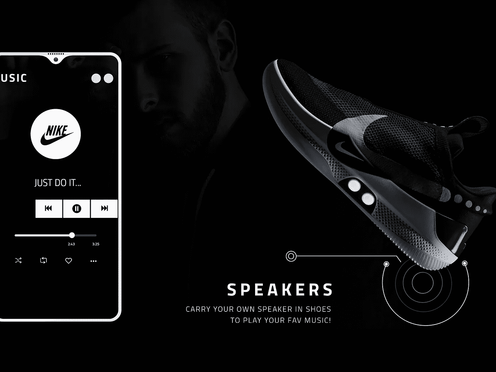
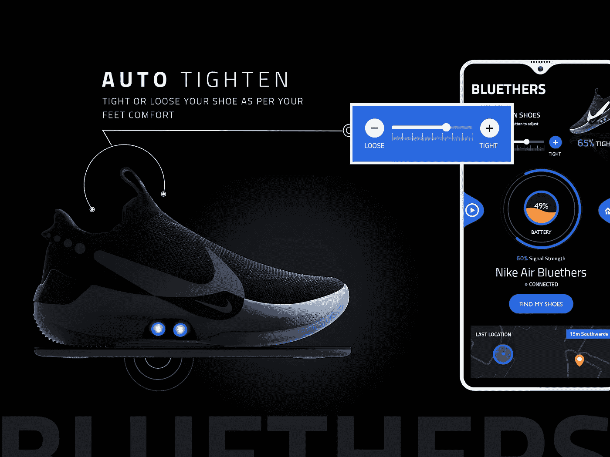
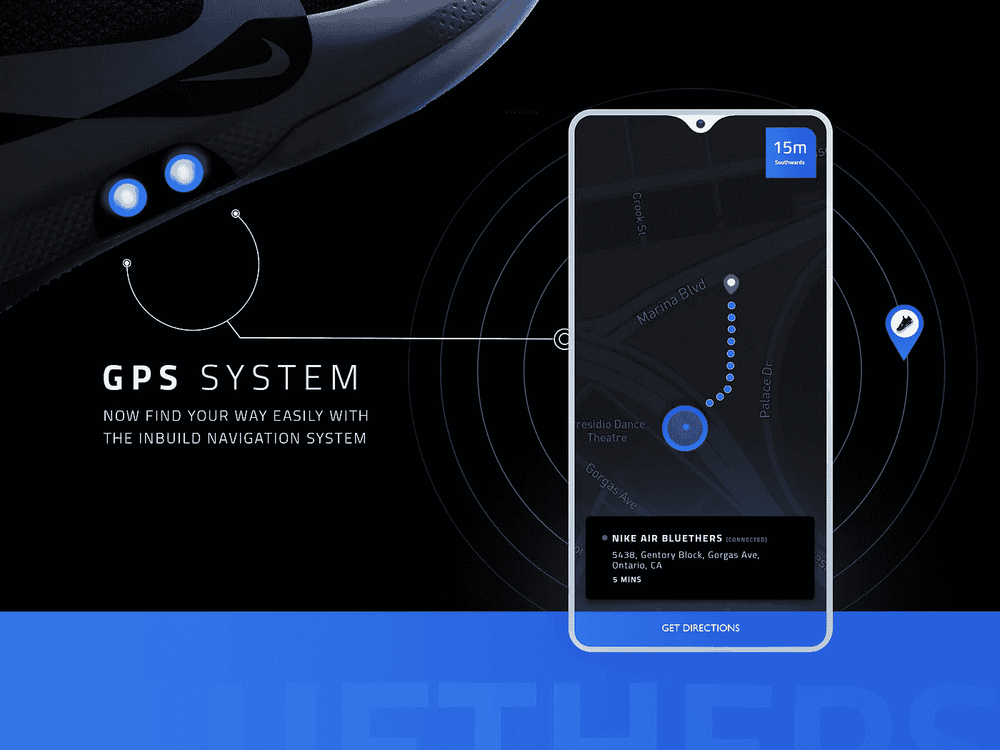
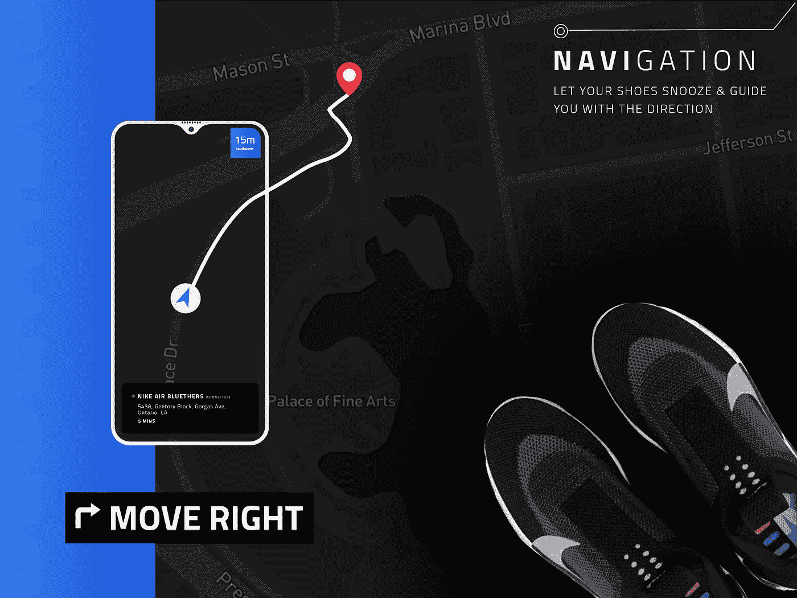
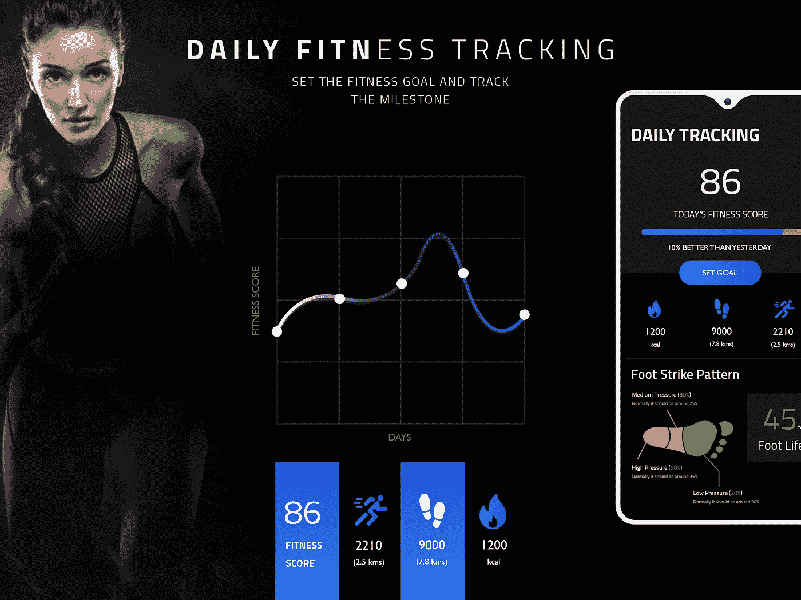
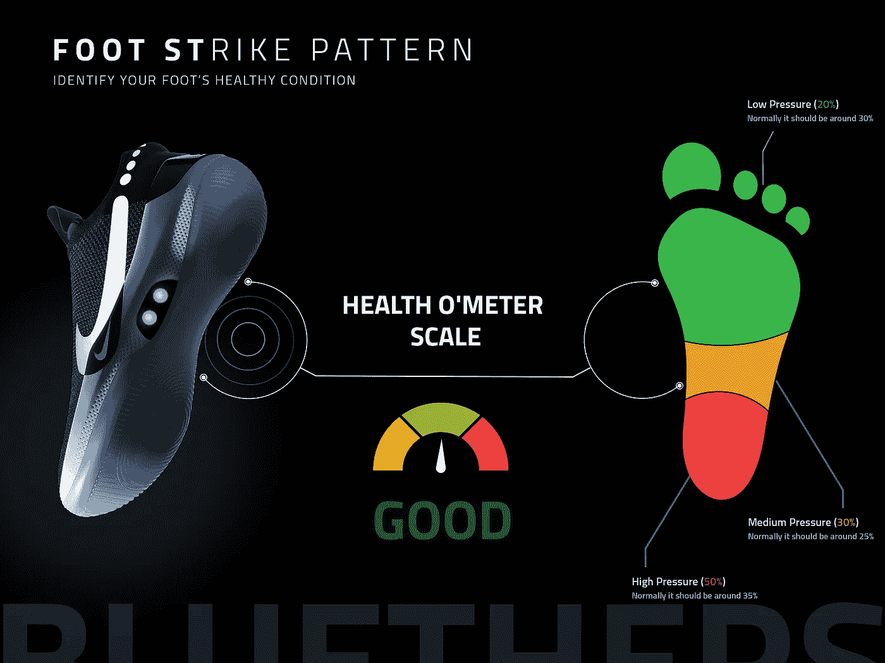
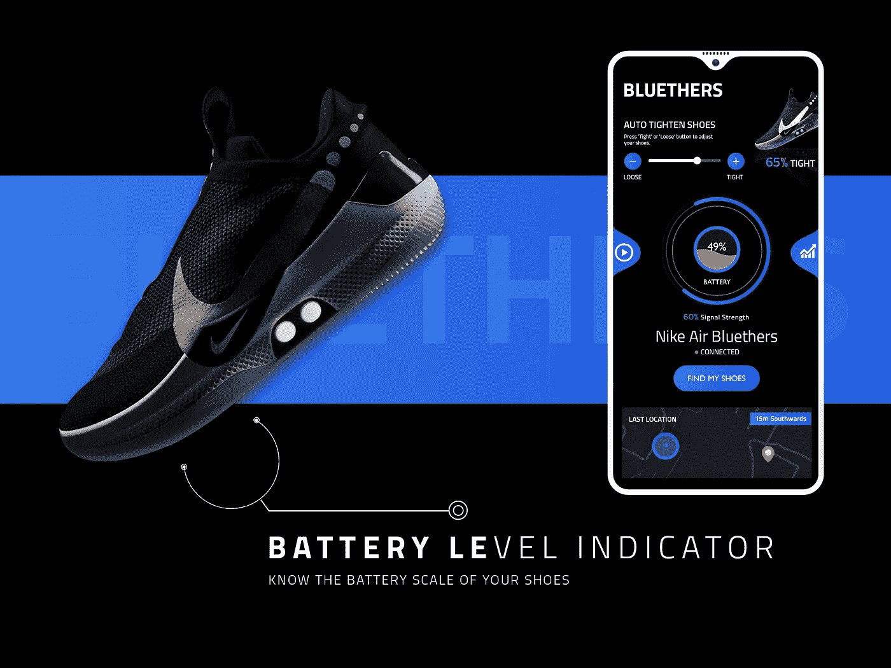

# 耐克智能鞋 Adapt BB-Bluethers 的移动应用程序概念

> 原文：<https://medium.com/hackernoon/a-mobile-app-concept-for-nikes-smart-shoes-adapt-bb-bluethers-3f53693dcef7>

可穿戴技术的快速发展不容忽视，因为与电脑领域的移动应用相比，现在的发展更加严格和先进。我们正处于创新的时代，这是今天大多数商业博客传达的信息。

随着 Nike Adapt BB 智能鞋的发明，现在的智能手表时代已经成为过去的时代。是的，耐克智能鞋在可穿戴智能技术的进化时代迈出了一大步，重新定义了运动鞋的技术界限。有史以来第一款可以通过手机应用程序控制的自由系带鞋。

# 移动应用是可穿戴技术的支柱吗？

是的，它们在可穿戴技术中扮演着重要角色。从可穿戴技术进入科技行业的那一刻起，它就已经成为一种时尚，现在正成为一种趋势，并将永远存在下去。然而，据[商业内幕](http://www.businessinsider.in/Wearable-Devices-Wont-Succeed-On-The-Mass-Market-Until-More-Apps-Become-Available/articleshow/33868517.cms)报道，如果[移动应用开发](https://www.cmarix.com/mobile-application-development-services-india.html)没有采用可穿戴技术，可穿戴设备就不可能越来越受欢迎。[创建一个应用](https://www.agicent.com/blog/how-to-create-an-app/)有助于消费者丰富有效地使用设备的功能。它们改变了我们使用设备的方式。因此，从那时起，跨平台集成变得越来越突出，似乎越来越少。

> “到目前为止，全球已有超过 3 . 25 亿台可穿戴设备投入使用”

# **Nike Adapt 应用在定制可充电智能鞋中的作用**

如今，移动应用被赋予了各种各样的技术控制权，不是吗？Nike self-lacing 运动鞋很容易与 iPhone 和 Android 应用程序配对，即 Nike Adapt 应用程序。这个应用程序有助于定制功能，使您能够收紧鞋子，选择鞋外发光的 LED 颜色，检查电池等等。是的，现在让你的手控制你的鞋。

该应用的几个功能:

*   远程调整你的适合度
*   保存多次拟合
*   定制灯光
*   检查你的费用
*   牢固地连接你的鞋子

# **CMARIX 为耐克鞋推出了新设计的应用概念——Bluethers**

新鲜的想法和持久的结果。我们的一天以这句咒语开始和结束。创造新概念和重新设计现有解决方案以获得更好的结果，帮助我们为 100 多家财富公司和初创公司创造了成功。耐克最近发布的智能鞋 Adapt BB 抓住了我们的创新愿景，给了我们重新创造整个概念的想法。我们分析了概念，观看了每个屏幕，记录了解决方案和改进，以提高可用性。

**我们如何综合技术和设计来创建一款卓越的智能鞋应用**

**易用性** —易用性应该永远超越“易用性”。可用性总是被定义为这样的参数——有效、高效、吸引人、容错、易学。在这个设计中，我们不仅使其易于学习，甚至简化了上述各种参数，从导航到清晰度，从有效性到效率。

**有影响力的用户界面**——如今，我们每个人最关心的是外观——界面。牢记用户的需求和使体验令人满意和愉快的必要性，我们确保设计是极简和可及的。为此，我们在这里选择了深色的用户界面，因为大多数运动和健身的人喜欢深色。除此之外，深色也能提高表现。

小动画被用作引人发笑的元素，使设计更加多样和抽象。动画为复杂的技术概念提供了一种简单有效的表达方式。

技术传奇与引人注目的界面的惊人融合是为了使可用性简化和有效。

**更好的特性** —特性是应用成功的重要因素。为了最大限度地利用智能技术产品，我们需要选择对用户有益的应用程序功能。因此，我们选择了一些最需要的功能，使该应用程序成为一个完整的健身解决方案包。

## **Bluethers 应用功能**

**蓝牙连接** —通过蓝牙连接您的应用和设备，为用户提供了一种简单易行的共享和访问数据的方式。

**扬声器** —当你不必随身携带手机时，在锻炼过程中听音乐是多么容易和放松。此功能可让您在跑步或去体育场时播放喜爱的播放列表。

**自动系紧鞋子** —鞋子中的电动自适应反作用鞋带技术使自系鞋带鞋子成为可能——它通过电子方式调节鞋带、压力和鞋子的合脚度。

现在，这个功能肯定会问你关于鞋的工作，不是吗？让我们来理解工作原理。

# **耐克智能鞋的工作原理**

耐克最近将新的第一个自我系带篮球鞋推向市场，适应 BB。当你踏进这双鞋时，它就有了生命。它能感应到你，并根据你的脚型调整鞋子。这款新运动鞋可以根据每个篮球运动员的脚的尺寸进行定制，该公司感谢 fit adapt——这是一个动力鞋带系统，可以自动或通过移动应用程序进行调整。

所以想知道，智能耐克鞋是怎么工作的？

根据耐克的说法，一旦你穿上这双鞋，“一个定制的电机系统和齿轮系会感应到足部所需的张力，并相应地收紧以保持足部舒适”。此外，“脚下系带的拉伸强度能够承受大约 32 磅的力，以便在每次运动中保护足部”

全球定位系统(GPS)—你在路上吗？忘记回家的路了吗？别担心，鞋子里的 GPS 导航系统会指引你回家的方向。

**导航** —向右还是向左移动？这双鞋将帮助你在打盹的帮助下知道是向右还是向左移动。所以，当你在奔跑中不想使用手机时，你可以在贪睡的帮助下到达目的地。

**健身追踪**——在这里你可以设定自己的目标，检查每天的健身量表，从而睡得更好，提高整体健康水平。

**足部健康** —跑步时，你的脚掌会对你的舒适度和表现产生很大影响。了解你的跑步风格，并对速度、能量消耗，甚至每次穿上运动鞋受伤的风险产生重大影响。

**电池电量指示器** —准确知道你还剩多少电量，并在你需要给鞋子充电时得到通知。

**结论**

如今，对可穿戴技术的评估不断增加，从监测健康状况的智能手表到智能鞋。CMARIX 通过提供领先于行业时代的新一代技术，服务于从医疗保健到电子商务的各个行业。

> 如果你有这样一个革命性的想法，并且正在寻找一个移动应用程序开发者来使你的应用程序概念值得使用的技术设备，你可以通过**biz@cmarix.com**或[联系我们**联系我们**](https://www.cmarix.com/inquiry.html) 。

> 最初发表于 2019 年 5 月 13 日[https://www.cmarix.com](https://www.cmarix.com/cmarix-delivers-a-mobile-app-concept-for-nike-adapt-bb-bluethers/)。