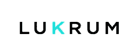

# 雷伊·达里奥推荐的必备加密投资词汇

> 原文：<https://medium.com/hackernoon/a-must-know-crypto-investment-glossary-recommended-by-ray-dalio-b9076b989f4a>

[Designed by LUKRUM](https://lukrum.tech/)

作为不断增长的[加密货币](https://hackernoon.com/tagged/cryptocurrency)领域的新投资者，你可能会对探索市场和在论坛上聊天时遇到的术语感到不知所措。为了帮助你熟悉加密口语，LUKRUM 为你提供了一个基本的术语表，让你对投资数字货币有一个基本的了解。

**区块链**

抗修改数据块的链表。加密货币交易使用加密技术在[区块链](https://hackernoon.com/tagged/blockchain)上按时间顺序公开记录。

**比特币**

比特币(BTC)是一种数字化的点对点货币，它的存在不需要中央银行或中介。

**山寨币**

比特币之外的任何加密货币模型都可以被正确地称为替代货币。

**以太坊**

与比特币不同，以太坊是一个区块链平台，旨在允许其他项目运行智能合约协议，如果满足某些商定的条件，就可以执行给定的任务。以太币(ETH)作为一种激励机制。**叉子**

协议的改变。一个**硬分叉**废弃了旧的协议，而一个**软分叉**是向后兼容的。*比特币现金(BCH)和以太坊经典(ETC)都是硬分叉的例子。*

**共识算法**

区块链网络的规则，旨在防止欺诈(以重复消费的形式)和验证交易。

**工作证明(PoW)**
比特币的**共识算法**是一个工作证明系统，其中**矿工**在被添加到区块链之前，通过竞争解决区块来验证网络内的交易。

**股权证明**

以太坊的共识算法是一个赌注系统的证明，其中区块链网络**矿工**将他们的以太网赌注放在与网络相连的本地钱包中，并承诺公平处理交易，以换取**采矿奖励**。

**交易所**
加密货币交易所，如币安或比特币基地，使用户能够用加密货币交易其他数字或法定资产。

**令牌** 基于基础区块链的价值单位。令牌的使用取决于平台，可以用于支付/费用、访问权限、投票和许多其他功能。

Bug 赏金
发现计算机代码“Bug”或问题的奖励。

**赏金**
完成某项任务所提供的奖励。

从参与奖金中获利的人。

**拉高抛售方案** 一种投资方案，发行者通过提高资产价格来出售资产以获利。

**循环供给**

市场上流通的硬币的大概数量

**总供应量**

现有硬币的总量，包括市场上的和未流通的。通常，总供应量等于或大于循环供应量。

**最大供应量**

将被开采或生产的最大数量的硬币。注意:一些硬币有无限的供应量。

**市值(市值)**

决定一枚硬币或一组硬币的价值，计算方法是将当前硬币价格乘以流通供应量。这种计算也可以用于分析硬币或公司的分组，以确定集体价值。

**ICO**

ICO，即初始硬币发行，是一种出售新代币以换取比特币、以太坊和/或法定货币的筹款活动。投资者不是购买一家公司的股权，而是获得一种新的代币，期望它会增值或给予他们获得项目特定机会的机会。

**软帽/硬帽**

有上限的 ICO 有筹款上限，它的硬上限和软上限代表筹款目标。硬上限是绝对的极限，而软上限只是一个假设的最小值。

资产价格的极度波动。

**ASIC**
‘专用集成电路’。用于加密货币**开采**的计算机芯片。

**挖掘** 交易完成的验证过程一个区块被添加到一个区块链中。

**采矿池** 一群矿工共享他们的计算机资源和采矿的报酬。

**挖矿奖励**
志愿提供计算机资源验证加密货币交易的奖励，往往是一种加密货币或交易费用的一部分。

**节点**节点
区块链网络上的任何设备

**排放曲线/排放计划**

硬币开采时间表

FOMO“害怕错失良机”是波动的市场让投资者产生冲动的结果。

**FUD**
‘恐惧、不确定、怀疑’指的是在硬币上散布毫无根据的、消极的观点。

**HODL**
最初是 BitcoinTalk 论坛上的一个错别字，一个叫霍德勒的人是一个打算“拼命坚持”的密码交易员。

**Bagholder** 在**抽走和抛售方案**后，持有一笔贬值资产或一枚硬币的人。

看跌的人预计市场和价格会下跌。

看涨的人预计市场和价格会上涨。

拥有大量资产储备的投资者。

**51%攻击** 某人获得超过 50%的**节点的控制权**对区块链网络有贡献意味着控制了该网络，并且能够验证双重花费交易。

**翻盘** 以太坊总市值超过比特币的事件。

专业投资需要专业知识，而加密带来了一系列全新的挑战。我们的基本加密货币术语表不仅应该为您提供日常术语的概述，还应该作为您更深入研究的起点。请务必将此页面设为书签，并查看我们的其他博客帖子，了解更多关于加密货币投资的有用信息。

你认为我们的清单中缺少了什么吗？请在评论中告诉我们。

你已经用过 LUKRUM 了吗？

[LUKRUM](https://lukrum.tech/?utm_source=medium) —最安全的加密货币投资组合经理。该应用程序允许与所有 exchange 帐户或区块链钱包自动同步，以跟踪数字资产。开始使用免费的&安全应用程序进行交叉投资组合分析&了解最有利可图的策略。

我们很高兴听到您的任何反馈或意见，以改善应用程序，让您的生活更轻松。因此，请随时通过以下任何渠道联系，包括[电报](https://t.me/LUKRUMapp)、[推特](https://twitter.com/LUKRUM_app) & [脸书](https://www.facebook.com/LUKRUMapp)。

