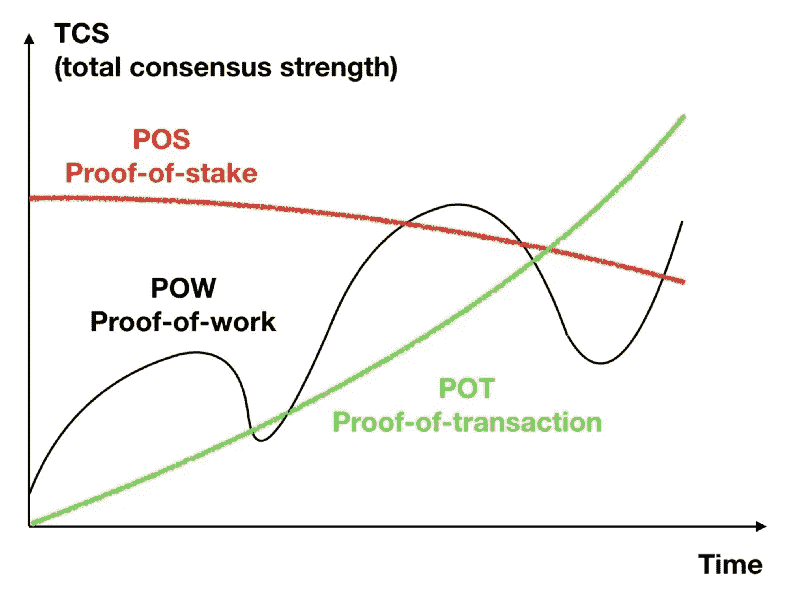

# 评估区块链项目的新方法

> 原文：<https://medium.com/hackernoon/a-new-way-of-evaluating-blockchain-projects-35299ddcefdf>

## 我们需要更多地了解 TAUcoin 是如何设定标准的

Photo by [rawpixel](https://unsplash.com/@rawpixel?utm_source=medium&utm_medium=referral) on [Unsplash](https://unsplash.com?utm_source=medium&utm_medium=referral)

作为比特币最大化主义者，很难在其他项目中看到价值。当你开始解构 10 年前 Satoshi 所做的所有选择时，你会开始理解这个创作是多么有远见。十年后，成千上万最聪明的人试图改进工作证明，数百万美元被用于构建竞争性加密货币，但比特币不仅是一个相关的选择，而且是迄今为止的最佳选择。

Satoshi 为比特币做出的最好选择之一就是保持匿名。这可能是让比特币凌驾于所有其他东西之上的一个原因；没有“比特币之首”。它允许开发社区作为一个团体来做决定，而不是被一个人推翻或影响。当一个人或一群人对如此高价值的组织产生如此大的影响时，它消除了腐败和意图的持续幽灵。

# 诚信币

可悲的事实是，大多数其他项目都是骗局。他们专注于如何尽快筹集尽可能多的资金。虚假的团队，抄袭的白皮书，以及不太清晰的产品进展。我们很肯定地知道，外面的大部分东西都属于这一类，结果，我们有 1000 个狗屎硬币用它们的恶臭弄脏了密码市场。过去的技术创新现在已经改变了。我们的首要任务不再是评估这个概念及其技术可行性。我们现在关注的是团队的完整性和愿景。

> “你没有货币痛苦”

一个代表正直和为共同利益而努力的团队是****Coin**。虽然这个团队仍然是半匿名的，但创始人吴大维非常引人注目，他每周都写作，并主持多次 YouTube 采访。这份白皮书已经重复了多次，每一个字都是原创的，以及它提出的新颖概念。Github 不断更新。大部分采矿工作由外部矿工完成。最上面的樱桃呢？没有打算做 ICO 或在交易所出售硬币。如果这被证明是一个骗局，这是区块链历史上最糟糕的一个。**

**虽然我被认为是创始人，但我不能说我除了帮助建立社区(这是我非常自豪的)之外还有其他重大贡献。这是我见过的最投入的一群密码爱好者，贡献的不仅仅是他们的热情和推荐，还有编码和开发，图形，甚至建立 TAUcoin 自己的论坛，[taucointalk.org](http://taucointalk.org)。在过去的 8 个月里，交易加密货币的证明已经悄悄地聚集了一大批支持者。尽管在“加密冬天”中期推出，该项目已成功扩展到超过 120，000 个钱包用户，推出了移动钱包和链浏览器(另一个社区编码贡献)，并计划实现区块链空间最大的创新之一——移动采矿。**

# **神奇的吴大维**

**创始人吴大维，又名[伊莫菲斯](https://medium.com/u/24d178ec058f?source=post_page-----35299ddcefdf--------------------------------)，以前没怎么失败过。作为中国信贷巨头融 360 的创始人之一，以及大获成功的 DWfund 的负责人，David 已被证明不仅仅是一个幸运的企业家。他即将见证自己在纽交所的第二次首次公开募股，对知识的不断渴望让他成为了区块链和长寿研究领域的思想领袖。**

> **“我们需要惩罚富人”**

**当有人与他分享区块链的创新时，他正在研究自动驾驶的 GPS 系统，这是另一个热门领域。这仅仅是 12 个月前的事。如今，他是 TAUcoin 的先驱，tau coin 是一个拥有超过 120，000 名钱包用户的加密软件，目前还没有在 ICO 或交易所上市的计划。**

**当我第一次开始与 TAUcoin 团队合作时，我们原本打算建立在 David 之前在他的公司 Rong360 的信贷方面取得的成功的基础上。他刚刚带领这家中国信用评级巨头在纽交所成功上市，将同样的专业知识带到区块链是有意义的。这是个好主意，但对大卫来说不够大。**

**“我们需要惩罚富人”是我第一次见到他时他的一句口头禅。穿着优衣库运动衫和裤子，他站在白板前，疯狂地描绘出平台结构和令牌组学的不同想法。他的思维以每小时 120 英里的速度前进，这是一个很难赶上的速度，因为他分享的每一个想法都是逻辑上的巨大飞跃。为了提高效率，实验设计应该从实用性开始。忘记信用吧，我们正在建立自己的加密货币。这是区块链唯一重要的事情”**

**“如果这个系统是公平的，并与每个人分享财富，它将达到大规模采用。最重要的是轻刑。我在以前的公司学到了这一点，它需要无摩擦。”他这样说是因为他展示了一个具有相互关联的奖金分配和交易证明挖掘过程的系统是如何协同发展的。当他与我和团队分享一切时，他面带微笑，好像他以前就这样做过，而且他知道这会成功。**

**最初的信用评分系统很快变成了今天的 TAUcoin。TAUcoin 和比特币有着相同的关注点和愿景:健全的货币。“不是 dapp 操作系统，匿名发送器或交换机。健全货币的特征应该是支持分散支付、无权限验证、达成共识的成本低、速度快。就是这样。”**

****

**Photo by [Nikita Kachanovsky](https://unsplash.com/@nkachanovskyyy?utm_source=medium&utm_medium=referral) on [Unsplash](https://unsplash.com?utm_source=medium&utm_medium=referral)**

**大卫总是拥有快乐的性格和令人振奋的魅力。这就是我想象中史蒂夫·乔布斯的“现实干扰场”的样子。团队分享了他们对满足他同样不可能的截止日期的担忧，他希望在 1 周内完成所有工作，并且他分享的规格不断变化，但他们并没有反对截止日期。他们都相信自己也能做到。David 喜欢玩扑克，他知道如何在不让任何人弃牌的情况下加注。**

# **动机**

**大卫和我并不总是意见一致。我们在很多方面都不一致，他认为这很大程度上是因为我的美国背景。他会说，“你没有货币痛苦”。“首要任务是创造一种完美的加密货币。每个人都可以使用它，没有审查、通货膨胀或高成本。”我们不同意，但我一直知道他的动机是纯的。他已经为自己创造了财富，现在他想建立一个贡献的遗产。**

> **“如果这个系统是公平的，并与每个人分享财富，它将达到大规模采用。最重要的是轻刑。我在以前的公司学到了这一点，它需要无摩擦。”**

**许多选择看起来很奇怪，但它们来自一个背景，即在互联网繁荣的快节奏世界中，需要打破一切，然后修复的文化。迅速改变计划，甚至放弃计划的决定，比如构思奇特的陶诺波利游戏，似乎是被误导了，因为事实就是如此。这不是一个简单的任务，即尽快在交易所或 ICO 上市，而是探索当你以社区为先时会发生什么。“我们将永远以一种松散耦合的心态来思考”，他会这样教导我们。这是他的说法，我们需要保持开放的心态，随时准备改变方向。TAUcoin 之前已经改变了方向，而且肯定会再次改变，但这总是因为一个新的想法。**

**您还可以在 TAUcoin 赞助的每周辩论奖金中看到这种特殊的思维方式，在这里，鼓励社区成员挑战 David 和团队引入的想法，以努力提高关注度和改进构思。我甚至数不清像这样发放了多少枚陶币(甚至还有 1000 美元的 BTC 奖金)。这是一个精彩的举动，概括了 TAUcoin 是什么。**

# **孤独的狼**

**这将是一个伟大的时间去和 [**阅读有关 TAUcoin**](http://taucoin.io) 如果你还没有。我不能强调它是多么的重要，你要明白已经建造了多少，这实际上是一个没有争议的竞争者，没有任何突出的批评。如此大规模的区块链项目在这么长时间内都不为人知，这太荒谬了。**

**尽管有强大的社区和直言不讳的领导，TAUcoin 独自生活在自己的星系中。David 和他的团队与加密世界的其他部分完全隔离，他们的团队仍然隐藏在加密社区之外。由于没有参加秘密活动，也很少与外部秘密社区互动，这无疑阻碍了大麻概念的构思和测试的发展。这并不是因为缺乏尝试。辩论奖金本来是对缺乏内部交流互动的一种补救，但这种兴趣从未被提起。其他硬币侧重于项目，帮助他们获得更多的能见度，并最终接近达到他们的 ICO 硬帽。激励机制完全错位了。**

****

**TAU believes it’s Consensus is far superior — yet still remains ignored by the masses**

**由于没有流动性，该项目还缺乏炒作，而关注市值的项目自然会有这种炒作。例如，TRON 拥有丰富的开发者社区和超过 100 万个账户，因为它专注于营销和融资。合作伙伴关系、会议和活动表明，浮夸可以轻而易举地超越激情和诚信。**

**最大的问题在于交易未经检验的理论的证据。置身于聚光灯之外可以让项目远离批判性思维；没有一个区块链知名人士对这个项目发表任何意见，不管是好是坏。硬币没有价值的事实使它成为毫无价值的攻击目标。**

# **向前一步**

**[分散化和低成本的共识是 TAUcoin 团队今天的独特目标](/@davidwu_30530/2019-approaching-a-perfect-crypto-currency-taucoin-experiment-7f83a2895571)。交易证明(PoT)的创新，一种基于硬币实际花费的共识算法，是这些目标的核心。“POT 拥有以两种方式解决“去中心化”的基因:完全移动设备挖掘和无许可透明挖掘。”大卫说。这种方法的独特之处在于，它不需要比特币挖矿所需的高成本硬件。“我们正在 1G 内存以下的低成本 android 手机上进行测试，一个完整的矿工每天消耗 2 Mb 数据。”这在任何其他区块链项目中都是闻所未闻的。我不知道这是否可行，但我知道这听起来像是在朝着正确的方向前进。**

****

**Photo by [rawpixel](https://unsplash.com/@rawpixel?utm_source=medium&utm_medium=referral) on [Unsplash](https://unsplash.com?utm_source=medium&utm_medium=referral)**

**有许多项目和许多硬币争夺我们的注意力，似乎他们中的大多数甚至没有诚实表现的基本体面。在没有 GitHub 或适当网站的情况下，有万亿美元市值的承诺和区块链改变生活的影响。项目要求数百万美元的投资，甚至没有投入我们所期望的创业公司要求的一小部分基础工作。我们的重点需要放在那些显然有良好意图的项目上，而不是在展示他们的优秀想法时偷懒。我们需要让每个人都达到 TAUcoin 设定的更高标准。**

**如果 TAUcoin 要做的不仅仅是一个有趣的实验，它需要走出它的外壳。蹲下身子专注于产品的策略创造了奇迹，甚至可以被认为是大卫的先见之明。现在是时候更进一步了。TAUcoin 可能是一个竞争者，但我们永远不会知道它是否永远不会走进拳击台。**

**[你可以在 taucoin.io](http://taucoin.io) 上阅读更多关于 TAUcoin 项目和白皮书的信息**

# ****感谢您的阅读，希望您喜欢这篇文章****

***随意在 Linkedin 上加我* [*这里*](https://www.linkedin.com/in/pappasdean) *，关注我 twitter 那里→*[*@ XL dean*](https://twitter.com/XLdean)*，给我发个* [*电报*](https://t.me/bobthegrownup) *。新的文章想法总是被赞赏！***