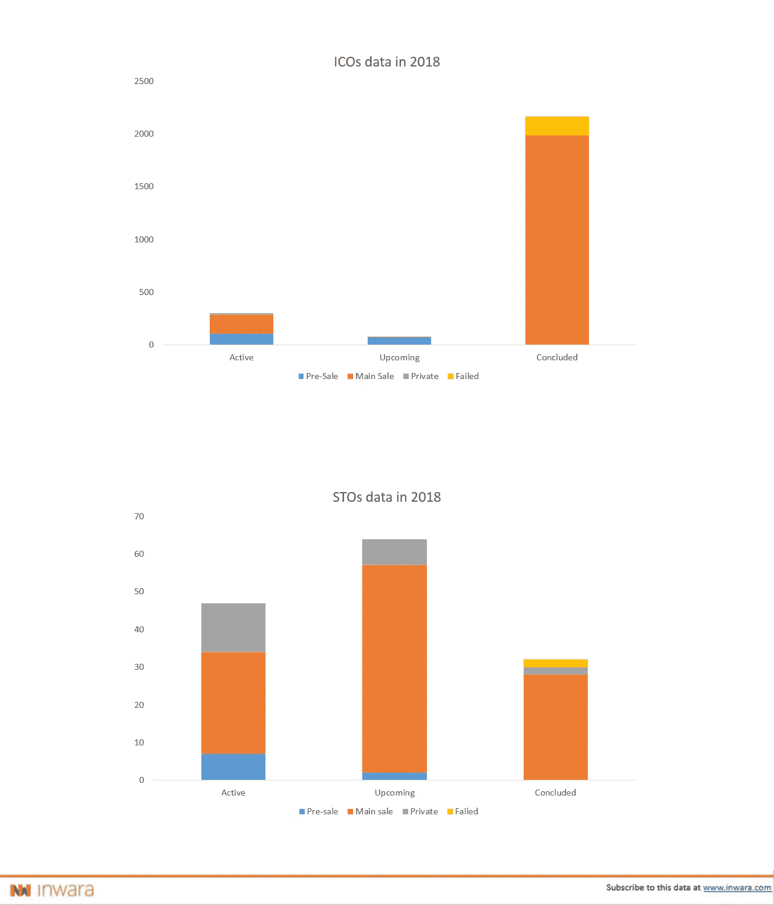
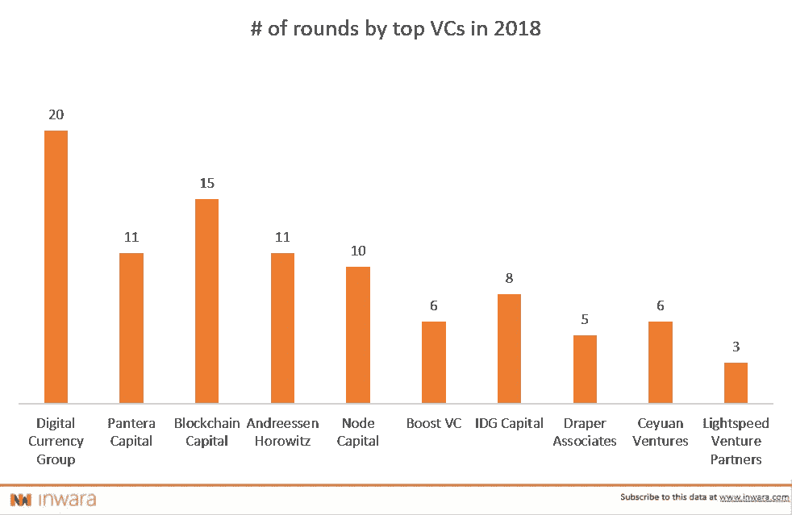
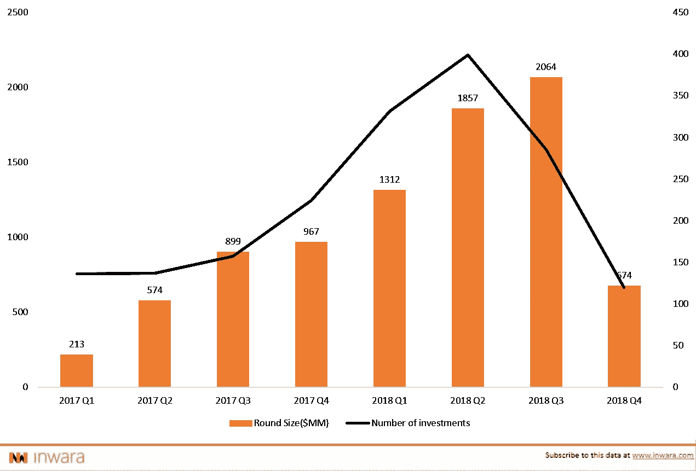
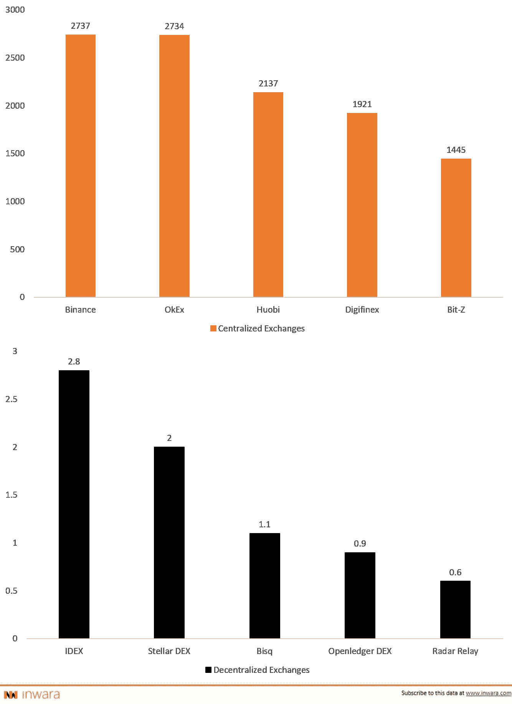
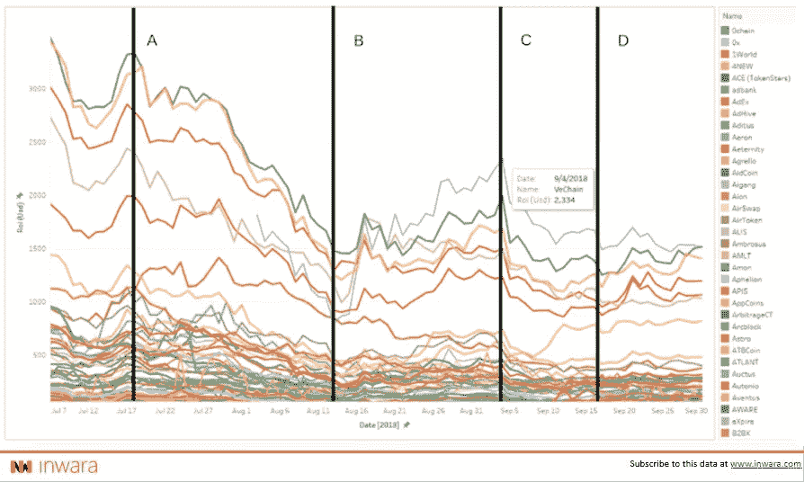
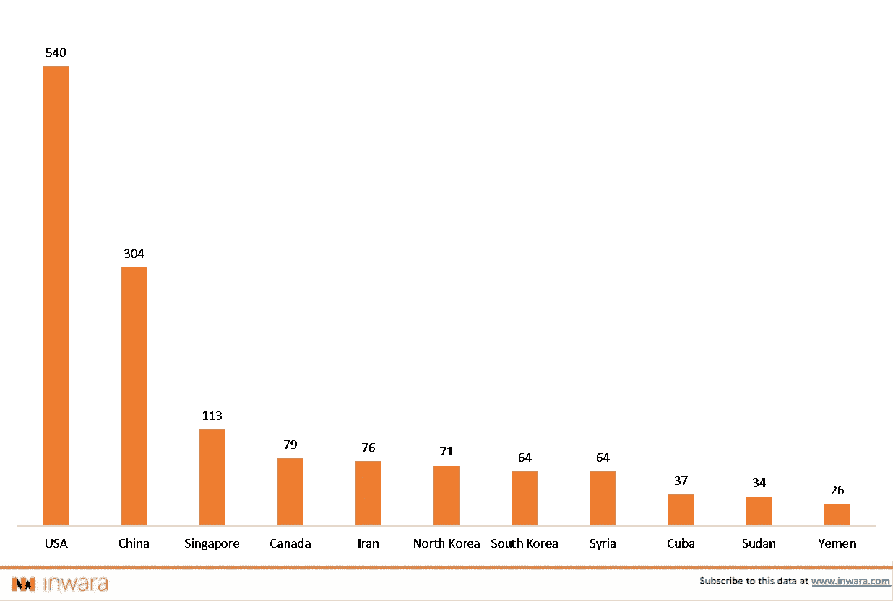
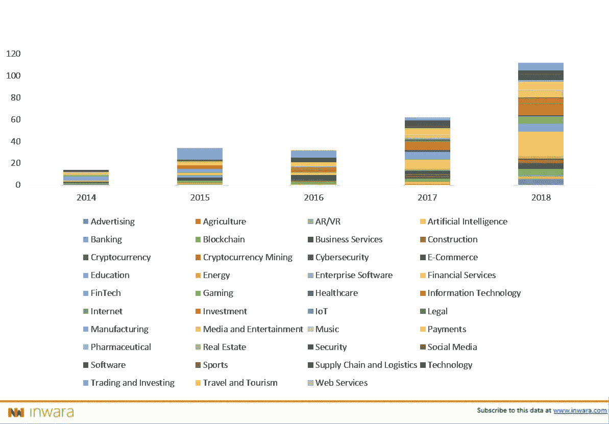
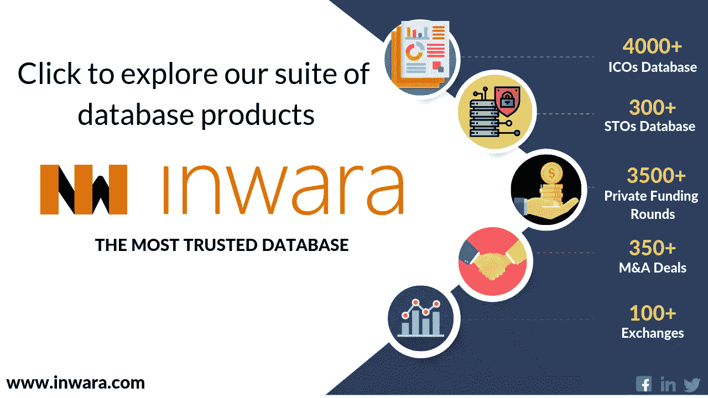

# 区块链公司和加密货币的关键一年

> 原文：<https://medium.com/hackernoon/a-pivotal-year-for-blockchain-companies-cryptocurrencies-stos-stos-poised-to-grow-in-2019-e8ae945d6dc2>

## 加密货币市场已经从 2019 年的熊市中复苏

## 区块链和加密市场趋势讲解！

[*InWara*](http://www.inwara.com/?utm_source=pivothacker&utm_medium=pivothacker&utm_campaign=pivothacker) *提供 ICO 和 STO 项目研究。除了 ico/sto，我们还研究加密交易所及其安全性、私人区块链公司、对冲基金、风险投资、HNI 和天使投资，以及区块链行业的并购。
免责声明:这不是财务建议。有关更多详情，请访问* [*条款和条件。*](https://www.inwara.com/disclaimer)

2018 年对于加密货币来说是充满挑战的一年，在 12 月的第三周，比特币的价格在币安创下了 3125 美元的年度低点。然而，2019 年有望出现一些有趣的发展，这些发展将影响加密货币市场。InWara 的市场智能平台有利于了解 2018 年的变化动态，并有助于为未来建立独立的数据驱动视角。

InWara 关注的一个关键因素是 STOs——安全代币发行，当 ICOs——初始硬币发行逐渐减少时，这种发行势头强劲。在一个不断发展的生态系统中，投资者仍然看好——选择性地看好产品，随着交易撮合的加快，生态系统已经显示出成熟的初步迹象。

此外，由交易所管理的流动性驱动因素已经显示出从集中到分散的初步转变。在监管方面，各国政府要么支持自由监管，要么反对严格监管。比特币 ETF 是监管延迟的受害者，也是机构资金的阻碍。

> [下载 2018 年年报](https://www.inwara.com/report/annual-report-2018?utm_source=pivotannhacker&utm_medium=pivotannhacker&utm_campaign=pivotannhacker)

# **sto 的势头超过 ico**

证券代币发行(sto)类似于初始硬币发行(ico ),只是它们授予投资者对公司有形资产的权利，就像股票或债券一样，而不仅仅是代币。

[Source: InWara’s ICO plus STO database](http://www.inwara.com/?utm_source=pivothacker&utm_medium=pivothacker&utm_campaign=pivothacker)

## **为什么风投和机构投资者看好 sto？**

ico 筹集的资金传统上不受监管，会产生意想不到的后果，例如管理团队挥霍筹集的资金，不负责任，或者干脆就是诈骗。

随着 2018 年越来越多的骗局成为新闻，机构和散户投资者都开始对 ico 失去信心。社区正在探索新的结构，到目前为止比较突出和成功的是 STOs。

sto 是证券交易委员会(SEC)委托的注册证券，这使得管理团队在很大程度上负有责任。在监管保护伞的支持下，sto 是一种提供资产支持的替代选择，这是散户和机构投资者的需要。

InWara 的数据显示，sto 的数量逐月稳步增长，很明显，团队已经开始认识到这一点，那些有真正项目想法并希望筹集资金的团队正在选择 sto。

不仅是投资者，像 Fieldcoin、T2、全球房地产投资信托基金这样正在或已经做 ICO 的公司也正在或计划做 sto。

# **机构投资者看好 cryptos**

尽管比特币价格在 2018 年 12 月从 20，000 美元的历史高点跌至 3500 美元，但像[数字货币集团](https://dcg.co/) (DCG)这样的机构投资者并不羞于投资加密技术。DCG 拥有的灰度投资积累了价值约 8.26 亿美元的比特币。DCG 也是风投中的佼佼者，宣布参与了 20 轮风投。其他值得注意的风投还有[潘迪拉](https://www.panteracapital.com/)、[节点](http://www.nodecap.com/?language=2)、[区块链资本](https://blockchain.capital/)和[安德森·霍洛维茨](https://a16z.com/)。

[Source: InWara’s Annual Report 2018](https://www.inwara.com/report/annual-report-2018?utm_source=pivotannhacker&utm_medium=pivotannhacker&utm_campaign=pivotannhacker)

> [下载 2018 年年报](https://www.inwara.com/report/annual-report-2018?utm_source=pivotannhacker&utm_medium=pivotannhacker&utm_campaign=pivotannhacker)

然而，悲观情绪阻碍了估值，并阻碍了私人投资筹集的资金，其中 2018 年第四季度受影响最大，第四季度筹集的资金下降了 65%。尽管上一季度有所下降，但总体而言，私人融资在 2018 年出现了显著增长，融资总额比 2017 年翻了一番

[Source: InWara’s Annual Report 2018](https://www.inwara.com/report/annual-report-2018?utm_source=pivotannhacker&utm_medium=pivotannhacker&utm_campaign=pivotannhacker)

# 加密交易转向分散化

黑客攻击等单点故障对集中式交易所构成了严重威胁。另一方面，在多个节点上运营的分散式交易所减轻了风险，有助于缓解投资者的担忧。像[币安](https://www.binance.com/)、 [Cobinhood](https://cobinhood.com/) 这样的顶级交易所正在努力推出他们的分散平台(来源:[顶级加密交易所文章](https://hackernoon.com/whats-the-role-of-cryptocurrency-exchanges-b37cc31f0b2c))。

> 前 5 大集中和分散交易所，交易量(百万美元)比较！

Trading volumes in $MM [(Source: InWara’s crypto exchange database)](http://www.inwara.com/?utm_source=pivothacker&utm_medium=pivothacker&utm_campaign=pivothacker)

分散的交易所正处于初期运作阶段。随着交易所参与者和做市商适应新的交易系统，目前较低的流动性有望改善。

# 期待已久的比特币交易所交易基金获批

比特币交易所交易基金的批准延迟是导致比特币价格在 2018 年下跌的早期触发因素之一。

[Source: InWara’s Market Intelligence Platform](http://www.inwara.com/?utm_source=pivothacker&utm_medium=pivothacker&utm_campaign=pivothacker)

> [下载 2018 年年报](https://www.inwara.com/report/annual-report-2018?utm_source=pivotannhacker&utm_medium=pivotannhacker&utm_campaign=pivotannhacker)

该图绘制了 2018 年 7 月 1 日至 2018 年 9 月 30 日之间排名靠前的 ico 的 ROI。

垂直线 A、B、C 和 D 代表可能影响加密货币市场的事件或新闻。线“ **A** ”代表 SEC 正式推迟比特币交易所交易基金批准听证会的日期。

这一延迟导致了密码领域的大规模崩溃，ICOs 下跌了 50%以上。如果 SEC 批准比特币 ETF，那么我们可以期待趋势逆转，然后市场复苏(来源:[如果 SEC 批准 ETF 会发生什么](https://hackernoon.com/what-happens-if-the-sec-approves-the-etf-for-bitcoin-65532630b35c))。

# 加密货币的监管和销售限制

[美国证券交易委员会](https://www.sec.gov/)和全球其他政府已经出台了针对 ico 的法规，以保护投资者并限制违规行为。在没有明确法律框架的情况下，美国正在主导 ICO 主要销售限制，这可能会持续到 2019 年。美国受限制的 ico 数量高达 540 个，中国紧随其后，为 304 个。

[Source: InWara’s Annual Report 2018](https://www.inwara.com/report/annual-report-2018?utm_source=pivotannhacker&utm_medium=pivotannhacker&utm_campaign=pivotannhacker)

> [下载 2018 年年报](https://www.inwara.com/report/annual-report-2018?utm_source=pivotannhacker&utm_medium=pivotannhacker&utm_campaign=pivotannhacker)

# 并购在增加

2018 年出现了一些重大并购，如 [Bitstamp](https://www.bitstamp.net/) 被 [NXMH](http://www.nxmh.com/) 收购、 [Chain](https://chain.com/) 被 [Stellar](https://www.stellar.org/) 收购、 [BitTorrent](https://www.bittorrent.com/) 收购 [Tron](https://tron.network/) 。这些大规模交易是市场即将增长和整合的早期指标。

[Source: InWara’s Annual Report 2018](https://www.inwara.com/report/annual-report-2018?utm_source=pivotannhacker&utm_medium=pivotannhacker&utm_campaign=pivotannhacker)

区块链和加密货币领域已经出现了重大的 M&A 交易。与 2017 年相比，2018 年增长了近 100%，随着更多传统公司和企业进入区块链生态系统开展业务，这一趋势可能会在 2019 年延续。

# 总结一下

这些市场趋势表明了加密市场的成熟，然而，还有很长的路要走。区块链作为一种技术，有可能接管数字货币生态系统，正如采用率的显著增长所表明的那样。在金融科技、金融服务、医疗保健和游戏等行业，已经可以看到这种深远的影响。

> [下载 2018 年年报](https://www.inwara.com/report/annual-report-2018?utm_source=pivotannhacker&utm_medium=pivotannhacker&utm_campaign=pivotannhacker)

