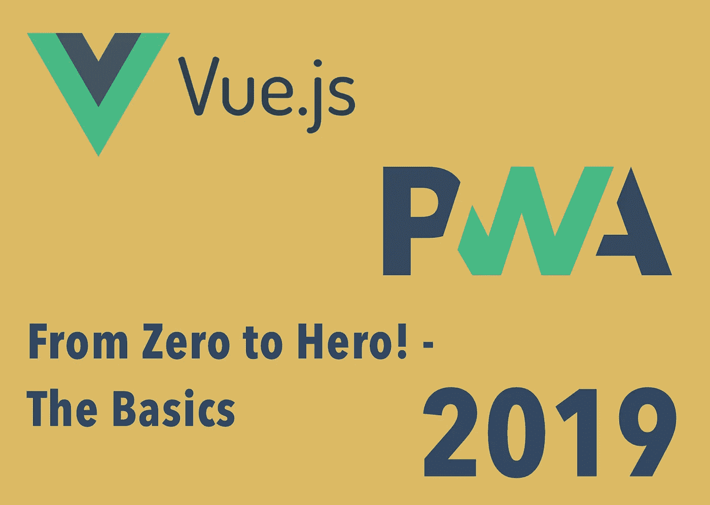
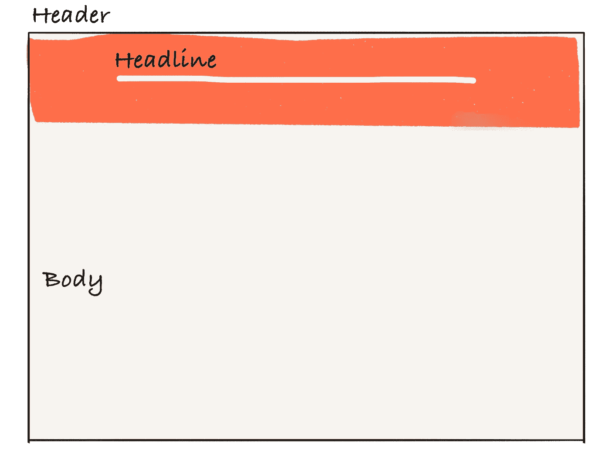
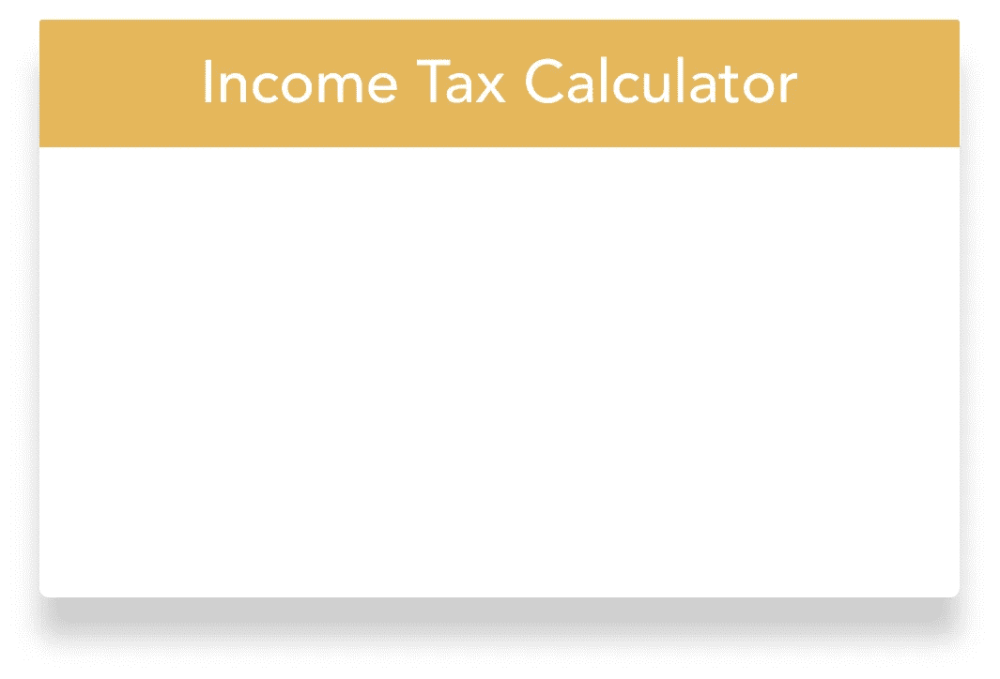
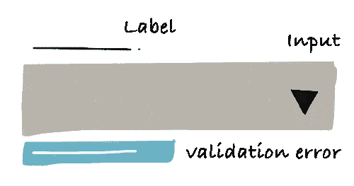
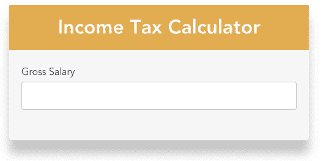
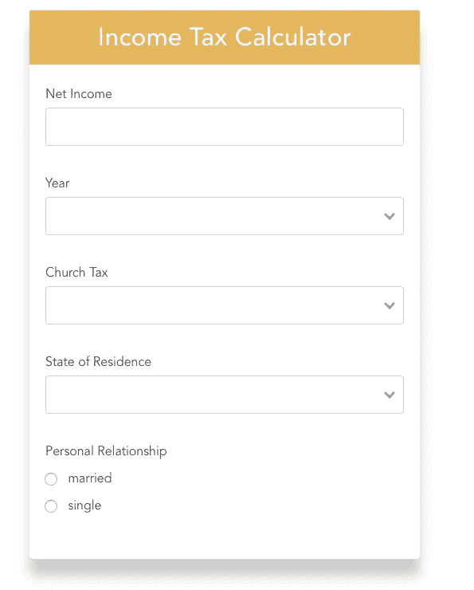
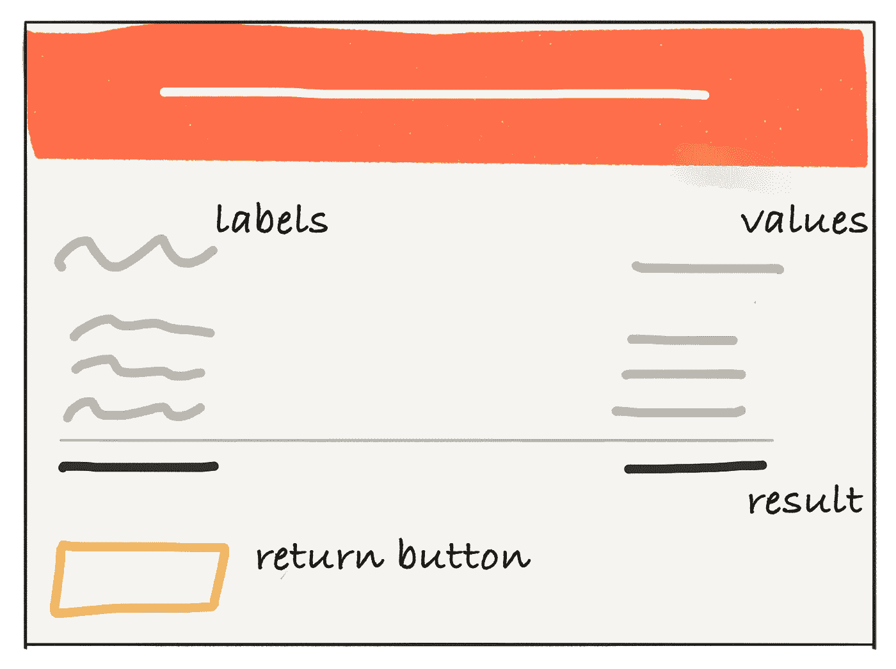
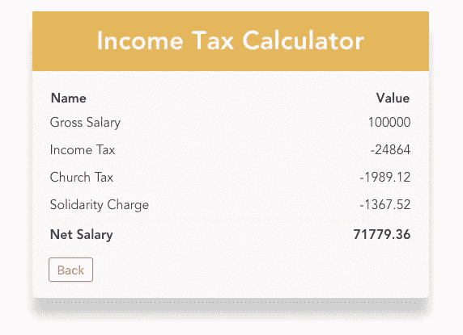

# 在 VueJs 中构建一个进步的 Web App，从零到英雄！第一部分

> 原文：<https://medium.com/hackernoon/a-progressive-web-app-in-vue-tutorial-part-1-the-vue-app-f9231b032a0b>

## 基础知识



渐进式 Web 应用程序(PWAs)的概念是一种框架不可知的方法，旨在将网站的可发现性和可访问性与本机应用程序的功能相结合。

几年来，我看到了越来越多的有趣的技术，它们弥合了网络应用和本地应用之间的鸿沟。

2018 年，PWAs 朝着主流采用迈出了一大步。到目前为止，许多公司，如 Pinterest、T2、优步、Twitter、Trivago、华盛顿邮报、星巴克，都已经创建了并行运行的 PWAs。

原因是显而易见的，许多这些公司报告了非常有希望的数字，大部分是惊人的，Trivago 的转换率增长了 97%。

> 为什么我们现在要开始开发 PWAs**？**

**事实上，在 2018 年，大多数浏览器供应商也开始支持 PWAs 背后的技术。微软承诺将 PWAs 带到“超过 5 亿台运行 Windows 10 的设备上”。谷歌甚至称之为应用程序开发的未来——毫不奇怪，谷歌用于提高网页质量的工具 [Lighthouse](https://developers.google.com/web/tools/lighthouse/) 审计“PWA ”,仅次于“SEO”和网络应用程序的“可访问性”。甚至苹果也终于在 2018 年开始支持 pwa，尽管 pwa 对苹果的应用商店业务构成了明显的威胁。**

**本文是指导您如何在 VueJS 中开发 PWA 的系列教程的第一部分！**

****第一部分—在 VueJS 中构建税收计算器应用程序。****

**[第二部分——让应用程序离线工作。](https://hackernoon.com/build-a-progressive-web-app-in-vuejs-from-zero-to-hero-part-2-the-service-worker-d9babc3d756f)**

****在 Medium 上关注我，你会收到第二部发布的通知！****

**为了便于您理解，请查看此[回购](https://github.com/fh48/vue-calculator-pwa)。您可以为每个部分检查一个分支！**

# **税收计算器应用程序**

****

**在本教程中，我们将建立一个所得税计算器。为什么？**

**因为计算所得税(至少在德国)很复杂，人们会喜欢一个能为他们解决这个问题的应用程序。除此之外，这也是一个探索上述 PWA 特性影响的机会。**

**我们将在本教程中使用 VueJS，因为它附带了一个很好的模板，可以很容易地启动 PWA 项目。另一个原因是，VueJS 真的很容易学。不需要任何其他前端框架的经验！**

**理论到此为止，是时候动手了！**

# **让我们创建应用程序的框架**

**我们从创建应用程序的基本设置和文件结构开始。为了加快速度，我们将使用 vue-cli 引导应用程序。首先，我们需要在全球安装 vue CLI 工具。**

```
yarn global add @vue/cli
```

**现在，我们可以通过以下方式实例化模板**

```
vue init pwa vue-calculator-pwa
```

**系统会提示我们选择一个预设，我推荐以下配置:**

```
? Project name vue-calculator-pwa
? Project short name: fewer than 12 characters to not be truncated on homescreens (default: same as name) vue-calculator-pwa
? Project description A simple tax calculator 
? Author Fabian Hinsenkamp <fabian.hinsenkamp@online.de>
? Vue build runtime
? Install vue-router? No
? Use ESLint to lint your code? Yes
? Pick an ESLint preset Standard
? Setup unit tests with Karma + Mocha? No
? Setup e2e tests with Nightwatch? No
```

**对于`Vue build`配置，我们可以选择较小的`runtime`选项，因为我们不需要编译器，因为我们在`*.vue`文件中编写的 html 已经在构建时预编译成了 [JavaScript](https://hackernoon.com/tagged/javascript) 。**

**出于简洁的原因，我们没有在这里添加测试。如果我们要为生产建立一个项目，一定要添加它们。**

**接下来，运行`yarn`来安装所有的依赖项。要启动开发模式，只需运行`yarn start`。**

> **不要被项目中的所有文件搞糊涂了——现在我们不会触及其中的大部分。如果你想了解更多关于模板结构的信息，请查阅[文档](https://vuejs-templates.github.io/webpack/structure.html)。只能推荐了！**

**在项目中，我们会找到扩展名为`.vue`的文件。它表示该文件是一个单文件 vue 组件。这是 Vue 的特色之一。每个文件由三种类型的块组成:`<template>`、`<script>`、`<style>`。这样，我们可以很容易地将项目划分成松散耦合的组件。**

**让我们开始创建我们的应用程序包含的所有`*.vue`文件。**

****App.vue****

**创建文件`src/App.vue`。这是我们的主要视图，它将包含组成我们的计算器的不同组件。**

## **InputForm.vue**

**接下来让我们创建输入表单文件`src/components/InputForm.vue`。它将处理计算所得税所需的所有用户输入。**

**此外，我们为下面的`Result`、`Panel`、`Input`组件创建`.vue`框架文件，包括一个与其所属组件同名的样式表。它们都属于`src/components`文件夹。**

## **结果. vue**

**它将显示我们的计算结果。**

## **Panel.vue & Input.vue**

**面板是一个简单的组件，它包装了输入和结果组件。**

**最后，我们应该删除 vue 模板附带的`Hello.vue`文件。**

# **添加样式和计算逻辑**

**接下来，我们添加以下库来支持 sass/scss 文件。**

**`yarn add node-sass sass-loader -D`**

**目前，我们添加的 scss 文件都是空的。**

> **我不会在本教程中谈论风格，因为没有什么具体的应用程序的风格。**

**因此，你有两个选择，创建你自己的风格或者检查下面的 github 项目的分支。**

**`git checkout 01_skeletonApp`**

**我们还需要逻辑来计算我们的所得税。我使用真正的德国所得税公式。为了省略细节，我还将其添加到了分支中。**

**它还包含一些输入验证消息的 css 动画。如果您不想使用上面的分支，也可以手动添加它们:**

**`yarn add animation.css`**

# **让我们创建面板组件！**

****

**现在我们可以开始编码了！为了让您熟悉一下，我们从构建面板组件开始。保持这些组件的通用性是一个很好的实践，这样就可以重用它来保存任何类型的内容。这就是为什么我们的目标是将标题以及正文的 html 传递给组件。**

**让我们将下面的代码添加到`panel.vue` 文件的模板部分。**

**对于 [VueJS](https://hackernoon.com/tagged/vuejs) 中的单向数据绑定，我们可以使用 [textinterpolation](https://vuejs.org/v2/guide/syntax.html#Text) 。这正是我们渲染标题所做的。因此，我们只需要用双花括号将标题数据对象括起来。注意，这个“小胡子”语法总是将数据解释为纯文本，而不是 HTML。**

**这就是为什么我们还使用 vue 的 *slot* 元素，它允许我们在 body 元素中呈现面板组件的子元素。现在我们已经完成了面板组件的 html，接下来我们定义脚本逻辑。**

**首先，为组件添加一个名称很重要，这样我们就可以实际注册组件并在以后导入它。因为我们想将标题传递给面板，所以我们应该将其指定为属性。属性是我们可以在组件上注册的自定义属性。**

**要在我们的应用程序中看到面板，只需将上面的代码添加到我们的`app.vue`组件中。**

****

**在脚本块中，我们已经导入了组件，所以添加 html 是我们将第一个组件添加到应用程序所需要的！**

**当我们运行`yarn start`时，我们应该会看到面板。**

**如果我们在实现面板时有任何问题，或者想跳过这一部分，请检查下面的分支。**

**`git checkout 02_panel`**

# **让我们创建输入组件！**

****

**接下来，我们用一些简单的自定义输入验证来构建输入表单。**

**我们有三种类型的输入:常规、选择和无线电。**

**除了单选按钮，这些输入需要输入验证和相应的用户反馈。为了避免重复，我们应该构建一个可重用的输入组件。为了构建一个实际上可重用的组件，我建议以一种方式来构建它，这种方式允许在不改变整个架构的情况下轻松地扩展它。**

**定义一个干净的、经过深思熟虑的组件 api 是一个很好的起点。**

**在我们的例子中，我们总是希望从组件外部控制四个属性:**

*   **标签**
*   **输入类型**
*   **验证规则**
*   **数据绑定**

**让我们把这些需求翻译成代码吧！`input.vue`组件如下所示:**

**我们向原生输入组件添加了一些定制的 vue 属性。首先，我们添加了`v-if`，它允许我们仅在将正确的类型传递给组件时才呈现输入。这对于添加不同类型的输入很重要。接下来，*将*绑定到组件的`input`事件，并将`@-prefix`绑定到一个名为`customInput`的方法。**

**这就是我们的自定义输入验证发挥作用的地方。我们通过运行以下命令向项目添加一个验证库**

**`yarn add vee-validate`并在我们的`main.js`文件中注册插件。**

**我们的验证包括截取本地输入事件，然后检查输入的值是否符合我们的验证规则。如果没有，我们设置一个错误信息。因此，我们在`input.vue`文件中添加了两个方法。当用户输入任何输入时，触发`customInput`方法。**

**验证错误消息从`v-validate`插件返回。我们只需要添加一些 html 来显示给用户:**

**我给错误消息添加了一个过渡。VueJS 附带了一个转换包装器，结合来自`animate.css`的翻转动画和一些样式，我们可以毫不费力地得到一个漂亮的错误消息。**

**要向应用程序添加新的输入，将完成的输入组件注册到`InputForm.vue`。这里我们通过`v-model`应用了双向绑定——它根据输入类型自动选择正确的方式来更新元素。现在，我们需要打开`App.vue`，像处理`Panel`一样导入`InputForm`，并用`<InputForm/>`替换`<span> content goes here. </span>`。**

****

**结果应该像你在左边看到的一样。**

**更多详情请查看分行！**

**`git checkout 03_basicInput`**

# **添加更多的输入类型！**

**现在我们已经有了一个带验证的基本输入，很容易用剩下的两种输入类型来扩展我们的输入组件 select 和 radio 输入。**

**对于 select 元素，我们使用现成的组件。我们只需通过运行以下命令来添加它:**

**`yarn add vue-select`**

**在我们使用它之前，它需要像之前的`v-validate`插件一样注册在`main.js`文件中。但是，这次我们使用`Vue.component`方法。**

**现在只需将组件添加到我们的`Input.vue`文件中。我们希望在下拉列表中显示的选项将作为道具传递给组件。**

**现在只剩下添加单选按钮了。**

**//图像**

**我们从原生 html 元素开始。尽管我们只需要两个单选按钮 atm，我建议以允许传递任意数量的输入的方式构建组件。因此，我们简单地使用 vue 的`v-for`属性来遍历 options 属性，并为选项数组的每个元素创建一个单选按钮。**

**此外，我们需要传递当前选择的值，以便管理单选按钮输入的“选中”状态。在脚本块中，我们添加了一个包含所有可能的值类型的数组。**

**为了测试我们的新输入类型，我们需要将它们添加到提交表单中，并将选项传递给 select 和 radio 输入。**

****

**检查下面分支中的`inputForm.vue`文件，看看选项是如何传递给新输入的。**

**`git checkout 04_completeInputs`**

**它遵循我们已经详细研究过的常规输入的相同模式。**

**最重要的是，记住总是传递包含值和标签的对象。**

**就是这样！我们成功地创建了一个组件，它允许我们添加所有需要的输入类型并验证它们，而不需要重复我们自己！**

# **让我们来完成我们的输入表单！**

**现在我们可以完成输入表单了。唯一缺少的是提交表单的按钮。**

**我们从阻止默认的 html 表单事件开始，改为调用我们的自定义方法`handleSubmit`。**

**在那里，我们清理输入结果——尽管我们的下拉菜单和单选按钮要求返回带有标签和值的对象，但我们只对计算结果的值感兴趣。**

**最后，我们创建一个自定义事件，它只发出输入选项的值。**

**我们还创建了一个 computed 属性，只有在用户输入了所有必需的数据后，该属性才能启用我们的“calculate”按钮。**

**您可以在上面提到的分支上找到完整的输入表单。**

**`git checkout 04_completeInputs`**

# ****让我们来算算我们的税吧！****

**现在我们已经能够从用户那里获得输入，接下来我们需要实际计算所得的所得税。正如我在开头提到的，我不想告诉你不同类型的扣除是如何计算的细节。如果你有兴趣的话，可以查看一下`calc.js`文件。**

**最重要的是，我们知道我们使用定制的`submitted`事件将输入传递回我们的`app.vue`组件。在这里，我们还计算实际税收，并用标签存储结果值，并向我们从总收入中推导出的值添加负号。**

**—为什么？这使得显示结果非常简单，我们将在下一节中看到。**

# **让我们展示我们的成果吧！**

**现在，我们已经拥有了最终显示税收计算结果所需的一切。**

****

**因此，我们使用一个本地 html 表以结构化的方式显示标签和相应的值。**

**实现非常简单，因为我们可以坚持我们已经了解的 VueJS。事实上，我们重复了我们已经为无线电输入所做的。**

**我们只是将我们的计算作为道具传递给`results`组件，并在结果对象上循环。**

**由于用户可能希望在不刷新页面的情况下执行多个计算，我们添加了另一个按钮，引导用户返回到输入表单。**

**因此，我们简单地发出一个名为`clearCalculations`的自定义事件来清除父组件中的 calculations 属性。最后，我们还将所有组件连接在一起，完成所得税计算器。**

****

**和往常一样，如果您想更详细地查看代码，请签出分支。**

**`git checkout 05_result`**

# **让我们完成我们的应用程序！**

**在最后一部分中，只剩下两件事要做——完成数据流并相应地管理输入和结果组件的生命周期。**

**在`Result.vue`组件中，我们刚刚添加了一个发出`clearCalculation`事件的按钮。在左边，我们看到我们的主要组成部分`App.vue`。在这里，我们订阅事件并将计算对象重置为空。**

**现在，我们只想呈现输入或结果组件。**

**因此，我们添加另一个`computed`布尔属性，检查我们是否有计算结果。**

**现在，我们基于`resultsCalculated`属性向组件添加`v-if`属性。**

**试试吧！现在，只有在我们成功地输入了输入内容之后，我们才能看到结果表。**

**为了使输入和结果之间的切换不那么剧烈，我们添加了一个过渡。当我们在这里用另一个组件替换一个组件时，我们使用了属性`mode`属性`out-in`，这样，当前元素首先过渡出来，然后当完成时，新元素过渡进来。**

**我们完成了教程！干得好！具有最终应用程序代码的分支如下**

**`git checkout 06_complete`**

# **结论**

**我们已经成功启动了基于 vue 的 PWA 模板的所得税计算器 PWA 的实施。因此，我们熟悉了 VueJS 的语法和范例。**

**到目前为止一切顺利，但我们离提供接近原生应用的用户体验还很远。这就是本教程第二部分将关注的内容。**

**如果你想在第二部发布时得到通知——只要在 Medium 上关注我或者在 Twitter 上关注我 [@Fa_Hinse](https://twitter.com/Fa_Hinse) ！**