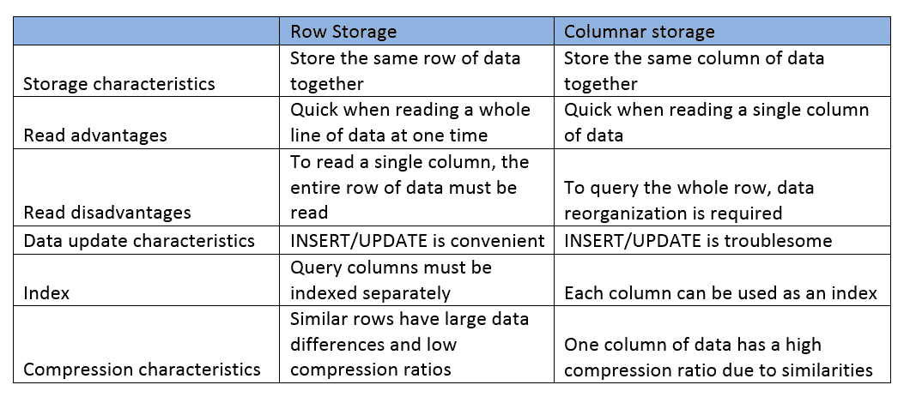
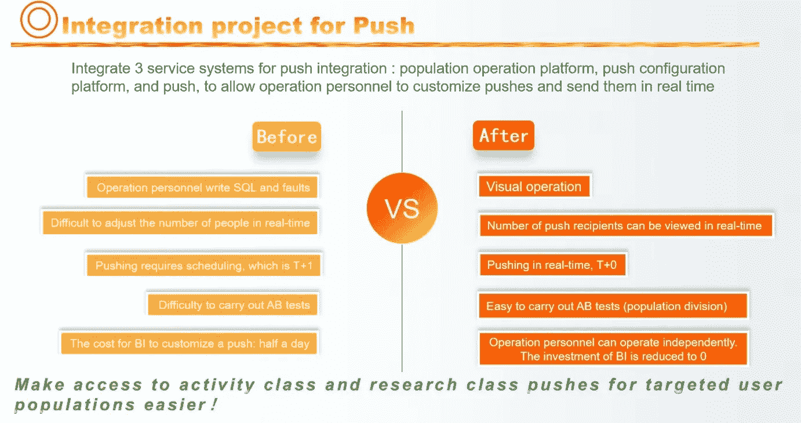
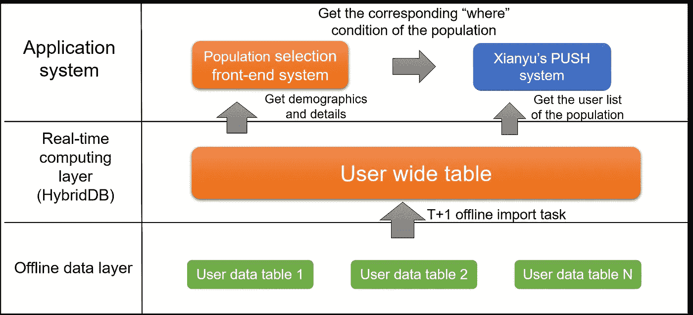

# 朝着正确的方向努力:改进通知目标

> 原文：<https://medium.com/hackernoon/a-push-in-the-right-direction-improving-notification-targeting-bec1d99126a1>

## 为了改善推送通知的数据排序，阿里巴巴的先宇团队重新设计了数据库结构，使其服务能够更好地针对用户群。

As Alibaba’s second-hand trading platform Xianyu(闲鱼) has grown and developed, the amount of data it has to sort through has risen astronomically. With hundreds of millions of users, each with over one hundred dimensions for data indicators, user data presents a technological challenge for Alibaba: How can you quickly screen for a targeted population to carry out targeted customer operations using push notifications?

推送是仙宇获取信息给用户最快捷的方式。仙宇最常见的推送方式是先离线计算推送人口，准备好相应的推送消息，然后在第二天的指定时间推送消息。

一般来说，推送是一个周期性的任务。但是，对于需要立即发送的推送任务，BI 人员必须手动干预。每个推送任务平均占用 BI 人员半天的开发时间，而且由于难以从用户数据中识别要推送的用户群，操作可能会很麻烦。

在处理大量数据时，行业中许多现有的解决方案需要几分钟甚至几小时来生成查询结果。本文探讨了先宇在大数据场景下高效数据筛选、统计和分析的解决方案，使其 BI 人员能够使用任意查询条件组合，在毫秒级内筛选出可用于形成推送策略的数据。

# 确定解决方案

审视其平台所面临的挑战，仙寓团队意识到，对与推送相关的数据进行排序是一个典型的 OLAP 场景。

OLTP 和 OLAP 的简单比较如下:

具体来说，它涉及到查询具有数百万甚至数十亿行数据的大型数据库，对于这些数据库，高读/写并发性或 OLTP 的事务支持是不必要的。

基于这一结论，团队进一步认识到列存储数据库提供了最佳方法——具体来说，就是阿里云的 MySQL hybrid db。

## 列胜过行

通常用于 OLTP 的行存储数据库(如 MySQL 和 Oracle)并不能满足 Xianyu 的需求。行存储适用于近线数据分析，例如，在需要查询表中一定数量的合格记录的所有字段的情况下。如果您有大量的行，并且只需要查询少量的字段，那么它的伸缩性就不好。

行存储和列存储的特征的简单比较如下:

例如，假设有一个包含 20 个字段的表，您需要计算用户的平均年龄。如果表使用行存储，数据库需要扫描整个表并遍历所有行。单独的索引或复合索引可以缓解这种情况，但只适用于常用的条件查询。一旦需要查询非索引字段，数据库就需要扫描整个表。当您有数亿行时，扫描整个表会花费大量时间。

在这种情况下，列存储要好得多。数据库只需要定位年龄列，扫描该列的数据得到所有年龄，然后计算平均值。理论上，性能比行存储快 20 倍，因为您只需要读取一列数据。

## 哪种柱状储物最好？

贤宇全面评测了阿里巴巴集团的各种列存储 DB 产品(ADS/PostgreSQL/HBase/HybridDB)，并对其各自的读写性能、稳定性、语法全面性、开发部署成本进行了评估。

最常用的列存储数据库是 HBase。但是它的设计让它不适合仙宇的要求。它使用一个行键作为其设计的核心部分。常见的筛选条件被组合并集成到 rowkey 中，查询是通过 Rowkey 的 get(单个记录)或 scan(范围)函数完成的。它是为过滤条件有限的非结构化数据而设计的。

对于仙寓来说，由于需要将所有字段作为过滤条件，所以还是需要结构化存储，查询需要低延迟。在阿里巴巴集团提供的其余解决方案中，HybridDB for MySQL 是最佳选择。

对于仙寓，HybridDB for MySQL 提供了以下特性，使其能够在大数据场景中为多维查询提供毫秒级响应时间:

一个高性能的列存储引擎及其带有内置存储的谓词计算功能，可以使用各种统计信息快速跳过数据块进行快速筛选。

智能索引技术，自动为一个表创建索引，并可以根据索引组合多个谓词条件进行筛选。(仙域不需要自建索引。)

一种高性能 MPP+DAG 融合计算引擎，结合高并发和高吞吐量模式来实现高性能矢量计算，这允许计算引擎和存储紧密合作以加快计算速度。

支持各种数据建模技术，如星形建模、雪花建模和聚集排序。业务适度数据建模支持更好的性能指标。

除了性能之外，Hybrid DB for MySQL 也非常适合 Xianyu，因为 MySQL 和 BI 在完整的 SQL 支持下相互兼容。此外，它还支持空间搜索、全文搜索和复杂数据类型(多值列和 JSON)。

# 推动 HybridDB

先宇为其人口选择系统实现了 HybridDB for MySQL，并将人口选择系统与其原有的推送系统进行了整合。这大大提高了推送的准备数据和传输效率，释放了开发资源。

HybridDB for MySQL 不仅为闲鱼的定向用户操作提供了强大的底层支持，还可以应用于其他业务场景，比如首页图片的定向推送等需要分级用户操作的场景，从而为闲鱼服务增加了优化空间。

## 系统结构

在下图中，您可以看到 Xianyu 为其人口选择系统使用的三层系统架构，该架构与 Push 一起使用，由离线数据层、实时计算层(HybridDB)和应用程序系统组成。

在*离线数据层*中，用户维度数据分布在各个业务系统的离线表中。离线 T+1 计时任务用于在实时计算层聚合数据并将其导入用户范围的表中。

*实时计算层*，根据人群的筛选条件，从 user wide 表中查询符合条件的用户数量和用户 id 列表，为应用系统提供服务。

*人群选择前端系统*构成应用系统层的第一部分，为运营人员提供可视化界面，选择筛选条件并保存为人群进行分析或推送。每个填充对应一个 SQL 存储，类似于:

select count(*)from user _ big _ table，其中 column1> 1，column2 in ('a '，' b') and (column31=1 或 column32=2)

SQL 支持多层和/或任何字段的嵌套组合进行查询。使用 SQL 保存群体，当用户表中的数据发生变化时，运行 SQL 可以检索群体中的最新用户，并相应地进行更新。

仙域的推送系统构成了应用系统层的第二部分。它从人口选择前端系统获取人口对应的“在哪里”条件，从实时计算层以分页方式获取用户列表，并向用户推送消息。在其实现过程中，分页查询的性能是一个关键的焦点。

## 优化分页性能

在分页时，如果总体规模很大(> 1000 万)，查询性能会随着查询页面数量的增加而显著降低。为了提高性能，将行号添加到人口数据中，并将它们导出到 MySQL。下表显示了该结构。

每次导出群体时，都会添加一个新的批号，并带有时间戳和增量。

对于每个批号，行号自动从 1 开始递增。

该结构使用由“群体 ID”+“批号”+“行号”组成的复合索引。这允许推送系统使用索引查询来代替分页，并提高查询大量页面的效率和性能。HybridDB 强大的数据导出功能大大弥补了导出数据的额外成本，数百万个数据点只需几秒钟即可导出。

# 展望未来

仙宇的模型保证了组合查询的结果在几秒钟内从海量多维数据存储中返回。该技术作为 OLAP 场景下的通用技术实现方案，可用于改造其他原有服务系统以提高服务效果，也可作为类似场景的参考。

人口选择引擎中的用户数据当前在 T+1 导入。原因是人口相关指标变化不频繁，很多指标(比如用户标签)是 T+1 离线计算的，这样 T+1 的数据更新频率是可以接受的。后来，基于 HybridDB 构建了一个更强大的商品选择引擎。

仙芋商品数据变化比用户数据快。一方面，用户可以随时更新自己的商品。另一方面，由于鲜宇的单一库存特征(即商品一售出就下架)和其他各种原因，商品的状态可能随时发生变化。因此，我们的选择引擎应该能够尽快识别数据中的这些变化，并在交付层进行实时调整。

基于 HybridDB(存储)和实时计算引擎，Xianyu 团队最近构建了一个更强大的实时选择系统，称为 Mach，读者可以期待在未来报道 Xianyu 发展的文章中探索这个系统。

# 阿里巴巴科技

关于阿里巴巴最新技术的第一手深度资料→脸书: [**“阿里巴巴科技”**](http://www.facebook.com/AlibabaTechnology) 。推特: [**【阿里巴巴技术】**](https://twitter.com/AliTech2017) 。