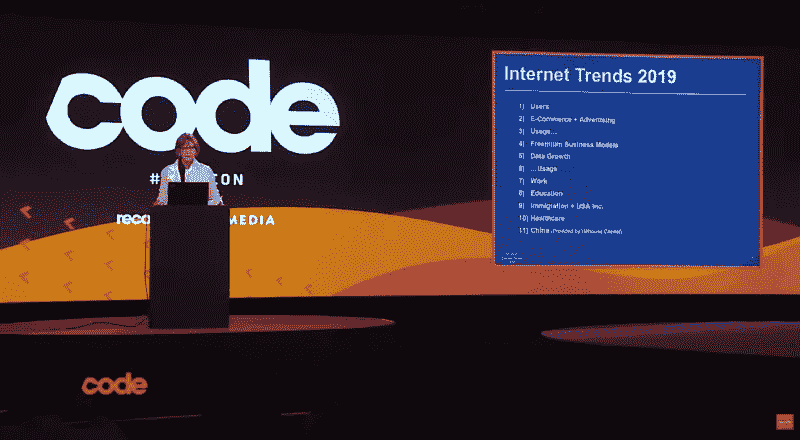

# 玛丽·米克尔 2019 年互联网趋势一瞥

> 原文：<https://medium.com/hackernoon/a-quick-glance-at-the-internet-trends-2019-by-mary-meeker-78eb5a137a07>

> "互联网是最未被充分利用的广告媒体."
> 
> “你可以拿 1999 年和 2000 年在美国发生的互联网热潮来说，而在中国，这种热情要高出三到五倍。”
> 
> 一个迷人的时刻是，我意识到人们，包括我自己，并不是在说，“我刚刚在易贝上买了一件东西。他们说，“我刚刚赢得了一个关于易贝的项目。“这是狩猎的刺激。我在易贝买了辆车。”
> 
> “我们认为，10%的互联网股票被低估，90%可能被高估。”
> 
> “我喜欢数据。我认为把它弄对是非常重要的，我认为质疑它是好的。”
> 
> 所有这些以及更多的预测、预报、分析都是由被称为互联网女王的玛丽·米克尔提出的。

## 谁是玛丽·米克尔？

一眼看去，

*   一位美国风险投资家
*   华尔街证券分析师
*   新风险公司 Bond Capital 的联合创始人
*   居住在加利福尼亚
*   Midas 名单:2019 年顶级科技投资者
*   2014 年福布斯全球最具影响力女性排名第 77 位
*   因每年撰写互联网趋势报告而广受欢迎
*   1995 年撰写了第一份互联网趋势报告
*   对人、企业和理念的投资者

每年的这个时候，她都会拿出自己迷人的《互联网趋势报告》,这是硅谷备受期待的幻灯片，准确地展示了互联网的发展，广告、电子商务、基于音频/视频的数字化等领域的技术进步。以及世界在技术发展方面的发展方向。

最近，在 2019 年 6 月 11 日，玛丽·米克尔在 Recode 的代码大会上发表了她的[2019 年整个互联网趋势报告](https://techcrunch.com/2019/06/11/internet-trends-report-2019/)，以下是她有趣报告的一些关键摘录:

Image Courtesy: [https://bit.ly/2ImDS0j](https://bit.ly/2ImDS0j)

# 从玛丽·米克尔的视角和经历看 2019 年互联网的主要趋势

观看视频:

## 通过数字广告吸引顾客正变得越来越重要

组织越来越关注数字广告，并为此分配了专项预算。据玛丽·米克尔称，谷歌、脸书、亚马逊、Twitter 等数字巨头正在抢占广告份额。毫无疑问，通过广告获得客户关注的运营成本很高。相比之下，互联网广告支出在去年增长了 22%，因此，获得广告份额的平台能够通过增强想象力、创新和重要性来实现其目标。

## 视觉效果是吸引注意力的关键

这是社交媒体的世界，直到现在，它仍然是。但是，根据研究，重点更多的是展示多媒体内容——音频、视频等。所有附有照片、视频或任何类型的视觉内容的内容肯定会吸引访问者/客户的更多关注。流行社交媒体平台上超过一半的热门消息和推文包括图像、视频和其他多媒体。用户甚至编辑图片并上传，以体现个性化和准确性。

## 技术将统治商业世界

无论是在技术领域工作还是将技术应用到最佳状态，企业都必须越来越多地拥抱技术。10 个全球巨头中有 7 个是科技公司，只有伯克希尔哈撒韦、维萨和强生不是科技公司。科技公司是微软、苹果、亚马逊、Alphabet、脸书、阿里巴巴和腾讯，它们继续统治着全球，它们的技术商数和许多其他公司紧随其后。

## 全球越来越多地通过移动设备联系在一起

越来越多的用户开始使用移动设备来连接网络。根据研究，在美国，平均每人每天花在互联网上的时间约为 6.3 小时，而且大部分是在移动设备上。现在是移动优先的世界，正在经历日益数字化的组织需要记住这一点。

## 电子商务正变得不可避免

电子商务——一直如此，今年，据玛丽·米克尔称，对于几乎所有组织来说，电子商务正成为企业生活中不可或缺的组成部分。根据她的研究，它几乎占所有零售购买的 15%。电子商务销售额每年增长 12.4 %。企业主现在真的必须采取行动，拥有自己的个人电子商务网站，以提高他们的业务多倍。

## 全球互联网使用的增长可能会放缓

根据报告，约 38 亿互联网用户占全球互联网普及率的 50%以上。这表明几乎有一半人口尚未受到影响。互联网被接受的速度有点慢——新的互联网用户从 5 年前的 10%下降到今天的 7%。

## 免费增值订阅模式和个性化扮演着更重要的角色

对于用户来说，在初级水平上轻松地进行产品测试，免费增值订阅模式将在今年更加流行。免费增值将在在线流媒体服务、社交分享、游戏、企业商业解决方案、消费者使用等方面得到推广。这些免费增值商业模式将推动货币化和现代化。个性化将显示出更大的力量——超过 90%的客户选择个性化方案的品牌，超过 80%的客户热衷于分享他们的数据以获得更好的个性化体验。免费试用被普遍接受，因为在线流媒体服务吸引了新的访问者。

## 按需服务和产品正在流行

按需获取服务和产品是当今的最新趋势，其重要性还在不断增长。从两年前的 4000 万增长到去年的 5600 万，在线市场和按需营销资源无疑为自己开辟了一个利基市场。

## 游戏化无疑是一种趋势

在在线游戏化领域，创新无疑越来越多。与前一年 5%的增长相比，去年有 6%的增长，并且注册的更新数量越来越多，表明互动游戏的使用越来越多。这是社交媒体的另一个快速发展的领域。

## 与电视相比，移动设备的使用增加

非常罕见的是，与看电视相比，美国人花在移动设备上的时间越来越多。据估计，成年人花在移动设备上的时间约为 226 分钟，而花在电视上的时间为 216 分钟。

# 快速浏览 2019 年互联网趋势报告中的某些关键统计数据

*   2018 锯约。38 亿人(约 51%)连接到互联网，高于 2017 年记录的 49%
*   互联网广告支出随着新渠道的出现和亚马逊、Twitter、Pinterest、谷歌、脸书等组织的增长而不断增长。
*   美国人每天上网的时间比 2017 年增加了 7%，几乎是 2010 年的两倍
*   “几乎所有时间”都在线的成年人数量正在迅速增加。2018 年，26%的美国人几乎没有离线
*   88%的观众除了电视之外还使用第二种数字设备，这使他们成为多任务处理者
*   大约 87%的网络流量被加密，而 3 年前这一比例为 53%
*   越来越多的消息平台正在提供全面的加密协议
*   数字广告收入增长了 20%，略低于去年的 29%
*   智能手机的销量已经下降，因为大多数全球用户现在已经上网了
*   电子商务占全球零售总额的 15%
*   大约 62%的数字显示广告购买是通过程序化广告进行的
*   根据 GDPR 的法律法规，定向广告的问题可能会很快增加
*   美国人在数字媒体上花费的时间越来越多。6.3 小时/天，比去年增加了 7%
*   大约 50% Twitter 消息包含多媒体内容
*   互动游戏用户增加了 6%，即大约 24 亿用户
*   大约 42%的美国青少年正面临着互联网上令人不快和尴尬的内容，这一数字在不久的将来可能会增加
*   25 个关键技术组织中有 60%是由第一代或第二代移民创建的

## 当我们等待 2019 年互联网趋势展现其真实面目时

这些年来，玛丽·米克尔一直在出色地进行她的研究，而我们，作为科技界的一员，每年都期待着她的发现。只有时间能告诉我们，互联网趋势是否如她所预测的那样，正显示出它们的模式。技术从未停止过并继续令人惊叹。让我们拭目以待吧。

注:这篇文章之前发表在我们的博客上: [*这里*](https://www.spec-india.com/blog/a-quick-glance-at-the-internet-trends-2019-by-mary-meeker/)