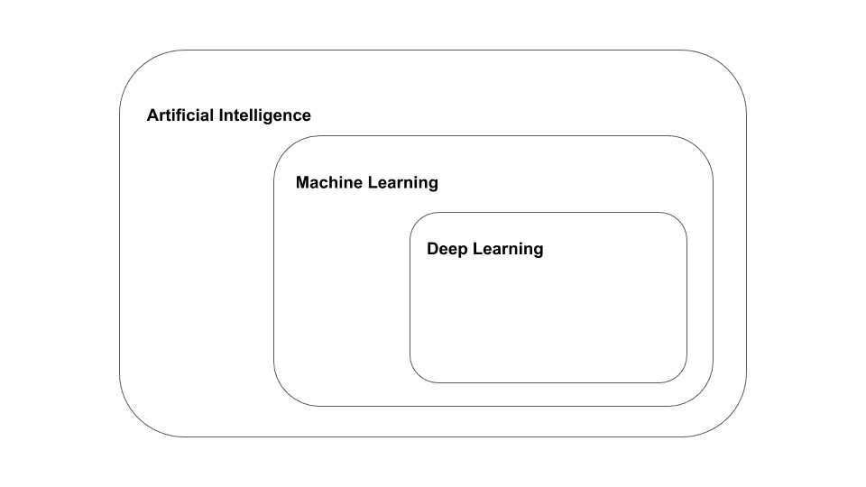
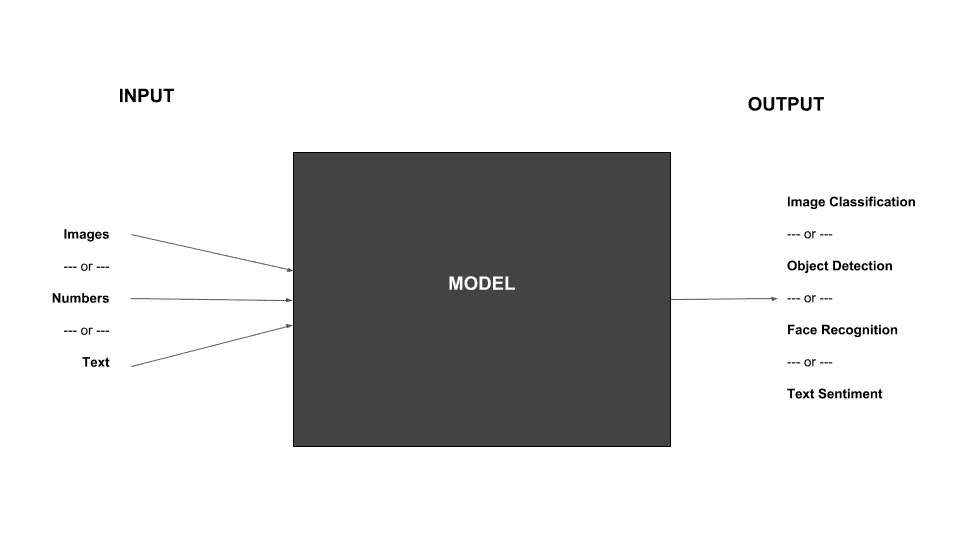
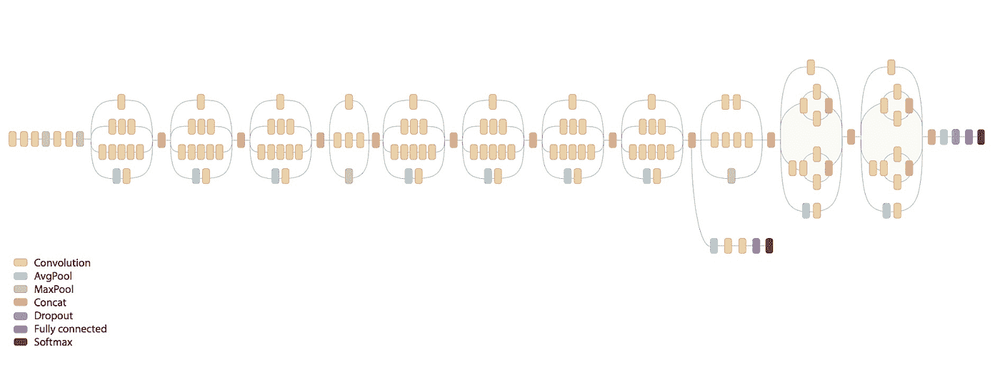
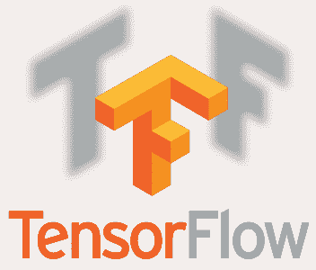

# 人工智能、机器学习、深度学习和张量流的快速介绍

> 原文：<https://medium.com/hackernoon/a-quick-introduction-to-artificial-intelligence-machine-learning-deep-learning-and-tensorflow-3e21b8fdefdc>

人工智能(AI)过去只是科幻小说领域的白日梦，现在已经成为我们日常生活中的主流技术，应用于图像和语音识别、语言翻译、聊天机器人和预测数据分析。

在本文中，我们将介绍 AI 及其相关术语[机器学习](https://hackernoon.com/tagged/machine-learning)和[深度学习](https://hackernoon.com/tagged/deep-learning)。到本文结束时，你应该理解这些术语，事情通常是如何工作的，并且更加熟悉像《盗梦空间》和《YOLO》这样的术语(不，我们不是在谈论莱昂纳多·迪卡普里奥的电影或一些互联网迷因)。

**人工智能** (AI)是计算机对人类智能的模拟。
**机器学习**是人工智能的一个分支，算法用于从数据中学习，以做出未来的决策或预测。
**深度学习**是使用人工神经网络(ANN)的机器学习的特定子集，人工神经网络是受人脑启发的分层结构。

下图更清楚地显示了 AI、机器学习和深度学习之间的关系。

最近，机器学习取得了重大进展，更具体地说，是深度学习。这些进步是由于几个因素的及时融合，包括大量数据的可用性、计算能力的提高和高效算法的出现。

那么机器学习和深度学习是如何工作的呢？用最简单的方式解释它，你基本上有一个定义了输入的模型(可以是图像、音频、数字或文本)。该模型将根据接收到的输入数据产生特定的输出(例如图像分类、检测到的物体等)。

它的工作原理是，你向模型输入大量的样本数据，以便“训练”它。有了足够的数据样本，模型将能够准确地“预测”任何未来输入的输出。有许多著名的模型用于不同的任务，例如 [Inception](https://arxiv.org/abs/1512.00567) 是广泛用于图像识别的模型， [YOLO](https://pjreddie.com/darknet/yolo/) 用于对象检测， [FaceNet](https://arxiv.org/abs/1503.03832) 用于面部识别， [TextCNN](https://www.researchgate.net/publication/322634187_What_Does_a_TextCNN_Learn) 用于文本情感分析，等等。

听起来很简单，不是吗？然而，毫无疑问，机器学习可能不是火箭科学，但绝对不简单。举个例子，前面提到的 Inception 模型有一个内部网络架构，如下所示，这是多年来来自多个研究人员的想法的顶点:

Inception v3 Model Architecture — [CC BY](https://www.researchgate.net/publication/329229460_A_deep_learning_model_for_the_detection_of_both_advanced_and_early_glaucoma_using_fundus_photography)

这看起来比之前展示的大黑匣子复杂多了！为了确定合适的架构，需要进行大量有条理的实验，并且需要手头有足够的数据用于培训和验证。不是任何数据，而是经过适当清理和结构化的相关数据。

有几个工具和平台试图用自动化或可视化工具来简化 AI 模型训练(例如[谷歌云 AutoML](https://cloud.google.com/automl/) 、[微软 Azure ML Studio](https://azure.microsoft.com/en-us/services/machine-learning-studio/) 、 [IBM Watson Studio](https://www.ibm.com/cloud/watson-studio) 、 [Lobe.ai](https://lobe.ai/) 等)，但严峻的事实是，找到并训练一个适用于特定问题的深度学习模型需要数据科学家和机器学习专业人员，或者至少是有抱负的人。为了更详细地了解机器学习，有许多在线课程，包括吴恩达在斯坦福大学开设的备受推崇的[机器学习课程](https://www.coursera.org/learn/machine-learning)。

[TensorFlow](https://www.tensorflow.org/) 是机器学习领域领先的开源 AI 库。TensorFlow 由谷歌构建，旨在实现、培训、测试和部署深度学习神经网络。最初由谷歌大脑团队的研究人员和工程师开发供内部使用，TensorFlow 在 2015 年作为一个开源项目发布。TensorFlow 提供了多种语言的 API，包括 Python、C、C++、Go、Java、JavaScript 和 Swift。TensorFlow 网站提供了一些入门的[教程](https://www.tensorflow.org/tutorials/)。

[Joget](https://www.joget.com/) 是一个开源的无代码/低代码应用平台，用于更快、更简单的数字转换。在[之前的一篇文章](http://blog.joget.org/2017/05/artificial-intelligence-and-automation.html)中，我们研究了通过使用[自定义插件](https://dev.joget.org/community/display/KBv6/AI+Label+Image+Plugin)将经过训练的 TensorFlow 神经网络模型合并到 Joget Workflow 应用程序中。作为 Joget Workflow 的下一代继承者，即将发布的 [Joget DX](https://blog.joget.org/2018/12/introducing-joget-dx-next-generation.html) 在将人工智能纳入决策方面更进一步。

# 结论

随着我们进入 21 世纪，人工智能无疑将在我们的未来扮演越来越重要的角色，所以至少对它是如何工作的有一个大致的了解是很重要的。在本文中，我们讨论了人工智能、机器学习、深度学习以及它们之间的相互关系。我们还用简单的术语解释了深度学习是如何运作的，并介绍了 TensorFlow 和 Joget。在下一篇文章[采用 TensorFlow 和 Joget DX 的企业应用中的人工智能](https://blog.joget.org/2019/03/artificial-intelligence-in-enterprise.html)中，我们将了解如何在 Joget DX 平台上结合 TensorFlow 用于 AI 用例。