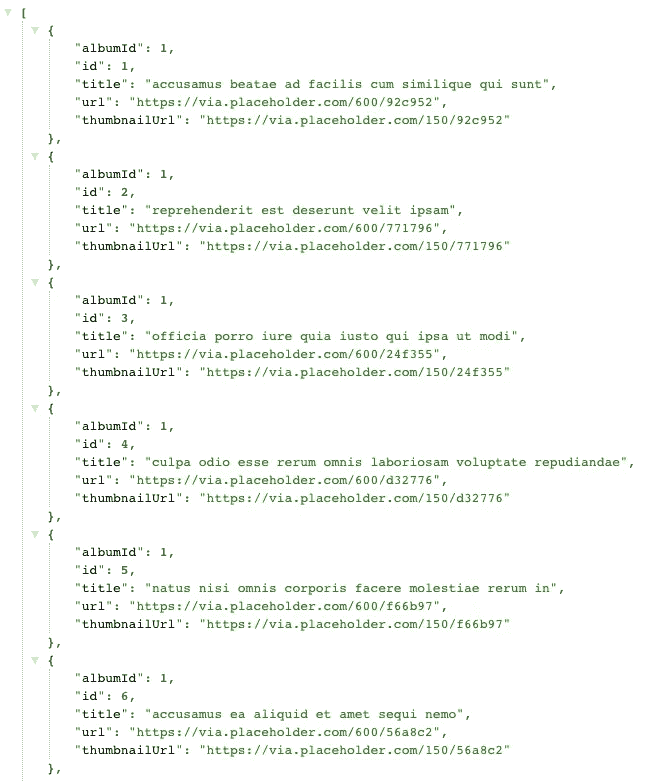
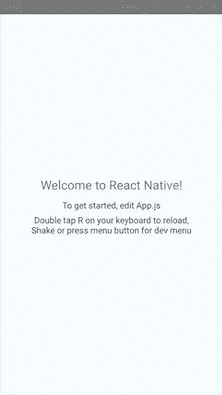
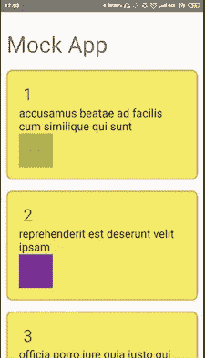
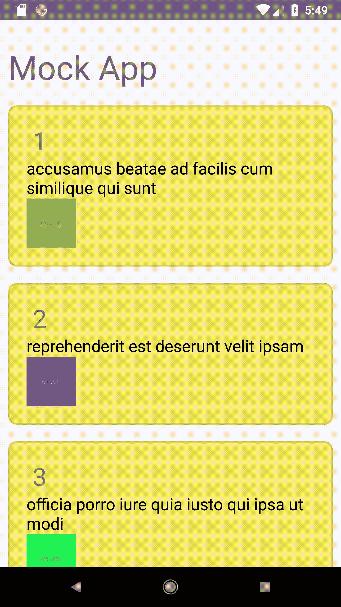

# Android 开发人员的 React Native 初学者指南(包括一个示例应用程序)

> 原文：<https://medium.com/hackernoon/a-react-native-beginner-guide-for-an-android-developer-b0572b709096>


我是一名使用 Java 的 Android 开发者已经有一段时间了。直到最近，我才开始尝试 React-Native 移动开发框架。至少可以说，这是一次令人耳目一新的视角转换体验。本文旨在展示我在这两种框架下开发应用程序时所经历的差异。

# 什么是 React Native？

官网上说:

> React Native 允许您仅使用 JavaScript 构建移动应用程序。它使用与 React 相同的设计，允许您使用声明性组件构建丰富的移动 UI。

它和核心 Swift 或 Java/Kotlin 中的任何 iOS 或 Android 应用程序一样真实。

> 您使用 React Native 构建的应用程序不是移动 web 应用程序，因为 React Native 使用与常规 iOS 和 Android 应用程序相同的基本 UI 构建块。不使用 Swift、Kotlin 或 Java，而是使用 JavaScript 和 React 将这些构建模块放在一起。

所以，基本上这是一个基于 [React.js](https://reactjs.org/) 的框架，它支持 Android 和 iOS 平台的跨平台开发。

现在你一定想知道，为什么我要离开 Java 的舒适环境，去探索 Javascript 和 React.js。

# 优点——等待你的是什么。

1.  **跨平台开发**

开发者的主要目标是为顾客/客户提供服务。没有人会仅仅因为他们的开发者只能为某个特定的平台开发应用程序，就想把他们的用户群限制在这个平台上。因此，即使是开发人员也不应该仅仅因为他/她在一个特定的开发设置中找到了安慰就限制他的技能集。

React Native 是可移植的，即用 Javascript 编写的单一代码库将为 Android 和 iOS 创建模块。

**2。学习反应。**

一旦你熟悉了 React-Native 和 Javascript，它就打开了前端 web 开发的通道，扩展了你的开发视野。React-Native 基于与 React 相同的组件，因此这里学到的技能并不局限于移动开发。

**3。比 Android Studio** 更快的构建时间

您是否浪费了超过 2-3 分钟的构建时间来测试/调试一个基本特性，从而导致调试过程耗时数小时？RN 是解决方案。RN 的构建时间要少得多。有了像热重装这样的特性，UI 开发和测试特性就是小菜一碟了。有了这个功能，每次。js 文件已保存！

**4。Javascript 是网络友好的**

在 RN 中，调用 API、从 URL 渲染图像等非常容易。不再使用*改型*、 *OkHttp* 、*毕加索*等。配置麻烦的开销减少了许多倍。在 android 中，当从 API 接收数据时，首先需要在 POJO 模型中进行转换，然后在 UI 元素中使用。但是 RN 中接收到的 JSON 数据是 Javascript 友好的，可以直接用于扩展 UI。这为来自 REST APIs 的 GET/POST 请求提供了一个简单的 web 接口。

**5。UI 开发**

RN 的 UI 方法是 *flexbox* ，这是 Android 的 XML 布局的一个强有力的竞争对手。flexbox 方法在 web 开发社区中非常流行。大多数 UI 元素必须在 RN 中从头开始开发，而在原生 Android 开发中，已经包含了 Google 设计支持库。这使得开发者在交互和响应设计方面有了更多的自由。

# 坏处-你可能会错过的。

1.  **你可能讨厌 Javascript**

有很多人不喜欢 Javascript，仅仅是因为它不像传统语言，例如 *Java* 、 *C++* 等等。你可以在这里找到详细的恨[，在这里](https://www.quora.com/Why-is-JavaScript-so-hated)找到[。](https://www.reddit.com/r/javascript/comments/9pwzpn/why_do_people_hate_javascript/)

**2。第三方库不多**

RN 社区仍处于萌芽阶段，第三方的支持库不像他们在原生 Android 社区中那样受欢迎(顺便检查我的幻灯片 Android 库[这里](https://github.com/nikhil-sachdeva/SliderViewLibrary)👈).

# 示例应用程序

让我们首先尝试开发一个 API 获取应用程序来理解 RN 工作的简单性。第一步显然是安装 RN，可以从官网[这里](https://facebook.github.io/react-native/docs/getting-started)进行。此外，对于初学者来说，他们有令人惊讶的文档，请务必阅读。我们将使用这个模拟 API[https://jsonplaceholder.typicode.com/photos](https://jsonplaceholder.typicode.com/photos)，它有如下数据



The API data received on a GET request

这里要注意的是，在 Android 上使用像 Retrofit/OkHttp 这样的库来使用 API 是一件麻烦的事情。但是正如我们将看到的，Javascript 是一种动态的迭代语言，这项工作简化了。

让我们首先创建一个 MockApp 项目，如下所示:

```
react-native init MockApp
cd MockApp
```

然后使用以下命令在您的虚拟/本地设备上运行它:

```
react-native run-android
```

您将看到一个类似如下的屏幕:



The initial screen of the app

我们将使用 API 制作一个应用程序，如下所示:



The final screen of our app.

现在，在文本编辑器中打开项目，编辑 App.js，如下所示:

```
export default class App extends Component<Props> {
constructor(props){
super(props);
this.state ={ isLoading: true}
}
componentDidMount(){
return fetch('https://jsonplaceholder.typicode.com/photos')
.then((response) => response.json())
.then((responseJson) => {
this.setState({
isLoading: false,
dataSource: responseJson,
}, function(){
});
})
.catch((error) =>{
console.error(error);
});
}
render() {
    if(this.state.isLoading){
return(
<View style={{flex: 1, padding: 20}}>
<ActivityIndicator/>
</View>
)}
return(
<View style={{flex: 1, paddingTop:20}}>
<Text style={styles.header}>Mock App</Text><FlatList
data={this.state.dataSource}
renderItem={({item}) => <View style={styles.card}><Text style={styles.id}> {item.id}</Text><Text style={styles.title}>{item.title}</Text><Image source ={{uri : item.url }}  style={styles.image}/></View>}
keyExtractor={({id}, index) => id}
/>
</View>
);
}
```

现在，在给定的代码中有很多东西需要解开。我将对代码中的每个主要关键字做一个简短的总结，但是继续查找对你没有意义的每个关键字。掌握所有的窍门需要一些时间。

1.  ***componentidmount:***它是 RN app 生命周期的一部分。`componentDidMount()`在组件安装(插入到树中)后立即被调用。
2.  ***Fetch:***React Native 为你的联网需求提供了 [Fetch API](https://developer.mozilla.org/en-US/docs/Web/API/Fetch_API) 。
3.  ***状态变量(isLoading，data source):****is loading*是一个 bool 变量，表示 API 数据是否加载。*数据源*是存储来自*获取*命令的 JSON 响应的变量
4.  ***FlatList :*** 它是 RecyclerView 的 RN 对应物但简单得多。*`FlatList`组件显示不断变化但结构相似的数据的滚动列表。`FlatLis` 适用于长数据列表，其中项目的数量可能会随着时间的推移而变化。*

> *但是正如我们所看到的，我们不需要为数据列表中的每个数据项单独设置变量。这就是动态语言(即 Javascript)的魅力所在。变量的类型是在运行时确定的，因此即使处理大量数据也是一件容易的事情。*

*正如我们所看到的，每个组件的样式已经定义，我们必须给它们属性值。这可以如下进行。*

```
*const styles = StyleSheet.create({
card: {
padding: 20,
margin: 10,
borderColor: '#ff7a00',
borderWidth: 2,
borderRadius: 10,
backgroundColor: '#f3ea68',
flex: 1,
},
header: {
fontSize: 40,
padding: 10,
},
image: {
height: 60,
width: 60,
},
title: {
fontSize: 20,
color: '#000',
},
id: {
fontSize: 30,
}
});*
```

*有了这么多代码，我们的工作就完成了。我们成功地得到了一个应用程序，它的组件使用 API 进行了膨胀。*

# *这是最终的结果:*

**