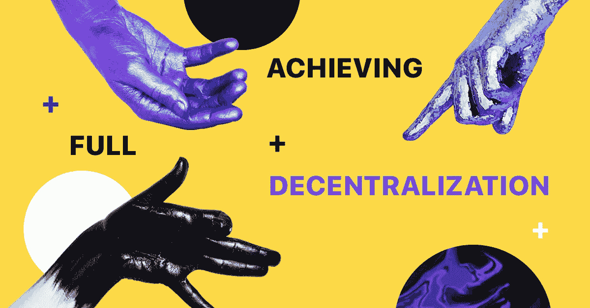

# 对读者友好且易于理解的 dApps 指南

> 原文：<https://medium.com/hackernoon/a-reader-friendly-and-an-easy-to-understand-guide-to-dapps-4ad4d9f82084>

Crypterium [wallet](https://crypterium.com/products/wallet) 的主要功能之一将是授权我们的用户访问 dApps，从 CryptoKitties 这样的赌博和游戏应用程序到像 [IDEX](http://idex.market/eth/aura) 这样的完全去中心化的交易所( [dex](https://crypterium.com/news/open/40dcde17-cd85-455c-823d-38b29d251753) )。

以某种奇怪的方式，dApps 就像你在美国的第一天——你有自由、民主和创造的机会。虽然美国的参考是福克斯新闻上整个政治辩论的主题，但 dApps 确实可以彻底改变应用程序的方式，尤其是互联网的工作方式。这场革命可以让普通用户而不是大公司受益，我们 Crypterium 希望参与 dApps 的普及。但是它们到底代表什么呢？

## dApps 的目的是什么？

分散式应用程序(dApps)是在计算机的 P2P 网络上运行的应用程序。它们是一种软件程序，旨在以不受任何实体控制的方式在线存在。

每天，我们大多数人都在网上分享某种数据，但事实是我们无法控制它。对一些人来说，这是一个问题，而且是一个严重的问题。在网上，我们接触到越来越多的个人数据泄露、身份盗窃案件，以及成为骗局或黑客攻击受害者的危险。这些需要解决的问题，像以太坊和 EOS，试图通过[区块链](https://hackernoon.com/tagged/blockchain)科技来解决。目标是创建一个类似“分散应用商店”的东西，任何人都有权发布他们现成的分散应用(d app)。

与现代的 Airbnb 或亚马逊不同，这些应用不需要中间人来管理用户数据或运行。DApps 将能够直接连接用户和应用程序提供商/开发者。

## dApps 必备的有哪些？

首先，应用程序必须完全开源。它必须只能自主工作，没有任何实体可以控制大多数令牌。只有用户一致同意才能决定任何更改和/或改进。

其次，所有操作的数据和记录必须以加密方式存储在公共的、分散的区块链。这样做是为了避免任何中心故障点。

此外，dApp 只能使用加密令牌。可以是[比特币](https://hackernoon.com/tagged/bitcoin)，以太坊或者 app 自带系统的 token。令牌必须是访问应用程序的先决条件，也是其中的一种奖励形式。

## Crypterium 和 dApps 有什么共同点？

那么我们为什么要谈论 dApps 呢？答案很简单:Crypterium 的目标是 dApps 集成，可以为我们的移动应用程序提供更广泛的功能和更好的用户体验。Crypterium 移动应用程序将充当 dApps 的接入点，并有机会自动连接用户的钱包。

如果我们回到一篇文章开头有争议的关于美国自由的提法，Crypterium 在你的国家有一个美国大使馆的角色，授予你绿卡。

Crypterium 与 dApps 的关系主要可以用两个强有力的词来描述:潜力和价值。我们将确保普通用户对 dApps 的访问变得简单和舒适。此外，我们将有可能创建自己的 dApps，并轻松地将其集成到 Crypterium 移动应用程序中。这意味着我们的社区成员可以无限扩展功能。

## 有哪些 dApps 的例子？

有几种 dApps，最受欢迎的与交流，游戏，赌博和收藏品有关。在目前的市场状态下，前 50 名 dApps 每月拥有约 10 万活跃用户。例子包括 IDEX，CryptoKitties，德州扑克扑克国王和史诗龙。他们中的一些人，比如 CryptoKitties，非常受欢迎，由于对它的大肆宣传，整个以太坊网络瘫痪了一段时间。

[IDEX](https://idex.market/eth/aura) 是一个正在运行的分散式交易所，DEX 使得参与者之间的加密货币交易的绝对安全成为可能。交换过程是匿名的，由参与者自己控制。德州扑克扑克王是在线游戏的一个例子，它让用户有权在没有第三方影响的情况下相互互动，而 Epic Dragons 是一个关于“凶猛的龙”之间战斗的游戏应用程序，结合了安全的区块链验证和投资模拟。

这些例子只是稍微说明了 dApps 的巨大潜力。DApps 已经发展出卓越的特性，因为它们为用户提供了投资开发的能力。观察它们的受欢迎程度和使用案例，可以确定在不久的将来，dApps 可以用于多种用途，如支付、存储、云计算等。可以超越目前可用的传统应用。

想象一下一个完全去中心化的互联网，你可以根据自己的条件自由地创造、购买、出售和交换，而不需要第三方。不仅如此，一些应用程序专注于投票系统和政府分权。DApps 可以创新，让我们生活的方方面面从教育到购物变得更好。Crypterium 想加入，也想让你加入。

## 关于隐密处

根据毕马威和 H2Ventures 的说法，Crypterium 是最有前途的金融科技公司之一。我们正在打造一款移动应用，以满足数字资产时代的银行需求。

我们的目标很明确:有了 Crypterium，无论你用传统货币做什么，你都可以用数字资产来做。这个想法得到了 TechCrunch 联合创始人 Keith Teare 和超过 40 万注册用户的支持，这个数字每天都在增长。

该团队由 Visa 中欧和东欧前总经理 Steven Parker 以及来自全球金融机构(如复兴保险、伦敦衍生品交易所、美国运通等)的高管领导。

加入我们的 [**电报新闻频道**](https://t.me/crypterium_en) 或其他社交媒体，保持更新！

[**网站**](http://crypterium.com)**๏**[**电报**](https://t.me/crypterium)**๏**[**脸书**](https://www.facebook.com/pg/crypterium.org)**๏**[**推特**](https://twitter.com/crypterium)**๏**[**bitcointalk**](https://bitcointalk.org/index.php?topic=2214098.0)****************