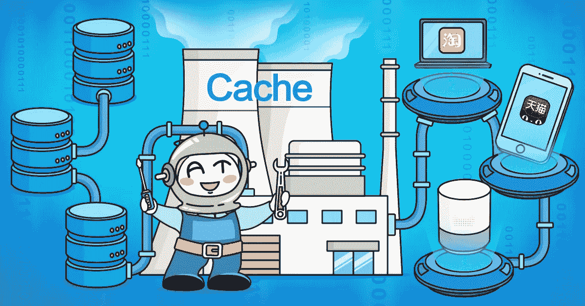
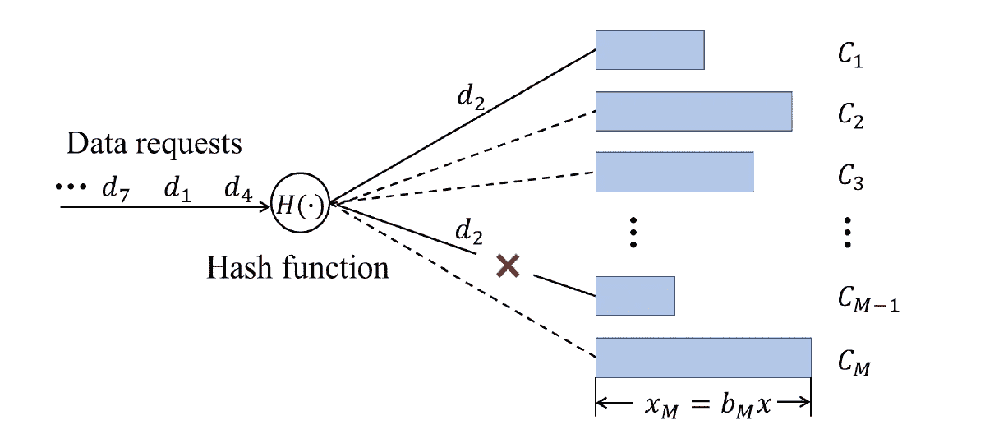
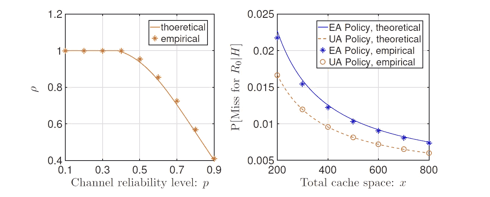
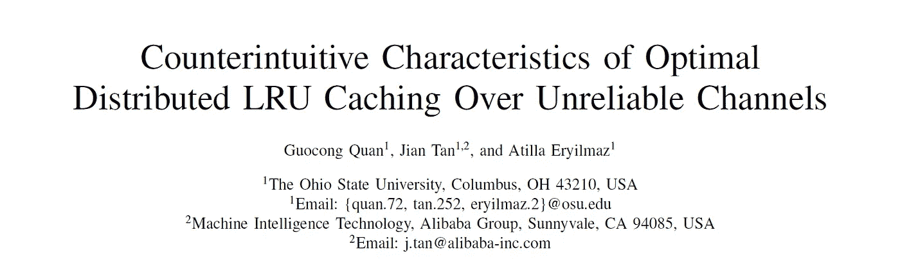

# 解决不可靠缓存环境的可靠方法

> 原文：<https://medium.com/hackernoon/a-reliable-approach-to-unreliable-caching-environments-786a9dfe809f>

*本文是* [***学术阿里巴巴***](/@alitech_2017/academic-alibaba-b56f4176a838) *系列的一部分，摘自 WWW 2019 年题为“不可靠信道上最优分布式 LRU 缓存的违反直觉的特征”的论文，作者是郭聪全、和阿蒂拉·埃尔伊尔马兹。全文可以在这里阅读***。**

*当你第一次打开一个应用程序时，你会从服务器上获取一堆数据——图片、文本和其他各种让应用程序运行的对象。如果你每次访问应用程序时都必须重复这个过程，你会浪费宝贵的时间，而这些时间本可以用来查看电子邮件、与虚拟维京人战斗或用应用程序做其他任何事情。*

*幸运的是，我们可以使用缓存来避免一次又一次地从服务器下载数据。通过缓存，来自服务器的一些数据存储在本地，这意味着您下次可以更快地访问这些数据。*

*最常见的缓存类型之一是最近最少使用的(LRU)缓存，其中只缓存最近使用的数据。当新数据进入但缓存已满时，最长时间未使用的数据将被踢出以腾出空间。确保这些缓存功能正常工作是维护系统性能的关键。*

# *缓存中的陷阱*

*缓存并不总是完美的。有时请求数据，但在缓存中找不到。这被称为缓存未命中。为了最大限度地减少缓存未命中，研究人员专注于优化两个主要领域:缓存组织(即内存在缓存中的分配方式)和数据放置(即，将数据请求分派到正确的缓存)。*

*对于数据中心和有线网络服务器的缓存优化，已经进行了大量有价值的研究。但是，不太可靠的环境，如边缘计算、无线和移动网络，带来了各种新的挑战:通信错误、移动性、衰落等。即使请求的数据确实在缓存中，缓存未命中也会发生。因此，在不可靠的环境中，每个数据项通常存储在多个缓存中。*

*考虑到这些特征，不可靠的环境应该使用在可靠环境中工作的相同的缓存技术吗？阿里巴巴科技团队与俄亥俄州立大学哥伦布分校合作，着手回答这个问题。*

# *讨论出答案*

*该团队考虑了一种单跳多缓存分布式系统，该系统将数据项调度到多个缓存空间。这一过程依赖于一种称为随机哈希的技术，假设每个数据项都映射到一组缓存，而不是一个缓存，这是典型的不可靠环境中的情况。通过分析这个多缓存系统，该团队开发了一个模型，同时考虑缓存组织和数据放置。他们还导出了一种计算高速缓存未命中率的有效方法。*

**

*Using random hashing to dispatch data to multiple channels*

*该团队在可靠和不可靠的环境中遇到了令人惊讶的差异。最违反直觉的结果来自于如何优化缓存分配。人们可能会认为，在多个缓存中平均分配空间会产生最佳性能，这一点已经在可靠环境中得到验证。但是该团队实际上发现，在不可靠的环境中，不平等地分配空间对性能来说是最好的，即使缓存在其他方面是相同的。*

**

*Comparing miss ratios for RP (resource pooling), EA (equal allocation), and UA (unequal allocation)*

*该团队的研究还分析表明，在不可靠的环境中，不同流行度的数据项应该在不可靠的节点上以不同的方式复制，以获得更好的性能。*

# *缓存的未来*

*阿里巴巴对缓存技术的见解可以帮助工程师开发和实施更高效的缓存解决方案。这对你意味着什么？更少的缓存未命中意味着获取数据的延迟更少，这意味着等待应用程序的时间更少，而虚拟海盗战斗的时间更多！*

**

**全文可在此阅读***。***

# **阿里巴巴科技**

**关于阿里巴巴最新技术的第一手深度资料→脸书: [**【阿里巴巴科技】**](http://www.facebook.com/AlibabaTechnology) 。Twitter:[**【AlibabaTech】**](https://twitter.com/AliTech2017)。**