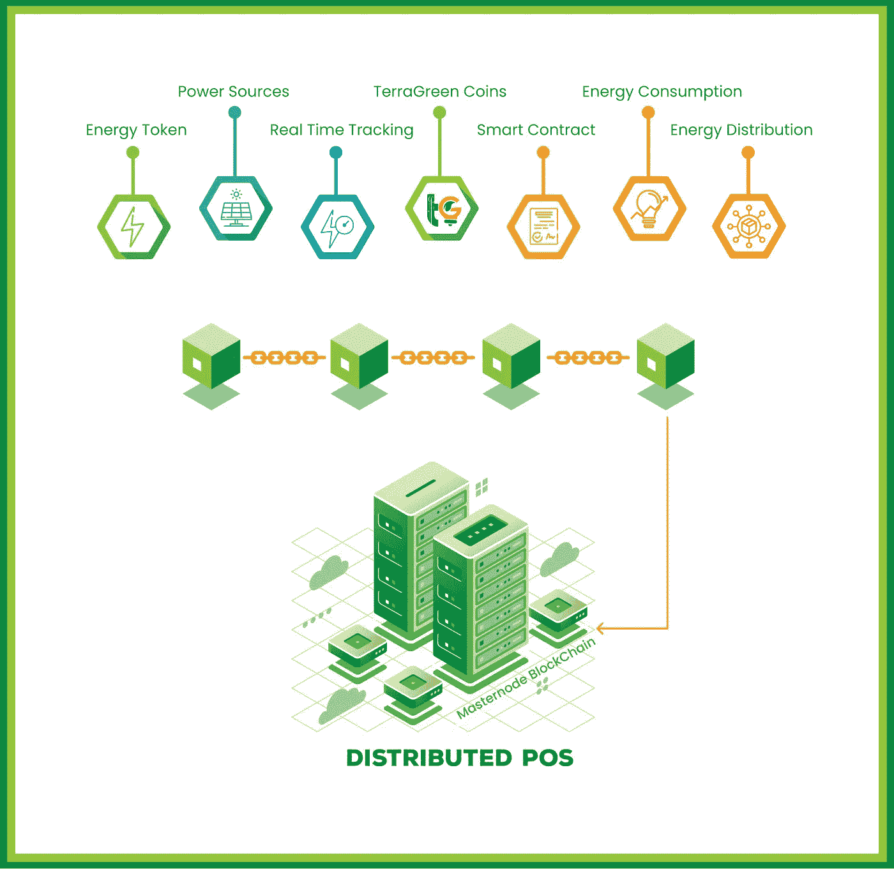

# 可再生能源领域的可靠区块链平台

> 原文：<https://medium.com/hackernoon/a-reliable-blockchain-platform-for-renewable-energy-sector-b25a7eecdf5d>

# TerraGreen 目的

TerraGreen 背后的一般想法是使用区块链技术和加密货币使地球(Terra)成为一个更绿色的地方。TerraGreen 的重点是利用可再生材料和废弃物生产可再生能源，而不是使用石油、煤炭和天然气等化石燃料。最终，TerraGreen 的目标是创建一个真正可持续的清洁社区，让消费者直接积极参与到可再生能源行业中来。

TerraGreen 计划打破能源生产商、投资者、消费者和公用事业公司之间的壁垒，让人们参与进来，影响他们的能源生产。

# TerraGreen 动机。

地球面临的环境压力引发了全球范围内对能源结构创新的迫切需求。正如 148 个国家批准了巴黎气候协议所证明的那样，随着这些国家同意履行责任，尽快限制 GHG 的排放量，它们对促进更清洁的未来有着浓厚的兴趣。

全球变暖的严重性是由于能源生产者和能源使用者之间的脱节。TerraGreen 致力于在区块链技术的帮助下，改革当前的能源供应结构，并过渡到新的能源系统，从而从根本上减少 GHG 排放，减轻废物污染。

TerraGreen 是一个生态系统，其中可再生能源被标记出来，可以被社区用来交换法定货币或支付能源消耗。但是我们并没有止步于此，我们希望利用区块链技术，让用户能够监控能源是如何产生的，以及它的用途是什么。

# 可再生能源技术合作。

TerraGreen 一直与能源行业内外的公司合作，以更高效、可靠和可持续的方式生产可再生能源技术。这种合作导致了新技术的发展，即生物质气化系统和生物燃料水解器。合作伙伴包括

a.AVI 可再生能源有限公司

b.奥古斯蒂娜贸易有限公司

c.海德格林放大器私人有限公司

通过将水解器引入 TerraGreen 平台，我们建立了与客户的直接联系，并为每个人提供了减少化石燃料消耗的可能性。可以跟踪水解器的使用情况，减少的燃料消耗可以转化为绿色能源令牌，该令牌连接到 TerraGreen 平台。

# TerraGreen 阶段。

TerraGreen 将分 4 个阶段开发。从第 1 和第 2 阶段的用例开始。从长远来看，TerraGreen 希望彻底改革能源生产和分配系统。但我们正从真实项目的用例开始，以建立信任并开始平台的开发。

# 第一阶段。

第一阶段是制造第一批能源代币和开发 TerraGreen 平台。在 TerraGreen 的第一阶段和使用案例中，我们着眼于为生产者创造能源令牌。

# 第二到第四阶段。

在第二阶段，TerraGreen 可以与能源分销公司建立合作关系，接受特定的能源代币作为客户的付款。

阶段 3 将阶段 1 和阶段 2 结合起来，将消费者购买的能源代币价格与可再生能源发电厂创造的代币联系起来。这就介绍了平台上的 TerraGreen 交易所。

在 TerraGreen 的最后阶段，我们正在将能源网络扩展到输电公司。能源支付将通过各种代币完成。区块链可以实时跟踪能源的产生、传输和使用。

第一阶段使用案例:Ajil Biofuel Sdn Bhd 在马来西亚丁加奴的 240 万千瓦生物质气化发电厂

# 2011 年马来西亚可再生能源法案

根据 2011 年《可再生能源法案》,马来西亚政府引入了一项上网电价机制，以促进可再生能源行业的发展，该机制的实施由马来西亚可持续能源发展局(SEDA)负责管理、监督和审查。

# 2.4 兆瓦生物质气化发电厂

电厂将采用的技术是一种成熟的流化床气化系统。用例工厂将使用森林和农业废弃物形式的原料。其设计目的是在整个 16 年的运行过程中实现至少 85%的可用系数。

该工厂将处理过的生物质废物转化为中热值产品气体。在这里，产生的气体在燃气发动机中燃烧以发电。该发电厂能够生产 2.4 兆瓦的电力。

# 生物质燃料生产设施。

生物质燃料生产设施旨在从森林和农业废料中生产煤球。煤球用于生物质气化厂发电。

使用案例:Hydrogreen Amplifier Pvt. Ltd .在印度的生物燃料水解器应用

印度的古吉拉特邦是世界上发展最快的大都市之一。2015 年，古吉拉特邦注册的机动车数量约为 1900 万辆。TerraGreen 利用最新技术应对不断增长的燃料需求和排放。为此，我们将首先在最需要的地方推出水解器的实现。

# 用例阶段 2 —电力交易验证服务。

TerraGreen 与柬埔寨、马来西亚和中非共和国(CAR)的配电公司合作，计划实施电力零售 DApps，目的如下:

-验证电力消耗

-付款的验证

-提高电力价值链的效率。

# 区块链技术。

TerraGreen 的本地区块链将允许在系统上部署不同的 DApps。因为这是一个绿色能源的平台，我们不支持工作共识证明所做的大量浪费。为此，我们将实施最新的利益相关共识专用证明，以确保我们的区块链安全高效。

随着应用程序部署在区块链上，我们可以实时传输、存储和分析能源数据。它将具有闪电般的速度，多层协议，易于使用和无限的侧链，使平台奢侈。

# 象征经济学——市场、增长和收入。

在每笔代币交易中， TerraGreen 平台币 (TGN)与一小部分相关联，因此“运行”系统。这种连接是通过智能合同来实现的，智能合同被实施到区块链技术中。

TerraGreen 的每个阶段都有自己的市场，并为硬币创造了新的需求。此外，每个阶段将包括多个项目和市场，TerraGreen 将在这些项目和市场中推出。

在第一阶段，通过 TerraGreen 平台支持可再生能源项目。第二阶段向消费者介绍能源代币。在第三和第四阶段，最终的大规模采用将在稍后出现，推动 TGN 的需求和价值。

# 代币分销、销售和供应。

**资金使用**

TerraGreen token (TGN)的总供应量设定为 2.7 亿。只有大约 50%会在 ICO 之后被解锁。20%留作主节点的奖励，其余 TGN 锁定投资合同，根据需求增长业绩发布。

# 结论

随着区块链技术在其平台上的应用，TerraGreen 将带来革命性的变化。它的主要目的是消除消费者、生产者和投资者之间的隔阂，在他们之间架起一座桥梁。

TerraGreen 是一个生态系统，其中可再生能源被符号化，可以被社区用于交换法定货币或作为能源消费的付款。但是我们并没有止步于此，我们希望利用区块链技术，让用户能够监控能源是如何产生的，以及它的用途是什么。

TerraGreen 将引入水解器，与客户建立直接联系，让每个人都有可能减少化石燃料的消耗。水解器的使用可以被跟踪并转换成绿色能源令牌，该令牌连接到 TerraGreen 平台。

TerraGreen 将分 4 个阶段开发。从第 1 和第 2 阶段的用例开始。从长远来看，TerraGreen 希望彻底改革能源生产和分配系统。但我们正从真实项目的用例开始，以建立信任并开始平台的开发。

随着应用程序部署在区块链上，我们可以实时传输、存储和分析能源数据。它将具有闪电般的速度，多层协议，易于使用和无限的侧链，使平台奢侈。

TerraGreen platform coin (TGN)在每笔代币交易中都与一小部分相关联，因此“运行”系统。这种连接是通过智能合同来实现的，智能合同被实施到区块链技术中。

TerraGreen 的每个阶段都有自己的市场，并为硬币创造了新的需求。此外，每个阶段将包括多个项目和市场，TerraGreen 将在这些项目和市场中推出。