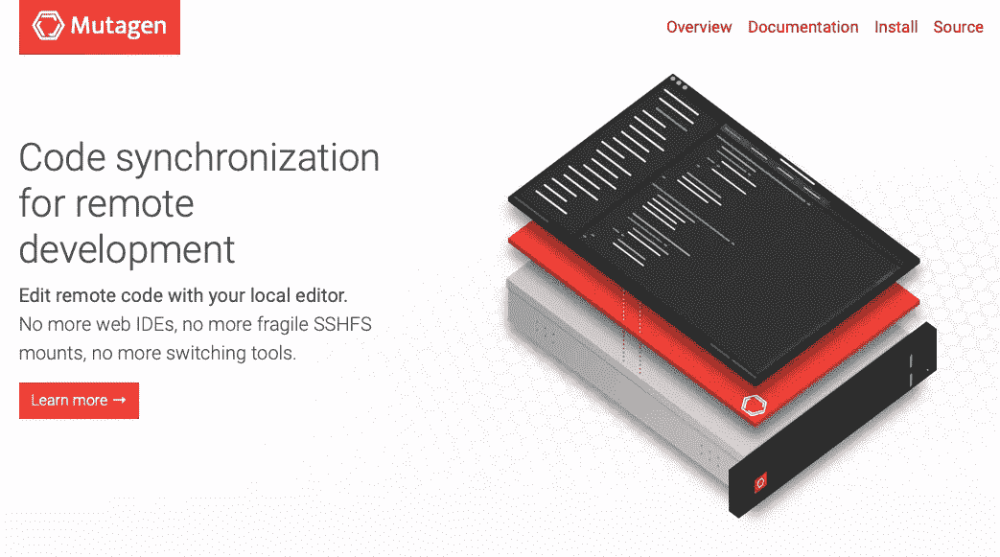
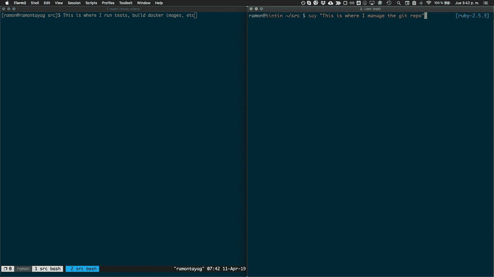
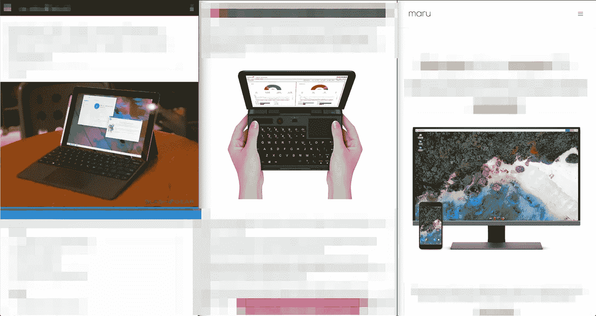

# 一个远程 Web 开发设置，我终于满意了

> 原文：<https://medium.com/hackernoon/a-remote-web-dev-setup-im-finally-happy-with-15a486e894b7>

作为一个制作[软件](https://hackernoon.com/tagged/software)的人，我一直想随身携带更轻便的设备，但这样做意味着不得不放弃一些软件开发任务所需的电力和存储空间。

拥有笔记本平板电脑或非常小的电脑的外形是让你的肩膀休息一下的答案，但这也是降低生产力的答案……除非你使用远程[开发](https://hackernoon.com/tagged/development)机器来完成繁重的工作。

## 我尝试过的

通往这一目标的道路漫长而曲折。虽然我以不值得一提的方式稍微调整了一下这个设置，但对我来说最有用的设置是[摩西](https://mosh.org)、 [TMUX](https://github.com/tmux/tmux) 和[维姆](https://www.vim.org)——都在远程机器上。这种设置的问题是，Vim 完全在终端中，每当我想要复制和粘贴某些东西时，它都让我想揪自己的头发——我永远无法让复制到系统剪贴板正常工作。虽然 mosh 有助于慢速连接，因为所有的工作都是在机器上完成的，当你的连接很慢时，你会感觉到。

因为我对 Vim 完全在远程机器上的抱怨，唯一缺少的部分是能够使用任何编辑器——gVim、MacVim、Microsoft VSCode、Sublime Text——并让我所做的任何更改自动同步到远程服务器。

这就是[诱变剂](http://mutagen.io)发挥作用的地方。

不需要在远程机器上安装任何东西，mutagen 允许你快速(读:我甚至没有注意到我的代码正在同步到远程机器)对远程文件进行更改。现在，我可以很好地使用 MacVim 和系统复制粘贴功能，或者远程配对，微软 VS Code 或 tmate。

## 立即安装

*   远程机器。这可能是你最喜欢的云主机:谷歌云，AWS，数字海洋，Linode。
*   终端有两个打开的标签:一个用于远程机器，另一个用于本地机器

Left window is the remote machine, right is the local.

*   到远程机器的连接是 Mosh + TMUX
*   所有代码都在一个文件夹里。对我来说，这就是“src”。这是唯一一个我用诱变剂设置的能和远程机器同步的。我不得不调整什么诱变剂不同步，这样我就不会下载缓存文件，日志文件，或任何大文件。
*   当我在远程机器上启动一个开发服务器时，我启动了 [ngrok](https://ngrok.com) ，所以我在一个域上访问我的站点，比如“https://abc1828.ngrok.com”。

我喜欢这种设置，因为我的电池续航时间更长。我可以使用更便宜、更轻便的机器，并且当我不在移动时，我仍然可以连接到大显示器。当我需要下载和构建 Docker 图像时，我也不会为此而烦恼，即使是在沙滩上通过 HSDPA 连接。

我只想改进一件事:能够在 30 分钟不使用远程机器后自动关闭它。我还没有找到简单的解决方法。

## 五金器具

我有点作弊。我在 Macbook Pro 上打这个，功能强大到可以在本地做任何事情。然而，我已经使用远程设置(并给我的 SSD 额外的 60GB 空间，因为我已经删除了 Docker)大约一个月了。时机成熟的时候，我会完成转型，把所有东西都转移到一个[微软 Surface Go](https://www.microsoft.com/en-us/p/surface-go/8v9dp4lnknsz) (我会[在上面安装 Linux](https://www.slashgear.com/surface-go-with-linux-review-almost-the-perfect-open-source-notepad-25558990/) ，或者一个 [GPD MicroPC](https://www.indiegogo.com/projects/gpd-micropc-6-inch-handheld-industry-laptop) +一个[便携显示器](https://www.amazon.com/gp/product/B013XFJKGI?ref=em_1p_1_ti&ref_=pe_3753960_398469730)，甚至[把所有东西都放到一个装有 MaruOS](https://maruos.com) 的手机上，得到一个[便携显示器](https://www.amazon.com/gp/product/B013XFJKGI?ref=em_1p_1_ti&ref_=pe_3753960_398469730)。

My top three hardware candidates. Left to right: Microsoft Surface Go with Linux, GPD MicroPC, MaruOS on a phone.

只要这台机器可以插入一个大显示器，有蓝牙功能，并且可以毫无问题地浏览大量网站，它就是这种设置的候选。

我很想知道你如何定制这个为你工作。请在下面留下评论。