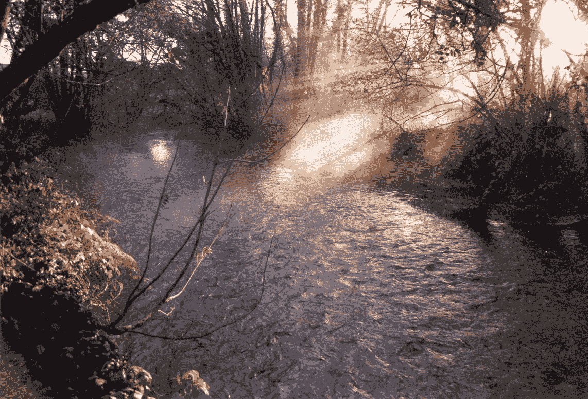
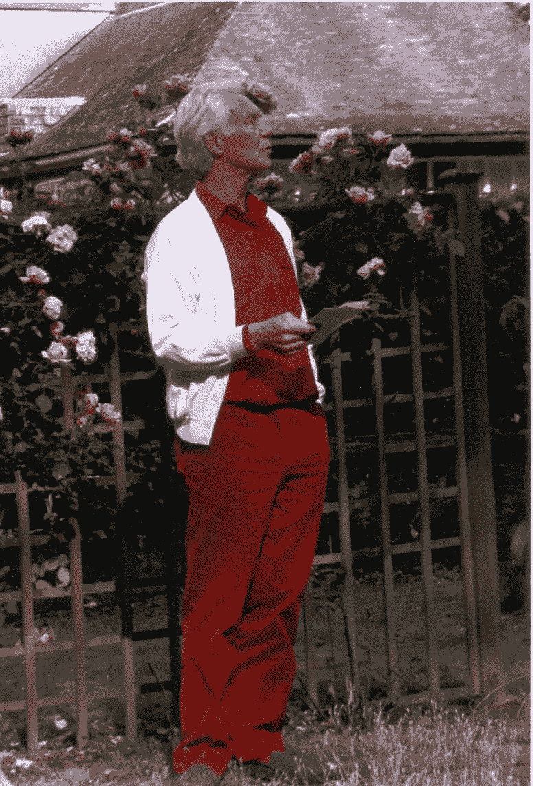
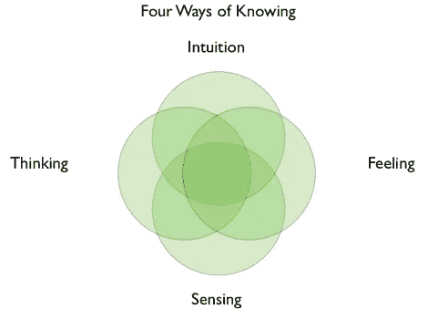
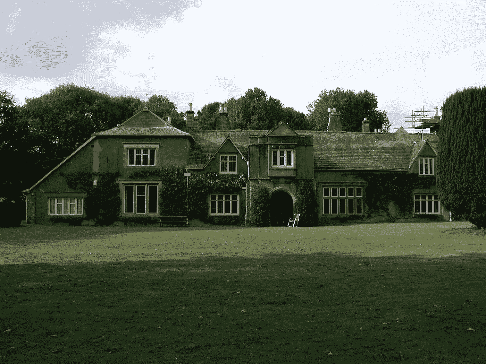
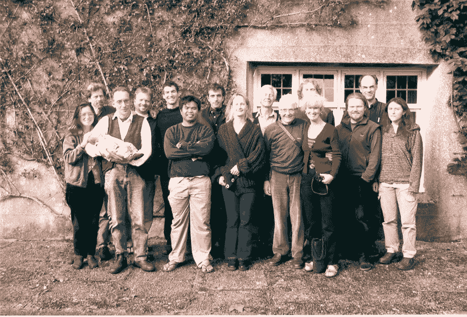

# 质量科学:体验世界的形成&生活在混沌的边缘

> 原文：<https://medium.com/hackernoon/a-science-of-qualities-experiencing-the-world-coming-into-being-living-on-the-edge-of-chaos-d54b6dce4c2c>

## 布莱恩·古德温 2007 年 3 月在舒马赫学院采访丹尼尔·沃尔

The River Dart near Schumacher College (Photo: Liz Turner)

2001-2002 年，我是舒马赫学院整体科学硕士的学生。Brian Goodwin 教授和 Stephan Harding 博士在三年前建立了这个创新项目。在 2007 年对布莱恩的采访中，我们探索了这门课程的一些关键见解以及它们与未来转变的相关性。我再怎么强调认识布莱恩并向他学习对我自己的生活和工作有多么重要也不为过。

**丹尼尔·c·沃尔**:你能解释一下你所说的*‘品质的科学’*是什么意思吗？

Brian Goodwin giving a speech during a wedding ceremony at Schumacher College

Brian Goodwin: “质量科学实际上是传统科学的延伸，从这个意义上说，它依赖于共识、协议和一种方法论，通过这种方法论，人们开始认识到他们对其他生命的经验质量的共识。这些其他的存在可以是动物、风景或组织——一个房间、一座建筑，无论它是什么。

当然，我们生活在质量方面，而不是数量方面。数量变得很重要，但真正赋予我们的生活和人际关系以质感和品质的是品质。从某种意义上说，关系在新的网络科学中已经变得非常重要，我们必须恢复整个质量领域。现在有系统的方法来证明，人们可以非常有效地达成共识，关于农场动物体验的质量，关于在风景中表达的质量，一条河流的质量等等。

这些都是人们一直自发做的事情。是常识，已经被现代科学排除在外了。现在我们需要把它作为数量科学的延伸带回来。"

丹尼尔·c·沃尔:“约翰·沃尔夫冈·冯·歌德的工作在早期质量科学的发展中起到了多大的作用？”

**布莱恩·古德温:**当然，歌德是一个很好的整体科学家的例子，它不仅仅是科学。歌德显然是一个整体的人，从某种意义上说，他从事艺术和科学，他使用[我们现在称之为]现象学的方法来观察生命的质量和数量。他把两者放在一起。

The Jungian Mandala of the Four Ways of Knowing (from a [review of Stephan Harding’s book ‘Animate Earth’ by Simon Robinsion](https://transitionconsciousness.wordpress.com/2012/11/12/science-intuition-and-gaia-stephan-hardings-animate-earth-2nd-edition/), another graduate of the MSc in Holistic Science and co-author of ‘Holonomics’

探索自然世界的系统方法——当我说“自然世界”时，我指的是一切！我没有区分自然和文化——这就是正在实现的统一。歌德提供了一个很好的例子，告诉我们如何系统地做到这一点，并整合所有不同的认知方式:直觉、感官、感觉和分析(思维)。如果你把所有这些放在一起，你就有了一个综合的方式来认识这个世界，并在这个世界上一致行动。"

丹尼尔·沃尔(Daniel c . Wahl):“设立整体科学硕士学位的想法是如何产生的，你能告诉我们一点你实际上是如何设立的吗？”

**布莱恩·古德温:**“自从我 60 年代和 70 年代在苏塞克斯大学经历了那种‘启蒙’时期之后——我的意思是 60 年代的现象非常显著，在苏塞克斯大学这种现象发展得非常好——它给我一种感觉，我们需要在某种程度上废除所有学科之间的界限，但不要放松任何严格性。这听起来很矛盾，但是你可以非常严谨地思考和分析，同时包含所有这些不同的认知方式。

现在这是一个挑战，在某种程度上我不知道解决方案是什么，我现在仍然不知道，但我在苏塞克斯大学和开放大学探索过这个问题——但学术*许可*是有界限的，所以当我 1996 年来到舒马赫学院时，我真的很惊讶，有可能系统地探索这个整体科学的领域——以混沌、复杂性和盖亚理论为基础，融合所有这些不同的成分。

当然还有斯蒂芬·哈丁，我们一起建立了这个项目，并被普利茅斯大学接受。尚未充分开发和仍在开发的领域是经验学习和与土地和建筑物的实际接触——在整体生活中实施整体科学。这是大师赛过去五年的发展方向，现在需要一个真正的推动。"

丹尼尔·沃尔(Daniel c . Wahl):“当你谈到整体生活时，这与当前的气候变化应对措施和更可持续的生活需求有着非常紧密的联系。你认为永久农业和生态村运动是更全面的生活方式的一部分吗？你如何看待这些草根运动的贡献？”

The Old Postern, Schumacher College

布莱恩·古德温:“这是绝对必要的。在马丁·克劳福德和比尔·莫里森等人的启发下，我们现在在大学所做的是将我们所谓的“草坪文化”——草坪的单一栽培——转变为永久性农业和复合农林业——这是一种美丽、自然、多产、低维护的整体愿景。这是学院发展的方向，我们希望看到整个(达廷顿)庄园朝着这个方向发展。

当然，通过[过渡城镇托特内斯](https://www.resurgence.org/magazine/article2852-resilience.html)，我们希望有一个合作过程，将一个可持续的、整体的社区投入运营，并在西南地区树立一个榜样，展示如何实现这一目标。这开始朝着一个令人兴奋的方向发展。我们知道我们前进的方向，但我们不知道结果会是什么。没有人知道，我们也不知道需要多长时间。但是我们知道我们必须做什么，而且我们正在——在某种程度上——着手去做。"

**Daniel C. Wahl** :“这种在不知道自己要去哪里的情况下驶向未来的想法，似乎多少受到了你从长期参与复杂性理论中获得的洞察力的影响。你能说一点关于复杂性理论的课程和你在圣达菲研究所的经历吗？

Brian Goodwin: “嗯，复杂性理论在某种意义上打开了一扇了解世界的科学之窗。它本质上是说，看，我们无法预测复杂系统中会发生什么。它们是一组太丰富的互动，所以我们必须做的是与复杂的系统一起工作，感受它们——使用我们的直觉和我们的感觉——来了解事物是如何运动的，并使它们朝着正确的方向运动。

这必须在小组中达成一致，但同时这与歌德的方法有关，这是数量-质量和艺术以及科学分析。所以它是艺术、科学、工艺、技术、商业、贸易，所有的东西现在都结合在一起了。这些新的社区，生态村或者你想叫它们什么，这些新的整体生活社区体现了这些综合原则。

复杂性是我们用来说服普利茅斯大学(在学术上验证了舒马赫学院整体科学硕士学位)的途径，这是一种合法有效的——有充分科学依据的——前进方式，但它已经远远超出了这一点，在某种意义上——常识——验证了这种前进方式，但再次得到了严格观察的支持。

我们正在这一领域进行研究，我认为，事情正朝着结合直觉、感觉、感知和思考的方向发展。荣格曼荼罗正在成为这些整体生活模式——生活方式的统一。"

丹尼尔·沃尔(Daniel c . Wahl):“从我参加大师赛的经历来看，混沌理论和复杂性理论的一大教训是从预测和控制的思维模式转变为参与的思维模式，并认识到我们所参与的复杂系统从根本上来说是不可预测和不可控制的。你能详细说明一下吗？”

The Masters in Holistic Science students (2001–2002) with Brian Goodwin, James Lovelock and his wife, Jordi Pigem, and Stephan Harding with his family

**布莱恩·古德温:**“是的，这就是《T4》生活在混沌边缘，或者*体验世界形成*的全部理念。歌德，或者以他为基础，亨利·博尔托夫特发展了这一点——这种理解是，一切总是在形成，我们需要把世界作为一个过程来体验。鉴于这是根本性的，我们无法预测结果会如何，但我们可以感觉到它的发展方向。

这是一种参与感，是一种对当下的深度投入——不关心未来——而是真实地呈现在所有正在发挥作用的元素面前。这就是[…]活在永恒的当下的过程，因为我们无法预测未来，所以你越活在当下，你的触角就越有助于找到正确的方向。

这就是旅程。这不是目标。这是永恒的智慧，经典的，在佛教和基督教中都有——如果你看看它的基本原理——在任何宗教中都有。这是在土著文化中。这是永恒的智慧。这就是我们正在回归的，或者正在着手去做的，或者将它与我们所拥有的所有技术、技能和分析知识结合在一起。"

丹尼尔·沃尔:非常感谢！

This is the 2007 interview of which the above is an edited transcript